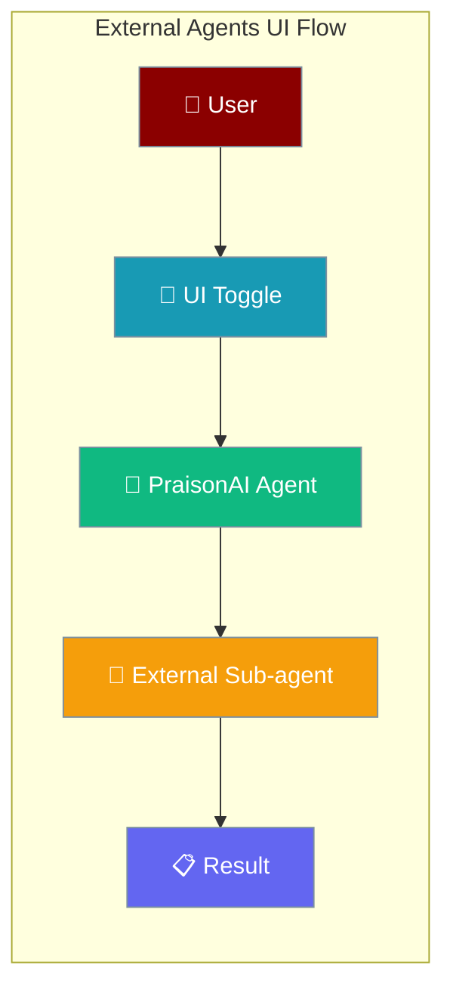
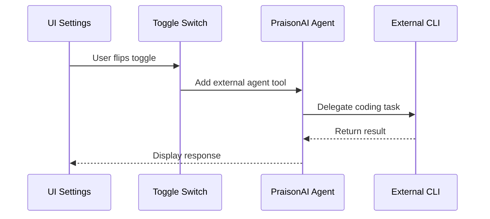
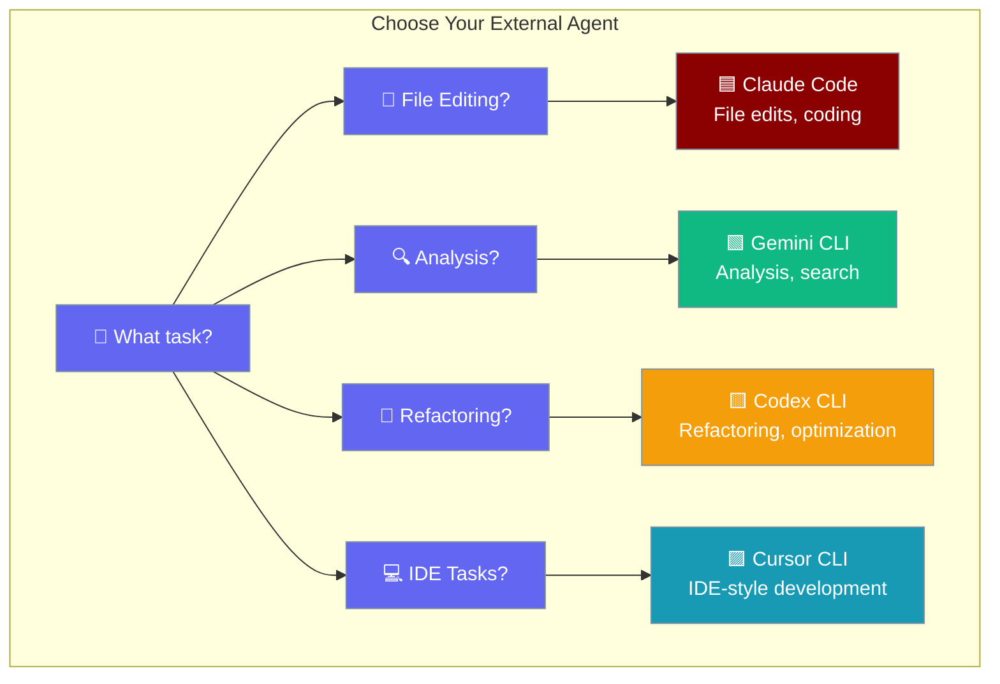

External Agents in UI allows you to flip toggles in any PraisonAI interface to instantly add Claude Code, Gemini CLI, Codex CLI, or Cursor CLI as sub-agents to your main agent.



## Quick Start

<Steps>
<Step title="Install External CLI">
Install one of the supported CLIs:

```bash
# Claude Code
npm install -g @anthropic-ai/claude-code

# Gemini CLI  
npm install -g @google/gemini-cli

# Codex CLI
npm install -g @openai/codex-cli

# Cursor CLI
# Download from cursor.com
```
</Step>

<Step title="Launch PraisonAI UI">
Run any PraisonAI UI entry point:

```bash
praisonai ui chat         # Chat interface with sidebar toggles
praisonai ui code         # Code interface with sidebar toggles
praisonai ui agents       # Agent team interface with toggles per agent
praisonai ui              # Multi-agent interface with auto-shown checkboxes
```
</Step>

<Step title="Enable External Agent">
Open the sidebar settings — toggles for installed CLIs appear automatically. Flip the toggle for your desired external agent:

- **Claude Code**: Enable for file edits and coding tasks
- **Gemini CLI**: Enable for analysis and search tasks  
- **Codex CLI**: Enable for refactoring and optimization
- **Cursor CLI**: Enable for IDE-style development tasks
</Step>

<Step title="Start Coding">
Your agent now delegates coding tasks to the external sub-agent:

```python
# Your agent automatically gains access to external tools
agent.start("Refactor the auth module and add error handling")
# → Delegates to Claude Code or Codex CLI based on your toggles
```
</Step>
</Steps>

---

## How It Works



| Component | Purpose | Features |
|-----------|---------|----------|
| **UI Toggles** | Enable/disable external agents | Auto-detection, persistence, per-entry-point |
| **External Agent Tools** | Bridge to CLI tools | Streaming, workspace context, error handling |
| **CLI Integration** | Execute external commands | Subprocess management, JSON output, session continuation |

---

## Which Agent for Which Job



---

## Per-Entry-Point Toggles

| Entry point | How toggles appear | Persistence | Workspace |
|---|---|---|---|
| `praisonai ui` | aiui checkboxes (auto-shown for installed CLIs) | session | `PRAISONAI_WORKSPACE` |
| `praisonai ui chat` | Chainlit `Switch` widgets in sidebar | persistent (`save_setting`) | `PRAISONAI_WORKSPACE` |
| `praisonai ui code` | Chainlit `Switch` widgets (replaces old single Claude toggle) | persistent (`save_setting`) | `PRAISONAI_CODE_REPO_PATH` |
| `praisonai ui agents` | Chainlit `Switch` widgets per `AgentTeam` member | persistent + per-agent merging with YAML tools | `PRAISONAI_WORKSPACE` |

### Auto-Availability Detection

Only CLIs that resolve via `shutil.which(...)` show a toggle. The CLI → command mapping is:

- `claude_enabled` → `claude` command
- `gemini_enabled` → `gemini` command  
- `codex_enabled` → `codex` command
- `cursor_enabled` → `cursor-agent` command

### Toggle IDs and Labels

| Toggle ID | Label | CLI Command | Integration Class |
|---|---|---|---|
| `claude_enabled` | "Claude Code (coding, file edits)" | `claude` | `ClaudeCodeIntegration` |
| `gemini_enabled` | "Gemini CLI (analysis, search)" | `gemini` | `GeminiCLIIntegration` |
| `codex_enabled` | "Codex CLI (refactoring)" | `codex` | `CodexCLIIntegration` |
| `cursor_enabled` | "Cursor CLI (IDE tasks)" | `cursor-agent` | `CursorCLIIntegration` |

<Note>
**Backward Compatibility**: The legacy `claude_code_enabled` setting and `PRAISONAI_CLAUDECODE_ENABLED=true` environment variable still work and auto-migrate to `claude_enabled` on next save. No user action required.
</Note>

---

## External Agent Tools Implementation

When you enable an external agent toggle, the UI automatically adds the corresponding tool to your agent:

```python
from praisonaiagents import Agent
from praisonai.integrations import ClaudeCodeIntegration

# What happens when you flip the Claude Code toggle:
claude_integration = ClaudeCodeIntegration(workspace="/path/to/workspace")

agent = Agent(
    name="Development Assistant",
    tools=[claude_integration.as_tool()]  # Added automatically
)

# Agent can now delegate to Claude Code:
agent.start("Fix the authentication bug in auth.py")
```

The integration tools provide:
- **Workspace Context**: Operate against `PRAISONAI_WORKSPACE` or `PRAISONAI_CODE_REPO_PATH`
- **Streaming Output**: Real-time feedback from external CLIs  
- **Error Handling**: Graceful fallbacks when external CLIs fail
- **Session Management**: Continuation across multiple requests

---

## Dynamic Instructions (Code UI)

In `praisonai ui code`, enabled external agents also modify the agent's instructions dynamically:

```python
# Base instructions
instructions = "You are a helpful coding assistant..."

# When Claude Code is enabled:
instructions += "\n\nYou have access to Claude Code for file editing and code analysis."

# When multiple agents are enabled:
instructions += "\n\nAvailable external agents: Claude Code, Gemini CLI"
```

---

## Best Practices

<AccordionGroup>
<Accordion title="Which Agent for Which Task">
Choose external agents based on task requirements:

- **Claude Code**: File edits, refactoring, adding features
- **Gemini CLI**: Code analysis, documentation, search
- **Codex CLI**: Performance optimization, code quality
- **Cursor CLI**: IDE-integrated development workflows

You can enable multiple agents simultaneously for complex workflows.
</Accordion>

<Accordion title="Combining Multiple Toggles">
Enable multiple external agents for comprehensive development support:

```python
# All four external agents enabled
agent = Agent(
    name="Full Stack Assistant",
    tools=[
        claude_code.as_tool(),    # File editing
        gemini_cli.as_tool(),     # Analysis
        codex_cli.as_tool(),      # Refactoring  
        cursor_cli.as_tool()      # IDE tasks
    ]
)

# Agent intelligently delegates based on task type
agent.start("Analyze the codebase, then refactor the auth module")
```
</Accordion>

<Accordion title="Toggle Persistence and Migration">
Toggle settings persist automatically:

- **Chat/Code/Agents UI**: Saved to Chainlit settings, persist across sessions
- **Main UI**: Session-based, reset on restart
- **Migration**: Legacy `claude_code_enabled` auto-migrates to `claude_enabled`

```bash
# Environment variable override (all UIs)
PRAISONAI_CLAUDECODE_ENABLED=true praisonai ui chat
# → Automatically enables claude_enabled toggle
```
</Accordion>

<Accordion title="CLI Not Showing Up Troubleshooting">
If a CLI toggle doesn't appear:

1. **Check Installation**: Ensure CLI is installed and on PATH
2. **Verify Command**: Test CLI command manually in terminal
3. **Restart UI**: Refresh browser or restart PraisonAI UI
4. **Check Logs**: Look for integration errors in console

```bash
# Test CLI availability
which claude        # Should return path
which gemini        # Should return path  
which codex         # Should return path
which cursor-agent  # Should return path
```
</Accordion>
</AccordionGroup>

---

## Related

<CardGroup cols={2}>
<Card title="External CLI Integrations (Python API)" icon="code" href="/docs/features/external-cli-integrations">
  Use external agents programmatically in your code
</Card>
<Card title="External Agents (Code)" icon="terminal" href="/docs/code/external-agents">
  Python API reference for external agent integrations
</Card>
</CardGroup>