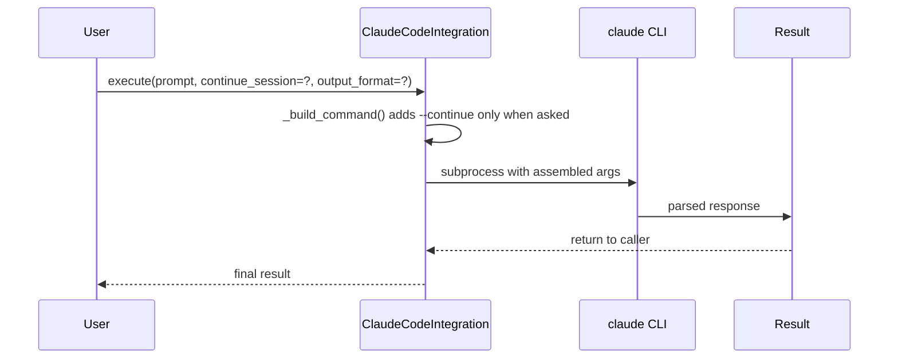
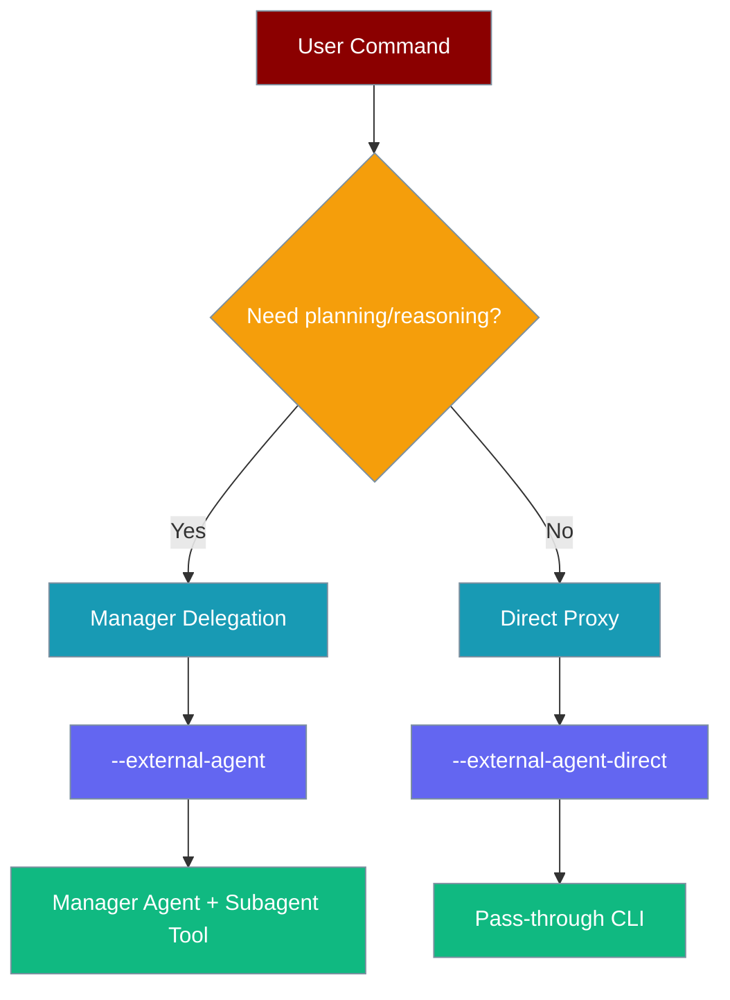
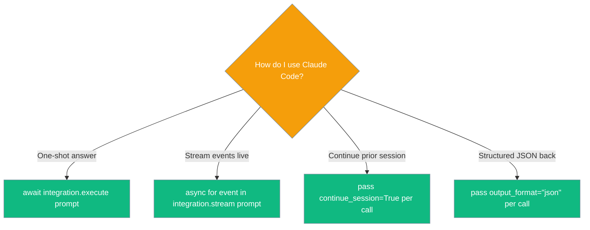

Drive external AI CLIs from a PraisonAI agent — Claude Code is the flagship integration.

```python
from praisonaiagents import Agent
from praisonai.integrations import ClaudeCodeIntegration

agent = Agent(
    name="coder",
    tools=[ClaudeCodeIntegration().as_tool()],
)
agent.start("Summarise the README in this repo")
```

The user asks in chat; the agent invokes Claude Code or another external CLI through the integration tool.


## Quick Start

<Steps>
<Step title="Attach Claude Code as an agent tool">
```python
from praisonaiagents import Agent
from praisonai.integrations import ClaudeCodeIntegration

agent = Agent(
    name="coder",
    tools=[ClaudeCodeIntegration().as_tool()],
)
agent.start("Summarise the README in this repo")
```
</Step>

<Step title="One-shot call via the integration API">
```python
import asyncio
from praisonai.integrations import ClaudeCodeIntegration

integration = ClaudeCodeIntegration()
result = asyncio.run(integration.execute("Summarise the README in this repo"))
print(result)
```
</Step>

<Step title="Continue a previous Claude Code session">
```python
# First turn
await integration.execute("List the open bugs")

# Continue the same session — you MUST pass continue_session=True explicitly
await integration.execute("Now suggest fixes for the first one", continue_session=True)
```
</Step>

<Step title="Stream events live">
```python
async for event in integration.stream("Refactor utils.py"):
    print(event)   # parsed JSON events from the CLI
```

The `timeout` argument is enforced end-to-end: `stream_async(timeout=...)` applies a monotonic deadline to every stdout read and the final drain, so a stalled `claude`/`gemini`/`codex`/`cursor` subprocess raises `TimeoutError: Stream timed out after {timeout}s: {cmd}` instead of hanging forever.
</Step>

<Step title="Per-call output format">
```python
await integration.execute("prompt", output_format="json")
await integration.execute("prompt", output_format="text")
```
</Step>
</Steps>

---

## How It Works



The integration builds CLI arguments dynamically per call, with no instance state mutated during execution.

---

## Stateless Session Management

<Warning>
`reset_session()` is a deprecated no-op as of PraisonAI PR #1466. Remove it from your code. Session continuation is now explicit via `continue_session=True`.
</Warning>

| Old (removed / ignored) | New explicit parameter |
|---|---|
| `self._session_active = True` (auto) | `continue_session=True` per call |
| `self.output_format` mutated during `stream()` | `output_format="stream-json"` passed per call |
| `integration.reset_session()` | **No longer needed — deprecated no-op** |

<Note>
Because state is no longer shared on the instance, a single `ClaudeCodeIntegration` is safe to call concurrently from multiple tasks / threads.
</Note>

**Before (stateful):**
```python
# ❌ Old pattern — relied on implicit session state
integration = ClaudeCodeIntegration()
await integration.execute("step 1")  # marks _session_active = True
await integration.execute("step 2")  # implicitly continued previous session
integration.reset_session()           # cleared state
```

**After (stateless):**
```python
# ✅ New pattern — explicit, stateless, safe for concurrent use
integration = ClaudeCodeIntegration()
await integration.execute("step 1")
await integration.execute("step 2", continue_session=True)   # explicit
# reset_session() is no longer needed; it is a deprecated no-op
```

---

## CLI: Manager Delegation (Default)

PraisonAI CLI offers two execution modes for external agents, providing flexibility between automated reasoning and direct execution.



| Mode | Flag | Behaviour | Best for |
|------|------|-----------|----------|
| Manager delegation (default) | `--external-agent X` | Manager Agent wraps the CLI as a tool, reasons, then calls it | Multi-step tasks, planning, aggregation |
| Direct proxy | `--external-agent X --external-agent-direct` | Pass-through — CLI runs the prompt verbatim | Fast single-shot calls, scripting, when you don't want a manager LLM |

**Usage Examples:**

```bash
# Manager delegation - manager reasons, then calls claude as tool
praisonai "Fix the bug in auth.py" --external-agent claude

# Direct proxy - no manager overhead, straight to claude  
praisonai "Fix the bug in auth.py" --external-agent claude --external-agent-direct
```

---

## Configuration Options

| Option | Type | Default | Where | Description |
|---|---|---|---|---|
| `workspace` | `str` | `"."` | constructor | Working directory passed to the CLI |
| `timeout` | `int` | `300` | constructor | Per-call timeout (seconds), enforced on streaming reads — a stalled subprocess raises `TimeoutError` |
| `output_format` | `str` | `"json"` | constructor **or** per-call | `"text"` \| `"json"` \| `"stream-json"` |
| `use_sdk` | `bool` | `False` (True if SDK available) | constructor | Use the Claude Code SDK when installed, otherwise fall back to subprocess |
| `model` | `str \| None` | `None` | constructor | Passed through to the CLI via `--model` |
| `continue_session` | `bool` | `False` | per-call | Adds `--continue` to the CLI invocation |
| `skip_permissions` | `bool` | `True` | constructor | Skip permission prompts with `--dangerously-skip-permissions` |
| `system_prompt` | `str \| None` | `None` | constructor | Custom system prompt to append |
| `allowed_tools` | `List[str] \| None` | `None` | constructor | List of allowed tools (e.g., ["Read", "Write", "Bash"]) |
| `disallowed_tools` | `List[str] \| None` | `None` | constructor | List of disallowed tools |

---

## Registry

The `ExternalAgentRegistry` manages all available CLI integrations with a thread-safe registry pattern with lazy module-level default. You can construct your own `ExternalAgentRegistry()` for test isolation or multi-tenant runs:

```python
from praisonai.integrations.registry import get_default_registry

# Default registry (recommended for app code)
registry = get_default_registry()

# List available integrations
available = await registry.get_available()
print(available)  # {'claude': True, 'gemini': False, ...}

# Option 1 — soft lookup: returns None if the integration is missing/unavailable
claude = registry.try_create("claude", workspace="/path/to/project")
if claude is None:
    print("Integration 'claude' not found or unavailable")

# Option 2 — strict: raises ValueError with diagnostics if not registered
claude = registry.create("claude", workspace="/path/to/project")
```

<Note>
As of PraisonAI PR #1849, `ExternalAgentRegistry.create()` raises `ValueError` for unknown integrations (parent registry contract). Use `try_create()` for the previous "return `None` on failure" behaviour. The module-level helper `create_integration(name, **kwargs)` already calls `try_create()` under the hood and still returns `None` on failure — no migration needed for code that uses it.
</Note>

The existing helpers `get_registry()`, `register_integration()`, `create_integration()`, and `get_available_integrations()` are still exported and still work — they now delegate to `get_default_registry()`. Backward-compat code does not need to change.

### Invalidating the availability cache

`BaseCLIIntegration` caches the result of `shutil.which(cli_command)` for each CLI. If a CLI is installed/uninstalled mid-run (e.g. in tests, or after a setup step), invalidate the cache:

```python
from praisonai.integrations.base import BaseCLIIntegration

# Clear cache for one command
BaseCLIIntegration.invalidate_availability("claude")

# Clear the entire cache
BaseCLIIntegration.invalidate_availability()
```

The cache is thread-safe; invalidation is also thread-safe.

---

## Prerequisites

The `claude` CLI must be available on `PATH` or the Claude Code SDK must be installed if `use_sdk=True`. The integration performs a cached, thread-safe `shutil.which(...)` check via `is_available()`.

```bash
# Install Claude Code CLI (option 1)
# Follow Claude Code installation instructions

# Or install SDK (option 2)  
pip install claude-agent-sdk
```

---

## Decision Flow



---

## Best Practices

<AccordionGroup>

<Accordion title="Always pass continue_session=True explicitly">
Don't rely on instance state for session continuation. Always be explicit about when you want to continue a previous session.

```python
# ✅ Good - explicit session control
await integration.execute("step 1")
await integration.execute("step 2", continue_session=True)

# ❌ Bad - relying on removed implicit state
await integration.execute("step 1")
await integration.execute("step 2")  # No longer continues session
```
</Accordion>

<Accordion title="Set output_format per call or once in constructor">
Do not mutate the `integration.output_format` attribute between calls. Use the per-call parameter or set it once during initialization.

```python
# ✅ Good - per-call parameter
await integration.execute("prompt", output_format="json")
await integration.execute("prompt", output_format="text")

# ✅ Good - set once in constructor
integration = ClaudeCodeIntegration(output_format="json")

# ❌ Bad - mutating instance attribute
integration.output_format = "json"  # Don't do this
```
</Accordion>

<Accordion title="Remove reset_session() calls">
The `reset_session()` method is now a no-op. Remove these calls from your code as they serve no purpose.

```python
# ❌ Bad - calling deprecated no-op
integration.reset_session()

# ✅ Good - just omit the call
# Session state is automatically stateless
```
</Accordion>

<Accordion title="Safe for concurrent use">
A single `ClaudeCodeIntegration` instance can be shared across concurrent tasks safely since no instance state is mutated during calls.

```python
# ✅ Good - concurrent safe
integration = ClaudeCodeIntegration()

async def task1():
    return await integration.execute("task 1")

async def task2(): 
    return await integration.execute("task 2")

# Both tasks can run concurrently safely
results = await asyncio.gather(task1(), task2())
```
</Accordion>

</AccordionGroup>

---

## Using from PraisonAI UI

<Tip>
You can also enable external CLI integrations directly from the PraisonAI user interface without writing code. All PraisonAI UI entry points include toggles for external agents when the corresponding CLIs are installed. See [External Agents in UI](/docs/features/external-agents-ui) for complete documentation.
</Tip>

---

## Related

<CardGroup cols={2}>
<Card title="Persistence & Concurrency" icon="database" href="/docs/persistence/overview">
  Learn about thread-safe persistence features
</Card>

<Card title="Agent Tools" icon="wrench" href="/docs/features/toolsets">
  Using integrations as agent tools
</Card>
</CardGroup>