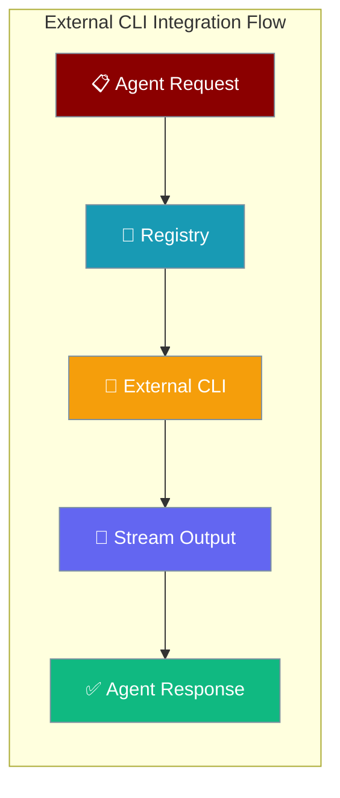
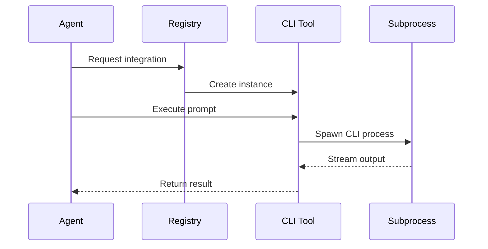

External CLI Integrations enable PraisonAI agents to leverage external AI-powered command-line tools for specialized coding tasks.



## Quick Start

<Steps>
<Step title="Registry Pattern Usage">
```python
from praisonaiagents import Agent
from praisonai.integrations.registry import ExternalAgentRegistry

# Get singleton registry
registry = ExternalAgentRegistry.get_instance()

# Create integration
claude_agent = registry.create('claude', workspace="/path/to/project")

# Use as agent tool
agent = Agent(
    name="Code Assistant",
    instructions="Help with coding tasks using external CLI tools",
    tools=[claude_agent.as_tool()]
)

agent.start("Add error handling to the API endpoints")
```
</Step>

<Step title="Direct Integration Usage">
```python
from praisonaiagents import Agent
from praisonai.integrations import CodexCLIIntegration

# Multiple approval modes
codex_suggest = CodexCLIIntegration(approval_mode="suggest")  # Default
codex_auto_edit = CodexCLIIntegration(approval_mode="auto-edit")  # Safe edits
codex_full_auto = CodexCLIIntegration(approval_mode="full-auto", provider="openai")

# Use with agent
agent = Agent(
    name="Code Refactor Assistant",
    tools=[codex_auto_edit.as_tool()]
)

agent.start("Refactor the authentication module")
```
</Step>
</Steps>

---

## How It Works



| Component | Purpose | Features |
|-----------|---------|----------|
| **Registry** | Dynamic registration and discovery | Singleton pattern, availability checking |
| **Base Integration** | Common CLI interface | Async execution, timeout handling, tool wrapper |
| **Specific Integrations** | Tool-specific implementations | Streaming, approval modes, multi-provider support |

---

## Configuration Options

<Card title="External CLI Integrations API Reference" icon="code" href="/docs/sdk/reference/typescript/classes/ExternalAgentRegistry">
  TypeScript configuration options
</Card>

---

## Built-in Integrations

<Tabs>
<Tab title="Claude Code">
```python
from praisonai.integrations import ClaudeCodeIntegration

claude = ClaudeCodeIntegration(
    workspace="/path/to/project",
    timeout=300
)

# Execute with streaming
async for event in claude.stream("Implement user authentication"):
    if event.get("type") == "agent_message":
        print(f"Claude: {event.get('text', '')}")
```
</Tab>

<Tab title="Codex CLI">
```python
from praisonai.integrations import CodexCLIIntegration

# Different approval modes
codex = CodexCLIIntegration(
    approval_mode="auto-edit",  # suggest, auto-edit, full-auto
    provider="openai",         # openai, openrouter, azure, gemini
    json_output=True           # Enable JSON streaming
)

result = await codex.execute("Add error handling to the API")
```
</Tab>

<Tab title="Gemini CLI">
```python
from praisonai.integrations import GeminiCLIIntegration

gemini = GeminiCLIIntegration(
    workspace="/path/to/project",
    model="gemini-2.5-pro"
)

result = await gemini.execute("Optimize the database queries")
```
</Tab>

<Tab title="Custom Integration">
```python
from praisonai.integrations import BaseCLIIntegration

class MyCustomCLI(BaseCLIIntegration):
    @property
    def cli_command(self) -> str:
        return "my-cli"
    
    async def execute(self, prompt: str, **options) -> str:
        cmd = ["my-cli", "--task", prompt]
        return await self.execute_async(cmd)
    
    async def stream(self, prompt: str, **options):
        cmd = ["my-cli", "--stream", "--task", prompt]
        async for line in self.stream_async(cmd):
            yield {"type": "text", "content": line}

# Register with registry
registry = ExternalAgentRegistry.get_instance()
registry.register('my-cli', MyCustomCLI)
```
</Tab>
</Tabs>

---

## TypeScript SDK

<CodeGroup>
```typescript Registry Pattern
import { getExternalAgentRegistry, createExternalAgent } from 'praisonai';

// Get available integrations
const registry = getExternalAgentRegistry();
const available = await registry.getAvailable();

// Create specific integration
const claudeAgent = createExternalAgent('claude', '/path/to/project');

// Stream output
const stream = claudeAgent.stream('Implement user authentication');
for await (const event of stream) {
  switch (event.type) {
    case 'text':
      console.log(`Output: ${event.content}`);
      break;
    case 'json':
      console.log('Structured data:', event.data);
      break;
  }
}
```

```typescript Direct Usage
import { ClaudeCodeAgent, CodexCliAgent } from 'praisonai';

// Claude Code integration
const claude = new ClaudeCodeAgent('/path/to/project');
const result = await claude.execute('Fix the authentication bug');

// Codex CLI integration
const codex = new CodexCliAgent('/path/to/project');
const codexResult = await codex.execute('Refactor the database module');

console.log('Claude result:', result.output);
console.log('Codex result:', codexResult.output);
```
</CodeGroup>

---

## Common Patterns

### Multi-Agent Code Review Pipeline
```python
from praisonaiagents import Agent, Task, PraisonAIAgents
from praisonai.integrations.registry import ExternalAgentRegistry

# Setup integrations
registry = ExternalAgentRegistry.get_instance()
claude = registry.create('claude')
codex = registry.create('codex', approval_mode="auto-edit")

# Create specialized agents
reviewer = Agent(
    name="Code Reviewer",
    role="Review code for bugs and improvements",
    tools=[claude.as_tool()]
)

fixer = Agent(
    name="Code Fixer", 
    role="Apply code fixes and improvements",
    tools=[codex.as_tool()]
)

# Define workflow
review_task = Task(
    description="Review the authentication module for security issues",
    agent=reviewer
)

fix_task = Task(
    description="Apply the suggested fixes from the code review",
    agent=fixer,
    context=[review_task]
)

# Execute pipeline
agents = PraisonAIAgents(
    agents=[reviewer, fixer],
    tasks=[review_task, fix_task]
)

agents.start()
```

### Interactive Development Session
```python
from praisonaiagents import Agent
from praisonai.integrations.registry import ExternalAgentRegistry

# Setup with multiple integrations
registry = ExternalAgentRegistry.get_instance()

async def interactive_coding_session():
    # Get available integrations
    available = await registry.get_available()
    print(f"Available tools: {list(available.keys())}")
    
    # Let user choose
    choice = input("Choose integration (claude/codex/gemini): ")
    integration = registry.create(choice)
    
    if not integration or not integration.is_available:
        print(f"Integration {choice} not available")
        return
    
    # Create agent with chosen integration
    agent = Agent(
        name="Interactive Coding Assistant",
        tools=[integration.as_tool()],
        instructions=f"Use {choice} for coding tasks"
    )
    
    # Interactive loop
    while True:
        task = input("Enter coding task (or 'quit'): ")
        if task.lower() == 'quit':
            break
        
        try:
            result = agent.start(task)
            print(f"\n{choice} result:\n{result}")
        except Exception as e:
            print(f"Error: {e}")

# Run interactive session
import asyncio
asyncio.run(interactive_coding_session())
```

### Automated QA Pipeline
```python
from praisonaiagents import Agent, Task, PraisonAIAgents
from praisonai.integrations.registry import ExternalAgentRegistry

class QAPipeline:
    def __init__(self):
        self.registry = ExternalAgentRegistry.get_instance()
        self.setup_agents()
    
    def setup_agents(self):
        # Test generation with Claude
        claude = self.registry.create('claude')
        self.test_generator = Agent(
            name="Test Generator",
            role="Generate comprehensive tests",
            tools=[claude.as_tool()]
        )
        
        # Static analysis with Codex
        codex = self.registry.create('codex', approval_mode="suggest")
        self.analyzer = Agent(
            name="Code Analyzer", 
            role="Perform static analysis",
            tools=[codex.as_tool()]
        )
        
        # Performance optimization with Gemini
        gemini = self.registry.create('gemini')
        self.optimizer = Agent(
            name="Performance Optimizer",
            role="Optimize code performance",
            tools=[gemini.as_tool()] if gemini else []
        )
    
    def run_qa_pipeline(self, codebase_path: str):
        tasks = [
            Task(
                description=f"Generate unit tests for {codebase_path}",
                agent=self.test_generator
            ),
            Task(
                description=f"Analyze code quality in {codebase_path}",
                agent=self.analyzer
            ),
            Task(
                description=f"Suggest performance optimizations for {codebase_path}",
                agent=self.optimizer
            )
        ]
        
        pipeline = PraisonAIAgents(
            agents=[self.test_generator, self.analyzer, self.optimizer],
            tasks=tasks,
            process="hierarchical"
        )
        
        return pipeline.start()

# Usage
qa = QAPipeline()
result = qa.run_qa_pipeline("/path/to/codebase")
```

---

## Best Practices

<AccordionGroup>
<Accordion title="Environment Setup">
Ensure all required CLI tools are installed and authenticated:

```bash
# Install CLI tools
npm install -g @anthropics/claude-code
pip install openai-codex-cli
pip install google-ai-cli

# Setup authentication
export ANTHROPIC_API_KEY="your-anthropic-api-key"
export OPENAI_API_KEY="your-openai-api-key"
export GOOGLE_AI_API_KEY="your-google-api-key"
```

Always check availability before using:
```python
registry = ExternalAgentRegistry.get_instance()
available = await registry.get_available()

if 'claude' in available:
    claude = registry.create('claude')
else:
    print("Claude CLI not available")
```
</Accordion>

<Accordion title="Approval Mode Selection">
Choose the right approval mode based on your use case:

- **suggest**: Safest mode, only provides suggestions (default)
- **auto-edit**: Automatically applies safe edits like formatting and simple fixes
- **full-auto**: Allows all file modifications (use with caution)

```python
# For production code
codex_safe = CodexCLIIntegration(approval_mode="suggest")

# For development with review
codex_dev = CodexCLIIntegration(approval_mode="auto-edit")

# For experimental/sandbox environments
codex_experimental = CodexCLIIntegration(approval_mode="full-auto")
```
</Accordion>

<Accordion title="Error Handling">
Implement robust error handling for CLI integrations:

```python
async def safe_execute(integration, prompt):
    try:
        if not integration.is_available:
            raise ValueError(f"CLI tool {integration.cli_command} not available")
        
        result = await integration.execute(prompt)
        return result
    
    except TimeoutError:
        print(f"CLI execution timed out after {integration.timeout}s")
        return None
    except Exception as e:
        print(f"CLI execution failed: {e}")
        return None

# Usage with fallback
claude = registry.create('claude')
codex = registry.create('codex')

result = await safe_execute(claude, prompt) or await safe_execute(codex, prompt)
```
</Accordion>

<Accordion title="Streaming Optimization">
Use streaming for long-running tasks to provide real-time feedback:

```python
async def stream_with_progress(integration, prompt):
    print(f"Starting {integration.cli_command} execution...")
    
    try:
        async for event in integration.stream(prompt):
            event_type = event.get("type", "")
            
            if event_type == "agent_message":
                content = event.get("text", "")
                print(f"📝 {content}")
            elif event_type == "tool_call":
                tool = event.get("tool", "")
                print(f"🔧 Using tool: {tool}")
            elif event_type == "error":
                error = event.get("error", "")
                print(f"❌ Error: {error}")
    
    except Exception as e:
        print(f"Streaming failed: {e}")
```
</Accordion>
</AccordionGroup>

---

## Using from PraisonAI UI

<Tip>
You can also enable external CLI integrations directly from the PraisonAI user interface without writing code. All PraisonAI UI entry points include toggles for external agents when the corresponding CLIs are installed. See [External Agents in UI](/docs/features/external-agents-ui) for complete documentation.
</Tip>

---

## Related

<CardGroup cols={2}>
<Card title="Agent Tools" icon="wrench" href="/docs/concepts/tools">
  Learn about creating and using agent tools
</Card>
<Card title="Multi-Agent Workflows" icon="users" href="/docs/concepts/tasks">
  Build complex multi-agent pipelines
</Card>
</CardGroup>