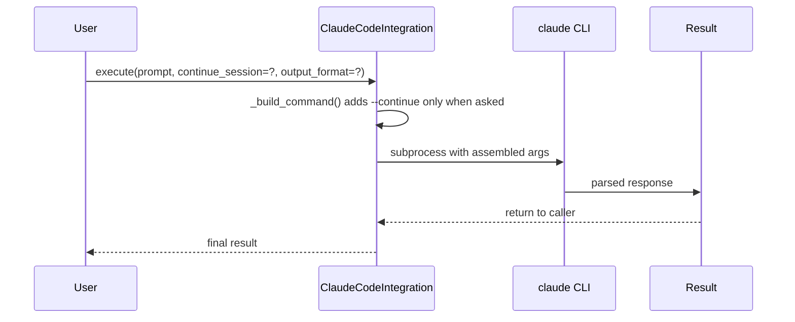
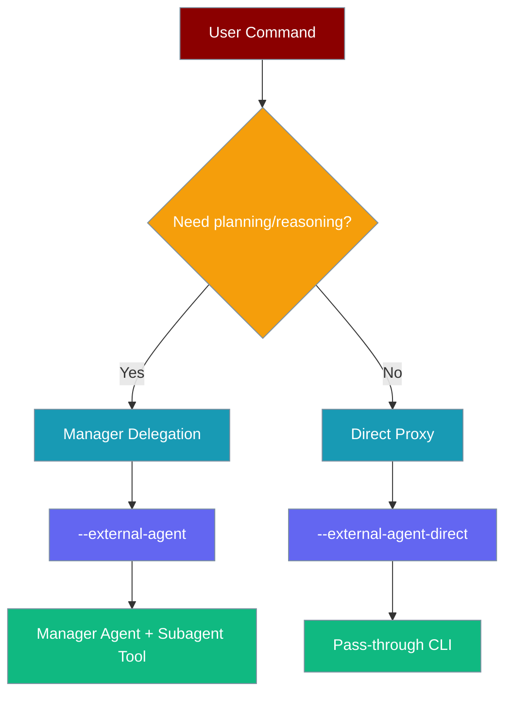
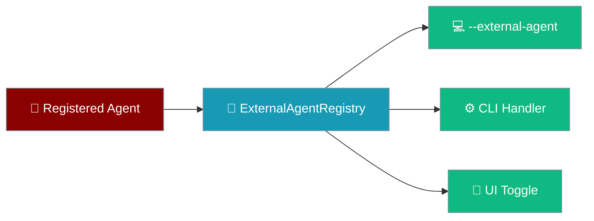
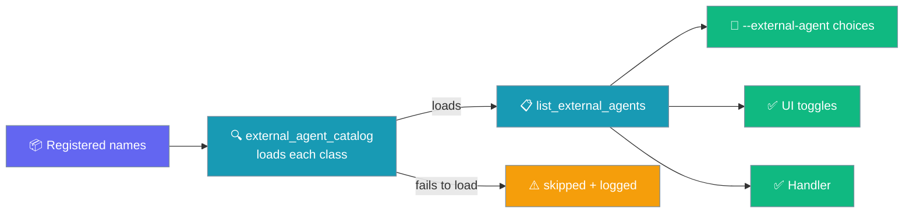
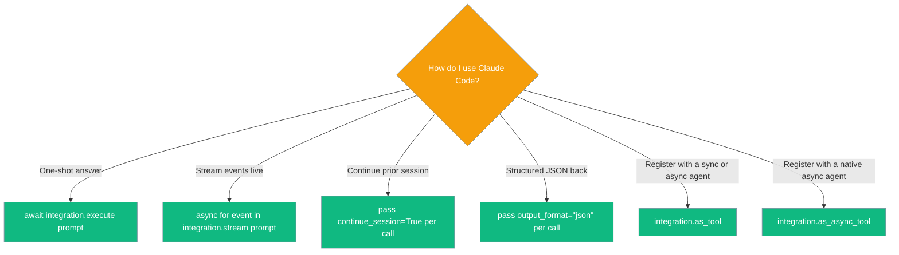

Drive external AI CLIs from a PraisonAI agent — Claude Code is the flagship integration.

```python
from praisonaiagents import Agent
from praisonai.integrations import ClaudeCodeIntegration

agent = Agent(
    name="coder",
    tools=[ClaudeCodeIntegration().as_tool()],
)
agent.start("Summarise the README in this repo")
```

The user asks in chat; the agent invokes Claude Code or another external CLI through the integration tool.


```mermaid
graph LR
    User[👤 User] --> Agent[🤖 Agent]
    Agent --> Integration[🔌 ClaudeCodeIntegration]
    Integration --> CLI[💻 claude CLI]
    CLI --> Result[✅ Result]

    classDef input fill:#8B0000,stroke:#7C90A0,color:#fff
    classDef agent fill:#6366F1,stroke:#7C90A0,color:#fff
    classDef tool fill:#189AB4,stroke:#7C90A0,color:#fff
    classDef output fill:#10B981,stroke:#7C90A0,color:#fff

    class User,Agent input
    class Integration,CLI tool
    class Result output

    classDef agent fill:#8B0000,color:#fff

    classDef tool fill:#189AB4,color:#fff
```

## Quick Start

<Note>
`integration.as_tool()` returns a **sync** callable that is safe to call from both sync and async agent runtimes. When registering with a native async agent, prefer `integration.as_async_tool()` — it returns an **async** callable that skips the worker-thread hop.
</Note>

<Steps>
<Step title="Attach Claude Code as an agent tool">
```python
from praisonaiagents import Agent
from praisonai.integrations import ClaudeCodeIntegration

agent = Agent(
    name="coder",
    tools=[ClaudeCodeIntegration().as_tool()],
)
agent.start("Summarise the README in this repo")
```
</Step>

<Step title="One-shot call via the integration API">
```python
import asyncio
from praisonai.integrations import ClaudeCodeIntegration

integration = ClaudeCodeIntegration()
result = asyncio.run(integration.execute("Summarise the README in this repo"))
print(result)
```
</Step>

<Step title="Continue a previous Claude Code session">
```python
# First turn
await integration.execute("List the open bugs")

# Continue the same session — you MUST pass continue_session=True explicitly
await integration.execute("Now suggest fixes for the first one", continue_session=True)
```
</Step>

<Step title="Stream events live">
```python
async for event in integration.stream("Refactor utils.py"):
    print(event)   # parsed JSON events from the CLI
```

The `timeout` argument is enforced end-to-end: `stream_async(timeout=...)` applies a monotonic deadline to every stdout read and the final drain, so a stalled `claude`/`gemini`/`codex`/`cursor` subprocess raises `TimeoutError: Stream timed out after {timeout}s: {cmd}` instead of hanging forever.
</Step>

<Step title="Per-call output format">
```python
await integration.execute("prompt", output_format="json")
await integration.execute("prompt", output_format="text")
```
</Step>

<Step title="Register as a native async tool">
```python
from praisonaiagents import Agent
from praisonai.integrations import ClaudeCodeIntegration

agent = Agent(
    name="coder",
    tools=[ClaudeCodeIntegration().as_async_tool()],  # awaited on the running loop
)

# Use the async entrypoint on the agent to keep everything on one loop:
await agent.astart("Summarise the README in this repo")
```

`as_async_tool()` returns a coroutine tool named `<cli>_atool` (for example `claude_atool`). It is functionally equivalent to `as_tool()`, but with no thread hop — measurable when the agent invokes the CLI many times in one turn.
</Step>
</Steps>

---

## How It Works


```mermaid
sequenceDiagram
    participant User
    participant Integration as ClaudeCodeIntegration
    participant CLI as claude CLI
    participant Result

    User->>Integration: execute(prompt, continue_session=?, output_format=?)
    Integration->>Integration: _build_command() adds --continue only when asked
    Integration->>CLI: subprocess with assembled args
    CLI->>Result: parsed response
    Result-->>Integration: return to caller
    Integration-->>User: final result
```

The integration builds CLI arguments dynamically per call, with no instance state mutated during execution.

---

## Stateless Session Management

<Warning>
`reset_session()` is a deprecated no-op as of PraisonAI PR #1466. Remove it from your code. Session continuation is now explicit via `continue_session=True`.
</Warning>

| Old (removed / ignored) | New explicit parameter |
|---|---|
| `self._session_active = True` (auto) | `continue_session=True` per call |
| `self.output_format` mutated during `stream()` | `output_format="stream-json"` passed per call |
| `integration.reset_session()` | **No longer needed — deprecated no-op** |

<Note>
Because state is no longer shared on the instance, a single `ClaudeCodeIntegration` is safe to call concurrently from multiple tasks / threads.
</Note>

**Before (stateful):**
```python
# ❌ Old pattern — relied on implicit session state
integration = ClaudeCodeIntegration()
await integration.execute("step 1")  # marks _session_active = True
await integration.execute("step 2")  # implicitly continued previous session
integration.reset_session()           # cleared state
```

**After (stateless):**
```python
# ✅ New pattern — explicit, stateless, safe for concurrent use
integration = ClaudeCodeIntegration()
await integration.execute("step 1")
await integration.execute("step 2", continue_session=True)   # explicit
# reset_session() is no longer needed; it is a deprecated no-op
```

---

## CLI: Manager Delegation (Default)

PraisonAI CLI offers two execution modes for external agents, providing flexibility between automated reasoning and direct execution.


```mermaid
graph TB
    A[User Command] --> B{Need planning/reasoning?}
    B -->|Yes| C[Manager Delegation]
    B -->|No| D[Direct Proxy]
    C --> E["--external-agent"]
    D --> F["--external-agent-direct"]
    E --> G[Manager Agent + Subagent Tool]
    F --> H[Pass-through CLI]
    
    classDef input fill:#8B0000,stroke:#7C90A0,color:#fff
    classDef decision fill:#F59E0B,stroke:#7C90A0,color:#fff  
    classDef mode fill:#189AB4,stroke:#7C90A0,color:#fff
    classDef flag fill:#6366F1,stroke:#7C90A0,color:#fff
    classDef execution fill:#10B981,stroke:#7C90A0,color:#fff
    
    class A input
    class B decision
    class C,D mode
    class E,F flag
    class G,H execution
```

| Mode | Flag | Behaviour | Best for |
|------|------|-----------|----------|
| Manager delegation (default) | `--external-agent X` | Manager Agent wraps the CLI as a tool, reasons, then calls it | Multi-step tasks, planning, aggregation |
| Direct proxy | `--external-agent X --external-agent-direct` | Pass-through — CLI runs the prompt verbatim | Fast single-shot calls, scripting, when you don't want a manager LLM |

**Usage Examples:**

```bash
# Manager delegation - manager reasons, then calls claude as tool
praisonai "Fix the bug in auth.py" --external-agent claude

# Direct proxy - no manager overhead, straight to claude  
praisonai "Fix the bug in auth.py" --external-agent claude --external-agent-direct
```

---

## Configuration Options

| Option | Type | Default | Where | Description |
|---|---|---|---|---|
| `workspace` | `str` | `"."` | constructor | Working directory passed to the CLI |
| `timeout` | `int` | `300` | constructor | Per-call timeout (seconds), enforced on streaming reads — a stalled subprocess raises `TimeoutError` |
| `output_format` | `str` | `"json"` | constructor **or** per-call | `"text"` \| `"json"` \| `"stream-json"` |
| `use_sdk` | `bool` | `False` (True if SDK available) | constructor | Use the Claude Code SDK when installed, otherwise fall back to subprocess |
| `model` | `str \| None` | `None` | constructor | Passed through to the CLI via `--model` |
| `continue_session` | `bool` | `False` | per-call | Adds `--continue` to the CLI invocation |
| `skip_permissions` | `bool` | `True` | constructor | Skip permission prompts with `--dangerously-skip-permissions` |
| `system_prompt` | `str \| None` | `None` | constructor | Custom system prompt to append |
| `allowed_tools` | `List[str] \| None` | `None` | constructor | List of allowed tools (e.g., ["Read", "Write", "Bash"]) |
| `disallowed_tools` | `List[str] \| None` | `None` | constructor | List of disallowed tools |

---

## Registry

The `ExternalAgentRegistry` manages all available CLI integrations with a thread-safe registry pattern with lazy module-level default. You can construct your own `ExternalAgentRegistry()` for test isolation or multi-tenant runs:

```python
from praisonai.integrations.registry import get_default_registry

# Default registry (recommended for app code)
registry = get_default_registry()

# List available integrations
available = await registry.get_available()
print(available)  # {'claude': True, 'gemini': False, ...}

# Option 1 — soft lookup: returns None if the integration is missing/unavailable
claude = registry.try_create("claude", workspace="/path/to/project")
if claude is None:
    print("Integration 'claude' not found or unavailable")

# Option 2 — strict: raises ValueError with diagnostics if not registered
claude = registry.create("claude", workspace="/path/to/project")
```

<Note>
As of PraisonAI PR #1849, `ExternalAgentRegistry.create()` raises `ValueError` for unknown integrations (parent registry contract). Use `try_create()` for the previous "return `None` on failure" behaviour. The module-level helper `create_integration(name, **kwargs)` already calls `try_create()` under the hood and still returns `None` on failure — no migration needed for code that uses it.
</Note>

The existing helpers `get_registry()`, `register_integration()`, `create_integration()`, and `get_available_integrations()` are still exported and still work — they now delegate to `get_default_registry()`. Backward-compat code does not need to change.

### Invalidating the availability cache

`BaseCLIIntegration` caches the result of `shutil.which(cli_command)` for each CLI. If a CLI is installed/uninstalled mid-run (e.g. in tests, or after a setup step), invalidate the cache:

```python
from praisonai.integrations.base import BaseCLIIntegration

# Clear cache for one command
BaseCLIIntegration.invalidate_availability("claude")

# Clear the entire cache
BaseCLIIntegration.invalidate_availability()
```

The cache is thread-safe; invalidation is also thread-safe.

### Logging for embedders

The registry logs through the named logger `praisonai.integrations.registry` — it never configures the root logger, so importing or calling the registry will not install a handler on an embedding application's root logger.

Two warnings route through this logger:

| Message | When |
|---|---|
| `Failed to check availability for <name>: <error>` | An integration raised while its availability was being probed |
| `Skipping external agent '<name>': failed to load (<error>)` | An optional plugin failed to import and was dropped from the catalog |

Silence or redirect them:

```python
import logging

logging.getLogger("praisonai.integrations.registry").setLevel(logging.ERROR)
```

### Registering the integration as a tool

Both methods wrap the same underlying `integration.execute(query)` coroutine — pick the one that matches how your agent is invoked.

| Method | Returns | Sync agent | Async agent | Registered name |
|---|---|---|---|---|
| `integration.as_tool()` | `def tool_func(query: str) -> str` | ✅ | ✅ (safe since PraisonAI PR #4022) | `<cli>_tool` |
| `integration.as_async_tool()` | `async def atool_func(query: str) -> str` | Not intended (coroutine) | ✅ Preferred — no thread hop | `<cli>_atool` |

`<cli>` is the integration's `cli_command`: `claude_tool`/`claude_atool`, `gemini_tool`/`gemini_atool`, `codex_tool`/`codex_atool`, and `cursor-agent_tool`/`cursor-agent_atool`.

---

## Register a custom external agent

Register your own external agent once and it becomes reachable from every surface — `--external-agent`, the `praisonai_code` CLI handler, and the UI toggles — with no PraisonAI code changes.

<Note>
As of PraisonAI PR [#4156](https://github.com/MervinPraison/PraisonAI/pull/4156), `--external-agent` choices, the CLI handler's `INTEGRATIONS`, and the UI's `EXTERNAL_AGENTS` all read the same `ExternalAgentRegistry`. A registered agent shows up in all three automatically.
</Note>


```mermaid
graph LR
    Plugin[🔌 Registered Agent] --> Registry[📝 ExternalAgentRegistry]
    Registry --> CLI[💻 --external-agent]
    Registry --> Handler[⚙️ CLI Handler]
    Registry --> UI[🔘 UI Toggle]

    classDef plugin fill:#8B0000,stroke:#7C90A0,color:#fff
    classDef registry fill:#189AB4,stroke:#7C90A0,color:#fff
    classDef surface fill:#10B981,stroke:#7C90A0,color:#fff

    class Plugin plugin
    class Registry registry
    class CLI,Handler,UI surface
```

<Steps>
<Step title="Ship as a pip plugin (recommended)">
Publish your integration class to the `praisonai.external_agents` entry-point group:

```toml
# your-plugin/pyproject.toml
[project.entry-points."praisonai.external_agents"]
aider = "acme_aider:AiderIntegration"
```

After `pip install your-plugin`, `aider` appears in `praisonai --external-agent` choices, in the `praisonai_code` CLI handler, and as a UI toggle — no PraisonAI code changes.

<Note>
**Built-ins always win on name collisions.** Since [PraisonAI PR #4159](https://github.com/MervinPraison/PraisonAI/pull/4159), a plugin whose entry-point name matches a shipped built-in (`claude`, `gemini`, `codex`, `cursor`) is not registered under that name — the shipped integration keeps ownership of the name. Pick a distinct name (e.g. `aider`, `acme-claude`) for your plugin.
</Note>
</Step>

<Step title="Or register at runtime">
```python
from praisonai.integrations.registry import get_default_registry
from praisonai.integrations.base import BaseCLIIntegration

class AiderIntegration(BaseCLIIntegration):
    display_label = "Aider (pair programming)"
    install_hint = "pip install aider-chat"

    @property
    def cli_command(self) -> str:
        return "aider"

    async def execute(self, prompt: str, **options) -> str: ...
    async def stream(self, prompt: str, **options): ...

get_default_registry().register("aider", AiderIntegration)
```

`register()` raises `ValueError` if the class does not inherit `BaseCLIIntegration`.
</Step>
</Steps>

### Presentation metadata

Two optional class attributes drive help text, UI labels, and install hints on **every** surface:

| Attribute | Type | Default | Description |
|---|---|---|---|
| `display_label` | `str \| None` | `f"{name} CLI"` | UI label and CLI help text |
| `install_hint` | `str \| None` | `"See documentation"` | Install instruction shown when the CLI is missing |

Built-ins declare them too:

| Name | `display_label` | `install_hint` |
|---|---|---|
| `claude` | `Claude Code (coding, file edits)` | `npm install -g @anthropic-ai/claude-code` |
| `gemini` | `Gemini CLI (analysis, search)` | `npm install -g @anthropic-ai/gemini-cli` |
| `codex` | `Codex CLI (refactoring)` | `npm install -g @openai/codex` |
| `cursor` | `Cursor CLI (IDE tasks)` | `Download from cursor.com` |

### Single source of truth

Two registry helpers back every surface that lists external agents:

```python
from praisonai.integrations.registry import (
    list_external_agents,
    external_agent_catalog,
)

# Names of every registered external agent (built-ins + plugins)
list_external_agents()
# ['claude', 'gemini', 'codex', 'cursor', 'aider']

# Presentation metadata per agent: {"cls", "label", "cli", "install"}
external_agent_catalog()["aider"]
# {'cls': AiderIntegration, 'label': 'Aider (pair programming)',
#  'cli': 'aider', 'install': 'pip install aider-chat'}
```

Built-ins keep declaration order (claude, gemini, codex, cursor); plugins are appended in sorted order behind them. A faulty optional plugin is logged and skipped — it never blanks the catalog. Name collisions between a third-party plugin and a built-in are resolved in favour of the built-in — a plugin can extend the catalog but never replace `claude`, `gemini`, `codex`, or `cursor`.

**A listed name is always a usable name.** `list_external_agents()` is derived from `external_agent_catalog()`, so a plugin that fails to import disappears from *both* surfaces at once. A broken plugin is never advertised as a `--external-agent` choice and then rejected by the handler — if the name shows up in `--help`, in `ExternalAgentsHandler().list_integrations()`, or as a UI toggle, it loads.


```mermaid
graph LR
    R[📦 Registered names] --> C[🔍 external_agent_catalog<br/>loads each class]
    C -->|loads| L[📋 list_external_agents]
    C -->|fails to load| S[⚠️ skipped + logged]
    L --> H[💬 --external-agent choices]
    L --> U[✅ UI toggles]
    L --> A[✅ Handler]

    classDef src fill:#6366F1,stroke:#7C90A0,color:#fff
    classDef proc fill:#189AB4,stroke:#7C90A0,color:#fff
    classDef warn fill:#F59E0B,stroke:#7C90A0,color:#fff
    classDef out fill:#10B981,stroke:#7C90A0,color:#fff

    class R src
    class C,L proc
    class S warn
    class H,U,A out
```

### Which entry-point group?

Two entry-point groups exist and are easy to confuse — pick by outcome:

| Group | Outcome | Documented in |
|---|---|---|
| `praisonai.external_agents` | Short-name `--external-agent` choices, registry, and UI toggles | This page |
| `praisonai.integrations` | Module **importability** (`from praisonai.integrations import acme`) — does **not** feed short-name `--external-agent` lookup | [Integration Registry](/features/integration-registry) |

Use `praisonai.external_agents` for a selectable `--external-agent` short name and a UI toggle. Use `praisonai.integrations` only to make a class importable from `praisonai.integrations`.

<Note>
Both entry-point groups apply the same precedence: **built-ins always win** on case-insensitive name collisions; plugins can only add new names.
</Note>

---

## Prerequisites

The `claude` CLI must be available on `PATH` or the Claude Code SDK must be installed if `use_sdk=True`. The integration performs a cached, thread-safe `shutil.which(...)` check via `is_available()`.

```bash
# Install Claude Code CLI (option 1)
# Follow Claude Code installation instructions

# Or install SDK (option 2)  
pip install claude-agent-sdk
```

---

## Decision Flow


```mermaid
graph TB
    Q{How do I use Claude Code?}
    Q -->|One-shot answer| A[await integration.execute prompt]
    Q -->|Stream events live| B[async for event in integration.stream prompt]
    Q -->|Continue prior session| C[pass continue_session=True per call]
    Q -->|Structured JSON back| D[pass output_format=&quot;json&quot; per call]
    Q -->|Register with a sync or async agent| E[integration.as_tool]
    Q -->|Register with a native async agent| F[integration.as_async_tool]

    classDef choice fill:#F59E0B,stroke:#7C90A0,color:#fff
    classDef action fill:#10B981,stroke:#7C90A0,color:#fff

    class Q choice
    class A,B,C,D,E,F action
```

---

## Best Practices

<AccordionGroup>

<Accordion title="Always pass continue_session=True explicitly">
Don't rely on instance state for session continuation. Always be explicit about when you want to continue a previous session.

```python
# ✅ Good - explicit session control
await integration.execute("step 1")
await integration.execute("step 2", continue_session=True)

# ❌ Bad - relying on removed implicit state
await integration.execute("step 1")
await integration.execute("step 2")  # No longer continues session
```
</Accordion>

<Accordion title="Set output_format per call or once in constructor">
Do not mutate the `integration.output_format` attribute between calls. Use the per-call parameter or set it once during initialization.

```python
# ✅ Good - per-call parameter
await integration.execute("prompt", output_format="json")
await integration.execute("prompt", output_format="text")

# ✅ Good - set once in constructor
integration = ClaudeCodeIntegration(output_format="json")

# ❌ Bad - mutating instance attribute
integration.output_format = "json"  # Don't do this
```
</Accordion>

<Accordion title="Remove reset_session() calls">
The `reset_session()` method is now a no-op. Remove these calls from your code as they serve no purpose.

```python
# ❌ Bad - calling deprecated no-op
integration.reset_session()

# ✅ Good - just omit the call
# Session state is automatically stateless
```
</Accordion>

<Accordion title="Safe for concurrent use">
A single `ClaudeCodeIntegration` instance can be shared across concurrent tasks safely since no instance state is mutated during calls.

```python
# ✅ Good - concurrent safe
integration = ClaudeCodeIntegration()

async def task1():
    return await integration.execute("task 1")

async def task2(): 
    return await integration.execute("task 2")

# Both tasks can run concurrently safely
results = await asyncio.gather(task1(), task2())
```
</Accordion>

</AccordionGroup>

---

## Troubleshooting

<AccordionGroup>

<Accordion title="My plugin doesn't appear in --external-agent">
The plugin failed to import, so it was dropped from the catalog and never offered as a choice. The reason is logged as `Skipping external agent '<name>': failed to load (<error>)` on logger `praisonai.integrations.registry`.

See the exact error:

```python
import logging
logging.basicConfig(level=logging.WARNING)

from praisonai.integrations.registry import list_external_agents
list_external_agents()
```

Fix the import error the log reports (a missing dependency, a bad entry-point path, a syntax error in the plugin), then re-run — the name reappears once the class loads.
</Accordion>

<Accordion title="--external-agent says the wrapper is too old">
You see:

```
your installed 'praisonai' wrapper is too old for --external-agent (missing external_agent_catalog); upgrade with: pip install -U praisonai
```

This means your `praisonai-code` is newer than your `praisonai` wrapper — a mixed-version install. Upgrade the wrapper:

```bash
pip install -U praisonai
```
</Accordion>

</AccordionGroup>

---

## Using from PraisonAI UI

<Tip>
You can also enable external CLI integrations directly from the PraisonAI user interface without writing code. All PraisonAI UI entry points include toggles for external agents when the corresponding CLIs are installed. See [External Agents in UI](/features/external-agents-ui) for complete documentation.
</Tip>

---

## Related

<CardGroup cols={2}>
<Card title="Persistence & Concurrency" icon="database" href="/persistence/overview">
  Learn about thread-safe persistence features
</Card>

<Card title="Agent Tools" icon="wrench" href="/features/toolsets">
  Using integrations as agent tools
</Card>
</CardGroup>