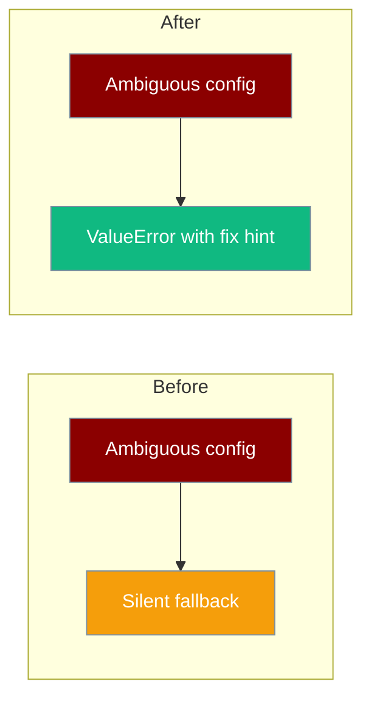

PraisonAI raises clear errors instead of silently picking a default when configuration is ambiguous.



<Warning>
**Behaviour change (PR #2122):** Several subsystems that previously fell back silently now raise explicit errors. Review the table below when upgrading.
</Warning>

## What Changed

| Area | Old behaviour | New behaviour | Deep dive |
|------|---------------|---------------|-----------|
| Database URL | Unknown scheme → SQLite fallback | `ValueError` | [Cloud Databases](/docs/features/cloud-databases) |
| Model string | Unrecognised name → OpenAI | `ValueError` | [Multi-Provider Advanced](/docs/features/multi-provider-advanced) |
| Daytona sandbox | Appeared available with client | `NotImplementedError` | [Sandbox](/docs/features/sandbox) |
| LazyCache | Cached `None` on `ImportError` | Re-raises `ImportError` | Optional deps docs |
| Approval | `enabled: false` by default | `enabled: true` by default | [Approval](/docs/features/approval) |
| Claude CLI backend | `bypassPermissions` default | `default` mode; bypass requires opt-in | [CLI Backend Protocol](/docs/features/cli-backend-protocol) |
| SandlockSandbox (PR #1367) | Landlock ABI too low → silent `SubprocessSandbox` fallback | `RuntimeError` at init time | [Sandbox](/docs/features/sandbox) |

## Quick Start

<Steps>

<Step title="Grep your logs for new errors">

```bash
grep -r "Unable to infer DB backend\|Cannot infer provider\|Daytona backend not yet implemented" logs/
```

</Step>

<Step title="Fix database URLs explicitly">

```python
# Was silently SQLite — now raises ValueError
db_url = "sqlite:///mydata.db"  # explicit scheme required
```

</Step>

<Step title="Use provider/model form">

```python
from praisonaiagents import Agent

# Was OpenAI fallback — now raises ValueError
agent = Agent(name="assistant", llm="ollama/llama3")
```

</Step>

</Steps>

## Migrating

| Exception text | Fix |
|----------------|-----|
| `Unable to infer DB backend from URL '...'; supported schemes: postgres://, mysql://, sqlite://, redis://, libsql://, http(s)://` | Prefix URL with a supported scheme, e.g. `sqlite:///path.db` |
| `Cannot infer provider from model '...'. Use the 'provider/model' form, e.g. 'ollama/llama3', 'bedrock/anthropic.claude-3-sonnet'.` | Use `provider/model` or a recognised prefix (`gpt-`, `claude-`, `gemini-`) |
| `Daytona backend not yet implemented. Use 'subprocess', 'docker', or 'e2b' sandbox instead.` | Switch `sandbox_type` to a supported backend |
| Approval prompts where none expected | Set `approval=False` or `approval: {enabled: false}` in YAML |

## Best Practices

<AccordionGroup>

<Accordion title="Prefer explicit configuration">
When in doubt, spell out schemes, provider prefixes, and backend names — silent fallbacks are gone.
</Accordion>

<Accordion title="Disable approval only when intended">
Approval is on by default (PR #2122). Use `approval=False` for fully autonomous runs.
</Accordion>

<Accordion title="Never use BYPASS without env gate">
Claude Code bypass requires `unsafe=True` **and** `PRAISONAI_CLAUDE_BYPASS_PERMISSIONS=1`.
</Accordion>

</AccordionGroup>

## Related

<CardGroup cols={2}>
  <Card title="Approval" icon="shield-check" href="/docs/features/approval">
    Safe-by-default approval gates
  </Card>
  <Card title="Cloud Databases" icon="cloud" href="/docs/features/cloud-databases">
    Supported DB URL schemes
  </Card>
  <Card title="Multi-Provider" icon="shuffle" href="/docs/features/multi-provider-advanced">
    Model string format
  </Card>
  <Card title="Sandbox" icon="box" href="/docs/features/sandbox">
    Available sandbox backends
  </Card>
</CardGroup>
