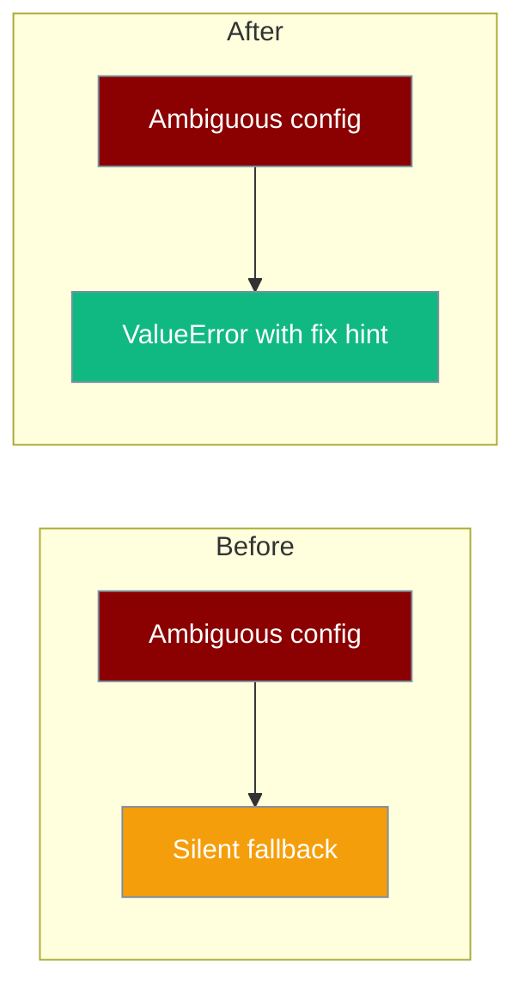
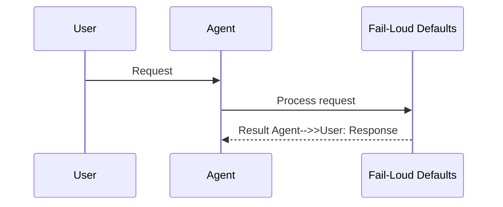
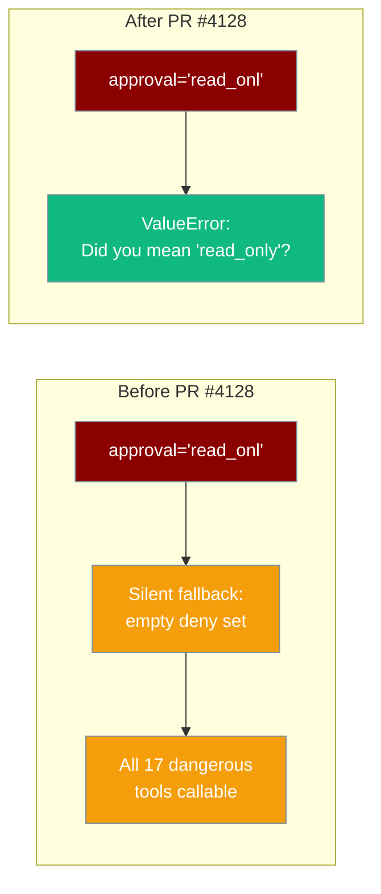
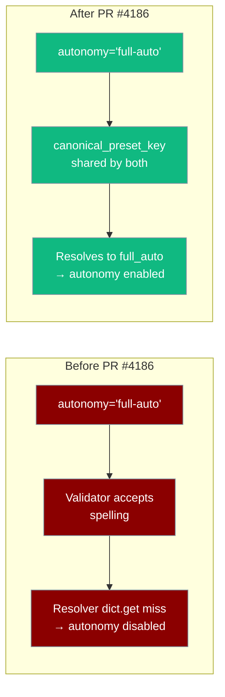
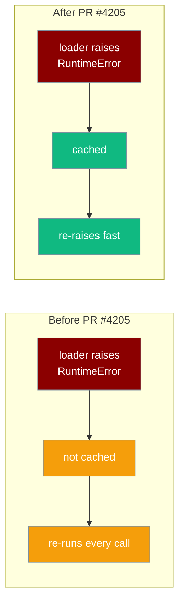

PraisonAI raises clear errors instead of silently picking a default when configuration is ambiguous.

```python
from praisonaiagents import Agent

# Explicit provider/model — no silent OpenAI fallback
agent = Agent(name="assistant", llm="ollama/llama3")
agent.start("Hello!")
```

The user passes ambiguous configuration; PraisonAI raises an explicit error with a fix hint instead of silently falling back.


```mermaid
graph LR
    subgraph Before
        A1[Ambiguous config] --> B1[Silent fallback]
    end
    subgraph After
        A2[Ambiguous config] --> B2[ValueError with fix hint]
    end

    classDef agent fill:#8B0000,stroke:#7C90A0,color:#fff
    classDef warn fill:#F59E0B,stroke:#7C90A0,color:#fff
    classDef ok fill:#10B981,stroke:#7C90A0,color:#fff

    class A1,A2 agent
    class B1 warn
    class B2 ok

    classDef tool fill:#189AB4,color:#fff

    classDef agent fill:#8B0000,color:#fff
```

## How It Works


```mermaid
sequenceDiagram
    participant User
    participant Agent
    participant Feature as Fail-Loud Defaults

    User->>Agent: Request
    Agent->>Feature: Process request
    Feature-->>Agent: Result    Agent-->>User: Response
```


<Warning>
**Behaviour change (PR #2122):** Several subsystems that previously fell back silently now raise explicit errors. Review the table below when upgrading.
</Warning>

<Warning>
**Also fixed in PR #4128:** Seven `Agent(...)` preset params — `output`, `execution`, `context`, `autonomy`, `approval`, `learn`, `self_improve` — now raise `ValueError` on a typo instead of silently using defaults. The worst case was security-relevant: `approval="read_onl"` produced an **empty deny set**, leaving all 17 dangerous tools callable. If you rely on the previous silent-default behaviour, pass the default explicitly: `approval=False`, `execution="balanced"`, etc.

**Completed by PraisonAI PR #4186 (issue #4182):** the same four params also silently disabled themselves when the validator accepted a spelling the resolver did not (`autonomy="full-auto"`, `context="sliding-window"`, `"FULL_AUTO"`, `" thorough "`, …). Validation and resolution now share one canonical spelling rule (`canonical_preset_key()` in `praisonaiagents/config/parse_utils.py`), so any spelling the validator accepts also resolves to the intended preset. `approval`, `learn`, and `self_improve` were already correct; this closes the gap for the remaining four (`output`, `execution`, `context`, `autonomy`).
</Warning>


```mermaid
graph LR
    subgraph "Before PR #4128"
        A1[approval='read_onl'] --> B1[Silent fallback:<br/>empty deny set]
        B1 --> C1[All 17 dangerous<br/>tools callable]
    end
    subgraph "After PR #4128"
        A2[approval='read_onl'] --> B2[ValueError:<br/>Did you mean 'read_only'?]
    end

    classDef bad fill:#8B0000,stroke:#7C90A0,color:#fff
    classDef warn fill:#F59E0B,stroke:#7C90A0,color:#fff
    classDef ok fill:#10B981,stroke:#7C90A0,color:#fff

    class A1,A2 bad
    class B1,C1 warn
    class B2 ok
```


```mermaid
graph LR
    subgraph "Before PR #4186"
        D1[autonomy='full-auto'] --> E1[Validator accepts<br/>spelling]
        E1 --> F1[Resolver dict.get miss<br/>→ autonomy disabled]
    end
    subgraph "After PR #4186"
        D2[autonomy='full-auto'] --> E2[canonical_preset_key<br/>shared by both]
        E2 --> F2[Resolves to full_auto<br/>→ autonomy enabled]
    end

    classDef bad fill:#8B0000,stroke:#7C90A0,color:#fff
    classDef ok fill:#10B981,stroke:#7C90A0,color:#fff

    class D1,F1 bad
    class E1 bad
    class D2,E2,F2 ok
```

A broken optional dependency that failed with anything other than `ImportError` used to re-probe on every hot-path access; now the first failure is cached and re-raised fast (PR #4205).


```mermaid
graph LR
    subgraph "Before PR #4205"
        L1[loader raises<br/>RuntimeError] --> C1[not cached] --> R1[re-runs every call]
    end
    subgraph "After PR #4205"
        L2[loader raises<br/>RuntimeError] --> C2[cached] --> R2[re-raises fast]
    end

    classDef bad fill:#8B0000,stroke:#7C90A0,color:#fff
    classDef warn fill:#F59E0B,stroke:#7C90A0,color:#fff
    classDef ok fill:#10B981,stroke:#7C90A0,color:#fff

    class L1,L2 bad
    class C1,R1 warn
    class C2,R2 ok
```

## What Changed

| Area | Old behaviour | New behaviour | Deep dive |
|------|---------------|---------------|-----------|
| Database URL | Unknown scheme → SQLite fallback | `ValueError` | [Cloud Databases](/features/cloud-databases) |
| Model string | Unrecognised name → OpenAI | `ValueError` | [Multi-Provider Advanced](/features/multi-provider-advanced) |
| Daytona sandbox | Appeared available with client | `NotImplementedError` | [Sandbox](/features/sandbox) |
| LazyCache | Only `ImportError` cached; other loader failures re-ran on every call | Caches and re-raises **every** terminal loader failure (`ImportError`, `RuntimeError`, `OSError`, …); `KeyboardInterrupt` / `SystemExit` still propagate uncached — PraisonAI PR #4205 | Optional deps docs |
| Approval | `enabled: false` by default | `enabled: true` by default | [Approval](/features/approval) |
| Claude CLI backend | `bypassPermissions` default | `default` mode; bypass requires opt-in | [CLI Backend Protocol](/features/cli-backend-protocol) |
| SandlockSandbox (PR #1367) | Landlock ABI too low → silent `SubprocessSandbox` fallback | `RuntimeError` at init time | [Sandbox](/features/sandbox) |
| `Agent()` preset params (PR #4128) — `output`, `execution`, `context`, `autonomy`, `approval`, `learn`, `self_improve` | Typo → silent fallback to defaults (worst case: `approval="read_onl"` → empty deny set, all tools callable) | `ValueError` with "Did you mean ...?" suggestion | [Agent Presets & Modes](/features/agent-presets-and-modes), [Approval](/features/approval) |

## Quick Start

<Steps>

<Step title="Grep your logs for new errors">

```bash
grep -r "Unable to infer DB backend\|Cannot infer provider\|Daytona backend not yet implemented" logs/
```

</Step>

<Step title="Fix database URLs explicitly">

```python
# Was silently SQLite — now raises ValueError
db_url = "sqlite:///mydata.db"  # explicit scheme required
```

</Step>

<Step title="Use provider/model form">

```python
from praisonaiagents import Agent

# Was OpenAI fallback — now raises ValueError
agent = Agent(name="assistant", llm="ollama/llama3")
```

</Step>

</Steps>

## Migrating

| Exception text | Fix |
|----------------|-----|
| `Unable to infer DB backend from URL '...'; supported schemes: postgres://, mysql://, sqlite://, redis://, libsql://, http(s)://` | Prefix URL with a supported scheme, e.g. `sqlite:///path.db` |
| `Cannot infer provider from model '...'. Use the 'provider/model' form, e.g. 'ollama/llama3', 'bedrock/anthropic.claude-3-sonnet'.` | Use `provider/model` or a recognised prefix (`gpt-`, `claude-`, `gemini-`) |
| `Daytona backend not yet implemented. Use 'subprocess', 'docker', or 'e2b' sandbox instead.` | Switch `sandbox_type` to a supported backend |
| Approval prompts where none expected | Set `approval=False` or `approval: {enabled: false}` in YAML |
| `Unknown preset '<typo>' for parameter '<param>'. Did you mean '<suggestion>'?` | Fix the spelling, or pass the default explicitly (`approval=False`, `output="silent"`, `execution="balanced"`, …). Free-form params (`knowledge=`, `guardrails=`, `skills=`, `runtime=`, `auth=`) are exempt from this check. |
| Silent fallback to a disabled feature after passing a hyphen / padded / uppercase preset (e.g. `autonomy="full-auto"` behaves as `autonomy=False`) | Upgrade to a build including PraisonAI PR #4186. From that build on, `full-auto`, `FULL_AUTO`, and ` full_auto ` all resolve to the same preset as `full_auto`. |
| A cached non-`ImportError` (e.g. `RuntimeError` from a broken native library) now re-raises on every access to an optional feature | Install the missing system dep or set the feature off explicitly — the cache no longer masks the failure by re-running the loader each call |

## Best Practices

<AccordionGroup>

<Accordion title="Prefer explicit configuration">
When in doubt, spell out schemes, provider prefixes, and backend names — silent fallbacks are gone.
</Accordion>

<Accordion title="Disable approval only when intended">
Approval is on by default (PR #2122). Use `approval=False` for fully autonomous runs.
</Accordion>

<Accordion title="Never use BYPASS without env gate">
Claude Code bypass requires `unsafe=True` **and** `PRAISONAI_CLAUDE_BYPASS_PERMISSIONS=1`.
</Accordion>

<Accordion title="Pin sandbox backends explicitly">
Do not rely on implicit fallbacks — set `sandbox_type` to a supported backend (`subprocess`, `docker`, or `e2b`).
</Accordion>

</AccordionGroup>

## Related

<CardGroup cols={2}>
  <Card title="Approval" icon="shield-check" href="/features/approval">
    Safe-by-default approval gates
  </Card>
  <Card title="Cloud Databases" icon="cloud" href="/features/cloud-databases">
    Supported DB URL schemes
  </Card>
</CardGroup>
