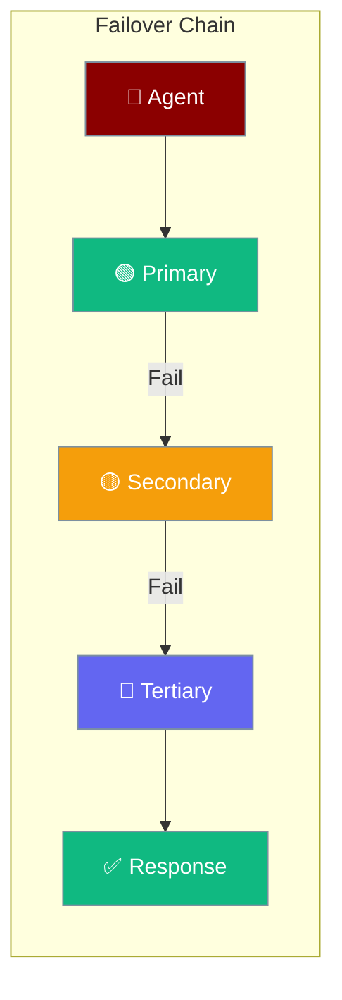
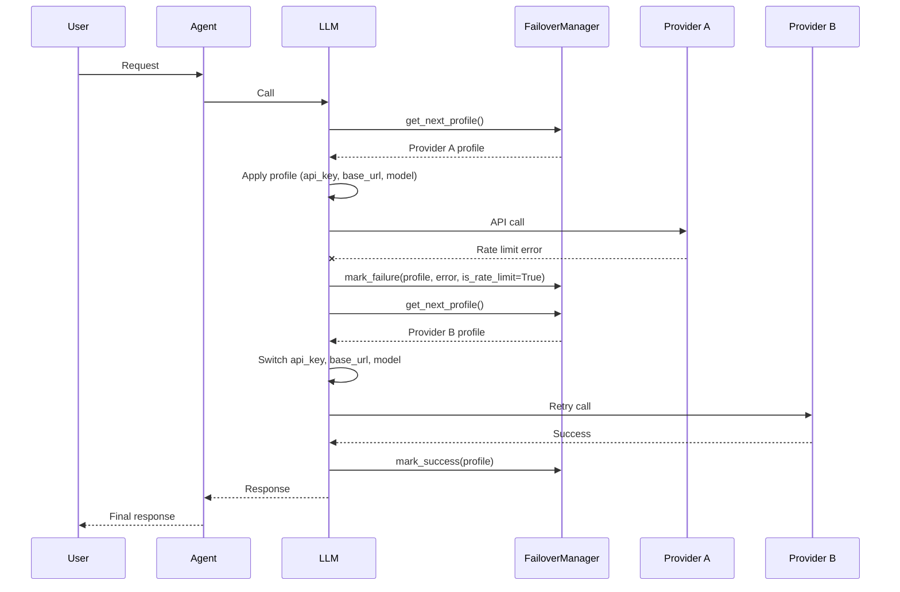
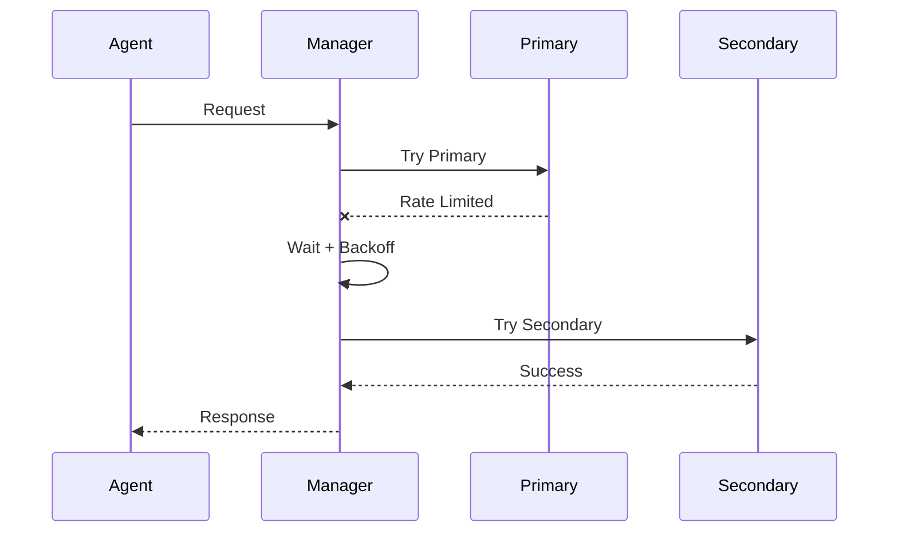

Failover automatically switches between LLM providers when one fails, keeping agents running during API outages or rate limits.

<Note>
Failover now integrates with [LLM Error Classification](/features/llm-error-classification) through the new `FailoverDecision` struct, which coordinates profile rotation with typed error handling.
</Note>



## Quick Start

<Steps>

<Step title="Run an agent with failover">
```python
import os
from praisonaiagents import Agent, AuthProfile, FailoverConfig, FailoverManager

manager = FailoverManager(FailoverConfig(max_retries=3, exponential_backoff=True))
manager.add_profile(AuthProfile(
    name="openai", provider="openai",
    api_key=os.getenv("OPENAI_API_KEY"), priority=1,
))
manager.add_profile(AuthProfile(
    name="anthropic", provider="anthropic",
    api_key=os.getenv("ANTHROPIC_API_KEY"), priority=2,
))

agent = Agent(
    name="assistant",
    llm={"model": "gpt-4o-mini", "failover_manager": manager},
)
agent.start("Hello!")
```
</Step>

<Step title="Add more profiles">
```python
import os
from praisonaiagents import AuthProfile, FailoverManager

manager = FailoverManager()
manager.add_profile(AuthProfile(
    name="groq", provider="groq",
    api_key=os.getenv("GROQ_API_KEY"), priority=3,
))
```
</Step>

<Step title="Monitor provider health">
```python
status = manager.status()
for name, info in status.items():
    print(f"{name}: {info['status']}")
```
</Step>

</Steps>

---

## How failover activates during retries

Failover now drives LLM retries through direct integration with the retry mechanism:



- On every LLM call, the system first gets the current profile via `get_next_profile()` and applies its `api_key`, `base_url`, and `model` settings
- On success, `mark_success(profile)` is called to track the working provider  
- On failure, `mark_failure(profile, error, is_rate_limit=...)` marks the provider as failed, then `get_next_profile()` fetches the next available provider
- Profile switching **overrides** non-retryable classification—one extra attempt is always granted after switching providers
- The LLM automatically updates request parameters (api_key, base_url, model) when switching between profiles

---

## How It Works



| Component | Role |
|-----------|------|
| **AuthProfile** | Credentials for a single provider |
| **FailoverManager** | Orchestrates failover logic |
| **FailoverConfig** | Retry and backoff settings |
| **ProviderStatus** | Tracks provider health |

---

## Configuration Options

<CardGroup cols={2}>
  <Card title="FailoverManager" icon="rotate" href="/docs/sdk/reference/praisonaiagents/classes/FailoverManager">
    Manager class reference
  </Card>
  <Card title="AuthProfile" icon="key" href="/docs/sdk/reference/praisonaiagents/classes/AuthProfile">
    Provider credential profile
  </Card>
</CardGroup>

```python
from praisonaiagents import FailoverConfig

config = FailoverConfig(
    max_retries=3,
    retry_delay=1.0,
    exponential_backoff=True,
    max_retry_delay=60.0,
)
```

| Option | Type | Default | Description |
|--------|------|---------|-------------|
| `max_retries` | `int` | `3` | Maximum retry attempts |
| `retry_delay` | `float` | `1.0` | Initial retry delay |
| `exponential_backoff` | `bool` | `True` | Use exponential backoff |
| `max_retry_delay` | `float` | `60.0` | Maximum retry delay |
| `cooldown_on_rate_limit` | `float` | `60.0` | Rate limit cooldown (seconds) |
| `cooldown_on_error` | `float` | `30.0` | Error cooldown (seconds) |
| `rotate_on_success` | `bool` | `False` | Rotate profiles on success |

---

## Auth Profiles

Configure credentials for each provider:

```python
import os
from praisonaiagents import AuthProfile

profile = AuthProfile(
    name="openai-primary",
    provider="openai",
    api_key=os.getenv("OPENAI_API_KEY"),
    priority=1,
    rate_limit_rpm=100,
)
```

| Field | Type | Description |
|-------|------|-------------|
| `name` | `str` | Unique profile identifier |
| `provider` | `str` | Provider: openai, anthropic, etc. |
| `api_key` | `str` | API key (masked in logs) |
| `base_url` | `str` | Custom API endpoint |
| `model` | `str` | Default model for this profile |
| `priority` | `int` | Failover priority (lower = higher priority) |
| `rate_limit_rpm` | `int` | Requests per minute limit |
| `rate_limit_tpm` | `int` | Tokens per minute limit |
| `metadata` | `dict` | Additional provider-specific config |

---

## Common Patterns

<Tabs>
<Tab title="Multi-Provider">
```python
from praisonaiagents import AuthProfile, FailoverManager

manager = FailoverManager()

# Add multiple providers
manager.add_profile(AuthProfile(
    name="openai", provider="openai",
    api_key=os.getenv("OPENAI_API_KEY"), priority=1,
))

manager.add_profile(AuthProfile(
    name="anthropic", provider="anthropic",
    api_key=os.getenv("ANTHROPIC_API_KEY"), priority=2,
))

manager.add_profile(AuthProfile(
    name="groq", provider="groq",
    api_key=os.getenv("GROQ_API_KEY"), priority=3,
))
```
</Tab>

<Tab title="Cost Optimization">
```python
import os
from praisonaiagents import AuthProfile, FailoverManager

manager = FailoverManager()
manager.add_profile(AuthProfile(
    name="gpt-4o-mini", provider="openai",
    api_key=os.getenv("OPENAI_API_KEY"), priority=1,
    model="gpt-4o-mini",
))
manager.add_profile(AuthProfile(
    name="gpt-4o", provider="openai",
    api_key=os.getenv("OPENAI_API_KEY"), priority=2,
    model="gpt-4o",
))
```
</Tab>

<Tab title="Regional Failover">
```python
import os
from praisonaiagents import AuthProfile, FailoverManager

manager = FailoverManager()
manager.add_profile(AuthProfile(
    name="openai-us", provider="openai",
    api_key=os.getenv("OPENAI_API_KEY"),
    base_url="https://api.openai.com/v1", priority=1,
))
manager.add_profile(AuthProfile(
    name="azure-eu", provider="azure",
    api_key=os.getenv("AZURE_OPENAI_API_KEY"),
    base_url=os.getenv("AZURE_OPENAI_ENDPOINT"), priority=2,
))
```
</Tab>
</Tabs>

---

## Failover Callbacks

React to failover events:

```python
from praisonaiagents import FailoverManager, FailoverConfig

def on_failover(from_profile, to_profile, error):
    print(f"Failing over from {from_profile} to {to_profile}")
    print(f"Reason: {error}")
    # Log to monitoring system
    
config = FailoverConfig(
    on_failover=on_failover
)

manager = FailoverManager(config)
```

<Info>
**Sync + async parity (from PraisonAI #2386).** The `retry` callback now fires on **both** the sync (`agent.chat`) and async (`await agent.achat`) LLM paths. Older versions silently skipped the callback on async calls — upgrade to get retry observability for gateway bots, async tools, and any `await`-based agent code.
</Info>

---

## Provider Status

Monitor provider health:

```python
from praisonaiagents import FailoverManager

manager = FailoverManager()

# Get status of all providers
status = manager.status()
for name, info in status.items():
    print(f"{name}: {info['status']}")
    print(f"  Failures: {info['failure_count']}")
    print(f"  Last success: {info['last_success']}")

# Reset a provider after recovery
manager.mark_success("openai")

# Reset all profiles
manager.reset_all()
```

---

## Best Practices

<AccordionGroup>
  <Accordion title="Configure multiple providers">
    Always have at least 2-3 providers configured. This ensures availability even during major outages.
  </Accordion>
  
  <Accordion title="Use exponential backoff">
    Enable `exponential_backoff=True` to avoid hammering providers during issues. This helps you stay within rate limits.
  </Accordion>
  
  <Accordion title="Set appropriate priorities">
    Order providers by cost and reliability. Put cheaper/faster providers first, with premium providers as fallback.
  </Accordion>
  
  <Accordion title="Monitor failover events">
    Use the `on_failover` callback to track when failovers occur. This helps identify provider issues early. The callback fires on both sync and async LLM paths — works the same whether your agent runs via `agent.chat()` or `await agent.achat()`.
  </Accordion>

  <Accordion title="Integrate with error classification">
    Pair failover with [LLM Error Classification](/features/llm-error-classification) so `FailoverDecision` coordinates profile rotation with typed errors.
  </Accordion>

  <Accordion title="Keep API keys out of source">
    Load keys from environment variables or a secrets manager — never commit credentials to version control.
  </Accordion>
</AccordionGroup>

---

## Related

<CardGroup cols={2}>
  <Card title="LLM Error Classification" icon="triangle-exclamation" href="/docs/features/llm-error-classification">
    Typed errors that drive failover decisions
  </Card>
  <Card title="Providers" icon="microchip" href="/docs/models">
    Supported LLM providers
  </Card>
</CardGroup>
