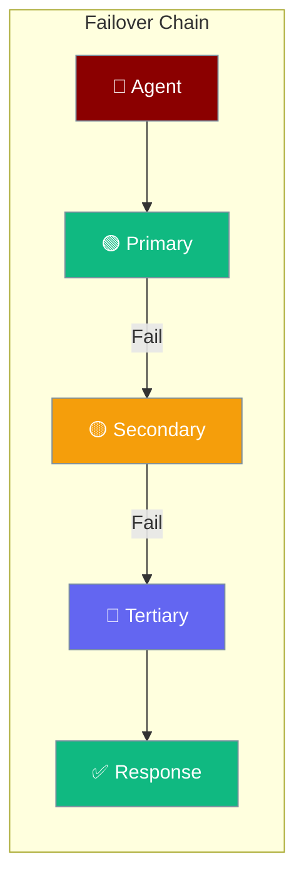
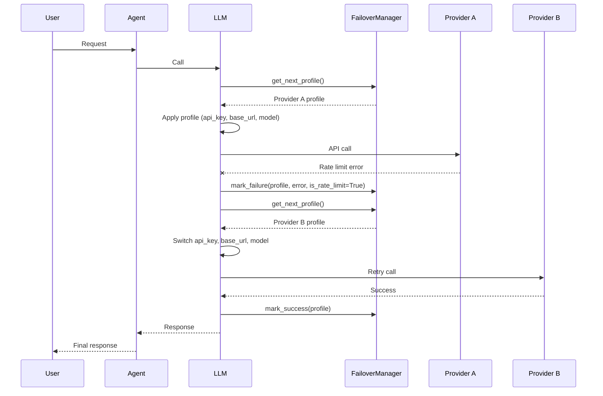
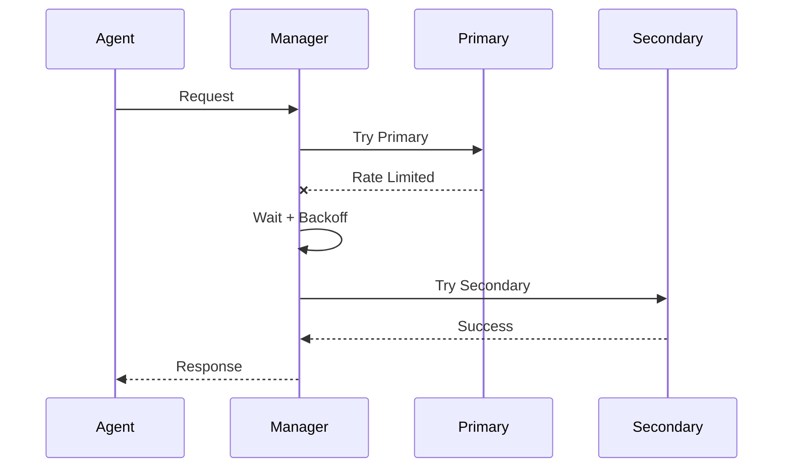
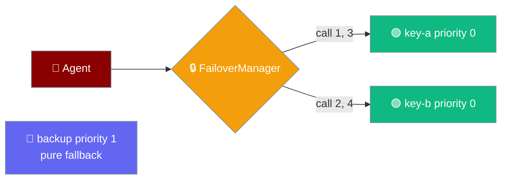
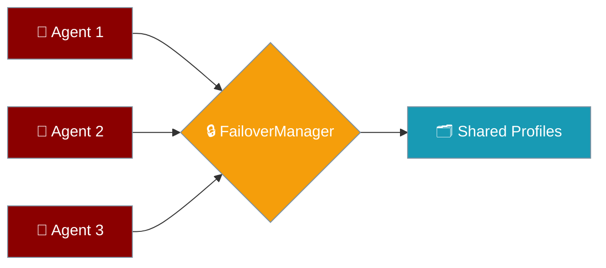

Failover automatically switches between LLM providers when one fails, keeping agents running during API outages or rate limits.

<Tabs>
<Tab title="Python">
```python
import os
from praisonaiagents import Agent, AuthProfile, FailoverConfig, FailoverManager

manager = FailoverManager(FailoverConfig(max_retries=3))
manager.add_profile(AuthProfile(
    name="openai", provider="openai",
    api_key=os.getenv("OPENAI_API_KEY"), priority=1,
))
manager.add_profile(AuthProfile(
    name="anthropic", provider="anthropic",
    api_key=os.getenv("ANTHROPIC_API_KEY"), priority=2,
))

agent = Agent(name="assistant", llm={"model": "gpt-4o-mini", "failover_manager": manager})
agent.start("Hello!")
```
</Tab>
<Tab title="TypeScript">
```typescript
import { FailoverManager } from 'praisonai';

const manager = new FailoverManager({
  providers: ['openai', 'anthropic'],
  strategy: 'priority',
  maxRetries: 3,
});

let provider = manager.getNextProvider(); // 'openai' under the priority strategy

// Rotate on a retryable failure (e.g. a 401 that a fresh key may fix):
manager.markFailed(provider!);
provider = manager.getNextProvider(); // now falls through to 'anthropic'

manager.markHealthy('openai', 120); // back online, 120ms latency
console.log(manager.getStatuses());
```
</Tab>
</Tabs>

The user sends a message; if the primary LLM profile fails, the agent tries the next profile in the failover chain.

<Note>
The LLM tool-loop failover rotates profiles on a retryable auth failure (a `401` that a fresh key may fix) and fires an event hook carrying `{ attempt, maxAttempts, profile, retryInSeconds }` so you can log or alert on each rotation.
</Note>


```mermaid
graph LR
    subgraph "Failover Chain"
        A[🤖 Agent] --> P1[🟢 Primary]
        P1 -->|Fail| P2[🟡 Secondary]
        P2 -->|Fail| P3[🔵 Tertiary]
        P3 --> R[✅ Response]
    end
    
    classDef agent fill:#8B0000,stroke:#7C90A0,color:#fff
    classDef primary fill:#10B981,stroke:#7C90A0,color:#fff
    classDef secondary fill:#F59E0B,stroke:#7C90A0,color:#fff
    classDef tertiary fill:#6366F1,stroke:#7C90A0,color:#fff
    classDef result fill:#10B981,stroke:#7C90A0,color:#fff
    
    class A agent
    class P1 primary
    class P2 secondary
    class P3 tertiary
    class R result

    classDef tool fill:#189AB4,color:#fff

    classDef agent fill:#8B0000,color:#fff
```

<Note>
Failover integrates with [LLM Error Classification](/features/llm-error-classification) via `FailoverDecision`, which coordinates profile rotation with typed error handling.
</Note>

## Quick Start

<Steps>

<Step title="Run an agent with failover">
```python
import os
from praisonaiagents import Agent, AuthProfile, FailoverConfig, FailoverManager

manager = FailoverManager(FailoverConfig(max_retries=3, exponential_backoff=True))
manager.add_profile(AuthProfile(
    name="openai", provider="openai",
    api_key=os.getenv("OPENAI_API_KEY"), priority=1,
))
manager.add_profile(AuthProfile(
    name="anthropic", provider="anthropic",
    api_key=os.getenv("ANTHROPIC_API_KEY"), priority=2,
))

agent = Agent(
    name="assistant",
    llm={"model": "gpt-4o-mini", "failover_manager": manager},
)
agent.start("Hello!")
```
</Step>

<Step title="Add more profiles">
```python
import os
from praisonaiagents import AuthProfile, FailoverManager

manager = FailoverManager()
manager.add_profile(AuthProfile(
    name="groq", provider="groq",
    api_key=os.getenv("GROQ_API_KEY"), priority=3,
))
```
</Step>

<Step title="Monitor provider health">
```python
status = manager.status()
for name, info in status.items():
    print(f"{name}: {info['status']}")
```
</Step>

</Steps>

---

## How failover activates during retries

Failover now drives LLM retries through direct integration with the retry mechanism:


```mermaid
sequenceDiagram
    participant User
    participant Agent
    participant LLM
    participant FailoverManager
    participant Provider A
    participant Provider B
    
    User->>Agent: Request
    Agent->>LLM: Call
    LLM->>FailoverManager: get_next_profile()
    FailoverManager-->>LLM: Provider A profile
    LLM->>LLM: Apply profile (api_key, base_url, model)
    LLM->>Provider A: API call
    Provider A--xLLM: Rate limit error
    LLM->>FailoverManager: mark_failure(profile, error, is_rate_limit=True)
    LLM->>FailoverManager: get_next_profile()
    FailoverManager-->>LLM: Provider B profile
    LLM->>LLM: Switch api_key, base_url, model
    LLM->>Provider B: Retry call
    Provider B-->>LLM: Success
    LLM->>FailoverManager: mark_success(profile)
    LLM-->>Agent: Response
    Agent-->>User: Final response
```

- On every LLM call, the system first gets the current profile via `get_next_profile()` and applies its `api_key`, `base_url`, and `model` settings
- On success, `mark_success(profile)` is called to track the working provider  
- On failure, `mark_failure(profile, error, is_rate_limit=...)` marks the provider as failed, then `get_next_profile()` fetches the next available provider
- Profile switching **overrides** non-retryable classification—one extra attempt is always granted after switching providers
- The LLM automatically updates request parameters (api_key, base_url, model) when switching between profiles

---

## How It Works


```mermaid
sequenceDiagram
    participant Agent
    participant Manager
    participant Primary
    participant Secondary
    
    Agent->>Manager: Request
    Manager->>Primary: Try Primary
    Primary--xManager: Rate Limited
    Manager->>Manager: Wait + Backoff
    Manager->>Secondary: Try Secondary
    Secondary-->>Manager: Success
    Manager-->>Agent: Response
```

| Component | Role |
|-----------|------|
| **AuthProfile** | Credentials for a single provider |
| **FailoverManager** | Orchestrates failover logic |
| **FailoverConfig** | Retry and backoff settings |
| **ProviderStatus** | Tracks provider health |

---

## Configuration Options

<CardGroup cols={2}>
  <Card title="FailoverManager" icon="rotate" href="/sdk/reference/praisonaiagents/classes/FailoverManager">
    Manager class reference
  </Card>
  <Card title="AuthProfile" icon="key" href="/sdk/reference/praisonaiagents/classes/AuthProfile">
    Provider credential profile
  </Card>
</CardGroup>

```python
from praisonaiagents import FailoverConfig

config = FailoverConfig(
    max_retries=3,
    retry_delay=1.0,
    exponential_backoff=True,
    max_retry_delay=60.0,
)
```

| Option | Type | Default | Description |
|--------|------|---------|-------------|
| `max_retries` | `int` | `3` | Maximum retry attempts |
| `retry_delay` | `float` | `1.0` | Initial retry delay |
| `exponential_backoff` | `bool` | `True` | Use exponential backoff |
| `max_retry_delay` | `float` | `60.0` | Maximum retry delay |
| `cooldown_on_rate_limit` | `float` | `60.0` | Rate limit cooldown (seconds) |
| `cooldown_on_error` | `float` | `30.0` | Error cooldown (seconds) |
| `rotate_on_success` | `bool` | `False` | Spread successful traffic across the current highest-priority tier (round-robin). Only equal-priority profiles at the top rotate — lower-priority profiles remain pure fallback. Off by default; see the "Load spreading across equal-priority credentials" section below. Wired into `LLM` in [PR #5330](https://github.com/MervinPraison/PraisonAI/pull/5330). |

---

## Load spreading across equal-priority credentials

If you have two API keys of the same priority — say, two OpenAI keys for redundancy — turn on `rotate_on_success` and PraisonAI will spread traffic across them one call at a time instead of hammering one until it hits a rate limit.

When you have multiple credentials of the same priority — e.g. two OpenAI keys — set `rotate_on_success=True` so each successful call moves to the next key in the tier.


```mermaid
graph LR
    Agent[🤖 Agent] --> Manager{🔒 FailoverManager}
    Manager -->|call 1, 3| KeyA[🟢 key-a priority 0]
    Manager -->|call 2, 4| KeyB[🟢 key-b priority 0]
    Backup[🔵 backup priority 1<br/>pure fallback]

    classDef agent fill:#8B0000,stroke:#7C90A0,color:#fff
    classDef manager fill:#F59E0B,stroke:#7C90A0,color:#fff
    classDef top fill:#10B981,stroke:#7C90A0,color:#fff
    classDef fallback fill:#6366F1,stroke:#7C90A0,color:#fff

    class Agent agent
    class Manager manager
    class KeyA,KeyB top
    class Backup fallback
```

```python
import os
from praisonaiagents import Agent, AuthProfile, FailoverConfig, FailoverManager

manager = FailoverManager(FailoverConfig(rotate_on_success=True))

# Two equal-priority keys share the top tier and get round-robin traffic
manager.add_profile(AuthProfile(name="key-a", provider="openai",
    api_key=os.getenv("OPENAI_KEY_A"), priority=0))
manager.add_profile(AuthProfile(name="key-b", provider="openai",
    api_key=os.getenv("OPENAI_KEY_B"), priority=0))

# A lower-priority key is used only when the top tier is exhausted
manager.add_profile(AuthProfile(name="backup", provider="anthropic",
    api_key=os.getenv("ANTHROPIC_KEY"), priority=1))

agent = Agent(name="assistant", llm={"model": "gpt-4o-mini", "failover_manager": manager})
for _ in range(4):
    agent.start("Hi")   # alternates key-a → key-b → key-a → key-b
```

**How rotation is scoped:** Rotation only cycles within the top available priority. If `key-a` gets rate-limited into cooldown, both remaining calls go to `key-b` until `key-a` recovers, then rotation resumes.

<Note>
**Shared `LLM` instances rotate too.** A single long-lived `LLM` shared across agents used to pin the profile it was constructed with. Since [PR #5330](https://github.com/MervinPraison/PraisonAI/pull/5330), when `rotate_on_success=True` the LLM re-selects the profile on every call via `FailoverManager.get_next_profile()` (per-call kwargs only — the shared instance state is never mutated), so concurrent calls remain safe and traffic actually spreads across the tier.
</Note>

---

## Auth Profiles

Configure credentials for each provider:

```python
import os
from praisonaiagents import AuthProfile

profile = AuthProfile(
    name="openai-primary",
    provider="openai",
    api_key=os.getenv("OPENAI_API_KEY"),
    priority=1,
    rate_limit_rpm=100,
)
```

| Field | Type | Description |
|-------|------|-------------|
| `name` | `str` | Unique profile identifier |
| `provider` | `str` | Provider: openai, anthropic, etc. |
| `api_key` | `str` | API key (masked in logs) |
| `base_url` | `str` | Custom API endpoint |
| `model` | `str` | Default model for this profile |
| `priority` | `int` | Failover priority (lower = higher priority) |
| `rate_limit_rpm` | `int` | Requests per minute limit |
| `rate_limit_tpm` | `int` | Tokens per minute limit |
| `metadata` | `dict` | Additional provider-specific config |

---

## Common Patterns

<Tabs>
<Tab title="Multi-Provider">
```python
from praisonaiagents import AuthProfile, FailoverManager

manager = FailoverManager()

# Add multiple providers
manager.add_profile(AuthProfile(
    name="openai", provider="openai",
    api_key=os.getenv("OPENAI_API_KEY"), priority=1,
))

manager.add_profile(AuthProfile(
    name="anthropic", provider="anthropic",
    api_key=os.getenv("ANTHROPIC_API_KEY"), priority=2,
))

manager.add_profile(AuthProfile(
    name="groq", provider="groq",
    api_key=os.getenv("GROQ_API_KEY"), priority=3,
))
```
</Tab>

<Tab title="Cost Optimization">
```python
import os
from praisonaiagents import AuthProfile, FailoverManager

manager = FailoverManager()
manager.add_profile(AuthProfile(
    name="gpt-4o-mini", provider="openai",
    api_key=os.getenv("OPENAI_API_KEY"), priority=1,
    model="gpt-4o-mini",
))
manager.add_profile(AuthProfile(
    name="gpt-4o", provider="openai",
    api_key=os.getenv("OPENAI_API_KEY"), priority=2,
    model="gpt-4o",
))
```
</Tab>

<Tab title="Regional Failover">
```python
import os
from praisonaiagents import AuthProfile, FailoverManager

manager = FailoverManager()
manager.add_profile(AuthProfile(
    name="openai-us", provider="openai",
    api_key=os.getenv("OPENAI_API_KEY"),
    base_url="https://api.openai.com/v1", priority=1,
))
manager.add_profile(AuthProfile(
    name="azure-eu", provider="azure",
    api_key=os.getenv("AZURE_OPENAI_API_KEY"),
    base_url=os.getenv("AZURE_OPENAI_ENDPOINT"), priority=2,
))
```
</Tab>
</Tabs>

---

## Failover Callbacks

React to failover events:

```python
from praisonaiagents import FailoverManager, FailoverConfig

def on_failover(from_profile, to_profile, error):
    print(f"Failing over from {from_profile} to {to_profile}")
    print(f"Reason: {error}")
    # Log to monitoring system
    
config = FailoverConfig(
    on_failover=on_failover
)

manager = FailoverManager(config)
```

<Info>
**Sync + async parity (from PraisonAI #2386).** The `retry` callback now fires on **both** the sync (`agent.chat`) and async (`await agent.achat`) LLM paths. Older versions silently skipped the callback on async calls — upgrade to get retry observability for gateway bots, async tools, and any `await`-based agent code.
</Info>

### Failover callbacks run outside the pool lock

Your `on_failover` callbacks are invoked **after** `FailoverManager` releases its internal lock (PraisonAI PR #3574). This means:

- Blocking work in a callback (network I/O, logging, metrics) does **not** stall other agents queuing on the pool.
- A callback that acquires an external lock will not deadlock against the pool's lock.
- Callbacks still run in the thread that triggered the failover — if you care about ordering, that is preserved.

---

## Provider Status

Monitor provider health:

```python
from praisonaiagents import FailoverManager

manager = FailoverManager()

# Get status of all providers
status = manager.status()
for name, info in status.items():
    print(f"{name}: {info['status']}")
    print(f"  Failures: {info['failure_count']}")
    print(f"  Last success: {info['last_success']}")

# Reset a provider after recovery
manager.mark_success("openai")

# Reset all profiles
manager.reset_all()
```

---

## Thread safety

`FailoverManager` is safe to **share across concurrent agents and threads** — it is the process-wide credential pool (PraisonAI PR #3574). Concurrent agents hitting a rate limit at the same time cannot observe torn reads or corrupt the pool: every read and mutation of the profile list and each profile's status is serialised internally.


```mermaid
graph LR
    A1[🤖 Agent 1] --> Pool{🔒 FailoverManager}
    A2[🤖 Agent 2] --> Pool
    A3[🤖 Agent 3] --> Pool
    Pool --> Profiles[🗂️ Shared Profiles]

    classDef agent fill:#8B0000,stroke:#7C90A0,color:#fff
    classDef pool fill:#F59E0B,stroke:#7C90A0,color:#fff
    classDef store fill:#189AB4,stroke:#7C90A0,color:#fff

    class A1,A2,A3 agent
    class Pool pool
    class Profiles store
```

Wire one `FailoverManager` into many agents and let them share the same credential pool — no external locking required. See [Thread Safety](/features/thread-safety) for how this fits with the rest of the SDK's concurrency model.

---

## Cross-Replica Coordination

`FailoverManager` accepts an optional `coordinator=` argument (implementing `QuotaCoordinatorProtocol`) that shares credential cooldowns across replicas. When omitted, a private in-memory coordinator is used and behaviour is exactly as before.

```python
from praisonaiagents import FailoverManager
from praisonaiagents.llm import LocalQuotaCoordinator

# Share cooldowns across managers in the same process.
shared = LocalQuotaCoordinator()
manager = FailoverManager(coordinator=shared)
```

Benches key on `AuthProfile.credential_id` — a stable, non-secret hash of `provider + base_url + api_key` — so two profiles named `"default"` with different keys never collide. See [Quota Coordinator](/features/quota-coordinator).

---

## Best Practices

<AccordionGroup>
  <Accordion title="Configure multiple providers">
    Always have at least 2-3 providers configured. This ensures availability even during major outages.
  </Accordion>
  
  <Accordion title="Use exponential backoff">
    Enable `exponential_backoff=True` to avoid hammering providers during issues. This helps you stay within rate limits.
  </Accordion>
  
  <Accordion title="Set appropriate priorities">
    Order providers by cost and reliability. Put cheaper/faster providers first, with premium providers as fallback.
  </Accordion>
  
  <Accordion title="Monitor failover events">
    Use the `on_failover` callback to track when failovers occur. This helps identify provider issues early. The callback fires on both sync and async LLM paths — works the same whether your agent runs via `agent.chat()` or `await agent.achat()`.
  </Accordion>

  <Accordion title="Integrate with error classification">
    Pair failover with [LLM Error Classification](/features/llm-error-classification) so `FailoverDecision` coordinates profile rotation with typed errors.
  </Accordion>

  <Accordion title="Keep API keys out of source">
    Load keys from environment variables or a secrets manager — never commit credentials to version control.
  </Accordion>

  <Accordion title="Spread load across equal-priority keys">
    When you configure two or more credentials at the same priority to spread rate-limit exposure, set `rotate_on_success=True`. Without it, one profile silently absorbs all traffic until it errors out. Rotation is scoped to the current top tier, so lower-priority profiles remain pure fallback.
  </Accordion>
</AccordionGroup>

---

## Related

<CardGroup cols={2}>
  <Card title="Quota Coordinator" icon="network-wired" href="/features/quota-coordinator">
    Share credential cooldowns across replicas
  </Card>
  <Card title="LLM Error Classification" icon="triangle-exclamation" href="/features/llm-error-classification">
    Typed errors that drive failover decisions
  </Card>
  <Card title="Providers" icon="microchip" href="/models">
    Supported LLM providers
  </Card>
</CardGroup>
