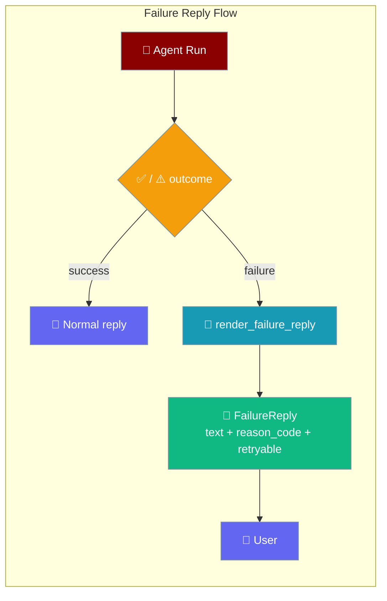
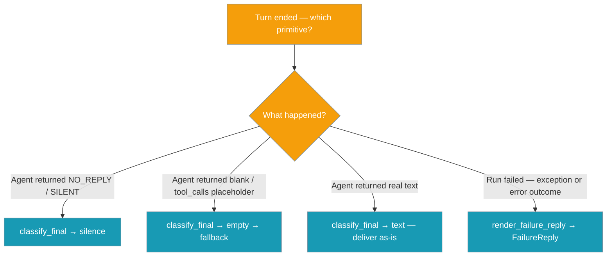
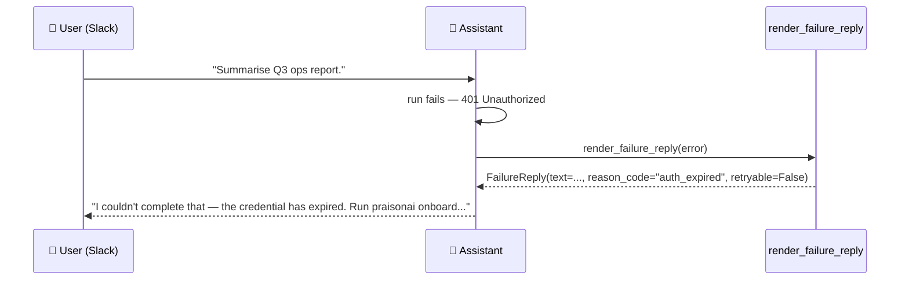

Failure Reply is the failure-path counterpart of the [Visible-Outcome Guarantee](/features/visible-outcome-guarantee): every failed turn — expired auth, missing key, rate limit, timeout, budget, doom-loop, needs-help — reaches the user as a typed, actionable message telling them exactly what to do next.

```python
from praisonaiagents import Agent

agent = Agent(
    name="Support Bot",
    instructions="Answer the user's question.",
)
# When this turn fails (expired credential, rate limit, budget, ...),
# every channel adapter delivers a visible, actionable reply keyed by the
# failure class — no more generic "Error: ..." strings.
agent.start("Summarise today's ops log.")
```



## Quick Start

<Steps>
<Step title="It's on by default">
Every adapter calls `render_failure_reply` at the failure-handling seam — there's no config knob to enable. A normal agent already benefits:

```python
from praisonaiagents import Agent

agent = Agent(
    name="Support Bot",
    instructions="Answer the user's question.",
)
```
</Step>

<Step title="Inspect a failure yourself">
Call `render_failure_reply` on any failed run — an `AgentRunOutcome`, a `PraisonAIError`, or a plain exception:

```python
from praisonaiagents.bots import render_failure_reply
from praisonaiagents.errors import PraisonAIConfigError

reply = render_failure_reply(PraisonAIConfigError("OPENAI_API_KEY missing"))

print(reply.text)         # "I couldn't complete that - a required credential ..."
print(reply.reason_code)  # "missing_key"
print(reply.retryable)    # False
```
</Step>

<Step title="Record the reason code">
Log `reply.reason_code` for aggregation. Compare against the `REASON_*` module constants, not the string literals:

```python
from praisonaiagents.bots import render_failure_reply, REASON_RATE_LIMIT

reply = render_failure_reply(outcome)
if reply.reason_code == REASON_RATE_LIMIT:
    logger.info("provider throttled this turn")
```
</Step>
</Steps>

<Note>
Before this primitive, a failed turn delivered a generic string like `Error: 401 Unauthorized` — or a silent downgrade. The rich taxonomy in `praisonaiagents.errors` / `praisonaiagents.run_outcome` (with retryability and `remediation_hint`) never reached the user, and every adapter re-invented the mapping.
</Note>

---

## Which primitive?

`classify_final` (silence) and `render_failure_reply` (failure) are easy to confuse — one handles empty finals, the other handles failed runs.



---

## FailureReply

`render_failure_reply(outcome)` is a single, pure, channel-agnostic decision that maps any failed run into a typed `FailureReply`.

- **Import:** `from praisonaiagents.bots import FailureReply, render_failure_reply`
- **Signature:** `render_failure_reply(outcome: AgentRunOutcome | PraisonAIError | Any) -> FailureReply`
- **Zero deps.** Inputs are duck-typed — an `AgentRunOutcome`, a `PraisonAIError` subclass, or any object exposing `error_category` / `status`. Anything else degrades to a generic (but still visible) `unknown` reply — it never raises.

| Field | Type | Description |
|-------|------|-------------|
| `text` | `str` | Visible, actionable message to deliver. Includes next-step copy keyed by failure class. |
| `reason_code` | `str` | Machine-readable failure class — one of the `REASON_*` constants. |
| `retryable` | `bool` | Whether the failure is worth retrying without user intervention. `True` for rate-limit / overload / transient timeout, plus any input outcome whose `is_retryable()` was `True` (e.g. `invalid_output`). |

---

## Reason codes

Compare against the `REASON_*` module constants, not the string literals.

| Constant | String value | User-facing meaning |
|----------|--------------|---------------------|
| `REASON_AUTH_EXPIRED` | `"auth_expired"` | Credential expired — run `praisonai onboard` to re-authenticate. |
| `REASON_AUTH_PERMANENT` | `"auth_permanent"` | Credential rejected — check API key/permissions, then re-onboard. |
| `REASON_MISSING_KEY` | `"missing_key"` | Required credential missing — run `praisonai onboard` (or `praisonai doctor`). |
| `REASON_RATE_LIMIT` | `"rate_limit"` | Provider is rate-limiting requests — wait and resend. |
| `REASON_OVERLOADED` | `"overloaded"` | Provider temporarily overloaded — wait and resend. |
| `REASON_TIMEOUT` | `"timeout"` | Request timed out — resend or shorten. |
| `REASON_BUDGET_EXHAUSTED` | `"budget_exhausted"` | Hit budget limit — raise budget or narrow the task. |
| `REASON_DOOM_LOOP` | `"doom_loop"` | Detected repeating loop and halted — rephrase and resend. |
| `REASON_NEEDS_HELP` | `"needs_help"` | Agent needs clarification — provide the missing detail. |
| `REASON_CANCELLED` | `"cancelled"` | Request was cancelled before it finished. |
| `REASON_CONTEXT_OVERFLOW` | `"context_overflow"` | Conversation too long — start a fresh thread or shorten. |
| `REASON_MODEL_NOT_FOUND` | `"model_not_found"` | Configured model unavailable — check model name in config. |
| `REASON_FORMAT_ERROR` | `"format_error"` | Request or configuration was invalid — check input and resend. |
| `REASON_UNKNOWN` | `"unknown"` | Unexpected error — please resend. |

`REASON_RATE_LIMIT`, `REASON_OVERLOADED`, and `REASON_TIMEOUT` are the always-retryable set. Other reasons still land as `retryable=True` when the source outcome's `is_retryable()` was affirmative (e.g. `invalid_output` → `format_error` reason, but retryable).

<Note>
The startup **turn pre-flight** (`praisonai gateway start --verify-turn`, on by default) catches most `REASON_MISSING_KEY` / `REASON_AUTH_PERMANENT` credential problems **before** the first inbound message. See [Gateway Readiness → Turn pre-flight](/features/gateway-readiness#turn-pre-flight).
</Note>

---

## Mapping tables

`_ERROR_KIND_TO_REASON` maps a `PraisonAIError.error_category` to a reason code:

| `error_category` | `reason_code` |
|------------------|---------------|
| `auth` | `auth_expired` |
| `auth_permanent` | `auth_permanent` |
| `rate_limit` | `rate_limit` |
| `overloaded` | `overloaded` |
| `context_overflow` | `context_overflow` |
| `idle_timeout` | `timeout` |
| `billing` | `budget_exhausted` |
| `model_not_found` | `model_not_found` |
| `format_error` | `format_error` |
| `validation` | `format_error` |
| `unknown` (or missing) | `unknown` |

**Special case:** if the error carries a `config_key` and the category is `format_error`, the reason becomes `missing_key` — steering the user to onboarding rather than re-auth.

`_TERMINATION_TO_REASON` maps an `AgentRunOutcome.context["termination_reason"]`:

| termination value | `reason_code` |
|-------------------|---------------|
| `budget_exhausted` | `budget_exhausted` |
| `doom_loop` | `doom_loop` |
| `needs_help` | `needs_help` |
| `timeout` | `timeout` |
| `cancelled` | `cancelled` |
| `interrupted` | `cancelled` |

When neither map hits, the fallback ladder is `error_category` → `status` (`timeout` / `cancelled` / `invalid_output → format_error`) → `unknown`.

---

## How It Works

The module never imports `PraisonAIError` / `AgentRunOutcome` at runtime — it reads fields by duck-typing, keeping it a zero-dependency leaf.

```mermaid
sequenceDiagram
    participant Adapter as Channel Adapter
    participant Failure as render_failure_reply
    participant Outcome as AgentRunOutcome / PraisonAIError
    participant User

    Adapter->>Failure: render_failure_reply(outcome)
    Failure->>Outcome: read error_category / status / termination / remediation_hint
    Outcome-->>Failure: fields
    Failure->>Failure: pick reason code + copy (hint wins)
    Failure-->>Adapter: FailureReply(text, reason_code, retryable)
    Adapter-->>User: deliver text; log reason_code
```

A concrete `remediation_hint` on a `PraisonAIError` (e.g. `PraisonAIConfigError`) always wins over the static per-class copy. Retryability is preserved from the source outcome — `invalid_output` maps to `format_error` but stays `retryable=True` when `outcome.is_retryable()` was `True`.

---

## User Interaction Flow

A user asks the assistant on Slack to summarise a report. The configured OpenAI key has expired. Instead of `Error: 401 Unauthorized`, the assistant replies with a concrete next step, and the adapter records `reason_code="auth_expired"` for the operator.



---

## Common Patterns

**Offer a retry affordance only when it makes sense** — inspect `reply.retryable` before showing a "Retry" button:

```python
from praisonaiagents.bots import render_failure_reply

reply = render_failure_reply(outcome)
send(reply.text, show_retry=reply.retryable)
```

**Aggregate by `reason_code`** — because it's a bounded, machine-readable enum, dashboards bucket failures by class (`auth_expired`, `rate_limit`, `budget_exhausted`, …) without regex on prose.

**Custom `remediation_hint` for domain errors** — a `PraisonAIConfigError` that sets `remediation_hint="Run the migration first: alembic upgrade head."` delivers that hint verbatim, keyed by `missing_key`.

---

## Best Practices

<AccordionGroup>
<Accordion title="Never hand-roll 'Error: …' strings">
Route every failed turn through `render_failure_reply` so downgrade messaging stays consistent across channels.
</Accordion>
<Accordion title="Compare against REASON_* constants, not string literals">
The reason codes are stable module constants for exactly this reason — import `REASON_RATE_LIMIT` rather than typing `"rate_limit"`.
</Accordion>
<Accordion title="A hint is more precise than a category">
When raising a custom error, set `remediation_hint` on the exception so the user sees the concrete next step rather than the generic per-class copy.
</Accordion>
<Accordion title="Trust reply.retryable">
`retryable` mirrors the source outcome — do not re-derive retry policy from the text.
</Accordion>
</AccordionGroup>

---

## Related

<CardGroup cols={2}>
<Card title="Visible-Outcome Guarantee" icon="eye" href="/features/visible-outcome-guarantee">
  The empty-final counterpart — classify_final for blank turns
</Card>
<Card title="Intentional Silence" icon="volume-xmark" href="/features/bot-intentional-silence">
  The deliberate no-reply path
</Card>
<Card title="Degraded Delivery" icon="signal-slash" href="/features/degraded-delivery">
  The presentation-path counterpart
</Card>
<Card title="Agent Run Outcomes" icon="list-check" href="/features/agent-run-outcomes">
  The input taxonomy render_failure_reply reads
</Card>
</CardGroup>

<Note>
Introduced in [PraisonAI commit 892b9fb](https://github.com/MervinPraison/PraisonAI/commit/892b9fb63361f9e543983c3d648d4f09aca6298f) (fixes [#3799](https://github.com/MervinPraison/PraisonAI/issues/3799)).
</Note>
