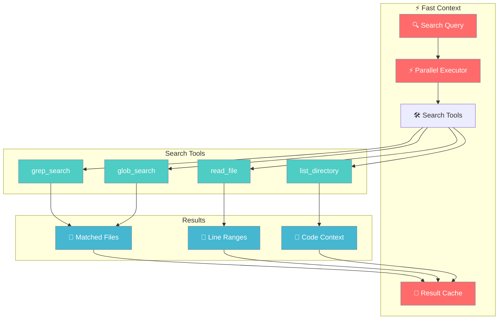

# Fast Context

Fast Context provides rapid parallel code search capabilities for AI agents, inspired by Windsurf's SWE-grep approach. It enables agents to search and understand codebases 10-20x faster than traditional sequential search methods.

<Note>
Fast Context is designed for code-aware AI agents that need to quickly find and understand relevant code in large codebases.
</Note>


```mermaid
graph TB
    subgraph FastContext["⚡ Fast Context"]
        direction TB
        Query[🔍 Search Query]
        Parallel[⚡ Parallel Executor]
        Tools[🛠️ Search Tools]
        Cache[💾 Result Cache]
    end
    
    subgraph SearchTools["Search Tools"]
        Grep[grep_search]
        Glob[glob_search]
        Read[read_file]
        List[list_directory]
    end
    
    subgraph Results["Results"]
        Files[📁 Matched Files]
        Lines[📝 Line Ranges]
        Context[📄 Code Context]
    end
    
    Query --> Parallel
    Parallel --> Tools
    Tools --> Grep
    Tools --> Glob
    Tools --> Read
    Tools --> List
    
    Grep --> Files
    Glob --> Files
    Read --> Lines
    List --> Context
    
    Files --> Cache
    Lines --> Cache
    Context --> Cache
    
    classDef fast fill:#FF6B6B,stroke:#7C90A0,color:#fff
    classDef tools fill:#4ECDC4,stroke:#7C90A0,color:#fff
    classDef results fill:#45B7D1,stroke:#7C90A0,color:#fff
    
    class Query,Parallel,Cache fast
    class Grep,Glob,Read,List tools
    class Files,Lines,Context results
```

## Key Features

| Feature | Description |
|---------|-------------|
| **Parallel Execution** | Up to 8 concurrent search operations |
| **Limited Turns** | Max 4 turns for fast response |
| **Result Caching** | Instant results for repeated queries |
| **Multi-Language** | Python, JavaScript, TypeScript, Go, Rust, Java |
| **Gitignore Support** | Respects `.gitignore` and `.praisonignore` |

## Quick Start


<Steps>
<Step title="Quick Start">
FastContext is accessed directly from the context module:

```python
from praisonaiagents.context.fast import FastContext

# Create FastContext for code search
fc = FastContext(
    workspace_path=".",
    model="gpt-4o-mini",
    max_turns=4,
    max_parallel=8,
)

# Search for code
result = fc.search("find authentication handlers")
print(f"Files found: {result.total_files}")

# Get formatted context for agent
if result.total_files > 0:
    context = fc.get_context_for_agent("authentication handlers")
    print(f"Context:\n{context}")
```
</Step>
</Steps>


## Best Practices

<AccordionGroup>
  <Accordion title="Start simple">
    Enable the feature with a single parameter before adding configuration. Verify it works, then layer in options.
  </Accordion>
  <Accordion title="Use environment variables for secrets">
    Never hardcode API keys or tokens. Use `os.getenv("KEY_NAME")` to read from environment variables.
  </Accordion>
  <Accordion title="Test with minimal examples first">
    Copy the Quick Start example, run it, then extend it. This confirms your environment is set up correctly.
  </Accordion>
  <Accordion title="Check the logs">
    Set `verbose=True` on your agent to see detailed execution logs when debugging unexpected behavior.
  </Accordion>
</AccordionGroup>

## Related

<CardGroup cols={2}>
  <Card title="Features Overview" icon="grid-2" href="/docs/features">
    Browse all PraisonAI features
  </Card>
  <Card title="Quick Start" icon="rocket" href="/docs/introduction">
    Get started with PraisonAI agents
  </Card>
</CardGroup>
