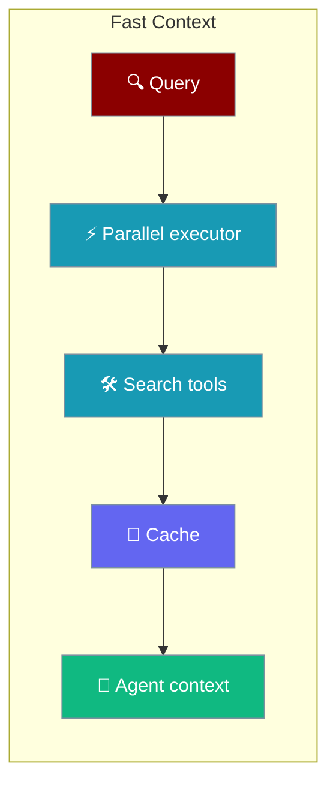

Parallel code search for agents — up to 8 concurrent lookups with caching, typically 10–20× faster than sequential grep.


```mermaid
graph LR
    subgraph "Fast Context"
        Query[🔍 Query] --> Parallel[⚡ Parallel executor]
        Parallel --> Tools[🛠️ Search tools]
        Tools --> Cache[💾 Cache]
        Cache --> Context[📄 Agent context]
    end

    classDef agent fill:#8B0000,stroke:#7C90A0,color:#fff
    classDef process fill:#189AB4,stroke:#7C90A0,color:#fff
    classDef config fill:#6366F1,stroke:#7C90A0,color:#fff
    classDef result fill:#10B981,stroke:#7C90A0,color:#fff

    class Query agent
    class Parallel,Tools process
    class Cache config
    class Context result
```

## Key Features

| Feature | Description |
|---------|-------------|
| **Parallel Execution** | Up to 8 concurrent search operations |
| **Limited Turns** | Max 4 turns for fast response |
| **Result Caching** | Instant results for repeated queries |
| **Multi-Language** | Python, JavaScript, TypeScript, Go, Rust, Java |
| **Gitignore Support** | Respects `.gitignore` and `.praisonignore` |

## Quick Start

<Steps>
<Step title="Simple Usage">

```python
from praisonaiagents import Agent, FastContext

agent = Agent(
    name="CodeAssistant",
    instructions="Explain code clearly.",
    context=True,
)

fc = FastContext(workspace_path=".")
result = fc.search("class Agent")
if result.files:
    context = result.to_context_string()
    print(agent.chat(f"Based on this code:\n{context[:2000]}\n\nExplain the Agent class."))
```

</Step>

<Step title="With Configuration">

```python
from praisonaiagents import FastContext

fc = FastContext(
    workspace_path=".",
    model="gpt-4o-mini",
    max_turns=4,
    max_parallel=8,
    search_backend="auto",
    cache_enabled=True,
)

result = fc.search("authentication handlers")
print(f"Files found: {result.total_files}")
print(fc.get_context_for_agent("authentication handlers"))
```

</Step>
</Steps>

## Configuration Options

### FastContext Direct Usage

```python
from praisonaiagents.context.fast import FastContext

fc = FastContext(
    workspace_path="/path/to/code",  # Workspace path
    model="gpt-4o-mini",             # Model for search
    max_turns=4,                     # Max search turns
    max_parallel=8,                  # Parallel calls per turn
    timeout=30.0                     # Timeout per call (seconds)
)
```

### Environment Variables

You can also configure Fast Context via environment variables:

| Variable | Default | Description |
|----------|---------|-------------|
| `FAST_CONTEXT_MODEL` | `gpt-4o-mini` | LLM model for search |
| `FAST_CONTEXT_MAX_TURNS` | `4` | Maximum search turns |
| `FAST_CONTEXT_PARALLELISM` | `8` | Max parallel calls |
| `FAST_CONTEXT_TIMEOUT` | `30.0` | Timeout in seconds |
| `FAST_CONTEXT_CACHE` | `true` | Enable caching |
| `FAST_CONTEXT_CACHE_TTL` | `300` | Cache TTL (seconds) |
| `FAST_CONTEXT_BACKEND` | `auto` | Search backend (auto/python/ripgrep) |

```bash
export FAST_CONTEXT_MODEL="gpt-4o-mini"
export FAST_CONTEXT_MAX_TURNS=4
export FAST_CONTEXT_PARALLELISM=8
export FAST_CONTEXT_CACHE=true
```

### Performance Optimizations

FastContext includes optional performance optimizations that enable faster search with no impact on default behavior:

<Tabs>
  <Tab title="Smart Auto-Selection">
    FastContext automatically selects the optimal backend based on codebase size:
    
    | Codebase Size | Backend | Performance |
    |---------------|---------|-------------|
    | **< 500 files** | Python | Faster (no subprocess overhead) |
    | **≥ 500 files** | Ripgrep | 20-40x faster |
    
    ```python
    from praisonaiagents.context.fast import FastContext
    
    # Auto-selects based on codebase size (default)
    fc = FastContext(
        workspace_path=".",
        search_backend="auto"  # "auto" | "python" | "ripgrep"
    )
    ```
    
    <Tip>
    Use `search_backend="auto"` (default) for optimal performance. FastContext counts files and automatically chooses Python for small projects and Ripgrep for large codebases.
    </Tip>
  </Tab>
  
  <Tab title="Force Ripgrep">
    Explicitly use ripgrep for faster pattern matching:
    
    ```python
    fc = FastContext(
        workspace_path=".",
        search_backend="ripgrep"  # Force ripgrep
    )
    ```
    
    <Note>
    Requires `rg` binary in PATH. Install via:
    - macOS: `brew install ripgrep`
    - Ubuntu: `apt install ripgrep`
    - Windows: `choco install ripgrep`
    </Note>
  </Tab>
  
  <Tab title="Incremental Indexing">
    Enable file indexing for faster repeat searches on large codebases:
    
    ```python
    fc = FastContext(
        workspace_path=".",
        enable_indexing=True,  # Track file mtimes
        index_path=".fast_context_index.json"  # Optional custom path
    )
    
    # First search indexes files
    result = fc.search("def main")
    
    # Subsequent searches skip unchanged files
    result = fc.search("class Agent")  # Faster!
    ```
  </Tab>
  
  <Tab title="Context Compression">
    Compress context to fit within token budgets:
    
    ```python
    fc = FastContext(
        workspace_path=".",
        compression="smart"  # "truncate" | "smart" | None
    )
    ```
    
    | Strategy | Description |
    |----------|-------------|
    | `truncate` | Simple token-based truncation preserving start/end |
    | `smart` | Preserves important lines (definitions, imports) |
  </Tab>
</Tabs>

#### Optional Dependencies

Install optional dependencies for enhanced performance:

```bash
pip install praisonaiagents[fastcontext]
```

Or install individually:

```bash
pip install aiofiles watchfiles
```

<Note>
All optimizations are optional with graceful fallback. If dependencies are not installed, FastContext uses built-in Python implementations.
</Note>

## Standalone Usage

You can also use Fast Context independently without an Agent:

```python
from praisonaiagents.context.fast import FastContext

# Create FastContext instance
fc = FastContext(
    workspace_path="/path/to/project",
    model="gpt-4o-mini",
    max_turns=4,
    max_parallel=8,
    cache_enabled=True
)

# Search for patterns
result = fc.search("def authenticate")
print(f"Found {result.total_files} files in {result.search_time_ms}ms")

# Get formatted context for an agent
context = fc.get_context_for_agent("authentication handlers", max_files=5)
print(context)

# Search for files
files = fc.search_files("**/*.py")
print(f"Found {files.total_files} Python files")
```

## Search Tools

Fast Context provides four core search tools:

### grep_search

Pattern-based search with regex support:

```python
from praisonaiagents.context.fast.search_tools import grep_search

results = grep_search(
    search_path="/path/to/code",
    pattern="class.*Agent",
    is_regex=True,
    case_sensitive=False,
    max_results=50,
    context_lines=2
)

for match in results:
    print(f"{match['path']}:{match['line_number']}: {match['content']}")
```

### glob_search

Find files by pattern:

```python
from praisonaiagents.context.fast.search_tools import glob_search

files = glob_search(
    search_path="/path/to/code",
    pattern="**/*.py",
    max_results=100
)

for f in files:
    print(f"{f['path']} ({f['size']} bytes)")
```

### read_file

Read file contents with line ranges:

```python
from praisonaiagents.context.fast.search_tools import read_file

result = read_file(
    filepath="/path/to/file.py",
    start_line=10,
    end_line=50,
    context_lines=5
)

if result['success']:
    print(result['content'])
```

### list_directory

List directory contents:

```python
from praisonaiagents.context.fast.search_tools import list_directory

result = list_directory(
    dir_path="/path/to/code",
    recursive=True,
    max_depth=3
)

for entry in result['entries']:
    prefix = "📁" if entry['is_dir'] else "📄"
    print(f"{prefix} {entry['name']}")
```

## File and Symbol Indexing

For even faster searches, use the indexers:

```python
from praisonaiagents.context.fast.indexer import FileIndexer, SymbolIndexer, SymbolType

# File Indexer
file_indexer = FileIndexer(workspace_path="/path/to/code")
file_indexer.index()

# Find files by pattern
py_files = file_indexer.find_by_pattern("**/*.py")
print(f"Found {len(py_files)} Python files")

# Symbol Indexer
symbol_indexer = SymbolIndexer(workspace_path="/path/to/code")
symbol_indexer.index()

# Find classes
classes = symbol_indexer.find_by_type(SymbolType.CLASS)
print(f"Found {len(classes)} classes")

# Find by name
agent_symbols = symbol_indexer.find_by_name("Agent")
for sym in agent_symbols:
    print(f"{sym.symbol_type.value}: {sym.name} in {sym.file_path}:{sym.line_number}")
```

## Caching

Fast Context automatically caches search results:

```python
from praisonaiagents.context.fast import FastContext

fc = FastContext(
    workspace_path=".",
    cache_enabled=True,
    cache_ttl=300  # 5 minutes
)

# First search - cache miss
result1 = fc.search("def main")
print(f"From cache: {result1.from_cache}")  # False

# Second search - cache hit (instant!)
result2 = fc.search("def main")
print(f"From cache: {result2.from_cache}")  # True

# Clear cache when needed
fc.clear_cache()
```

## Performance

Fast Context provides significant performance improvements:

| Metric | Value |
|--------|-------|
| Search Latency | 100-200ms average |
| Cache Hit | Less than 1ms |
| Parallel Speedup | 2-5x |
| File Indexing | 6,000+ files/second |
| Symbol Indexing | 20,000+ symbols/second |

## Best Practices

<AccordionGroup>
  <Accordion title="Use Caching for Repeated Queries">
    Enable caching for workflows that search the same patterns multiple times:
    ```python
    fc = FastContext(cache_enabled=True, cache_ttl=300)
    ```
  </Accordion>
  
  <Accordion title="Limit Search Scope">
    Use include/exclude patterns to focus searches:
    ```python
    result = fc.search(
        "authenticate",
        include_patterns=["**/*.py"],
        exclude_patterns=["**/tests/**"]
    )
    ```
  </Accordion>
  
  <Accordion title="Use Indexers for Large Codebases">
    Pre-index files and symbols for instant lookups:
    ```python
    indexer = FileIndexer(workspace_path=".")
    indexer.index()  # Run once
    files = indexer.find_by_pattern("**/*.py")  # Instant
    ```
  </Accordion>
</AccordionGroup>

## API Reference

### FastContext Class

```python
class FastContext:
    def __init__(
        self,
        workspace_path: str = None,
        model: str = "gpt-4o-mini",
        max_turns: int = 4,
        max_parallel: int = 8,
        timeout: float = 30.0,
        cache_enabled: bool = True,
        cache_ttl: int = 300,
        verbose: bool = False,
        # Performance optimizations
        search_backend: str = "auto",  # "auto" | "python" | "ripgrep"
        enable_indexing: bool = False,
        index_path: str = None,
        compression: str = None,  # "truncate" | "smart" | None
    )
    
    def search(self, query: str, ...) -> FastContextResult
    def search_files(self, pattern: str, ...) -> FastContextResult
    def get_context_for_agent(self, query: str, ...) -> str
    def read_context(self, filepath: str, ...) -> str
    def clear_cache(self) -> None
```

### FastContextResult Class

```python
@dataclass
class FastContextResult:
    files: List[FileMatch]
    query: str
    search_time_ms: int
    turns_used: int
    total_tool_calls: int
    from_cache: bool
    
    @property
    def total_files(self) -> int
    
    def to_context_string(self) -> str
    def to_dict(self) -> dict
```

## Related

<CardGroup cols={2}>
  <Card title="Context Management" icon="layer-group" href="/docs/features/context-management">
    Agent context management and compaction
  </Card>
  <Card title="Code Agent" icon="code" href="/docs/features/codeagent">
    Code generation and analysis agents
  </Card>
</CardGroup>
