# Fast Context

Fast Context provides rapid parallel code search capabilities for AI agents, inspired by Windsurf's SWE-grep approach. It enables agents to search and understand codebases 10-20x faster than traditional sequential search methods.

<Note>
Fast Context is designed for code-aware AI agents that need to quickly find and understand relevant code in large codebases.

```mermaid
graph TB
    subgraph FastContext["⚡ Fast Context"]
        direction TB
        Query[🔍 Search Query]
        Parallel[⚡ Parallel Executor]
        Tools[🛠️ Search Tools]
        Cache[💾 Result Cache]
    end
    
    subgraph SearchTools["Search Tools"]
        Grep[grep_search]
        Glob[glob_search]
        Read[read_file]
        List[list_directory]
    end
    
    subgraph Results["Results"]
        Files[📁 Matched Files]
        Lines[📝 Line Ranges]
        Context[📄 Code Context]
    end
    
    Query --> Parallel
    Parallel --> Tools
    Tools --> Grep
    Tools --> Glob
    Tools --> Read
    Tools --> List
    
    Grep --> Files
    Glob --> Files
    Read --> Lines
    List --> Context
    
    Files --> Cache
    Lines --> Cache
    Context --> Cache
    
    classDef fast fill:#FF6B6B,stroke:#7C90A0,color:#fff
    classDef tools fill:#4ECDC4,stroke:#7C90A0,color:#fff
    classDef results fill:#45B7D1,stroke:#7C90A0,color:#fff
    
    class Query,Parallel,Cache fast
    class Grep,Glob,Read,List tools
    class Files,Lines,Context results
```

</Note>



## Key Features

| Feature | Description |
|---------|-------------|
| **Parallel Execution** | Up to 8 concurrent search operations |
| **Limited Turns** | Max 4 turns for fast response |
| **Result Caching** | Instant results for repeated queries |
| **Multi-Language** | Python, JavaScript, TypeScript, Go, Rust, Java |
| **Gitignore Support** | Respects `.gitignore` and `.praisonignore` |

## Quick Start

The simplest way to use Fast Context is with the `Agent` class:

```python
from praisonaiagents import Agent

# Create an agent with Fast Context enabled
agent = Agent(
    name="CodeAssistant",
    instructions="You are a helpful code assistant.",
    fast_context=True,  # Enable Fast Context
    fast_context_path="."  # Search in current directory
)

# Use delegate_to_fast_context to search code
context = agent.delegate_to_fast_context("find authentication handlers")

if context:
    print(f"Found relevant code:\n{context}")
```

## Basic Example

```python
from praisonaiagents import Agent

def main():
    # Create agent with Fast Context
    agent = Agent(
        name="CodeAssistant",
        instructions="You are a helpful code assistant.",
        fast_context=True,
        fast_context_path=".",
        verbose=False
    )
    
    print(f"Fast Context enabled: {agent.fast_context_enabled}")
    print(f"Search path: {agent.fast_context_path}")
    
    # Search for code patterns
    context = agent.delegate_to_fast_context("class Agent")
    
    if context:
        print(f"Found {len(context)} characters of relevant code")
        print(context[:500])  # Preview first 500 chars
    
    # Direct FastContext access for more control
    fc = agent.fast_context
    if fc:
        result = fc.search("def chat")
        print(f"Files found: {result.total_files}")
        print(f"Search time: {result.search_time_ms}ms")

if __name__ == "__main__":
    main()
```

## Configuration Options

### Agent Parameters

```python
agent = Agent(
    name="CodeAssistant",
    instructions="...",
    
    # Fast Context Configuration
    fast_context=True,              # Enable Fast Context
    fast_context_path="/path/to/code",  # Workspace path
    fast_context_model="gpt-4o-mini",   # Model for search
    fast_context_max_turns=4,       # Max search turns
    fast_context_parallelism=8,     # Parallel calls per turn
    fast_context_timeout=30.0       # Timeout per call (seconds)
)
```

### Environment Variables

You can also configure Fast Context via environment variables:

| Variable | Default | Description |
|----------|---------|-------------|
| `FAST_CONTEXT_MODEL` | `gpt-4o-mini` | LLM model for search |
| `FAST_CONTEXT_MAX_TURNS` | `4` | Maximum search turns |
| `FAST_CONTEXT_PARALLELISM` | `8` | Max parallel calls |
| `FAST_CONTEXT_TIMEOUT` | `30.0` | Timeout in seconds |
| `FAST_CONTEXT_CACHE` | `true` | Enable caching |
| `FAST_CONTEXT_CACHE_TTL` | `300` | Cache TTL (seconds) |

```bash
export FAST_CONTEXT_MODEL="gpt-4o-mini"
export FAST_CONTEXT_MAX_TURNS=4
export FAST_CONTEXT_PARALLELISM=8
export FAST_CONTEXT_CACHE=true
```

## Standalone Usage

You can also use Fast Context independently without an Agent:

```python
from praisonaiagents.context.fast import FastContext

# Create FastContext instance
fc = FastContext(
    workspace_path="/path/to/project",
    model="gpt-4o-mini",
    max_turns=4,
    max_parallel=8,
    cache_enabled=True
)

# Search for patterns
result = fc.search("def authenticate")
print(f"Found {result.total_files} files in {result.search_time_ms}ms")

# Get formatted context for an agent
context = fc.get_context_for_agent("authentication handlers", max_files=5)
print(context)

# Search for files
files = fc.search_files("**/*.py")
print(f"Found {files.total_files} Python files")
```

## Search Tools

Fast Context provides four core search tools:

### grep_search

Pattern-based search with regex support:

```python
from praisonaiagents.context.fast.search_tools import grep_search

results = grep_search(
    search_path="/path/to/code",
    pattern="class.*Agent",
    is_regex=True,
    case_sensitive=False,
    max_results=50,
    context_lines=2
)

for match in results:
    print(f"{match['path']}:{match['line_number']}: {match['content']}")
```

### glob_search

Find files by pattern:

```python
from praisonaiagents.context.fast.search_tools import glob_search

files = glob_search(
    search_path="/path/to/code",
    pattern="**/*.py",
    max_results=100
)

for f in files:
    print(f"{f['path']} ({f['size']} bytes)")
```

### read_file

Read file contents with line ranges:

```python
from praisonaiagents.context.fast.search_tools import read_file

result = read_file(
    filepath="/path/to/file.py",
    start_line=10,
    end_line=50,
    context_lines=5
)

if result['success']:
    print(result['content'])
```

### list_directory

List directory contents:

```python
from praisonaiagents.context.fast.search_tools import list_directory

result = list_directory(
    dir_path="/path/to/code",
    recursive=True,
    max_depth=3
)

for entry in result['entries']:
    prefix = "📁" if entry['is_dir'] else "📄"
    print(f"{prefix} {entry['name']}")
```

## File and Symbol Indexing

For even faster searches, use the indexers:

```python
from praisonaiagents.context.fast.indexer import FileIndexer, SymbolIndexer, SymbolType

# File Indexer
file_indexer = FileIndexer(workspace_path="/path/to/code")
file_indexer.index()

# Find files by pattern
py_files = file_indexer.find_by_pattern("**/*.py")
print(f"Found {len(py_files)} Python files")

# Symbol Indexer
symbol_indexer = SymbolIndexer(workspace_path="/path/to/code")
symbol_indexer.index()

# Find classes
classes = symbol_indexer.find_by_type(SymbolType.CLASS)
print(f"Found {len(classes)} classes")

# Find by name
agent_symbols = symbol_indexer.find_by_name("Agent")
for sym in agent_symbols:
    print(f"{sym.symbol_type.value}: {sym.name} in {sym.file_path}:{sym.line_number}")
```

## Caching

Fast Context automatically caches search results:

```python
from praisonaiagents.context.fast import FastContext

fc = FastContext(
    workspace_path=".",
    cache_enabled=True,
    cache_ttl=300  # 5 minutes
)

# First search - cache miss
result1 = fc.search("def main")
print(f"From cache: {result1.from_cache}")  # False

# Second search - cache hit (instant!)
result2 = fc.search("def main")
print(f"From cache: {result2.from_cache}")  # True

# Clear cache when needed
fc.clear_cache()
```

## Performance

Fast Context provides significant performance improvements:

| Metric | Value |
|--------|-------|
| Search Latency | 100-200ms average |
| Cache Hit | Less than 1ms |
| Parallel Speedup | 2-5x |
| File Indexing | 6,000+ files/second |
| Symbol Indexing | 20,000+ symbols/second |

## Best Practices

<AccordionGroup>
  <Accordion title="Use Caching for Repeated Queries">
    Enable caching for workflows that search the same patterns multiple times:
    ```python
    fc = FastContext(cache_enabled=True, cache_ttl=300)
    ```
  </Accordion>
  
  <Accordion title="Limit Search Scope">
    Use include/exclude patterns to focus searches:
    ```python
    result = fc.search(
        "authenticate",
        include_patterns=["**/*.py"],
        exclude_patterns=["**/tests/**"]
    )
    ```
  </Accordion>
  
  <Accordion title="Use Indexers for Large Codebases">
    Pre-index files and symbols for instant lookups:
    ```python
    indexer = FileIndexer(workspace_path=".")
    indexer.index()  # Run once
    files = indexer.find_by_pattern("**/*.py")  # Instant
    ```
  </Accordion>
</AccordionGroup>

## API Reference

### FastContext Class

```python
class FastContext:
    def __init__(
        self,
        workspace_path: str = None,
        model: str = "gpt-4o-mini",
        max_turns: int = 4,
        max_parallel: int = 8,
        timeout: float = 30.0,
        cache_enabled: bool = True,
        cache_ttl: int = 300,
        verbose: bool = False
    )
    
    def search(self, query: str, ...) -> FastContextResult
    def search_files(self, pattern: str, ...) -> FastContextResult
    def get_context_for_agent(self, query: str, ...) -> str
    def read_context(self, filepath: str, ...) -> str
    def clear_cache(self) -> None
```

### FastContextResult Class

```python
@dataclass
class FastContextResult:
    files: List[FileMatch]
    query: str
    search_time_ms: int
    turns_used: int
    total_tool_calls: int
    from_cache: bool
    
    @property
    def total_files(self) -> int
    
    def to_context_string(self) -> str
    def to_dict(self) -> dict
```

## Related

<CardGroup cols={2}>
  <Card title="Memory" icon="brain" href="/features/memory">
    Persistent memory for agents
  </Card>
  <Card title="Knowledge" icon="book" href="/features/knowledge">
    Knowledge base integration
  </Card>
  <Card title="RAG" icon="magnifying-glass" href="/features/rag">
    Retrieval-augmented generation
  </Card>
  <Card title="Code Agent" icon="code" href="/features/codeagent">
    Code generation and analysis
  </Card>
</CardGroup>
