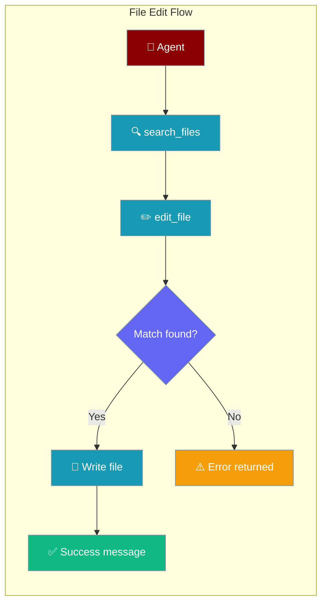
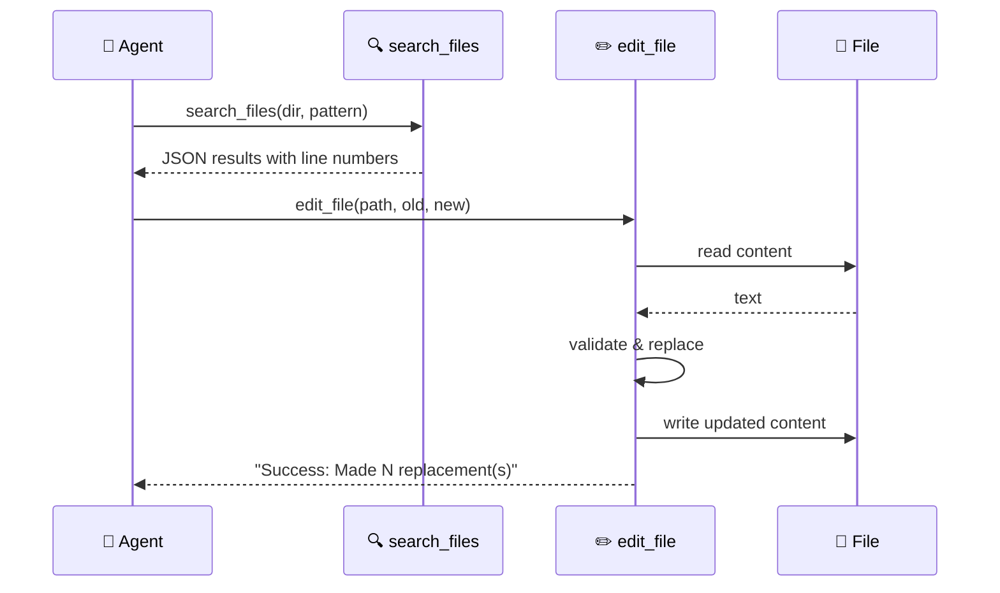

File editing tools give agents secure, workspace-scoped access to read, search, and modify files.



## Quick Start

<Steps>
<Step title="Agent with file editing tools">

```python
from praisonaiagents import Agent

agent = Agent(
    name="Code Editor",
    instructions="Edit code precisely. Search first to confirm the match is unique.",
    tools=["edit_file", "search_files", "read_file"]
)

agent.start("In src/user.js, replace getUserName() with getUserEmail().")
```

</Step>

<Step title="Direct find-and-replace">

```python
from praisonaiagents.tools.edit_tools import edit_file

result = edit_file(
    "config.py",
    old_string="DEBUG = False",
    new_string="DEBUG = True",
)
print(result)  # Success: Made 1 replacement(s) in config.py
```

</Step>

<Step title="Replace all occurrences">

```python
from praisonaiagents.tools.edit_tools import edit_file

result = edit_file(
    "styles.css",
    old_string="color: blue",
    new_string="color: green",
    replace_all=True,
)
```

</Step>
</Steps>

---

## How It Works



| Tool | Returns | Notes |
|------|---------|-------|
| `search_files` | JSON string | Case-insensitive; returns file paths and line numbers |
| `read_file` *(file_tools)* | `str` | Plain read; use before editing to inspect content |
| `edit_file` | `str` | Replaces first occurrence by default; returns success or error message |
| `write_file` | `bool` | Full overwrite of a file |
| `list_files` | `list[dict]` | Directory listing with name, size, dates |

<Warning>
Two modules export `read_file` with different import paths:

- `from praisonaiagents.tools.file_tools import read_file` → `read_file(filepath, encoding='utf-8') -> str`
- `from praisonaiagents.tools.edit_tools import read_file` — **does not exist**; import from `file_tools` to read content before editing.
</Warning>

---

## Configuration Options

### `edit_file` Parameters

| Parameter | Type | Default | Purpose |
|---|---|---|---|
| `filepath` | `str` | required | Path to the file to edit |
| `old_string` | `str` | required | Exact text to find and replace |
| `new_string` | `str` | required | Replacement text |
| `replace_all` | `bool` | `False` | Replace every occurrence; when `False` only the first is replaced |

### Return Values

| Outcome | Return value |
|---|---|
| Success | `"Success: Made {N} replacement(s) in {filepath}"` |
| File not found | `"Error: File not found: {filepath}"` |
| String not found | `"Error: String not found in file: '{preview}...'"` |
| Empty `old_string` | `"Error: old_string must be non-empty"` |
| Unexpected exception | `"Error editing file {filepath}: {detail}"` |

```python
# Single match — replaces first occurrence only
edit_file("config.py", "DEBUG = False", "DEBUG = True")

# Replace every occurrence of the pattern
edit_file("styles.css", "color: blue", "color: green", replace_all=True)
```

---

## Common Patterns

### Search before editing

```python
from praisonaiagents.tools.edit_tools import search_files, edit_file
import json

results = json.loads(search_files("src", "getUserName"))
print(results["total_matches"])  # Confirm scope before editing

edit_file("src/user.js", "getUserName()", "getUserEmail()")
```

### Read, inspect, then edit

```python
from praisonaiagents.tools.file_tools import read_file
from praisonaiagents.tools.edit_tools import edit_file

content = read_file("config.py")
if "DEBUG = False" in content:
    edit_file("config.py", "DEBUG = False", "DEBUG = True")
```

### Code refactoring

```python
from praisonaiagents.tools.edit_tools import edit_file

edit_file(
    "src/utils.js",
    "function oldHelper(",
    "function newHelper(",
)
```

---

## Best Practices

<AccordionGroup>
<Accordion title="Search before editing">
Use `search_files` to confirm the pattern exists and how many times it appears before calling `edit_file`. This lets you decide whether `replace_all=True` is appropriate.
</Accordion>

<Accordion title="Make old_string specific enough">
Include enough surrounding context (e.g. the full function signature or the enclosing block) so that `old_string` matches exactly one place. When every occurrence should change, use `replace_all=True`.
</Accordion>

<Accordion title="Check the return value">
`edit_file` returns a string in all cases — success or error. Always inspect the return value before continuing, especially inside an agent tool chain.
</Accordion>

<Accordion title="Workspace security">
File paths are validated against the workspace root. Paths containing `..` or pointing outside the workspace are rejected to prevent directory traversal.
</Accordion>

<Accordion title="Encoding">
Files are read and written as UTF-8 by default. Pass a different `encoding` argument to `read_file` from `file_tools` when working with non-UTF-8 files.
</Accordion>
</AccordionGroup>

---

## Related

<CardGroup cols={2}>
<Card title="Workspace" icon="folder-lock" href="/docs/features/workspace">
  How workspace containment secures file operations
</Card>
<Card title="Bot Default Tools" icon="toolbox" href="/docs/features/bot-default-tools">
  File tools included in default bot toolsets
</Card>
</CardGroup>
