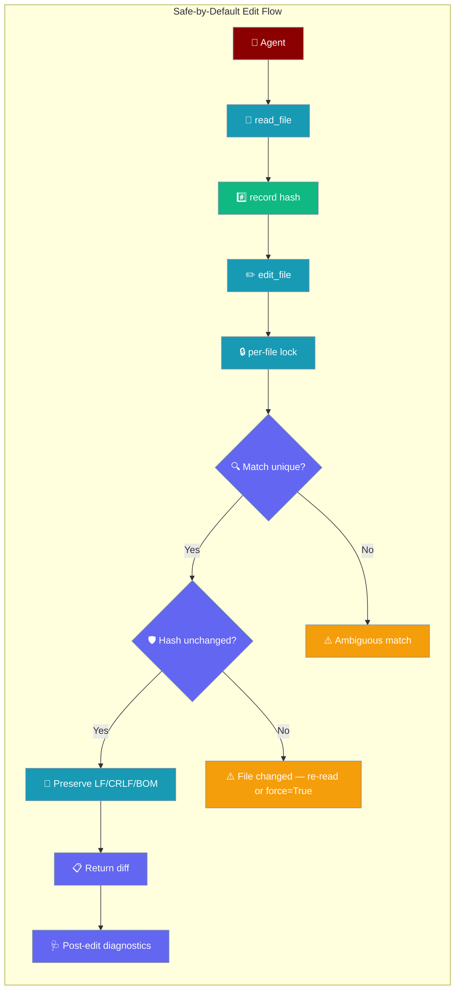
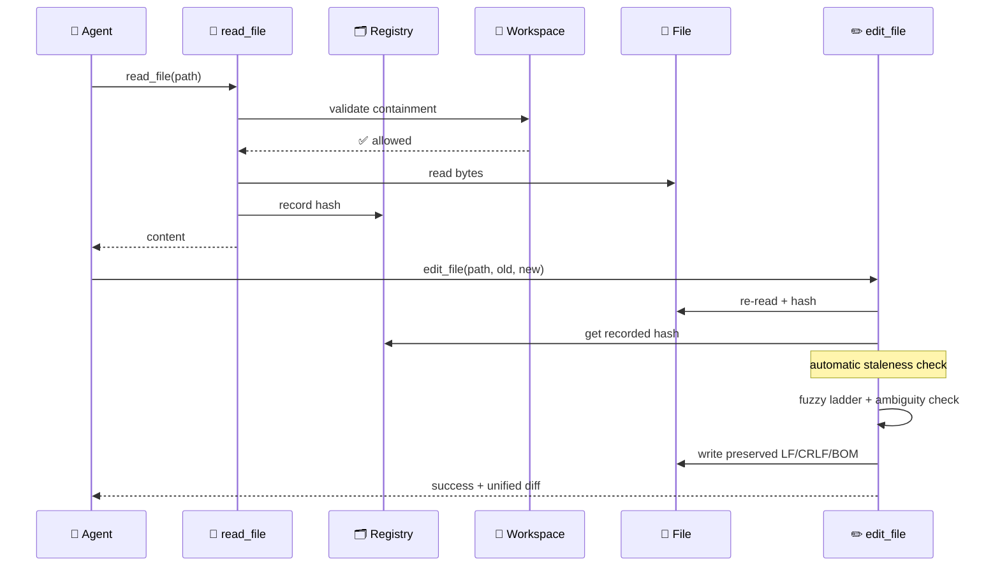
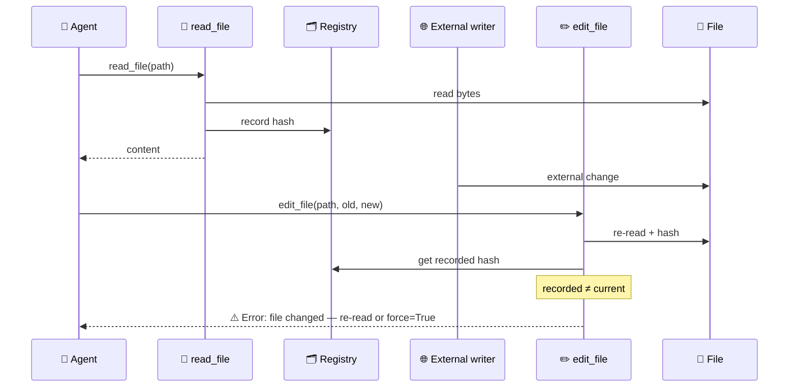
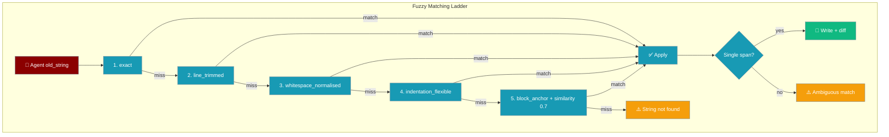
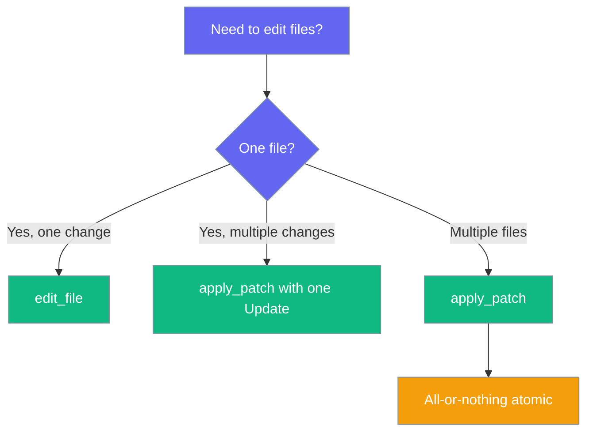
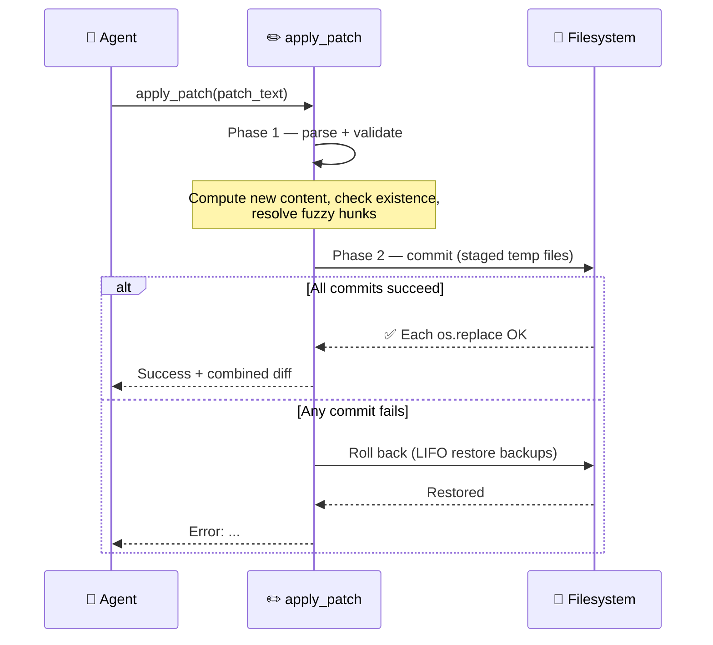
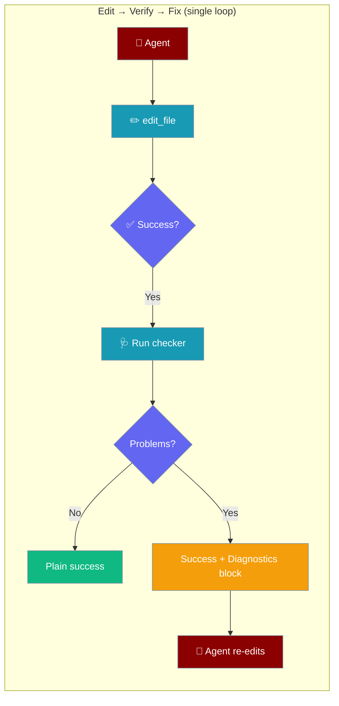
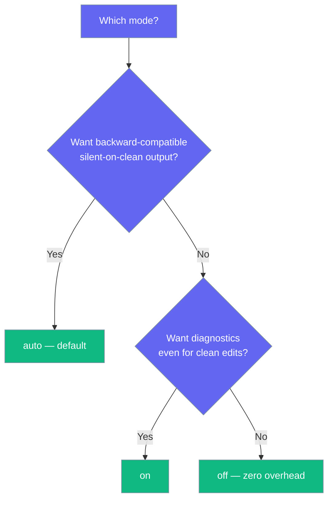
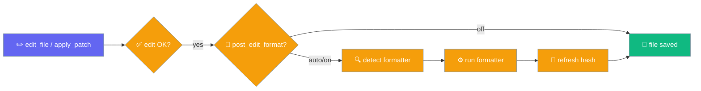

File editing tools provide secure, workspace-scoped file operations with **precise, conflict-safe** find-and-replace that's **safe by default**. Ambiguous matches fail loudly instead of editing the wrong occurrence. Read-modify-write on the same file is automatically serialised across parallel tools and multi-agent teams, and writes abort with a clear error if the file changed on disk since it was last read — no extra parameters required. A fuzzy matching ladder makes first-try edits succeed even when `old_string` drifts from the file by whitespace, indentation, or line endings.

```python
from praisonaiagents import Agent

agent = Agent(
    name="coder",
    instructions="Edit files with safe find-and-replace tools",
)

agent.start("Rename the helper in src/utils.py")
```

The user requests a code change; the agent reads the file, matches uniquely, verifies the hash, then writes and returns a diff.





The user describes an edit; the agent reads, matches uniquely, and writes with conflict checks.

## Quick Start

<Steps>
<Step title="Agent edits a file safely (no boilerplate)">

```python
from praisonaiagents import Agent

agent = Agent(
    name="Code Editor",
    instructions="Edit code precisely. Re-read files before retrying after a stale error.",
    tools=["read_file", "edit_file", "search_files"],
)

agent.start("In src/user.js, replace getUserName() with getUserEmail().")
# read_file records a hash; edit_file is auto-serialised and stale-aborted
# with no extra params from the agent.
```

</Step>

<Step title="String-name resolution — no import needed">

<Note>
**`edit_file` and `apply_patch` resolve by name.** Enable them via `tools=["edit_file", "apply_patch"]` in Python, `tools: [edit_file, apply_patch]` in YAML, or `--tools edit_file,apply_patch` from the CLI — no explicit import required. Or grab the curated bundle with `toolsets=["coding"]`.
</Note>

<Note>
**Interactive CLI users get these tools automatically.** Running `praison "prompt"` or `praisonai tui launch` now includes `edit_file` and `apply_patch` in the default toolset (the new `edit` group in [Interactive Tools](/docs/cli/interactive-tools)). Under the default `approval_mode="auto"` they are context-approved so nothing blocks; set `PRAISON_TOOLS_DISABLE=edit` or `ToolConfig(enable_edit=False)` to opt out.
</Note>

```python
from praisonaiagents import Agent

agent = Agent(name="coder", tools=["edit_file", "apply_patch", "read_file"])
agent.start("Refactor UserService to AccountService in src/user.py")
```

</Step>

<Step title="Direct SDK use (automatic protection)">

```python
from praisonaiagents.tools.edit_tools import read_file, edit_file

read_file("src/user.js")  # arms the automatic staleness guard

edit_file(
    "src/user.js",
    old_string="def getUserName(self):",
    new_string="def getUserEmail(self):",
)
# Aborts with "file changed since it was read" if anything modifies the file
# between the read and the edit. No expected_hash needed.
```

</Step>

<Step title="Replace all occurrences">

```python
from praisonaiagents.tools.edit_tools import edit_file

edit_file(
    "styles.css",
    old_string="color: blue",
    new_string="color: green",
    replace_all=True,
)
```

</Step>
</Steps>

---

## How It Works



| Operation | Risk Level | Workspace Required | Purpose |
|-----------|------------|-------------------|---------|
| **search_files** | Low | No | Find patterns in files |
| **read_file** *(edit_tools)* | Low | No | Read content + SHA-256 hash; **records hash into the shared staleness registry** |
| **read_file** *(file_tools)* | Low | No | Plain read; **also records hash so a later `write_file` engages the staleness guard** |
| **list_files** | Low | No | Directory listings |
| **edit_file** | High | Recommended | Precise find-and-replace; **automatic per-file lock + staleness guard**; `force=True` to override |
| **write_file** | High | Recommended | Create/overwrite; **automatic per-file lock + staleness guard on existing files**; `force=True` to override |
| **apply_patch** | High | Recommended | Atomic multi-file Add/Update/Delete with rollback; **per-path locks across the whole patch**; staleness guard on Update **and** Delete; `force=True` to override |

<Warning>
Two modules export `read_file` with different signatures:

- `from praisonaiagents.tools.file_tools import read_file` → `read_file(filepath, encoding='utf-8') -> str`
- `from praisonaiagents.tools.edit_tools import read_file` → `read_file(filepath) -> Tuple[str, str]`

Either flavour records the hash into the shared registry, so reading via `file_tools.read_file` still arms the automatic staleness guard for a later `edit_file` or `apply_patch` on the same path.
</Warning>

---

## Safe by Default: Concurrency & Staleness

Every read-modify-write on the same file is serialised by a per-file lock, and every write checks whether the file changed since it was last read — both run automatically across `FileTools`, `EditTools`, and `apply_patch`.

### Per-File Locking

```mermaid
graph TB
    subgraph "Per-File Lock — same path serialises, different paths parallel"
        A1[Agent A: edit_file file.py] --> L1[🔒 lock(file.py)]
        A2[Agent B: edit_file file.py] -.waits.-> L1
        A3[Agent C: edit_file other.py] --> L2[🔒 lock(other.py)]
        L1 --> W1[✏️ A writes]
        W1 --> R1[🔓 release]
        R1 --> A2W[✏️ B writes]
        L2 --> W3[✏️ C writes in parallel]
    end

    classDef agent fill:#8B0000,stroke:#7C90A0,color:#fff
    classDef lock fill:#6366F1,stroke:#7C90A0,color:#fff
    classDef ok fill:#10B981,stroke:#7C90A0,color:#fff

    class A1,A2,A3 agent
    class L1,L2 lock
    class W1,A2W,W3,R1 ok
```

### Automatic Staleness Guard



### Which Override Do I Need?


### Precedence Ladder

| Mechanism | When it fires | How to bypass |
|---|---|---|
| Explicit `expected_hash` | Always when supplied | Pass a matching hash, or omit it and rely on the automatic guard |
| Automatic staleness guard | Only when a prior `read_file` recorded a hash for the path | `force=True` (or pass `expected_hash` explicitly) |
| Per-file lock | Always (cannot be bypassed) | n/a — serialises but never refuses |

The precedence order is: **`expected_hash` > `force=True` > automatic last-read-hash guard**.

### `force=True` Examples

```python
from praisonaiagents.tools.edit_tools import edit_file, apply_patch
from praisonaiagents.tools.file_tools import FileTools

# 1. Intentional blind edit
edit_file("rollback.txt", "v2", "v1", force=True)

# 2. Force an entire patch (overrides Update & Delete staleness; per-file lock still applies)
apply_patch(patch_text, force=True)

# 3. Force a blind write through FileTools
FileTools().write_file("out.log", "snapshot", force=True)
```

---

## How Fuzzy Matching Works

`edit_file` walks a deterministic ladder of matching strategies and stops at the **first** strategy that produces a confident match. Exact matches always win; fuzzy strategies only engage when an exact substring is not found. Existing code keeps behaving exactly as before — only previously-failing edits now succeed.



| # | Strategy | Tolerates | Example divergence |
|---|----------|-----------|-------------------|
| 1 | `exact` | nothing | byte-for-byte match |
| 2 | `line_trimmed` | leading/trailing whitespace per line | `    return 1` vs `return 1` |
| 3 | `whitespace_normalised` | collapsed internal whitespace | `x   =    1` vs `x = 1` |
| 4 | `indentation_flexible` | tabs vs spaces, depth | `\treturn 1` vs `    return 1` |
| 5 | `block_anchor` | structural drift (similarity ≥ 0.7) | first/last lines anchor a fuzzy block |

**Confidence guards (block_anchor only):**
- Similarity threshold: `0.7` (constant `_BLOCK_ANCHOR_THRESHOLD` in source)
- Disproportionate-length guard: rejects blocks more than 2× or less than half the `old_string` line count
- Tie-breaking: two equally-scored candidates are treated as **ambiguous** (not silently picked)

```python
from praisonaiagents.tools.edit_tools import edit_file

# File uses tabs; old_string uses spaces — still succeeds
# because indentation_flexible normalises both
edit_file(
    "src/utils.py",
    old_string="    return value",
    new_string="    return processed_value",
)
```

<Note>
**Why this matters for coding agents:** LLM-generated `old_string` values routinely drift by whitespace, indentation, or line endings. The fuzzy ladder makes the first attempt succeed when the target is unambiguous, saving retry turns and tokens.
</Note>

---

## Multi-file Patches with `apply_patch`

`apply_patch` lets an agent Add, Update, and Delete multiple files in a single atomic call — all changes succeed together or none are committed.



<Steps>
<Step title="Agent Quick Start">

```python
from praisonaiagents import Agent

agent = Agent(
    name="Refactor Agent",
    instructions="Refactor across files atomically. Use apply_patch for multi-file changes.",
    tools=["read_file", "search_files", "apply_patch", "edit_file"],
)

agent.start("Rename UserService to AccountService across src/ and update its tests.")
```

</Step>

<Step title="Direct SDK use">

```python
from praisonaiagents.tools.edit_tools import apply_patch

patch = """*** Update File: src/service.py
@@
class UserService:
===
class AccountService:
*** Update File: tests/test_service.py
@@
from src.service import UserService
===
from src.service import AccountService
*** Delete File: docs/old_userservice.md
"""

result = apply_patch(patch)
print(result)  # "Success: Applied patch to 3 file(s) ... <combined diff>"
```

</Step>
</Steps>

### Patch Format Reference

| Header | Body format | Purpose |
|--------|------------|---------|
| `*** Add File: <path>` | Full file content lines until next header | Create a new file (errors if path already exists) |
| `*** Update File: <path>` | One or more `@@` hunks (`<old>\n===\n<new>`) | Modify file using fuzzy ladder for each hunk |
| `*** Delete File: <path>` | (no body) | Remove file (errors if path missing) |

Optional sentinels `*** Begin Patch` / `*** End Patch` are accepted and stripped.

**Update hunk syntax:**

```
*** Update File: path/to/file
@@
<old block to find>
===
<new block to replace it with>
@@
<another old block>
===
<another new block>
```

Each `@@` hunk runs through the same fuzzy ladder as `edit_file`, so whitespace/indentation drift in the old block is tolerated.

### Atomicity Guarantees



| Behaviour | How it works |
|-----------|-------------|
| All-or-nothing | Phase 1 validates every operation and computes new content; Phase 2 commits with staged temp files and `os.replace` |
| Rollback on failure | If any commit step raises, applied operations are reversed in LIFO order via backup paths |
| BOM preservation | UTF-8 BOM detected on Update is reapplied on write |
| Line-ending preservation | CRLF files stay CRLF, LF files stay LF (matches `edit_file`) |
| UTF-16 rejection | Update on a UTF-16 file fails with a clear error |

### `apply_patch` Error Messages

| Trigger | Message |
|---------|---------|
| Empty / no operations | `Error: Patch contains no operations` |
| Malformed header / orphan body | `Error: Invalid patch: Unexpected line in patch (expected a section header): ...` |
| Add target already exists | `Error: Cannot add '<path>': file already exists` |
| Delete target missing | `Error: Cannot delete '<path>': file not found` |
| Update target missing | `Error: Cannot update '<path>': file not found` |
| Empty hunk old-block | `Error: Empty hunk in update for '<path>'` |
| Hunk not found | `Error: Hunk not found in '<path>': '<preview>'` |
| Ambiguous hunk | `Error: Ambiguous hunk in '<path>': '<preview>' matches N locations` |
| UTF-16 file | `Error: Cannot update '<path>': UTF-16 encoding is not supported. Please convert the file to UTF-8.` |
| Automatic staleness — Update | `Error: Cannot update '{path}': file changed since it was read - re-read before editing (or pass force=True to override).` |
| Automatic staleness — Delete | `Error: Cannot delete '{path}': file changed since it was read - re-read before editing (or pass force=True to override).` |
| Success | `Success: Applied patch to N file(s)\n\n<combined diff>` |

---

## Post-edit Diagnostics

After a successful edit, `edit_file` and `apply_patch` can run a lightweight checker on the modified file and append concise diagnostics to the tool result — so the agent sees the problem and fixes it in the same loop.



### Agent Quick Start

```python
from praisonaiagents import Agent

agent = Agent(
    name="Self-correcting Editor",
    instructions=(
        "Edit code precisely. If a Diagnostics section appears in the tool "
        "result, fix the reported problems in your next edit."
    ),
    tools=["edit_file", "apply_patch", "read_file"],
)

agent.start("In src/calc.py, replace `total = a + b` with `total = a + b + c`.")
```

When a `Diagnostics` block appears, the agent self-corrects in the next turn — no separate "run the linter" task required.

### Three modes



| Mode | When the `Diagnostics` block appears | Use when |
|---|---|---|
| `"auto"` (default) | Only when the checker reports problems | You want zero noise on clean edits and a self-correction hint on broken ones |
| `"on"` | Always when a checker is available (shows `no problems found` on clean) | You want positive confirmation in logs/traces |
| `"off"` | Never | You're in a sandbox with no checkers, or want absolute minimum overhead |

### Configure the mode

```python
from praisonaiagents.tools.edit_tools import create_edit_tools

edit_tools = create_edit_tools(post_edit_diagnostics="on")  # or "auto" / "off"
```

### Which checker runs?

The first installed candidate for the file extension is used. Nothing installed → diagnostics are silently skipped and the tool returns the plain success string.

| Extension | Checkers (in order) |
|---|---|
| `.py`, `.pyi` | `ruff` → `py_compile` (stdlib, always available) |
| `.ts`, `.tsx`, `.js`, `.jsx`, `.mjs`, `.cjs` | `eslint` → `tsc` (TS only) |
| `.json` | stdlib JSON parser |
| anything else | (no checker — silent) |

### Output format

```
Success: Made 1 replacement(s) in src/calc.py

Diff:
@@ -1 +1 @@
-total = a + b
+total = a + b + c

Diagnostics (ruff):
src/calc.py:1:18: F821 Undefined name `c`
```

### Guarantees

- **Backward compatible** — `auto` mode keeps the success string unchanged when the edit is clean.
- **Never breaks an edit** — a missing, slow, or crashing checker is silently skipped (logged at `DEBUG`).
- **Bounded** — 10-second timeout per file; output capped at 2000 characters and truncated cleanly beyond that.
- **Sandbox-safe** — `eslint` runs with `--no-config-lookup` so workspace-controlled configs/plugins cannot execute code; `tsc` runs per-file without a `tsconfig.json`.
- **Zero overhead in `off` mode** — all imports are deferred.

---

## Post-edit Formatting

After a successful edit, `EditTools` can run a configured language-appropriate formatter on the touched file and persist the formatted result. Default is **`"off"`** — byte-for-byte identical to prior behaviour. A missing or failing formatter **never** turns a successful edit into a failure.



### Agent Quick Start

```python
from praisonaiagents import Agent
from praisonaiagents.tools.edit_tools import create_edit_tools

edit_tools = create_edit_tools(post_edit_format="auto")

agent = Agent(
    name="Code Editor",
    instructions="Edit files cleanly and let the formatter tidy up afterward.",
    tools=[edit_tools.edit_file, edit_tools.apply_patch],
)

agent.start("Refactor src/utils.py to use list comprehensions")
```

### Three modes

| Mode | Behaviour | Use when |
|---|---|---|
| `"off"` (default) | Never runs a formatter | Backward-compatible zero overhead |
| `"auto"` | Run a formatter if one is detected for the file type, otherwise skip silently | Typical projects with formatters installed |
| `"on"` | Same as `"auto"` — run when detected | Explicit opt-in |

Invalid values silently fall back to `"off"`.

### Built-in formatters

| Extension(s) | Formatter (preference order) | Notes |
|---|---|---|
| `.py`, `.pyi` | `ruff format` → `black` | First on PATH wins |
| `.ts`, `.tsx`, `.js`, `.jsx`, `.mjs`, `.cjs`, `.json`, `.css`, `.scss`, `.less`, `.html`, `.md`, `.yaml`, `.yml` | `prettier` | Runs with `--no-config --no-editorconfig` |
| `.go` | `gofmt` | |
| `.rs` | `rustfmt` | |

Relative commands (e.g. `./node_modules/.bin/prettier`) resolve relative to the **edited file's directory**, not CWD. Formatter runs under a 10-second timeout; timeouts are swallowed. The on-disk hash baseline is only refreshed when the formatter exits `0`.

### Custom formatter overrides

```python
from praisonaiagents.tools.edit_tools import create_edit_tools

edit_tools = create_edit_tools(
    post_edit_format="auto",
    formatters={
        ".py": ("black", ["black", "--quiet"]),
        ".ts": ("local-prettier", ["./node_modules/.bin/prettier", "--write", "{path}"]),
    },
)
```

`formatters` maps lowercase extensions to `(tool_name, argv_template)`. Use `{path}` in argv entries; if omitted, the path is appended.

---

## Configuration Options

### File Editing Functions

| Function | Args | Returns | Notes |
|----------|------|---------|-------|
| `edit_file` | `filepath`, `old_string`, `new_string`, `replace_all=False`, `expected_hash=None`, `force=False` | `str` | High-risk; fuzzy ladder + fails on ambiguous match unless `replace_all=True`; **automatic per-file lock + staleness guard** |
| `apply_patch` | `patch: str`, `force=False` | `str` | High-risk; atomic multi-file Add/Update/Delete with rollback; **per-path locks + staleness guard on Update and Delete** |
| `read_file` *(edit_tools)* | `filepath` | `Tuple[str, str]` | `(content, sha256_hex)`; **records hash into shared registry** |
| `read_file` *(file_tools)* | `filepath`, `encoding='utf-8'` | `str` | Simple read; **also records hash into shared registry** |
| `search_files` | `directory`, `pattern`, `file_pattern='*'` | JSON string | Case-insensitive substring search |
| `write_file` | `filepath`, `content`, `encoding='utf-8'`, `force=False` | `bool` | Full overwrite; **automatic per-file lock + staleness guard on existing files** |
| `list_files` | `directory` | `list[dict]` | Directory listing |

### Edit Parameters

| Parameter | Type | Default | Purpose |
|---|---|---|---|
| `replace_all` | `bool` | `False` | Required when `old_string` matches more than once |
| `expected_hash` | `Optional[str]` | `None` | SHA-256 hex digest from the last `read_file`; aborts if the file changed (takes priority over the automatic guard) |
| `force` | `bool` | `False` | Bypass the **automatic** staleness guard for an intentional blind write. An explicit `expected_hash` is still honoured even when `force=True`. |

### Constructor Parameters (`EditTools` / `create_edit_tools`)

| Parameter | Type | Default | Purpose |
|---|---|---|---|
| `post_edit_diagnostics` | `str` (`"auto"` \| `"on"` \| `"off"`) | `"auto"` | Run a per-file checker after a successful edit and append concise diagnostics. See [Post-edit Diagnostics](#post-edit-diagnostics). Invalid values fall back to `"auto"`. |
| `post_edit_format` | `str` (`"off"` \| `"auto"` \| `"on"`) | `"off"` | Run a language-appropriate formatter after a successful edit and persist the result. See [Post-edit Formatting](#post-edit-formatting). Invalid values fall back to `"off"`. |
| `formatters` | `Optional[dict]` | `None` | Override map: extension → `(tool_name, argv_template)`. See [Post-edit Formatting](#post-edit-formatting). |

```python
# Single unique match — guard fires automatically after a prior read
edit_file("config.py", "DEBUG = False", "DEBUG = True")

# Multiple matches — replace_all required
edit_file("styles.css", "color: blue", "color: green", replace_all=True)

# Explicit hash (most precise — takes priority over automatic guard)
content, h = read_file("config.py")
edit_file("config.py", "DEBUG = False", "DEBUG = True", expected_hash=h)

# Intentional blind write — skip the staleness check
edit_file("rollback.txt", "v2", "v1", force=True)
```

### Error Messages

| Trigger | Message |
|---|---|
| File not found | `Error: File not found: {filepath}` |
| UTF-16 encoding | `Error: UTF-16 encoding is not supported. Please convert the file to UTF-8.` |
| Explicit `expected_hash` mismatch | `Error: File has been modified since last read. Please re-read the file before editing. Expected hash: {expected_hash[:8]}..., Current hash: {current_hash[:8]}...` |
| Automatic staleness — `edit_file` | `Error: File changed since it was read - re-read before editing (or pass force=True to override). Recorded hash: {recorded[:8]}..., Current hash: {current[:8]}...` |
| Automatic staleness — `apply_patch` Update | `Error: Cannot update '{path}': file changed since it was read - re-read before editing (or pass force=True to override).` |
| Automatic staleness — `apply_patch` Delete | `Error: Cannot delete '{path}': file changed since it was read - re-read before editing (or pass force=True to override).` |
| `write_file` stale refusal | (logger error; tool returns `False`) `Refusing to write {filepath}: file changed since it was read - re-read before writing (or pass force=True)` |
| `write_file` verify-read failure | (logger error; tool returns `False`) `Refusing to write {filepath}: could not verify staleness: {err}` |
| Empty `old_string` | `Error: old_string must be non-empty` |
| String not found | `Error: String not found in file: '{preview}'` |
| Ambiguous match | `Error: Ambiguous match - '{preview}' occurs {N} times. Please provide more surrounding context to make the match unique, or use replace_all=True to replace all occurrences.` |
| Success | `Success: Made {N} replacement(s) in {filepath}\n\nDiff:\n{diff}` |

<Warning>
An "Ambiguous match" error can also fire when **fuzzy strategies** produce more than one candidate location (e.g. whitespace-normalised matches at two places). Fix by adding more surrounding context to `old_string`.
</Warning>

<Warning>
If a file contains mixed line endings, any CRLF present causes the file to be normalised to CRLF on save.
</Warning>

---

## Common Patterns

### Code Refactoring

```python
from praisonaiagents.tools.edit_tools import read_file, edit_file

read_file("src/utils.js")
edit_file(
    "src/utils.js",
    "function oldFunction(",
    "function newFunction(",
)
```

### Configuration Updates

```python
# Ambiguous if port: 3000 appears twice — add context or use replace_all=True
edit_file(
    "config.js",
    "server: {\n  port: 3000",
    "server: {\n  port: 8080",
)
```

### Surviving Concurrent Edits

```python
from praisonaiagents.tools.edit_tools import read_file, edit_file

# Automatic — the recorded read hash makes the edit safe.
read_file("config.py")
result = edit_file("config.py", "DEBUG = False", "DEBUG = True")
# If anything changed config.py between the read and the edit, the result is
# the staleness error; re-read and retry, or pass force=True for an intentional
# blind write.

# Same protection for write_file:
from praisonaiagents.tools.file_tools import FileTools
ft = FileTools()
ft.read_file("config.json")
ft.write_file("config.json", '{"debug": true}')  # refuses if config.json moved on us
```

If you already have a trusted hash:

```python
from praisonaiagents.tools.edit_tools import read_file, edit_file

content, h = read_file("config.py")
# ... another process may edit the file here ...
result = edit_file("config.py", "DEBUG = False", "DEBUG = True", expected_hash=h)
# Returns stale-file error if content changed — re-read and retry
```

### Atomic Multi-file Rename

```python
from praisonaiagents.tools.edit_tools import apply_patch

result = apply_patch("""*** Begin Patch
*** Update File: src/auth.py
@@
class UserService:
===
class AccountService:
*** Update File: tests/test_auth.py
@@
from src.auth import UserService
===
from src.auth import AccountService
*** End Patch
""")
```

---

## Best Practices

<AccordionGroup>
<Accordion title="Read before you edit — the guard is automatic">
Any `read_file` call (via `edit_tools` or `file_tools`) arms the automatic staleness guard for the next write or edit on that path. The guard fires without any extra parameters; just read first and the protection is in place.
</Accordion>

<Accordion title="Use force=True only for intentional blind overwrites">
`force=True` bypasses the automatic staleness guard on `edit_file`, `apply_patch`, and `write_file` — but the per-file lock still applies. It's not a "skip all safety" flag; it only allows the write to proceed when the file changed since the last read. Use it for deliberate rollbacks or idempotent snapshots, not as a routine escape from proper read-before-write discipline.
</Accordion>

<Accordion title="Same path = same lock, different paths = parallel">
The per-file lock is keyed on the **canonical** path, so two callers that resolve to the same file always serialise — regardless of which module or agent they use. Different files proceed in parallel, so unrelated edits in a multi-agent run are never unnecessarily blocked.
</Accordion>

<Accordion title="Search Before Edit">
Use `search_files` to locate patterns before editing so you know scope and can craft a unique `old_string`.
</Accordion>

<Accordion title="Use the returned diff for verification">
`edit_file` returns a bounded unified diff (10 lines max, 200 chars per line) so you rarely need a second read.
</Accordion>

<Accordion title="Make old_string unique">
Include surrounding context so the match is unambiguous; use `replace_all=True` only when every occurrence should change.
</Accordion>

<Accordion title="Line endings and BOM are preserved">
CRLF files stay CRLF, LF files stay LF, UTF-8 BOM is preserved. UTF-16 files are rejected with a clear error.
</Accordion>

<Accordion title="Use apply_patch for multi-file changes">
Use `apply_patch` when changes span multiple files and must succeed/fail together (rename, refactor, dependency bump). Use `edit_file` when changing one file in one place — it returns a focused diff and avoids patch syntax overhead.
</Accordion>

<Accordion title="Patch hunk format is not unified diff">
The patch hunk format uses `@@` to separate hunks and `===` to separate old from new — this is not unified diff format. Add/Delete sections must not contain `@@`/`===` markers.
</Accordion>

<Accordion title="Workspace Security">
File operations respect workspace boundaries. Paths outside the workspace are rejected to prevent directory traversal.
</Accordion>

<Accordion title="Post-edit diagnostics mode">
Leave `post_edit_diagnostics` at its default (`"auto"`). When the checker reports problems, the tool result includes a `Diagnostics (<tool>):` block — instruct the agent to fix the reported issues in its next edit. Switch to `"on"` if you want positive `no problems found` confirmations in traces, or `"off"` if you're in a sandbox with no checkers available.
</Accordion>
</AccordionGroup>

---

## Related

<CardGroup cols={2}>
<Card title="Workspace" icon="folder-lock" href="/docs/features/workspace">
  How workspace containment secures file operations — the per-file lock complements workspace boundaries
</Card>
<Card title="Bot Default Tools" icon="toolbox" href="/docs/features/bot-default-tools">
  File tools included in default bot toolsets
</Card>
<Card title="Toolsets" icon="toolbox" href="/docs/features/toolsets">
  Attach the curated `coding` toolset to get edit_file + apply_patch + code search + shell + todos in one line
</Card>
</CardGroup>
