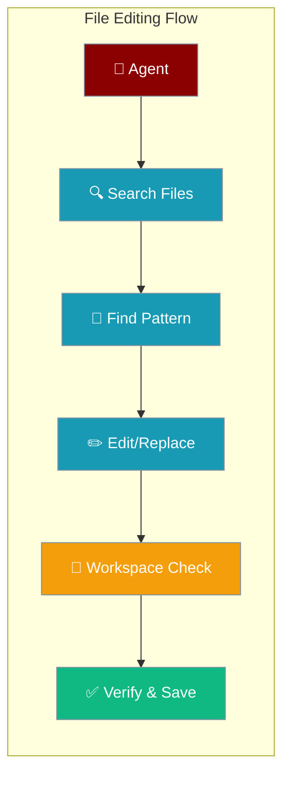
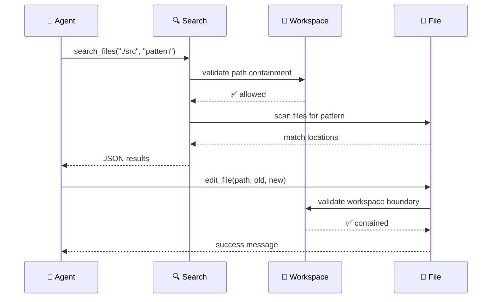

File editing tools provide secure, workspace-scoped file operations with fuzzy find-and-replace capabilities for precise code and content modifications.



## Quick Start

<Steps>
<Step title="Basic File Editing">
```python
from praisonaiagents import Agent

agent = Agent(
    name="Code Editor",
    instructions="Edit code files carefully using fuzzy search and replace.",
    tools=["edit_file", "search_files", "read_file"]
)

agent.start("Replace 'getUserName' with 'getUserEmail' in all JavaScript files.")
```
</Step>

<Step title="Search and Edit Workflow">
```python
# Agent workflow:
# 1. search_files("./src", "getUserName", "*.js") - Find occurrences
# 2. edit_file("src/user.js", "getUserName", "getUserEmail") - Make changes
# 3. read_file("src/user.js") - Verify results
```
</Step>
</Steps>

---

## How It Works



File editing operations use workspace containment for security:

| Operation | Risk Level | Workspace Required | Purpose |
|-----------|------------|-------------------|---------|
| **search_files** | Low | No | Find patterns in files |
| **read_file** | Low | No | Read file contents |
| **list_files** | Low | No | Directory listings |
| **edit_file** | High | Recommended | Modify file contents |
| **write_file** | High | Recommended | Create/overwrite files |

---

## Configuration Options

### File Editing Functions

| Function | Args | Description |
|----------|------|-------------|
| `edit_file` | `filepath`, `old_string`, `new_string`, `replace_all=False` | Fuzzy find-and-replace in file |
| `search_files` | `directory`, `pattern`, `file_pattern="*"` | Search for text patterns |
| `read_file` | `filepath` | Read file contents |
| `write_file` | `filepath`, `content` | Write/overwrite file |
| `list_files` | `directory` | List directory contents |

### Search Parameters

```python
# Basic text search
search_files("./src", "function getUserName")

# File type filtering
search_files("./src", "useState", "*.jsx")
search_files("./docs", "# Introduction", "*.md")

# Recursive directory search
search_files("./", "TODO:", "*.py")
```

### Edit Options

```python
# Single replacement (default)
edit_file("config.js", "port: 3000", "port: 8080")

# Replace all occurrences
edit_file("styles.css", "color: blue", "color: green", replace_all=True)

# Case-sensitive replacement
edit_file("README.md", "PraisonAI", "PraisonAI Framework")
```

### Workspace Integration

```python
from praisonaiagents.tools import create_edit_tools
from praisonaiagents.workspace import Workspace

workspace = Workspace(root=Path("./project"), access="rw")
edit_tools = create_edit_tools(workspace=workspace)

# All operations scoped to workspace
result = edit_tools.edit_file("src/app.js", "old", "new")
```

---

## Common Patterns

### Code Refactoring

```python
agent = Agent(
    name="Refactoring Assistant",
    instructions="""
    For refactoring tasks:
    1. Search for pattern occurrences first
    2. Show user what will be changed
    3. Apply edits systematically
    4. Verify results by reading modified files
    """,
    tools=["search_files", "edit_file", "read_file"]
)

# User: "Rename all instances of 'oldFunction' to 'newFunction'"
# Agent workflow:
# search_files("./src", "oldFunction")  # Find all occurrences
# edit_file("src/utils.js", "oldFunction", "newFunction", replace_all=True)
# read_file("src/utils.js")  # Verify changes
```

### Configuration Updates

```python
# Update environment variables
edit_file(".env", "DATABASE_URL=localhost", "DATABASE_URL=production.db")

# Update package versions  
search_files(".", "\"react\": \"16", "package.json")
edit_file("package.json", "\"react\": \"16.14.0\"", "\"react\": \"18.2.0\"")

# Update documentation
edit_file("README.md", "## Version 1.0", "## Version 2.0")
```

### Bulk Content Changes

```python
# Update copyright notices
search_files("./src", "Copyright 2023", "*.js")
edit_file("src/header.js", "Copyright 2023", "Copyright 2024", replace_all=True)

# Update API endpoints
search_files("./src", "/api/v1/", "*.js")
edit_file("src/api.js", "/api/v1/", "/api/v2/", replace_all=True)
```

---

## Best Practices

<AccordionGroup>
<Accordion title="Search Before Edit">
Always use `search_files` to locate patterns before making edits. This provides visibility into the scope of changes and prevents unexpected modifications.
</Accordion>

<Accordion title="Workspace Security">
File editing operations respect workspace boundaries. Destructive operations (`edit_file`, `write_file`) require proper workspace configuration for security.
</Accordion>

<Accordion title="Verification Workflow">
After making edits, use `read_file` to verify changes were applied correctly. This catches encoding issues or unexpected results.
</Accordion>

<Accordion title="Atomic Operations">
Edit operations are atomic - they either succeed completely or leave the original file unchanged. This prevents file corruption from partial writes.
</Accordion>
</AccordionGroup>

---

## Related

<CardGroup cols={2}>
<Card title="Workspace" icon="folder-lock" href="/docs/features/workspace">
  How workspace containment secures file operations
</Card>
<Card title="Bot Default Tools" icon="toolbox" href="/docs/features/bot-default-tools">
  File tools included in default bot toolsets
</Card>
</CardGroup>