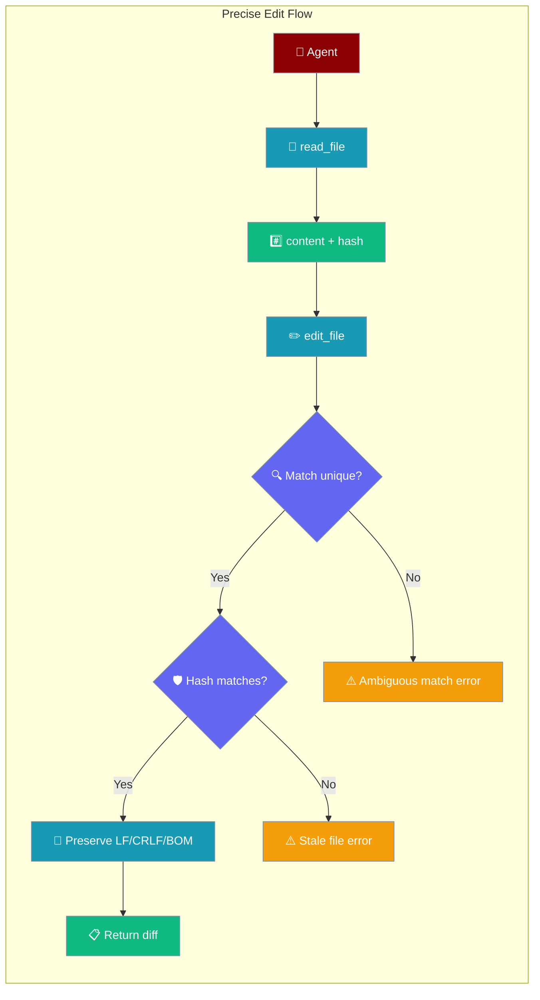
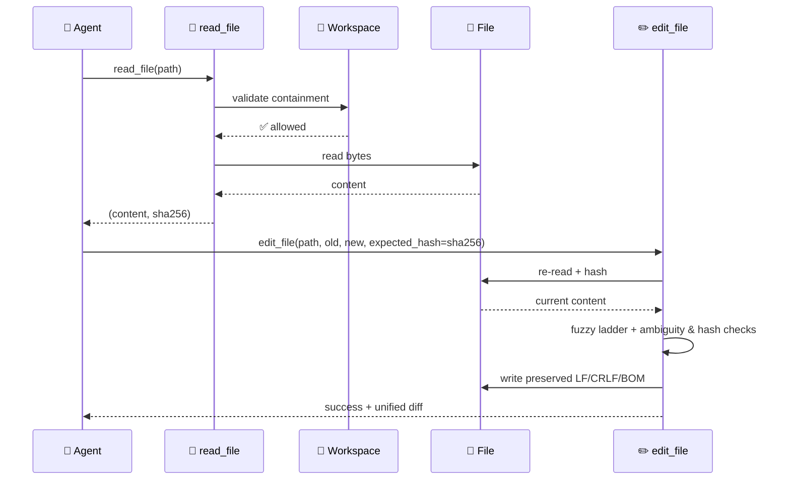
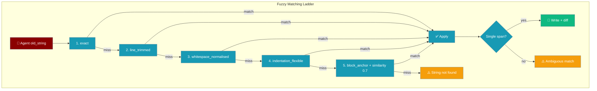
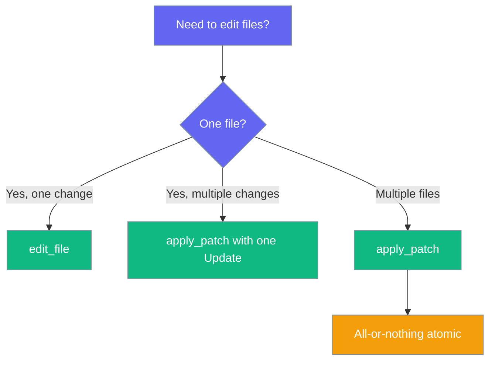
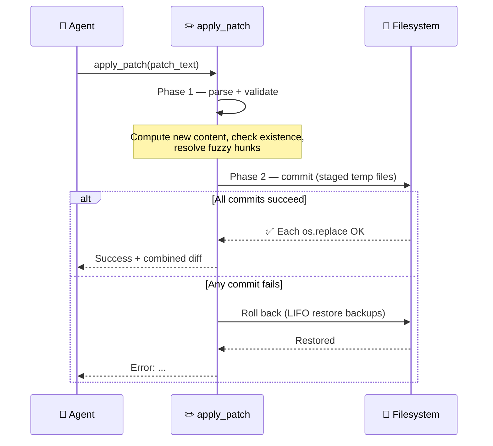

File editing tools provide secure, workspace-scoped file operations with **precise, conflict-safe** find-and-replace. Ambiguous matches fail loudly instead of editing the wrong occurrence, and a content-hash check prevents lost-update conflicts when files change between read and edit. A fuzzy matching ladder makes first-try edits succeed even when `old_string` drifts from the file by whitespace, indentation, or line endings.



## Quick Start

<Steps>
<Step title="Simple precise edit">

```python
from praisonaiagents import Agent

agent = Agent(
    name="Code Editor",
    instructions="Edit code precisely. If a match is ambiguous, add more context.",
    tools=["edit_file", "search_files", "read_file"]
)

agent.start("In src/user.js, replace getUserName() with getUserEmail().")
```

</Step>

<Step title="Conflict-safe read → edit">

```python
from praisonaiagents.tools.edit_tools import read_file, edit_file

content, file_hash = read_file("src/user.js")

edit_file(
    "src/user.js",
    old_string="def getUserName(self):",
    new_string="def getUserEmail(self):",
    expected_hash=file_hash,
)
```

</Step>

<Step title="Replace all occurrences">

```python
from praisonaiagents.tools.edit_tools import edit_file

edit_file(
    "styles.css",
    old_string="color: blue",
    new_string="color: green",
    replace_all=True,
)
```

</Step>
</Steps>

---

## How It Works



| Operation | Risk Level | Workspace Required | Purpose |
|-----------|------------|-------------------|---------|
| **search_files** | Low | No | Find patterns in files |
| **read_file** *(edit_tools)* | Low | No | Read content + SHA-256 hash for staleness checks |
| **read_file** *(file_tools)* | Low | No | Plain read returning a string |
| **list_files** | Low | No | Directory listings |
| **edit_file** | High | Recommended | Precise find-and-replace with fuzzy ladder, ambiguity & staleness guards |
| **write_file** | High | Recommended | Create/overwrite files |
| **apply_patch** | High | Recommended | Atomic multi-file Add/Update/Delete with rollback |

<Warning>
Two modules export `read_file` with different signatures:

- `from praisonaiagents.tools.file_tools import read_file` → `read_file(filepath, encoding='utf-8') -> str`
- `from praisonaiagents.tools.edit_tools import read_file` → `read_file(filepath) -> Tuple[str, str]`

Use **edit_tools** when passing `expected_hash` to `edit_file`.
</Warning>

---

## How Fuzzy Matching Works

`edit_file` walks a deterministic ladder of matching strategies and stops at the **first** strategy that produces a confident match. Exact matches always win; fuzzy strategies only engage when an exact substring is not found. Existing code keeps behaving exactly as before — only previously-failing edits now succeed.



| # | Strategy | Tolerates | Example divergence |
|---|----------|-----------|-------------------|
| 1 | `exact` | nothing | byte-for-byte match |
| 2 | `line_trimmed` | leading/trailing whitespace per line | `    return 1` vs `return 1` |
| 3 | `whitespace_normalised` | collapsed internal whitespace | `x   =    1` vs `x = 1` |
| 4 | `indentation_flexible` | tabs vs spaces, depth | `\treturn 1` vs `    return 1` |
| 5 | `block_anchor` | structural drift (similarity ≥ 0.7) | first/last lines anchor a fuzzy block |

**Confidence guards (block_anchor only):**
- Similarity threshold: `0.7` (constant `_BLOCK_ANCHOR_THRESHOLD` in source)
- Disproportionate-length guard: rejects blocks more than 2× or less than half the `old_string` line count
- Tie-breaking: two equally-scored candidates are treated as **ambiguous** (not silently picked)

```python
from praisonaiagents.tools.edit_tools import edit_file

# File uses tabs; old_string uses spaces — still succeeds
# because indentation_flexible normalises both
edit_file(
    "src/utils.py",
    old_string="    return value",
    new_string="    return processed_value",
)
```

<Note>
**Why this matters for coding agents:** LLM-generated `old_string` values routinely drift by whitespace, indentation, or line endings. The fuzzy ladder makes the first attempt succeed when the target is unambiguous, saving retry turns and tokens.
</Note>

---

## Multi-file Patches with `apply_patch`

`apply_patch` lets an agent Add, Update, and Delete multiple files in a single atomic call — all changes succeed together or none are committed.



<Steps>
<Step title="Agent Quick Start">

```python
from praisonaiagents import Agent

agent = Agent(
    name="Refactor Agent",
    instructions="Refactor across files atomically. Use apply_patch for multi-file changes.",
    tools=["read_file", "search_files", "apply_patch", "edit_file"],
)

agent.start("Rename UserService to AccountService across src/ and update its tests.")
```

</Step>

<Step title="Direct SDK use">

```python
from praisonaiagents.tools.edit_tools import apply_patch

patch = """*** Update File: src/service.py
@@
class UserService:
===
class AccountService:
*** Update File: tests/test_service.py
@@
from src.service import UserService
===
from src.service import AccountService
*** Delete File: docs/old_userservice.md
"""

result = apply_patch(patch)
print(result)  # "Success: Applied patch to 3 file(s) ... <combined diff>"
```

</Step>
</Steps>

### Patch Format Reference

| Header | Body format | Purpose |
|--------|------------|---------|
| `*** Add File: <path>` | Full file content lines until next header | Create a new file (errors if path already exists) |
| `*** Update File: <path>` | One or more `@@` hunks (`<old>\n===\n<new>`) | Modify file using fuzzy ladder for each hunk |
| `*** Delete File: <path>` | (no body) | Remove file (errors if path missing) |

Optional sentinels `*** Begin Patch` / `*** End Patch` are accepted and stripped.

**Update hunk syntax:**

```
*** Update File: path/to/file
@@
<old block to find>
===
<new block to replace it with>
@@
<another old block>
===
<another new block>
```

Each `@@` hunk runs through the same fuzzy ladder as `edit_file`, so whitespace/indentation drift in the old block is tolerated.

### Atomicity Guarantees



| Behaviour | How it works |
|-----------|-------------|
| All-or-nothing | Phase 1 validates every operation and computes new content; Phase 2 commits with staged temp files and `os.replace` |
| Rollback on failure | If any commit step raises, applied operations are reversed in LIFO order via backup paths |
| BOM preservation | UTF-8 BOM detected on Update is reapplied on write |
| Line-ending preservation | CRLF files stay CRLF, LF files stay LF (matches `edit_file`) |
| UTF-16 rejection | Update on a UTF-16 file fails with a clear error |

### `apply_patch` Error Messages

| Trigger | Message |
|---------|---------|
| Empty / no operations | `Error: Patch contains no operations` |
| Malformed header / orphan body | `Error: Invalid patch: Unexpected line in patch (expected a section header): ...` |
| Add target already exists | `Error: Cannot add '<path>': file already exists` |
| Delete target missing | `Error: Cannot delete '<path>': file not found` |
| Update target missing | `Error: Cannot update '<path>': file not found` |
| Empty hunk old-block | `Error: Empty hunk in update for '<path>'` |
| Hunk not found | `Error: Hunk not found in '<path>': '<preview>'` |
| Ambiguous hunk | `Error: Ambiguous hunk in '<path>': '<preview>' matches N locations` |
| UTF-16 file | `Error: Cannot update '<path>': UTF-16 encoding is not supported. Please convert the file to UTF-8.` |
| Success | `Success: Applied patch to N file(s)\n\n<combined diff>` |

---

## Configuration Options

### File Editing Functions

| Function | Args | Returns | Notes |
|----------|------|---------|-------|
| `edit_file` | `filepath`, `old_string`, `new_string`, `replace_all=False`, `expected_hash=None` | `str` | High-risk; fuzzy ladder + fails on ambiguous match unless `replace_all=True` |
| `apply_patch` | `patch: str` | `str` | High-risk; atomic multi-file Add/Update/Delete with rollback |
| `read_file` *(edit_tools)* | `filepath` | `Tuple[str, str]` | `(content, sha256_hex)` for staleness checks |
| `read_file` *(file_tools)* | `filepath`, `encoding='utf-8'` | `str` | Simple read, no hash |
| `search_files` | `directory`, `pattern`, `file_pattern='*'` | JSON string | Case-insensitive substring search |
| `write_file` | `filepath`, `content` | `bool` | Full overwrite |
| `list_files` | `directory` | `list[dict]` | Directory listing |

### Edit Parameters

| Parameter | Type | Default | Purpose |
|---|---|---|---|
| `replace_all` | `bool` | `False` | Required when `old_string` matches more than once |
| `expected_hash` | `Optional[str]` | `None` | SHA-256 hex digest from the last `read_file`; aborts if the file changed |

```python
# Single unique match
edit_file("config.py", "DEBUG = False", "DEBUG = True")

# Multiple matches — replace_all required
edit_file("styles.css", "color: blue", "color: green", replace_all=True)

# Conflict-safe flow
content, h = read_file("config.py")
edit_file("config.py", "DEBUG = False", "DEBUG = True", expected_hash=h)
```

### Error Messages

| Trigger | Message |
|---|---|
| File not found | `Error: File not found: {filepath}` |
| UTF-16 encoding | `Error: UTF-16 encoding is not supported. Please convert the file to UTF-8.` |
| Stale hash | `Error: File has been modified since last read. Please re-read the file before editing. Expected hash: {expected_hash[:8]}..., Current hash: {current_hash[:8]}...` |
| Empty `old_string` | `Error: old_string must be non-empty` |
| String not found | `Error: String not found in file: '{preview}'` |
| Ambiguous match | `Error: Ambiguous match - '{preview}' occurs {N} times. Please provide more surrounding context to make the match unique, or use replace_all=True to replace all occurrences.` |
| Success | `Success: Made {N} replacement(s) in {filepath}\n\nDiff:\n{diff}` |

<Warning>
An "Ambiguous match" error can also fire when **fuzzy strategies** produce more than one candidate location (e.g. whitespace-normalised matches at two places). Fix by adding more surrounding context to `old_string`.
</Warning>

<Warning>
If a file contains mixed line endings, any CRLF present causes the file to be normalised to CRLF on save.
</Warning>

---

## Common Patterns

### Code Refactoring

```python
from praisonaiagents.tools.edit_tools import read_file, edit_file

content, h = read_file("src/utils.js")
edit_file(
    "src/utils.js",
    "function oldFunction(",
    "function newFunction(",
    expected_hash=h,
)
```

### Configuration Updates

```python
# Ambiguous if port: 3000 appears twice — add context or use replace_all=True
edit_file(
    "config.js",
    "server: {\n  port: 3000",
    "server: {\n  port: 8080",
)
```

### Surviving Concurrent Edits

```python
content, h = read_file("config.py")
# ... another process may edit the file here ...
result = edit_file("config.py", "DEBUG = False", "DEBUG = True", expected_hash=h)
# Returns stale-file error if content changed — re-read and retry
```

### Atomic Multi-file Rename

```python
from praisonaiagents.tools.edit_tools import apply_patch

result = apply_patch("""*** Begin Patch
*** Update File: src/auth.py
@@
class UserService:
===
class AccountService:
*** Update File: tests/test_auth.py
@@
from src.auth import UserService
===
from src.auth import AccountService
*** End Patch
""")
```

---

## Best Practices

<AccordionGroup>
<Accordion title="Search Before Edit">
Use `search_files` to locate patterns before editing so you know scope and can craft a unique `old_string`.
</Accordion>

<Accordion title="Use the returned diff for verification">
`edit_file` returns a bounded unified diff (10 lines max, 200 chars per line) so you rarely need a second read.
</Accordion>

<Accordion title="Pass expected_hash when files might change">
Long-running agents, parallel sessions, or human edits during a run benefit from the staleness guard.
</Accordion>

<Accordion title="Make old_string unique">
Include surrounding context so the match is unambiguous; use `replace_all=True` only when every occurrence should change.
</Accordion>

<Accordion title="Line endings and BOM are preserved">
CRLF files stay CRLF, LF files stay LF, UTF-8 BOM is preserved. UTF-16 files are rejected with a clear error.
</Accordion>

<Accordion title="Use apply_patch for multi-file changes">
Use `apply_patch` when changes span multiple files and must succeed/fail together (rename, refactor, dependency bump). Use `edit_file` when changing one file in one place — it returns a focused diff and avoids patch syntax overhead.
</Accordion>

<Accordion title="Patch hunk format is not unified diff">
The patch hunk format uses `@@` to separate hunks and `===` to separate old from new — this is not unified diff format. Add/Delete sections must not contain `@@`/`===` markers.
</Accordion>

<Accordion title="Workspace Security">
File operations respect workspace boundaries. Paths outside the workspace are rejected to prevent directory traversal.
</Accordion>
</AccordionGroup>

---

## Related

<CardGroup cols={2}>
<Card title="Workspace" icon="folder-lock" href="/docs/features/workspace">
  How workspace containment secures file operations
</Card>
<Card title="Bot Default Tools" icon="toolbox" href="/docs/features/bot-default-tools">
  File tools included in default bot toolsets
</Card>
</CardGroup>
