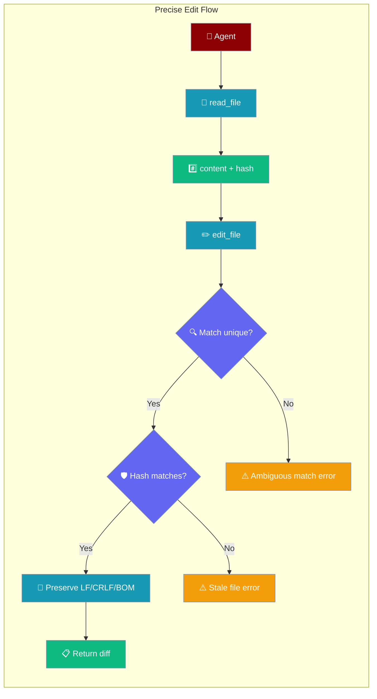
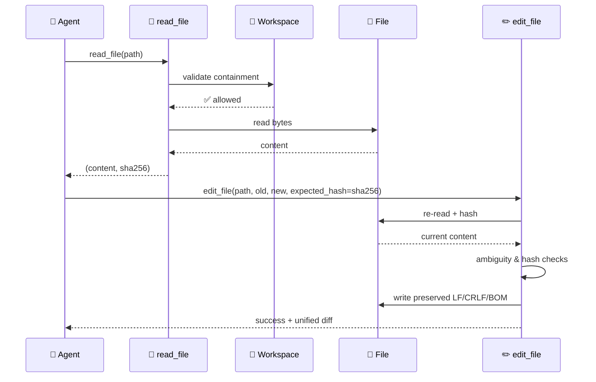

File editing tools provide secure, workspace-scoped file operations with **precise, conflict-safe** find-and-replace. Ambiguous matches fail loudly instead of editing the wrong occurrence, and a content-hash check prevents lost-update conflicts when files change between read and edit.



## Quick Start

<Steps>
<Step title="Simple precise edit">

```python
from praisonaiagents import Agent

agent = Agent(
    name="Code Editor",
    instructions="Edit code precisely. If a match is ambiguous, add more context.",
    tools=["edit_file", "search_files", "read_file"]
)

agent.start("In src/user.js, replace getUserName() with getUserEmail().")
```

</Step>

<Step title="Conflict-safe read → edit">

```python
from praisonaiagents.tools.edit_tools import read_file, edit_file

content, file_hash = read_file("src/user.js")

edit_file(
    "src/user.js",
    old_string="def getUserName(self):",
    new_string="def getUserEmail(self):",
    expected_hash=file_hash,
)
```

</Step>

<Step title="Replace all occurrences">

```python
from praisonaiagents.tools.edit_tools import edit_file

edit_file(
    "styles.css",
    old_string="color: blue",
    new_string="color: green",
    replace_all=True,
)
```

</Step>
</Steps>

---

## How It Works



| Operation | Risk Level | Workspace Required | Purpose |
|-----------|------------|-------------------|---------|
| **search_files** | Low | No | Find patterns in files |
| **read_file** *(edit_tools)* | Low | No | Read content + SHA-256 hash for staleness checks |
| **read_file** *(file_tools)* | Low | No | Plain read returning a string |
| **list_files** | Low | No | Directory listings |
| **edit_file** | High | Recommended | Precise find-and-replace with ambiguity & staleness guards |
| **write_file** | High | Recommended | Create/overwrite files |

<Warning>
Two modules export `read_file` with different signatures:

- `from praisonaiagents.tools.file_tools import read_file` → `read_file(filepath, encoding='utf-8') -> str`
- `from praisonaiagents.tools.edit_tools import read_file` → `read_file(filepath) -> Tuple[str, str]`

Use **edit_tools** when passing `expected_hash` to `edit_file`.
</Warning>

---

## Configuration Options

### File Editing Functions

| Function | Args | Returns | Notes |
|----------|------|---------|-------|
| `edit_file` | `filepath`, `old_string`, `new_string`, `replace_all=False`, `expected_hash=None` | `str` | High-risk; fails on ambiguous match unless `replace_all=True` |
| `read_file` *(edit_tools)* | `filepath` | `Tuple[str, str]` | `(content, sha256_hex)` for staleness checks |
| `read_file` *(file_tools)* | `filepath`, `encoding='utf-8'` | `str` | Simple read, no hash |
| `search_files` | `directory`, `pattern`, `file_pattern='*'` | JSON string | Case-insensitive substring search |
| `write_file` | `filepath`, `content` | `bool` | Full overwrite |
| `list_files` | `directory` | `list[dict]` | Directory listing |

### Edit Parameters

| Parameter | Type | Default | Purpose |
|---|---|---|---|
| `replace_all` | `bool` | `False` | Required when `old_string` matches more than once |
| `expected_hash` | `Optional[str]` | `None` | SHA-256 hex digest from the last `read_file`; aborts if the file changed |

```python
# Single unique match
edit_file("config.py", "DEBUG = False", "DEBUG = True")

# Multiple matches — replace_all required
edit_file("styles.css", "color: blue", "color: green", replace_all=True)

# Conflict-safe flow
content, h = read_file("config.py")
edit_file("config.py", "DEBUG = False", "DEBUG = True", expected_hash=h)
```

### Error Messages

| Trigger | Message |
|---|---|
| File not found | `Error: File not found: {filepath}` |
| UTF-16 encoding | `Error: UTF-16 encoding is not supported. Please convert the file to UTF-8.` |
| Stale hash | `Error: File has been modified since last read. Please re-read the file before editing. Expected hash: {expected_hash[:8]}..., Current hash: {current_hash[:8]}...` |
| Empty `old_string` | `Error: old_string must be non-empty` |
| String not found | `Error: String not found in file: '{preview}'` |
| Ambiguous match | `Error: Ambiguous match - '{preview}' occurs {N} times. Please provide more surrounding context to make the match unique, or use replace_all=True to replace all occurrences.` |
| Success | `Success: Made {N} replacement(s) in {filepath}\n\nDiff:\n{diff}` |

<Warning>
If a file contains mixed line endings, any CRLF present causes the file to be normalised to CRLF on save.
</Warning>

---

## Common Patterns

### Code Refactoring

```python
from praisonaiagents.tools.edit_tools import read_file, edit_file

content, h = read_file("src/utils.js")
edit_file(
    "src/utils.js",
    "function oldFunction(",
    "function newFunction(",
    expected_hash=h,
)
```

### Configuration Updates

```python
# Ambiguous if port: 3000 appears twice — add context or use replace_all=True
edit_file(
    "config.js",
    "server: {\n  port: 3000",
    "server: {\n  port: 8080",
)
```

### Surviving Concurrent Edits

```python
content, h = read_file("config.py")
# ... another process may edit the file here ...
result = edit_file("config.py", "DEBUG = False", "DEBUG = True", expected_hash=h)
# Returns stale-file error if content changed — re-read and retry
```

---

## Best Practices

<AccordionGroup>
<Accordion title="Search Before Edit">
Use `search_files` to locate patterns before editing so you know scope and can craft a unique `old_string`.
</Accordion>

<Accordion title="Use the returned diff for verification">
`edit_file` returns a bounded unified diff (10 lines max, 200 chars per line) so you rarely need a second read.
</Accordion>

<Accordion title="Pass expected_hash when files might change">
Long-running agents, parallel sessions, or human edits during a run benefit from the staleness guard.
</Accordion>

<Accordion title="Make old_string unique">
Include surrounding context so the match is unambiguous; use `replace_all=True` only when every occurrence should change.
</Accordion>

<Accordion title="Line endings and BOM are preserved">
CRLF files stay CRLF, LF files stay LF, UTF-8 BOM is preserved. UTF-16 files are rejected with a clear error.
</Accordion>

<Accordion title="Workspace Security">
File operations respect workspace boundaries. Paths outside the workspace are rejected to prevent directory traversal.
</Accordion>
</AccordionGroup>

---

## Related

<CardGroup cols={2}>
<Card title="Workspace" icon="folder-lock" href="/docs/features/workspace">
  How workspace containment secures file operations
</Card>
<Card title="Bot Default Tools" icon="toolbox" href="/docs/features/bot-default-tools">
  File tools included in default bot toolsets
</Card>
</CardGroup>
