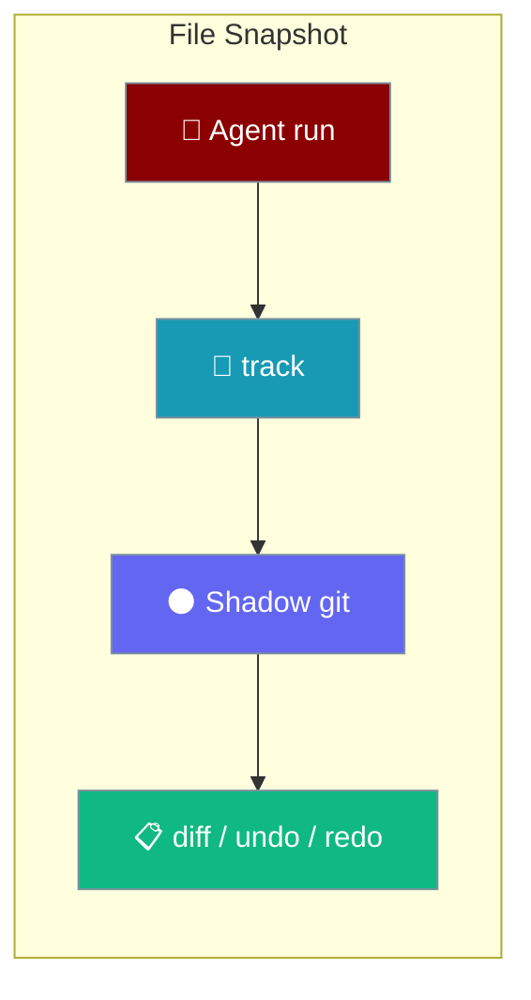
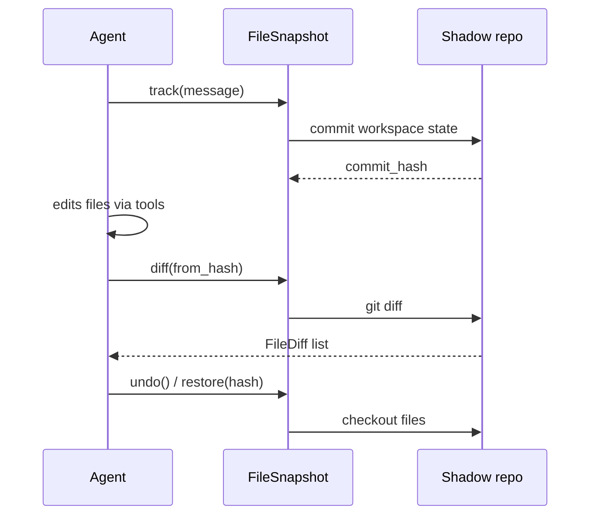

Track file changes in a hidden git repo so agents can snapshot, diff, and restore workspace files without touching your real repository.



## Quick Start

<Steps>
<Step title="Simple Usage">

Enable change tracking on an autonomous agent — `full_auto` turns on snapshots automatically:

```python
from praisonaiagents import Agent

agent = Agent(
    name="Refactorer",
    instructions="Edit files carefully.",
    autonomy="full_auto",
)

agent.start("Rename getUserName to getUserEmail in src/user.js")
agent.diff()   # see what changed
agent.undo()   # restore pre-run state
```

</Step>

<Step title="With Configuration">

Use `AutonomyConfig` for explicit control, or call `FileSnapshot` directly:

```python
from praisonaiagents import Agent
from praisonaiagents.agent.autonomy import AutonomyConfig
from praisonaiagents.snapshot import FileSnapshot

agent = Agent(
    name="Editor",
    autonomy=AutonomyConfig(level="full_auto", track_changes=True),
)

# Or standalone — no agent required
snapshot = FileSnapshot(project_path=".")
info = snapshot.track(message="Before refactor")
# ... edit files ...
snapshot.restore(info.commit_hash)
```

</Step>
</Steps>

---

## How It Works



| Component | Role |
|-----------|------|
| **Shadow git** | Hidden repo under `~/.praison/snapshots/` — never affects your project git |
| **`track()`** | Commits current file state; returns `SnapshotInfo` with hash |
| **`diff()`** | Compares two snapshots or snapshot vs working tree |
| **`restore()`** | Checks out files from a snapshot; optional file list for partial restore |
| **Agent helpers** | `agent.undo()`, `agent.redo()`, `agent.diff()` when `track_changes=True` |

<Note>
Git must be available on `PATH`. If shadow-repo init fails, tracking is skipped silently and `undo()` returns `False`.
</Note>

---

## Common Patterns

### Selective restore

```python
from praisonaiagents.snapshot import FileSnapshot

snapshot = FileSnapshot(project_path="/my/project")
initial = snapshot.track(message="Checkpoint")

# ... changes across many files ...

snapshot.restore(initial.commit_hash, files=["src/config.py", "src/utils.py"])
```

### List recent snapshots

```python
for info in snapshot.list_snapshots(limit=10):
    print(f"{info.commit_hash[:8]} — {info.message} ({info.files_changed} files)")
```

---

## Best Practices

<AccordionGroup>
<Accordion title="Prefer agent undo for autonomous runs">
When using `autonomy="full_auto"`, call `agent.undo()` rather than manual `restore()` — the agent maintains an undo/redo stack across iterations.
</Accordion>

<Accordion title="Snapshot before risky edits">
Call `track(message=...)` (or run the agent once) before bulk refactors so you have a named rollback point.
</Accordion>

<Accordion title="Respects .gitignore">
The shadow repo honours `.gitignore` patterns — build artefacts and secrets ignored by git are not snapshotted.
</Accordion>

<Accordion title="Clean up when finished">
Call `snapshot.cleanup()` to remove the shadow repository if you no longer need history for a project.
</Accordion>
</AccordionGroup>

---

## Related

<CardGroup cols={2}>
  <Card title="File Editing" icon="file-pen" href="/docs/features/file-editing">
    Safe find-and-replace tools agents use before snapshots capture the result
  </Card>
  <Card title="Autonomy Loop" icon="robot" href="/docs/features/autonomy-loop">
    Configure `track_changes` and autonomous file-editing levels
  </Card>
</CardGroup>
