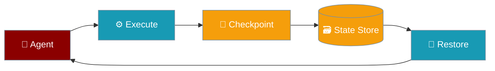

The File Snapshot module provides file change tracking using a shadow git repository, enabling undo/restore capabilities without affecting the user's actual git repository.




## Features

- **Shadow Git Repository** - Tracks changes in a separate hidden repo
- **File Diff Generation** - Compare file states between snapshots
- **Snapshot Creation** - Create named checkpoints of file states
- **File Restoration** - Restore files to previous states
- **Gitignore Support** - Respects .gitignore patterns

## Quick Start

<Steps>
<Step title="Basic Usage">
```python
from praisonaiagents.snapshot import FileSnapshot

# Initialize for a project directory
snapshot = FileSnapshot("/path/to/project")

# Track current state
info = snapshot.track(message="Initial state")
print(f"Snapshot: {info.commit_hash[:8]}")

# Make changes to files...

# Get diff from snapshot
diffs = snapshot.diff(info.commit_hash)
for d in diffs:
    print(f"{d.status}: {d.path}")

# Restore to snapshot
snapshot.restore(info.commit_hash)
```
</Step>
</Steps>


## API Reference

### FileSnapshot

```python
class FileSnapshot:
    def __init__(
        self,
        project_dir: str,
        snapshot_dir: Optional[str] = None
    ):
        """Initialize snapshot manager for a project."""
    
    def track(self, message: Optional[str] = None) -> SnapshotInfo:
        """Track current file state, returns snapshot info."""
    
    def diff(
        self,
        from_hash: str,
        to_hash: Optional[str] = None
    ) -> List[FileDiff]:
        """Get file differences between snapshots."""
    
    def restore(
        self,
        commit_hash: str,
        files: Optional[List[str]] = None
    ) -> bool:
        """Restore files to a snapshot state."""
    
    def list_snapshots(self, limit: int = 50) -> List[SnapshotInfo]:
        """List recent snapshots."""
    
    def get_current_hash(self) -> Optional[str]:
        """Get current HEAD commit hash."""
    
    def cleanup(self) -> bool:
        """Remove the shadow repository."""
```

### SnapshotInfo

```python
@dataclass
class SnapshotInfo:
    commit_hash: str      # Git commit hash
    message: str          # Snapshot message
    timestamp: float      # Unix timestamp
    files_changed: int    # Number of files in snapshot
```

### FileDiff

```python
@dataclass
class FileDiff:
    path: str            # File path
    status: str          # 'added', 'modified', 'deleted'
    additions: int       # Lines added
    deletions: int       # Lines deleted
```

## Examples

### Tracking Changes

```python
snapshot = FileSnapshot("/my/project")

# Initial snapshot
snap1 = snapshot.track(message="Before refactoring")

# Make changes to files...
with open("/my/project/main.py", "a") as f:
    f.write("\n# New code")

# Track new state
snap2 = snapshot.track(message="After refactoring")

# See what changed
diffs = snapshot.diff(snap1.commit_hash, snap2.commit_hash)
for d in diffs:
    print(f"{d.path}: +{d.additions}/-{d.deletions}")
```

### Selective Restore

```python
snapshot = FileSnapshot("/my/project")
initial = snapshot.track()

# Make changes...

# Restore only specific files
snapshot.restore(
    initial.commit_hash,
    files=["src/config.py", "src/utils.py"]
)
```

### Integration with Sessions

```python
from praisonaiagents.snapshot import FileSnapshot
from praisonaiagents.session.hierarchy import HierarchicalSessionStore

# Track both session and file states
session_store = HierarchicalSessionStore()
file_snapshot = FileSnapshot("/project")

session_id = session_store.create_session()
file_hash = file_snapshot.track(message="Session start").commit_hash

# Store file hash in session metadata
session_store.add_message(
    session_id, "system",
    f"File snapshot: {file_hash}"
)
```
## Best Practices

<AccordionGroup>
<Accordion title="Start with defaults">
Use the built-in defaults first. Only add configuration when you hit a specific limitation.
</Accordion>
<Accordion title="Test incrementally">
Add one feature at a time and verify behaviour before combining features.
</Accordion>
<Accordion title="Monitor in production">
Watch token consumption and latency metrics when enabling advanced features in production.
</Accordion>
</AccordionGroup>

## Related

<CardGroup cols={2}>
<Card title="Checkpoints" icon="flag" href="/docs/features/checkpoints">
  Save and restore state
</Card>
<Card title="Database Persistence" icon="database" href="/docs/features/database-persistence">
  Persist data across runs
</Card>
</CardGroup>
