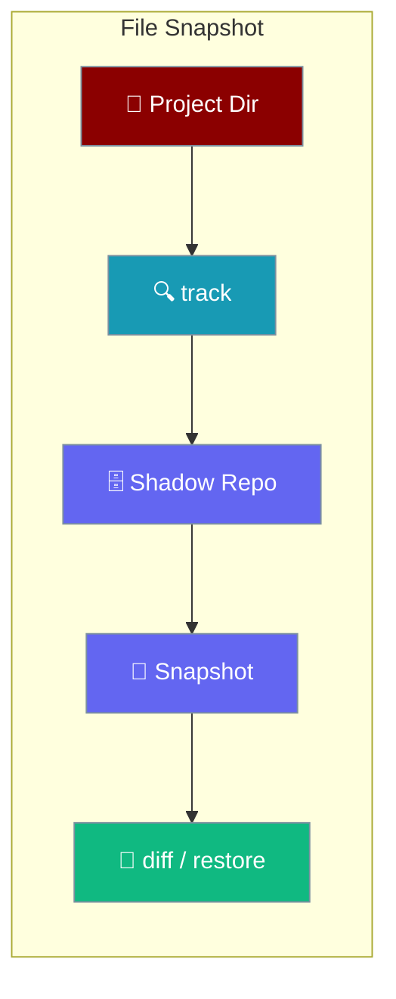
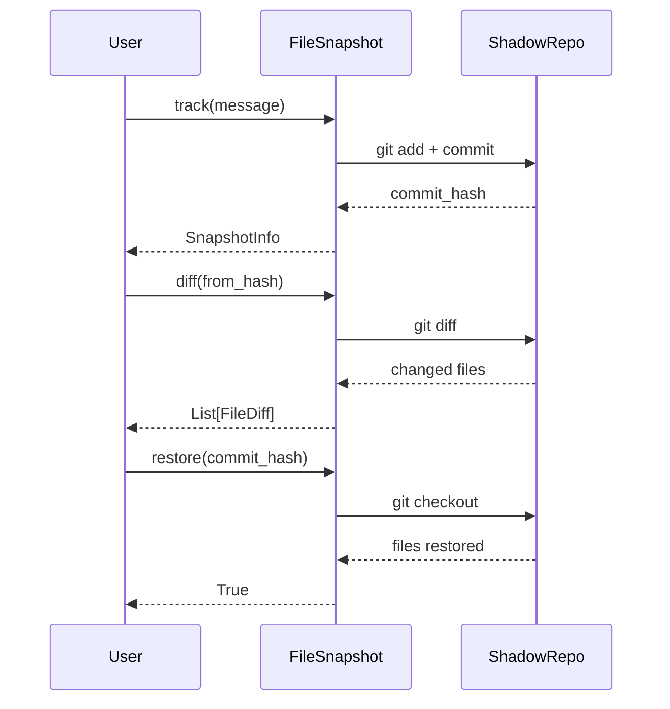

The File Snapshot module tracks file changes using a shadow git repository, enabling undo and restore capabilities without touching the user's actual git history.



## Quick Start

<Steps>
<Step title="Create a snapshot">
```python
from praisonaiagents.snapshot import FileSnapshot

snapshot = FileSnapshot("/path/to/project")
info = snapshot.track(message="Initial state")
print(f"Snapshot: {info.commit_hash[:8]}")
```
</Step>

<Step title="Diff and restore">
```python
# Make changes to files...

# Get diff from snapshot
diffs = snapshot.diff(info.commit_hash)
for d in diffs:
    print(f"{d.status}: {d.path}")

# Restore to snapshot
snapshot.restore(info.commit_hash)
```
</Step>
</Steps>

---

## How It Works



---

## API Reference

### FileSnapshot

```python
class FileSnapshot:
    def __init__(
        self,
        project_dir: str,
        snapshot_dir: Optional[str] = None
    ):
        """Initialize snapshot manager for a project."""
    
    def track(self, message: Optional[str] = None) -> SnapshotInfo:
        """Track current file state, returns snapshot info."""
    
    def diff(
        self,
        from_hash: str,
        to_hash: Optional[str] = None
    ) -> List[FileDiff]:
        """Get file differences between snapshots."""
    
    def restore(
        self,
        commit_hash: str,
        files: Optional[List[str]] = None
    ) -> bool:
        """Restore files to a snapshot state."""
    
    def list_snapshots(self, limit: int = 50) -> List[SnapshotInfo]:
        """List recent snapshots."""
    
    def get_current_hash(self) -> Optional[str]:
        """Get current HEAD commit hash."""
    
    def cleanup(self) -> bool:
        """Remove the shadow repository."""
```

### SnapshotInfo

```python
@dataclass
class SnapshotInfo:
    commit_hash: str      # Git commit hash
    message: str          # Snapshot message
    timestamp: float      # Unix timestamp
    files_changed: int    # Number of files in snapshot
```

### FileDiff

```python
@dataclass
class FileDiff:
    path: str            # File path
    status: str          # 'added', 'modified', 'deleted'
    additions: int       # Lines added
    deletions: int       # Lines deleted
```

---

## Examples

### Tracking Changes

```python
snapshot = FileSnapshot("/my/project")

snap1 = snapshot.track(message="Before refactoring")

with open("/my/project/main.py", "a") as f:
    f.write("\n# New code")

snap2 = snapshot.track(message="After refactoring")

diffs = snapshot.diff(snap1.commit_hash, snap2.commit_hash)
for d in diffs:
    print(f"{d.path}: +{d.additions}/-{d.deletions}")
```

### Selective Restore

```python
snapshot = FileSnapshot("/my/project")
initial = snapshot.track()

# Make changes...

snapshot.restore(
    initial.commit_hash,
    files=["src/config.py", "src/utils.py"]
)
```

### Integration with Sessions

```python
from praisonaiagents.snapshot import FileSnapshot
from praisonaiagents.session.hierarchy import HierarchicalSessionStore

session_store = HierarchicalSessionStore()
file_snapshot = FileSnapshot("/project")

session_id = session_store.create_session()
file_hash = file_snapshot.track(message="Session start").commit_hash

session_store.add_message(
    session_id, "system",
    f"File snapshot: {file_hash}"
)
```

---

## Best Practices

<AccordionGroup>
<Accordion title="Take snapshots before risky operations">
Always call `track()` before running agent tasks that modify files, so you have a clean restore point if something goes wrong.
</Accordion>

<Accordion title="Use meaningful snapshot messages">
Pass a descriptive `message` to `track()` so `list_snapshots()` is easy to navigate later.

```python
snapshot.track(message="Before agent refactor run")
```
</Accordion>

<Accordion title="Restore selectively when possible">
Pass a `files` list to `restore()` to avoid overwriting unrelated changes.

```python
snapshot.restore(hash, files=["src/api.py"])
```
</Accordion>

<Accordion title="Call cleanup() when done">
The shadow repo lives on disk. Call `snapshot.cleanup()` at the end of long-running sessions to free space.
</Accordion>
</AccordionGroup>

---

## Related

<CardGroup cols={2}>
<Card title="Checkpoints" icon="flag-checkered" href="/features/checkpoints">
  Higher-level checkpoint service built on file snapshots
</Card>
<Card title="Replay" icon="rotate-left" href="/features/replay">
  Replay agent sessions from saved state
</Card>
</CardGroup>
