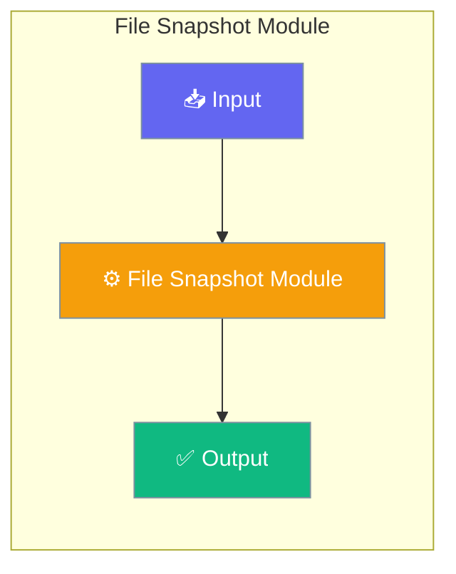

# File Snapshot Module

The File Snapshot module provides file change tracking using a shadow git repository, enabling undo/restore capabilities without affecting the user's actual git repository.




## Features

- **Shadow Git Repository** - Tracks changes in a separate hidden repo
- **File Diff Generation** - Compare file states between snapshots
- **Snapshot Creation** - Create named checkpoints of file states
- **File Restoration** - Restore files to previous states
- **Gitignore Support** - Respects .gitignore patterns

## Quick Start


<Steps>
<Step title="Quick Start">
```python
from praisonaiagents.snapshot import FileSnapshot

# Initialize for a project directory
snapshot = FileSnapshot("/path/to/project")

# Track current state
info = snapshot.track(message="Initial state")
print(f"Snapshot: {info.commit_hash[:8]}")

# Make changes to files...

# Get diff from snapshot
diffs = snapshot.diff(info.commit_hash)
for d in diffs:
    print(f"{d.status}: {d.path}")

# Restore to snapshot
snapshot.restore(info.commit_hash)
```
</Step>
</Steps>


## Best Practices

<AccordionGroup>
  <Accordion title="Start simple">
    Enable the feature with a single parameter before adding configuration. Verify it works, then layer in options.
  </Accordion>
  <Accordion title="Use environment variables for secrets">
    Never hardcode API keys or tokens. Use `os.getenv("KEY_NAME")` to read from environment variables.
  </Accordion>
  <Accordion title="Test with minimal examples first">
    Copy the Quick Start example, run it, then extend it. This confirms your environment is set up correctly.
  </Accordion>
  <Accordion title="Check the logs">
    Set `verbose=True` on your agent to see detailed execution logs when debugging unexpected behavior.
  </Accordion>
</AccordionGroup>

## Related

<CardGroup cols={2}>
  <Card title="Features Overview" icon="grid-2" href="/docs/features">
    Browse all PraisonAI features
  </Card>
  <Card title="Quick Start" icon="rocket" href="/docs/introduction">
    Get started with PraisonAI agents
  </Card>
</CardGroup>
