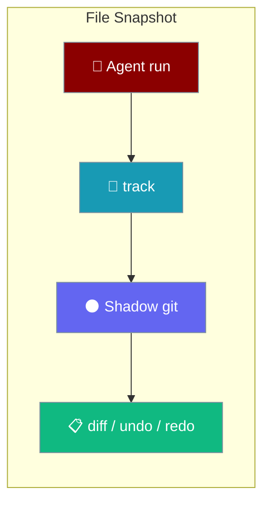
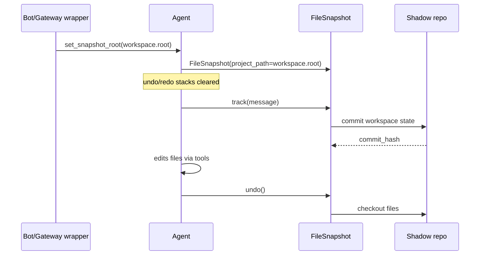
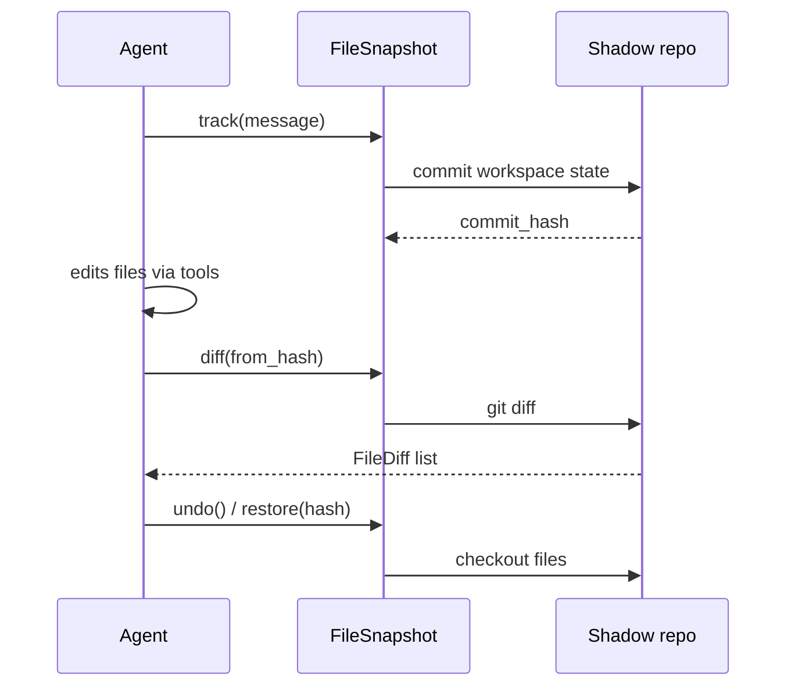

Track file changes in a hidden git repo so agents can snapshot, diff, and restore workspace files without touching your real repository.

```python
from praisonaiagents import Agent, AutonomyConfig

agent = Agent(
    name="coder",
    instructions="Snapshot files before autonomous edits",
    autonomy=AutonomyConfig(file_snapshot=True),
)

agent.start("Refactor the module")
```

The user approves autonomous edits; shadow-git snapshots let the agent diff, undo, or redo workspace changes safely.



```mermaid
graph LR
    subgraph "File Snapshot"
        A[🤖 Agent run] --> B[📸 track]
        B --> C[🌑 Shadow git]
        C --> D[📋 diff / undo / redo]
    end

    classDef agent fill:#8B0000,stroke:#7C90A0,color:#fff
    classDef process fill:#189AB4,stroke:#7C90A0,color:#fff
    classDef store fill:#6366F1,stroke:#7C90A0,color:#fff
    classDef result fill:#10B981,stroke:#7C90A0,color:#fff

    class A agent
    class B process
    class C store
    class D result

    classDef tool fill:#189AB4,color:#fff

    classDef agent fill:#8B0000,color:#fff
```
## Quick Start

<Steps>
<Step title="Simple Usage">

Enable change tracking on an autonomous agent — `full_auto` turns on snapshots automatically:

```python
from praisonaiagents import Agent

agent = Agent(
    name="Refactorer",
    instructions="Edit files carefully.",
    autonomy="full_auto",
)

agent.start("Rename getUserName to getUserEmail in src/user.js")
agent.diff()   # see what changed
agent.undo()   # restore pre-run state
```

</Step>

<Step title="With Configuration">

Use `AutonomyConfig` for explicit control, or call `FileSnapshot` directly:

```python
from praisonaiagents import Agent
from praisonaiagents import AutonomyConfig
from praisonaiagents.snapshot import FileSnapshot

agent = Agent(
    name="Editor",
    autonomy=AutonomyConfig(level="full_auto", track_changes=True),
)

# Or standalone — no agent required
snapshot = FileSnapshot(project_path=".")
info = snapshot.track(message="Before refactor")
# ... edit files ...
snapshot.restore(info.commit_hash)
```

</Step>

<Step title="Re-root After a Workspace">

`Agent.__init__` roots change tracking at `os.getcwd()`. Attach a per-session directory later, then call `set_snapshot_root()` so `undo()` restores the right place:

```python
from praisonaiagents import Agent, AutonomyConfig

agent = Agent(
    name="Editor",
    instructions="Edit files carefully.",
    autonomy=AutonomyConfig(track_changes=True),
)

# Later — once you know the workspace the tools will actually write to
agent.set_snapshot_root("/tmp/session-42/workspace")

agent.start("Rename getUserName in src/user.js")
agent.undo()  # restores /tmp/session-42/workspace, not process cwd
```

</Step>
</Steps>

---

## Re-rooting Change Tracking

`set_snapshot_root(project_path)` re-roots `undo`/`redo`/`diff` at a directory known only after construction — the moment a bot, gateway, or custom wrapper attaches a per-chat `Workspace`.


```mermaid
sequenceDiagram
    participant Wrapper as Bot/Gateway wrapper
    participant Agent
    participant FS as FileSnapshot
    participant Git as Shadow repo

    Wrapper->>Agent: set_snapshot_root(workspace.root)
    Agent->>FS: FileSnapshot(project_path=workspace.root)
    Note over Agent: undo/redo stacks cleared
    Agent->>FS: track(message)
    FS->>Git: commit workspace state
    Git-->>FS: commit_hash
    Agent->>Agent: edits files via tools
    Agent->>FS: undo()
    FS->>Git: checkout files
```


```mermaid
graph LR
    W[🤖 Wrapper] --> A[🤖 Agent.set_snapshot_root]
    A --> F[📸 new FileSnapshot]
    F --> G[🌑 Shadow repo]

    classDef agent fill:#8B0000,stroke:#7C90A0,color:#fff
    classDef process fill:#189AB4,stroke:#7C90A0,color:#fff
    classDef store fill:#6366F1,stroke:#7C90A0,color:#fff

    class W,A agent
    class F process
    class G store
```

| Behaviour | Detail |
|-----------|--------|
| **Path resolution** | `project_path` is normalised via `os.path.abspath()` — relative paths resolve against process cwd |
| **No-op on same root** | Called with the current root → returns `True` immediately and keeps the existing manager |
| **Re-root clears stacks** | Called with a *new* root → creates a fresh `FileSnapshot` and clears the undo/redo stacks |
| **Preserves `snapshot_dir`** | Reuses `autonomy_config["snapshot_dir"]` if set, so a custom shadow-repo base survives re-rooting |
| **Silent fallback** | If `FileSnapshot(...)` fails (git missing, permission error), returns `False` and logs at DEBUG — never raises |
| **Thread-safe** | Uses the agent's snapshot lock when clearing the stacks |

| Parameter | Type | Description |
|-----------|------|-------------|
| `project_path` | `str` | Directory to root change tracking at. Absolute-normalised; relative paths resolve against cwd. |

Returns `bool` — `True` when a snapshot manager is rooted at the given path, `False` if construction failed (e.g. git unavailable).

<Note>
Re-rooting clears the undo/redo stacks — they belong to the previous root. The old shadow repo is orphaned (still on disk under `~/.praisonai/snapshots/`), and only *future* changes are tracked at the new root.
</Note>

---

## Bot / Gateway Workspaces

Bots and gateways call `Agent.set_snapshot_root(workspace.root)` from `apply_bot_smart_defaults()` immediately after attaching the per-chat `Workspace`. So `/undo` in a Slack, Discord, or Telegram chat reverts files in that chat's workspace — never the gateway's process cwd.

Custom wrappers that attach a workspace after `Agent.__init__` should do the same:

```python
from praisonaiagents import Agent, AutonomyConfig

agent = Agent(name="assistant", autonomy=AutonomyConfig(track_changes=True))
# ... attach your workspace ...
agent.set_snapshot_root(str(workspace.root))
```

See [Bot Gateway](/features/bot-gateway) for how the gateway wires this automatically.

---

## How It Works


```mermaid
sequenceDiagram
    participant Agent
    participant FS as FileSnapshot
    participant Git as Shadow repo

    Agent->>FS: track(message)
    FS->>Git: commit workspace state
    Git-->>FS: commit_hash
    Agent->>Agent: edits files via tools
    Agent->>FS: diff(from_hash)
    FS->>Git: git diff
    Git-->>Agent: FileDiff list
    Agent->>FS: undo() / restore(hash)
    FS->>Git: checkout files
```

| Component | Role |
|-----------|------|
| **Shadow git** | Hidden repo under `~/.praisonai/snapshots/` (honours `PRAISONAI_HOME`) — never affects your project git |
| **`track()`** | Commits current file state; returns `SnapshotInfo` with hash |
| **`diff()`** | Compares two snapshots or snapshot vs working tree |
| **`restore()`** | Checks out files from a snapshot; optional file list for partial restore |
| **Agent helpers** | `agent.undo()`, `agent.redo()`, `agent.diff()` when `track_changes=True` |

<Note>
Git must be available on `PATH`. If shadow-repo init fails, tracking is skipped silently and `undo()` returns `False`.
</Note>

---

## Restore Guarantees

`restore()` (and `agent.undo()`) rebuilds the project to exactly the target snapshot's tree:

| Case | Behaviour |
|------|-----------|
| File exists in snapshot, missing in project | **Restored** from shadow git |
| File exists in project, not in snapshot | **Removed** — no leak from a later snapshot |
| File was deleted before the snapshot | **Stays deleted** — deletion is recorded, not resurrected |
| File is ignored (`.env`, `venv`, `node_modules`, `.gitignore` matches) | **Preserved untouched** — the snapshot never tracked it, so restore never prunes it |
| `files=[...]` selective restore | Only the listed files are touched; project prune step is skipped |

<Note>
The ignored-file guarantee is what makes `agent.undo()` safe to call in projects that keep secrets in `.env`. Both `_sync_files()` and `restore()` build their exclusion set from `_build_ignore_patterns()`, so a file the snapshot never tracked can never be pruned by a restore.
</Note>

---

## Common Patterns

### Selective restore

```python
from praisonaiagents.snapshot import FileSnapshot

snapshot = FileSnapshot(project_path="/my/project")
initial = snapshot.track(message="Checkpoint")

# ... changes across many files ...

snapshot.restore(initial.commit_hash, files=["src/config.py", "src/utils.py"])
```

### List recent snapshots

```python
for info in snapshot.list_snapshots(limit=10):
    print(f"{info.commit_hash[:8]} — {info.message} ({info.files_changed} files)")
```

---

## Best Practices

<AccordionGroup>
<Accordion title="Prefer agent undo for autonomous runs">
When using `autonomy="full_auto"`, call `agent.undo()` rather than manual `restore()` — the agent maintains an undo/redo stack across iterations.
</Accordion>

<Accordion title="Snapshot before risky edits">
Call `track(message=...)` (or run the agent once) before bulk refactors so you have a named rollback point.
</Accordion>

<Accordion title="Respects .gitignore">
The shadow repo honours `.gitignore` patterns plus built-in defaults (`.git`, `__pycache__`, `node_modules`, `venv`, `.venv`, `.pytest_cache`, `.mypy_cache`). Ignored files are neither snapshotted nor pruned by `restore()`. A `.env` file that lives outside version control **survives** every `undo()` / `restore()`.
</Accordion>

<Accordion title="Clean up when finished">
Call `snapshot.cleanup()` to remove the shadow repository if you no longer need history for a project.
</Accordion>

<Accordion title="Re-root after attaching a workspace">
`Agent.__init__` roots the snapshot at `os.getcwd()`. If you attach a `Workspace` (or any per-session root) later, call `agent.set_snapshot_root(str(workspace.root))` immediately — otherwise `agent.undo()` restores files in the wrong directory. Re-rooting clears the undo/redo stacks; rooting at the current directory is a no-op.
</Accordion>
</AccordionGroup>

---

## Related

<CardGroup cols={2}>
  <Card title="File Editing" icon="file-pen" href="/features/file-editing">
    Safe find-and-replace tools agents use before snapshots capture the result
  </Card>
  <Card title="Autonomy Loop" icon="robot" href="/features/autonomy-loop">
    Configure `track_changes` and autonomous file-editing levels
  </Card>
</CardGroup>
