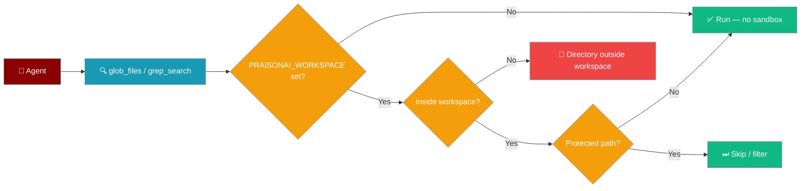
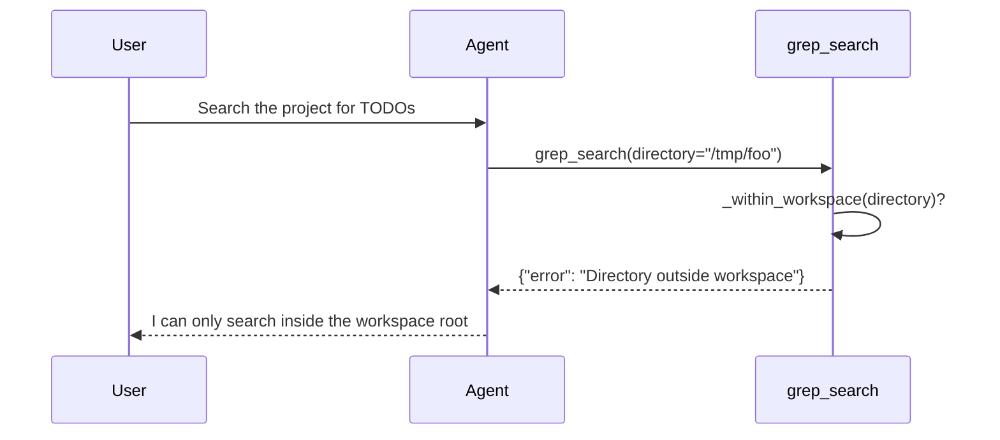

Set `PRAISONAI_WORKSPACE` and the `glob_files`, `grep_search`, and `multiedit` tools reject any `directory=` outside that real path.



## Quick Start

<Steps>
<Step title="Set the workspace root">
Export `PRAISONAI_WORKSPACE`, then hand the file tools to an agent — searches stay inside the project:

```python
import os
from praisonaiagents import Agent
from praisonai.tools.glob_tool import glob_files
from praisonai.tools.grep_tool import grep_search

os.environ["PRAISONAI_WORKSPACE"] = "/home/me/project"

agent = Agent(
    name="Explorer",
    instructions="Search only inside the project.",
    tools=[glob_files, grep_search],
)

agent.start("Find every TODO in the code")
```
</Step>

<Step title="No workspace set">
Without `PRAISONAI_WORKSPACE`, no sandbox is enforced — the tools search wherever `directory=` points:

```python
from praisonai.tools.grep_tool import grep_search

# No PRAISONAI_WORKSPACE → runs anywhere
grep_search("TODO", directory="/tmp/scratch")
```
</Step>
</Steps>

---

## How It Works



Confinement is **opt-in**. Without `PRAISONAI_WORKSPACE` set, no sandbox is enforced — the previous `cwd()` "boundary" was never real, and enforcing it broke callers passing an explicit directory (see [PraisonAI `86dd01a`](https://github.com/MervinPraison/PraisonAI/commit/86dd01a)). When set, all three tools reject a `directory=` whose real path is not under the workspace root:

```python
{"error": "Directory outside workspace"}
```

The check uses `os.path.realpath` + `os.path.commonpath`, so symlinks pointing out of the workspace are rejected too.

### Protected-path filtering

Inside the workspace, protected files are still hidden, skipped, or refused:

| Tool | Behavior on protected path |
|------|----------------------------|
| `multiedit` | Refuse-write, return `error` |
| `grep_search` | Skip during scan (never read) |
| `glob_files`, `glob_directories` | Filter out of the listing |

See [Protected Paths](/features/protected-paths) for the full list of protected targets.

### Grep ReDoS bound

`grep_search` caps each line at `_MAX_LINE = 100_000` characters and silently skips anything longer. The stdlib `re` module has no timeout, so a pathological line like `aaaa…!` can pin a CPU under a crafted regex — skipping over-long lines bounds that risk.

---

## Configuration Options

`PRAISONAI_WORKSPACE` is the single switch that turns confinement on.

| Env var | Type | Default | Description |
|---------|------|---------|-------------|
| `PRAISONAI_WORKSPACE` | `str` (path) | unset | When set, file tools reject `directory=` paths outside this real path. When unset, no sandbox is enforced. |

---

## Common Patterns

### Confine a code-exploration agent

```python
import os
from praisonaiagents import Agent
from praisonai.tools.glob_tool import glob_files
from praisonai.tools.grep_tool import grep_search
from praisonai.tools.multiedit import multiedit

os.environ["PRAISONAI_WORKSPACE"] = "/srv/app"

agent = Agent(
    name="Maintainer",
    instructions="Find and update code inside /srv/app only.",
    tools=[glob_files, grep_search, multiedit],
)

agent.start("Rename the old_api helper across the project")
```

### Explain a refused search to the user

```python
from praisonai.tools.grep_tool import grep_search

result = grep_search("secret", directory="/etc")
if result.get("error") == "Directory outside workspace":
    print("That path is outside the workspace root — refusing to search.")
```

---

## Best Practices

<AccordionGroup>
<Accordion title="Set PRAISONAI_WORKSPACE for untrusted prompts">
When an agent acts on user-supplied instructions, set `PRAISONAI_WORKSPACE` to the project root so a crafted `directory=` can't reach `/etc` or a home directory.
</Accordion>

<Accordion title="Leave it unset for trusted CLI runs">
Local scripts that intentionally search arbitrary directories should leave `PRAISONAI_WORKSPACE` unset — enforcing a sandbox would reject their explicit `directory=` inputs.
</Accordion>

<Accordion title="Combine with protected paths">
Workspace confinement bounds *where* tools look; protected paths bound *what* they touch inside. Use both — protected-path filtering still applies within the workspace.
</Accordion>

<Accordion title="Trust the ReDoS cap">
`grep_search` skips lines over 100,000 characters. If a legitimate file has very long lines, split it or search a narrower pattern rather than removing the cap.
</Accordion>
</AccordionGroup>

---

## Related

<CardGroup cols={2}>
<Card title="Protected Paths" icon="lock" href="/features/protected-paths">
  Block agents from reading or writing sensitive files.
</Card>
<Card title="Workspace Boundary" icon="folder-tree" href="/features/workspace-boundary">
  Approval-gate on external paths — a different mechanism from env-var confinement.
</Card>
<Card title="Workspace Isolation" icon="box" href="/features/workspace-isolation">
  Per-agent workspace isolation.
</Card>
</CardGroup>
