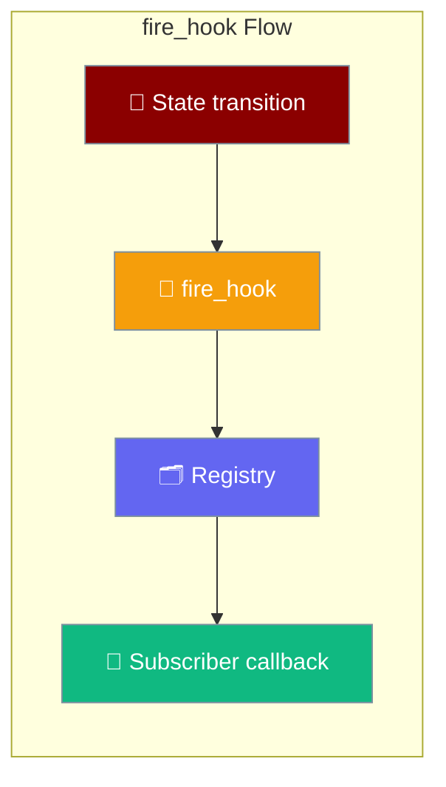
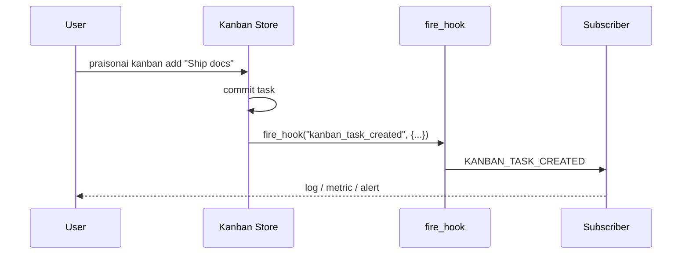

`fire_hook()` is the emission counterpart of `add_hook()` — a runtime component calls it at a real state transition so plugins subscribed to that `HookEvent` actually hear about it.

```python
from praisonaiagents.hooks import add_hook, fire_hook

@add_hook("kanban_task_moved")
def on_move(data):
    print(f"{data.task_id}: {data.from_status} -> {data.to_status}")

fire_hook("kanban_task_moved", {"task_id": "t1", "from_status": "ready", "to_status": "running"})
```



## Quick Start

<Steps>

<Step title="Simple: subscribe with add_hook">
Register a subscriber; the SDK emits built-in events for you.

```python
from praisonaiagents import Agent
from praisonaiagents.hooks import add_hook

@add_hook("kanban_task_created")
def on_created(data):
    print(f"New task: {data.task_id}")

agent = Agent(name="Watcher", instructions="Track board activity.")
```
</Step>

<Step title="Emit from your own code">
Call `fire_hook` at a real state change to reach every subscriber.

```python
from praisonaiagents.hooks import fire_hook

fire_hook("kanban_task_moved", {
    "task_id": "t_42",
    "from_status": "ready",
    "to_status": "running",
})
```
</Step>

<Step title="Emit from an async function">
The same call works inside `async def`; on a running loop it schedules the subscribers fire-and-forget and returns `[]`.

```python
import asyncio
from praisonaiagents.hooks import fire_hook

async def promote(task_id: str):
    fire_hook("kanban_task_moved", {"task_id": task_id, "to_status": "ready"})

asyncio.run(promote("t_42"))
```
</Step>

</Steps>

---

## How It Works

A user action triggers a state change; `fire_hook` turns that change into a call to every registered subscriber.



---

## Arguments

`fire_hook(event, data=None, *, target=None, registry=None)` emits one event and returns the subscriber results.

| Argument | Type | Default | Description |
|----------|------|---------|-------------|
| `event` | `str \| HookEvent` | — | The event to emit. Accepts the enum, its canonical value, or its member name. |
| `data` | `Optional[Dict]` | `None` | Payload; recognised keys populate the event's input dataclass, the rest is carried in `extra`. |
| `target` | `Optional[str]` | `None` | Matcher target (e.g. a tool name) so only matching subscribers run. |
| `registry` | `Optional[HookRegistry]` | `None` | Registry to emit on. Defaults to the process-wide registry. |

---

## Accepted Event Spellings

`fire_hook` resolves three spellings of the same event, so legacy call sites and new code reach the same subscribers.

| Spelling | Example |
|----------|---------|
| Enum member | `HookEvent.KANBAN_TASK_MOVED` |
| Canonical value | `"kanban_task_moved"` |
| Member name | `"KANBAN_TASK_MOVED"` |

```python
from praisonaiagents.hooks import fire_hook, HookEvent

fire_hook(HookEvent.KANBAN_TASK_MOVED, {"task_id": "t1"})
fire_hook("kanban_task_moved", {"task_id": "t1"})
fire_hook("KANBAN_TASK_MOVED", {"task_id": "t1"})
```

Use `resolve_hook_event()` when you only need to normalise an id without emitting.

```python
from praisonaiagents.hooks import resolve_hook_event

resolve_hook_event("KANBAN_TASK_MOVED")   # -> HookEvent.KANBAN_TASK_MOVED
resolve_hook_event("nope")                # -> None
```

---

## Payload Shape

Recognised keys map onto the event's input dataclass; everything else is carried through in `extra` so nothing you supply is dropped.

```python
from praisonaiagents.hooks import add_hook, fire_hook

@add_hook("kanban_task_moved")
def inspect(data):
    print(data.task_id)             # typed field
    print(data.to_status)           # typed field
    print(data.extra.get("task"))   # carried through in extra

fire_hook("kanban_task_moved", {
    "task_id": "t1",
    "to_status": "done",
    "task": {"title": "Ship docs"},   # unknown key -> extra
})
```

`KANBAN_TASK_*` events build a `KanbanHookInput`, `JOB_COMPLETED` builds a `JobCompletedInput`, and every other event builds a plain `HookInput`.

---

## Best-Effort Contract

Emitting an observability event must never break the operation that produced it, so `fire_hook` swallows its own failures.

| Situation | Result |
|-----------|--------|
| Unknown event id | Logged at debug, returns `[]` |
| No subscribers | Returns `[]` (no payload built, no loop started) |
| Malformed payload | Logged at debug, returns `[]` |
| A subscriber raises | Logged at debug, other subscribers still run |
| Called on a running event loop | Schedules subscribers fire-and-forget, returns `[]` |

The return value is the subscriber results list, or `[]` when there are no subscribers, no loop to run on, or the emission failed.

---

## When To Call This Yourself

Call `fire_hook` when you own a new state transition that plugins should observe.

- Emitting a custom lifecycle event your own plugin exposes.
- Wiring a new runtime component (a queue, a scheduler) into the hook system.

<Note>
The SDK's kanban store and background job manager already call `fire_hook` internally, so subscribing to the built-in `KANBAN_TASK_*` and `JOB_COMPLETED` events needs only `add_hook` — you do not emit those yourself.
</Note>

---

## Best Practices

<AccordionGroup>

<Accordion title="Keep subscribers cheap and idempotent">
A subscriber can run twice for the same transition on retry or replay. Make its side effects safe to repeat — check before insert, or upsert.
</Accordion>

<Accordion title="Never block an async loop from a hook body">
When the emitter runs on a live event loop, subscribers are scheduled on it. Avoid blocking I/O in the hook body — offload to a thread pool or a queue.

```python
import concurrent.futures
from praisonaiagents.hooks import add_hook

_pool = concurrent.futures.ThreadPoolExecutor(max_workers=4)

@add_hook("job_completed")
def notify(data):
    _pool.submit(send_slack, data.job_id, data.status)
```
</Accordion>

<Accordion title="Normalise ids with resolve_hook_event">
When you accept event ids from config or a plugin, call `resolve_hook_event()` first — it returns `None` for anything unknown instead of raising.
</Accordion>

<Accordion title="Scope with a registry when you need isolation">
`fire_hook()` targets the process-wide registry by default. Pass `registry=` to emit into a scoped `HookRegistry` — useful in tests or per-tenant setups.

```python
from praisonaiagents.hooks import HookRegistry, fire_hook

reg = HookRegistry()
fire_hook("kanban_task_moved", {"task_id": "t1"}, registry=reg)
```
</Accordion>

</AccordionGroup>

---

## Related

<CardGroup cols={2}>
  <Card title="Hook Events" icon="bolt" href="/features/hook-events">
    Every event the SDK emits, with input dataclasses and examples
  </Card>
  <Card title="Hooks" icon="webhook" href="/features/hooks">
    Register, remove, and scope hooks with `add_hook` and `HookRegistry`
  </Card>
</CardGroup>
