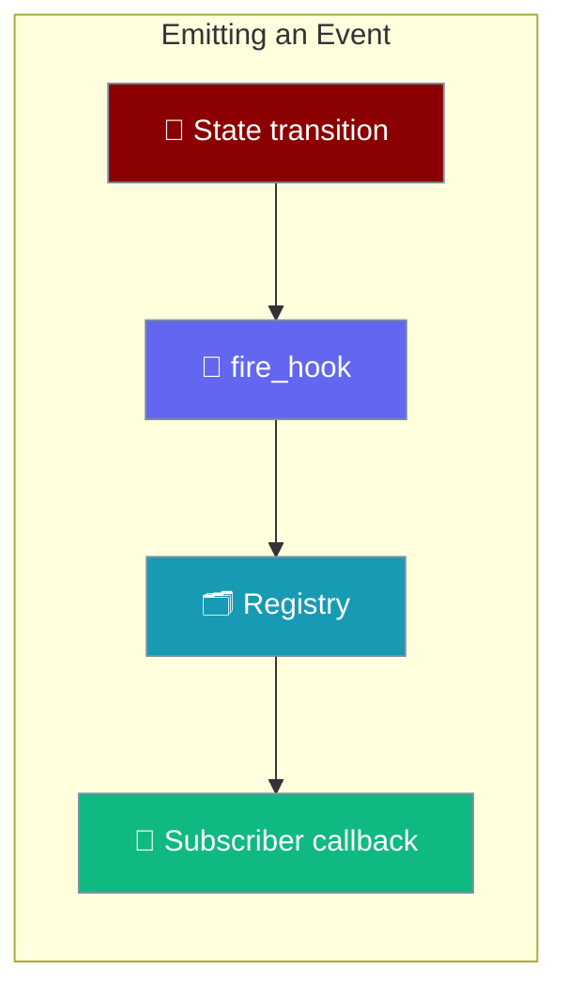
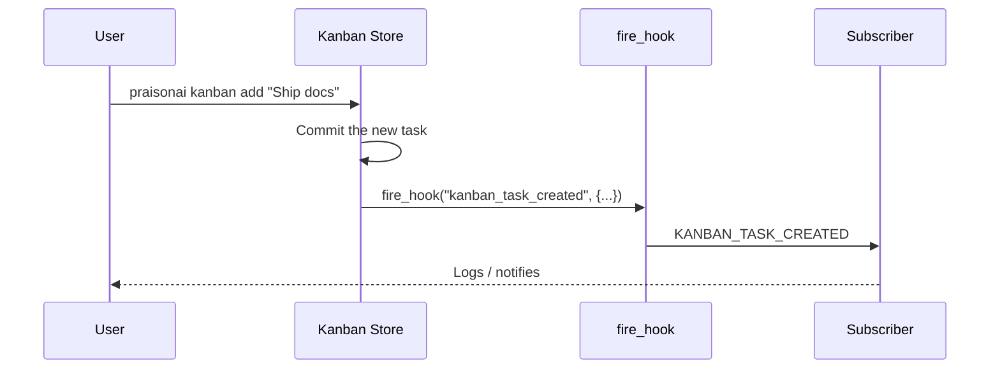

`fire_hook()` is the emission counterpart of `add_hook()`: a runtime component calls it at a real state transition so plugins subscribed to that `HookEvent` actually hear about it.

```python
from praisonaiagents.hooks import fire_hook

fire_hook("kanban_task_moved", {"task_id": "T-42", "to_status": "done"})
```



## Quick Start

<Steps>

<Step title="Subscribe with add_hook">
Register a callback for the event you care about. This is all a plugin author needs for the SDK's built-in events.

```python
from praisonaiagents.hooks import add_hook, HookResult

def on_move(data):
    print(f"{data.task_id}: {data.from_status} -> {data.to_status}")
    return HookResult.allow()

add_hook("kanban_task_moved", on_move)
```
</Step>

<Step title="Emit from your own code">
Call `fire_hook()` at the moment your code changes state. Subscribers registered above run immediately.

```python
from praisonaiagents.hooks import fire_hook

fire_hook("kanban_task_moved", {
    "task_id": "T-42",
    "from_status": "running",
    "to_status": "done",
})
```
</Step>

<Step title="Emit from an async function">
The same call works inside `async def`. When a loop is already running, `fire_hook` schedules the subscribers fire-and-forget on that loop and returns `[]` without blocking.

```python
import asyncio
from praisonaiagents.hooks import fire_hook

async def finish_task(task_id: str):
    # ... do the async work ...
    fire_hook("kanban_task_done", {"task_id": task_id, "to_status": "done"})

asyncio.run(finish_task("T-42"))
```
</Step>

</Steps>

---

## How It Works

A subscriber runs the moment a real user action triggers an emission.



---

## Arguments

`fire_hook(event, data=None, *, target=None, registry=None)` accepts these arguments.

| Argument | Type | Default | Description |
|----------|------|---------|-------------|
| `event` | `str \| HookEvent` | required | The event to emit — enum, canonical value, or member name. |
| `data` | `dict \| None` | `None` | Payload; recognised keys populate the event's input dataclass, the rest go into `extra`. |
| `target` | `str \| None` | `None` | Optional matcher target (e.g. a tool name) so only matching hooks run. |
| `registry` | `HookRegistry \| None` | `None` | Registry to emit on; defaults to the process-wide registry. |

---

## Event ID Spellings

`fire_hook()` accepts three spellings for the same event, so legacy call sites using the member name reach the same subscribers.

| Spelling | Example | Notes |
|----------|---------|-------|
| Enum | `HookEvent.KANBAN_TASK_MOVED` | The type itself. |
| Canonical value | `"kanban_task_moved"` | Lowercase string value. |
| Member name | `"KANBAN_TASK_MOVED"` | Uppercase enum name; used by legacy emitters. |

Use `resolve_hook_event()` to normalise an id without emitting:

```python
from praisonaiagents.hooks import resolve_hook_event

resolve_hook_event("KANBAN_TASK_MOVED")  # -> HookEvent.KANBAN_TASK_MOVED
resolve_hook_event("nope")               # -> None
```

---

## Payload Shape

Keys that match a field on the event's input dataclass are set directly; everything else is carried through in `extra`.

```python
from praisonaiagents.hooks import add_hook, fire_hook, HookResult

def on_move(data):
    # `task_id` is a typed field; `priority` was not, so it lands in extra
    print(data.task_id, data.extra.get("priority"))
    return HookResult.allow()

add_hook("kanban_task_moved", on_move)
fire_hook("kanban_task_moved", {"task_id": "T-42", "priority": "high"})
```

`fire_hook` builds the right subclass automatically — `KanbanHookInput` for `KANBAN_TASK_*`, `JobCompletedInput` for `JOB_COMPLETED`, and a plain `HookInput` otherwise.

---

## Best-Effort Contract

Emitting an observability event must never break the operation that produced it, so `fire_hook` swallows and logs (`logger.debug`) these cases.

| Situation | Result |
|-----------|--------|
| Unknown event id | Logged, returns `[]` — nothing emitted. |
| No subscribers | Returns `[]` — no payload built, no loop started. |
| Malformed payload | Logged, returns `[]`. |
| Subscriber raises | Logged, does not propagate. |
| Emitted on a running loop | Scheduled fire-and-forget, returns `[]`. |

The return value is the list of hook results, or `[]` in any of the cases above.

---

## When To Call This Yourself

The SDK's kanban store and background job manager already call `fire_hook` internally, so a plugin author subscribing to a **built-in** event does not need to emit anything.

Call `fire_hook()` yourself when:

- You expose a **custom lifecycle event** from a plugin and want subscribers to react to it.
- You **wire a new runtime component** that has its own state transitions worth observing.

```python
from praisonaiagents.hooks import fire_hook

def deploy(version: str):
    # ... perform the deploy ...
    fire_hook("job_completed", {
        "job_id": f"deploy-{version}",
        "status": "completed",
    })
```

---

## Best Practices

<AccordionGroup>

<Accordion title="Keep subscribers cheap and idempotent">
A subscriber can be called again on retry or replay. Make it safe to run twice for the same payload — check before you insert, or upsert instead.
</Accordion>

<Accordion title="Never block an async emitter">
If the emitter runs on an event loop, `fire_hook` schedules subscribers on that loop. Blocking I/O inside a hook body stalls the loop — offload to a thread pool or a queue instead.

```python
import concurrent.futures
from praisonaiagents.hooks import add_hook, HookResult

_pool = concurrent.futures.ThreadPoolExecutor(max_workers=4)

def notify(data):
    _pool.submit(send_alert, data.task_id)
    return HookResult.allow()

add_hook("kanban_task_blocked", notify)
```
</Accordion>

<Accordion title="Normalise ids without emitting">
When you only need to canonicalise an event id (validation, routing), call `resolve_hook_event()` rather than `fire_hook()` — it returns the `HookEvent` or `None` and never triggers subscribers.
</Accordion>

<Accordion title="Scope with registry= when needed">
`fire_hook()` targets the process-wide default registry. Pass `registry=` to emit on a scoped registry — useful in tests or when isolating a subsystem's hooks.
</Accordion>

</AccordionGroup>

---

## Related

<CardGroup cols={2}>
  <Card title="Hook Events" icon="list" href="/features/hook-events">
    Every event you can subscribe to and its payload
  </Card>
  <Card title="Hooks" icon="webhook" href="/features/hooks">
    Register, remove, and inspect hooks
  </Card>
</CardGroup>
