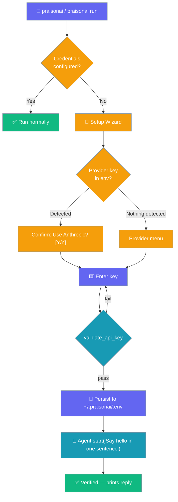
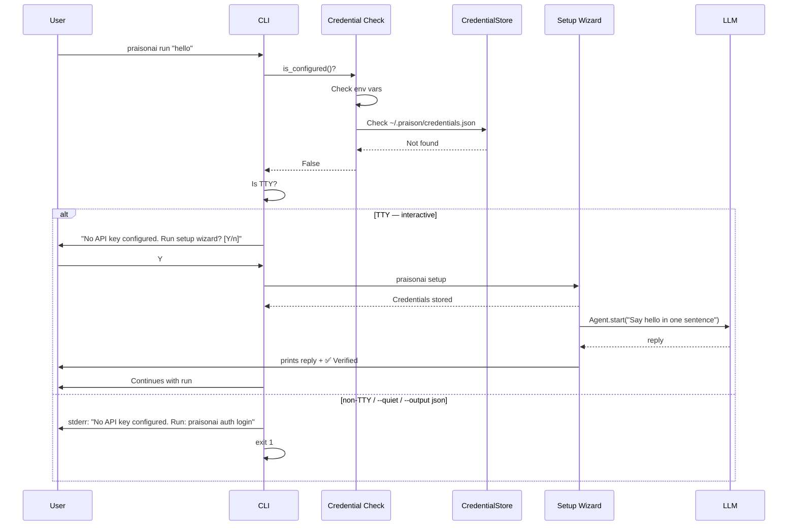

PraisonAI leads you to a verified, working agent in as few keystrokes as possible — auto-detecting any provider key you already have, validating the one you enter, and smoke-testing before it hands back the prompt.

`praisonai --init` is now safe to run before `setup` — if no provider is configured it prints provider guidance and exits cleanly rather than throwing a stack trace. Either order works for onboarding.

```python
from praisonaiagents import Agent

agent = Agent(name="onboarding-agent", instructions="Guide new users through setup.")
agent.start("Walk me through setting up PraisonAI for the first time.")
```

The user launches PraisonAI without API keys; the CLI offers the setup wizard instead of failing on the first model call.




## Quick Start

<Steps>
<Step title="Run praisonai without any setup">
```bash
praisonai
```

If no credentials are configured, you'll see:

```
No API key configured.
Would you like to run the setup wizard now? [Y/n]:
```

Type `Y` (or press Enter) to launch the setup wizard.
</Step>

<Step title="Complete setup once">
The setup wizard asks for your provider and API key, then stores the credential securely:

```bash
praisonai setup
# Choose: 1) OpenAI  2) Anthropic  3) Google  4) Ollama  5) Custom
# Enter your API key when prompted
```

<Note>
When one of `OPENAI_API_KEY`, `ANTHROPIC_API_KEY`, `GEMINI_API_KEY`, or `GOOGLE_API_KEY` is already exported, the wizard skips the menu and pre-selects that provider — you only confirm.
</Note>

Credentials are stored in `~/.praison/credentials.json` (permissions `0600`).
</Step>

<Step title="Re-run — no prompts after the first time">
```bash
praisonai "What is 2+2?"
# Runs immediately — no credential prompt
```
</Step>
</Steps>

---

## Wizard flow (post-#2680)

The wizard moves through three stages: auto-detect, validate, and smoke-test.

<Steps>
<Step title="Auto-detect a key you already have">
If a `*_API_KEY` is already exported, the first prompt is a confirmation — not a numeric menu:

```
Detected ANTHROPIC_API_KEY in your environment.
Use Anthropic (claude-sonnet-4-20250514)? [Y/n]:
```

Answer `n` to fall through to the full provider menu. The provider menu only appears when no key is detected.
</Step>

<Step title="Validate the key before it persists">
Entered keys run through the same `validate_api_key()` check as `praisonai auth login`. A bad key re-prompts instead of silently writing a broken credential:

```
2. Enter your OpenAI API key:
Enter API key (hidden):
Invalid API key for OpenAI: OpenAI keys start with "sk-"
Try again? [Y/n]: y
Enter API key (hidden):
```

After up to three attempts the wizard proceeds with the last entry so you're never stuck in a loop.
</Step>

<Step title="Smoke-test before handing back the prompt">
After the config is written, the wizard runs one live call and prints the reply:

```
Verifying your setup...
✅ Verified — your agent is working!
Hello! How can I help you today?
```

A failed smoke test is a **warning**, not an error — your config is already saved, so you can run `praisonai doctor` to diagnose the key or model.
</Step>
</Steps>

<Note>
Pass `--no-verify` to skip the smoke test when running offline or in CI:

```bash
praisonai setup --no-verify --non-interactive \
  --provider openai --api-key "$OPENAI_API_KEY"
```

The wizard still writes the config; it just doesn't dial the LLM.
</Note>

---

## How It Works

Both `praisonai` (bare) and `praisonai run` perform a credential check before doing any work.



### Credential detection order

| Step | What is checked | Example |
|------|----------------|---------|
| 1. Env vars (fast path) | `OPENAI_API_KEY`, `ANTHROPIC_API_KEY`, `GOOGLE_API_KEY`, `GEMINI_API_KEY`, `GROQ_API_KEY`, `COHERE_API_KEY` | `export OPENAI_API_KEY=sk-...` |
| 2. Credential store | `~/.praison/credentials.json` written by `praisonai setup` | `praisonai setup` |
| 3. LLM resolution | `resolve_llm_endpoint_with_credentials()` — final fallback | Stored OpenAI base URL |
| 4. Setup wizard auto-detection | Same `*_API_KEY` env vars, offered as pre-selected default when the user is inside the wizard | Detected on wizard entry, not first `Agent.start()` |

---

## Behaviour by Mode

| Scenario | Old behaviour | New behaviour |
|----------|--------------|--------------|
| Configured user (env var or stored credential) | Works normally | Works — **no extra prompts, no added latency** |
| New TTY user, no credentials, `praisonai` | Launched TUI, failed on first LLM call | Auto-detects any provider key already in the environment (confirm to use), otherwise prompts the menu; validates the key; runs a smoke-test with `Agent.start(...)`; prints the reply. |
| New TTY user, no credentials, `praisonai run "hi"` | Ran agent, failed on first LLM call | Same prompt as above; on success continues the run |
| CI / piped stdin / `--output json` | Cryptic LLM failure | Writes error to `stderr`, exits `1` |

---

## CI / Scripting

In non-interactive environments, PraisonAI exits with code `1` and writes to `stderr`:

```
No API key configured. Run: praisonai auth login
```

**Non-interactive detection:** `not sys.stdin.isatty()` or `--output json` mode.

### GitHub Actions example

```yaml
- name: Run PraisonAI agent
  run: praisonai run "Summarize the changelog"
  env:
    OPENAI_API_KEY: ${{ secrets.OPENAI_API_KEY }}
```

Setting any of the 6 detected env vars silences the check completely — no code changes needed.

---

## Skipping the Prompt

Three ways to avoid the setup prompt:

| Method | Command / Action |
|--------|-----------------|
| Set an env var | `export OPENAI_API_KEY=sk-...` |
| Run setup ahead of time | `praisonai setup` |
| Answer "No" at the prompt | Type `n` → exits `0` with a hint to run `praisonai auth login` |

---

## Default model on first run

If you run a command like `praisonai chat` without `--model` on first use, PraisonAI picks a default that matches the provider credential it finds in your environment — Anthropic key → Claude, Gemini key → Gemini Flash, etc. See [Default Model Resolution](/docs/cli/setup#what-happens-if-you-skip---model) for the full ladder.

---

## Best Practices

<AccordionGroup>
<Accordion title="In CI, set credentials before invoking">
Set `OPENAI_API_KEY` (or the provider key for your model) as a repository secret, then reference it in your workflow env block. This is the recommended approach — no credential files in your repo, no interactive prompts:

```yaml
env:
  OPENAI_API_KEY: ${{ secrets.OPENAI_API_KEY }}
```
</Accordion>

<Accordion title="Prefer stored credentials over env vars for shared machines">
On shared developer machines, stored credentials (`praisonai setup`) are scoped to the user's home directory and avoid environment variable leakage between sessions. Run `praisonai setup config --show` to verify what is stored.
</Accordion>

<Accordion title="Test your setup with a quick prompt before piping through automation">
Run `praisonai run "ping"` manually before wiring the command into a pipeline or CI job. A successful response confirms credentials are configured and the model is reachable.
</Accordion>

<Accordion title="Skip the smoke test in CI">
The smoke test is convenient locally but wastes a token round-trip in CI. Skip it with `--no-verify` on both `setup` and `setup wizard`.
</Accordion>
</AccordionGroup>

---

## Related

<CardGroup cols={2}>
  <Card title="Setup Wizard" icon="key" href="/docs/cli/setup">
    Interactive wizard for configuring LLM provider credentials
  </Card>
  <Card title="Run Command" icon="play" href="/docs/cli/run">
    Run agents from files or prompts
  </Card>
</CardGroup>
