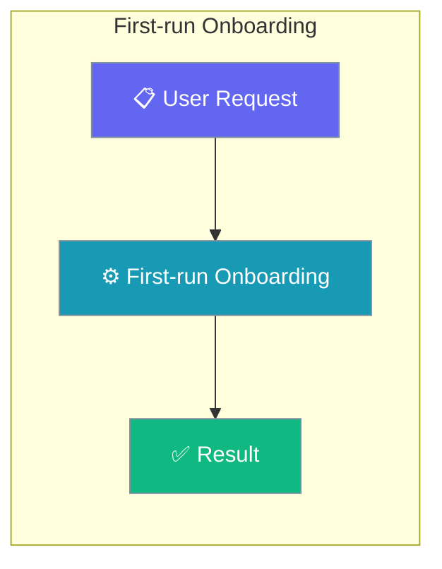
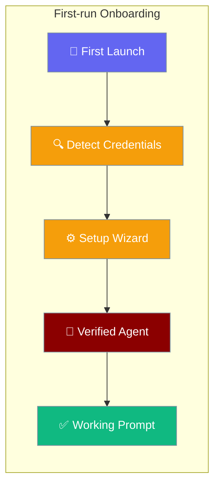
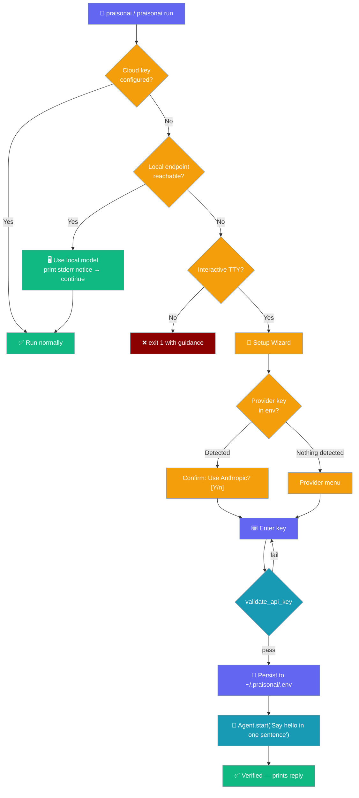

PraisonAI leads you to a verified, working agent in as few keystrokes as possible — auto-detecting any provider key you already have **or a locally-running model (e.g. Ollama) reachable on the machine**, validating the one you enter, and smoke-testing before it hands back the prompt.




`praisonai --init` is now safe to run before `setup` — if no provider is configured it prints provider guidance and exits cleanly rather than throwing a stack trace. Either order works for onboarding.

```python
from praisonaiagents import Agent

agent = Agent(name="onboarding-agent", instructions="Guide new users through setup.")
agent.start("Walk me through setting up PraisonAI for the first time.")
```

The user launches PraisonAI without API keys; the CLI uses a reachable local model if one is running, otherwise offers the setup wizard instead of failing on the first model call.



### Onboarding Flow



<Note>
When no cloud key is configured, PraisonAI checks for a reachable local endpoint (`detect_local_endpoint()`) **before** prompting the wizard. If a local Ollama or OpenAI-compatible server answers, it prints a one-line stderr notice and continues — the wizard prompt (TTY) or exit `1` (non-TTY) only fires when nothing is reachable. See [Keyless Local-First Run](/docs/features/keyless-local-first-run).
</Note>

## Quick Start

<Steps>
<Step title="Run praisonai without any setup">
```bash
praisonai
```

If no cloud credentials are configured **and no local model is reachable**, you'll see:

```
No API key configured.
Would you like to run the setup wizard now? [Y/n]:
```

Type `Y` (or press Enter) to launch the setup wizard.

<Note>
If a local endpoint (e.g. Ollama) is already running, PraisonAI skips the prompt and uses it — see [Keyless local-first](#keyless-local-first-ollama-openai-compatible).
</Note>
</Step>

<Step title="Complete setup once">
The setup wizard asks for your provider and API key, then stores the credential securely:

```bash
praisonai setup
# Choose from a catalogue-driven menu: OpenAI, Anthropic, Google, Ollama, Groq,
# OpenRouter, Mistral, DeepSeek, xAI, … (curated first, Custom last)
# Enter your API key when prompted (a "Get your key" hint prints first)
```

<Note>
On first run, the picker shows every catalogue-known provider (Groq, OpenRouter, Mistral, DeepSeek, xAI, …) — not just the historical curated five — and prints a `Get your key:` link before the masked prompt.
</Note>

<Note>
When one of `OPENAI_API_KEY`, `ANTHROPIC_API_KEY`, `GEMINI_API_KEY`, or `GOOGLE_API_KEY` is already exported, the wizard skips the menu and pre-selects that provider — you only confirm.
</Note>

Credentials are stored in `~/.praisonai/credentials.json` (permissions `0600`). Legacy `~/.praison/credentials.json` is still read as a fallback and migrated automatically on the next write — no re-login required.
</Step>

<Step title="Re-run — no prompts after the first time">
```bash
praisonai "What is 2+2?"
# Runs immediately — no credential prompt
```
</Step>
</Steps>

---

## Wizard flow (post-#2680)

The wizard moves through three stages: auto-detect, validate, and smoke-test.

<Steps>
<Step title="Auto-detect a key you already have">
If a `*_API_KEY` is already exported, the first prompt is a confirmation — not a numeric menu:

```
Detected ANTHROPIC_API_KEY in your environment.
Use Anthropic (claude-sonnet-4-20250514)? [Y/n]:
```

Answer `n` to fall through to the full provider menu. The provider menu only appears when no key is detected, and is **catalogue-driven** — it lists every provider `ModelCatalogue` knows about (Groq, OpenRouter, Mistral, DeepSeek, xAI, …), curated ones first and `custom` last.
</Step>

<Step title="Validate the key before it persists">
Entered keys run through the same `validate_api_key()` check as `praisonai auth login`. A bad key re-prompts instead of silently writing a broken credential:

```
2. Enter your OpenAI API key:
Enter API key (hidden):
Invalid API key for OpenAI: OpenAI keys start with "sk-"
Try again? [Y/n]: y
Enter API key (hidden):
```

After up to three attempts the wizard proceeds with the last entry so you're never stuck in a loop.
</Step>

<Step title="Smoke-test before handing back the prompt">
After the config is written, the wizard runs one live call and prints the reply:

```
Verifying your setup...
✅ Verified — your agent is working!
Hello! How can I help you today?
```

A failed smoke test is a **warning**, not an error — your config is already saved, so you can run `praisonai doctor` to diagnose the key or model.
</Step>
</Steps>

<Note>
Pass `--no-verify` to skip the smoke test when running offline or in CI:

```bash
praisonai setup --no-verify --non-interactive \
  --provider openai --api-key "$OPENAI_API_KEY"
```

The wizard still writes the config; it just doesn't dial the LLM.
</Note>

---

## How It Works

Both `praisonai` (bare) and `praisonai run` perform a credential check before doing any work.

```mermaid
sequenceDiagram
    participant User
    participant CLI
    participant CredCheck as Credential Check
    participant Store as CredentialStore
    participant Detector as Local Detector
    participant Wizard as Setup Wizard
    participant LLM

    User->>CLI: praisonai run "hello"
    CLI->>CredCheck: is_configured()?
    CredCheck->>CredCheck: Check env vars
    CredCheck->>Store: Check ~/.praisonai/credentials.json
    Store-->>CredCheck: Not found
    CredCheck-->>CLI: False
    CLI->>Detector: detect_local_model()
    alt Local endpoint reachable
        Detector-->>CLI: LocalModel(ollama/llama3.2, base_url)
        CLI->>User: stderr: "No cloud key found; using local model ollama/llama3.2 …"
        CLI->>LLM: run against local base URL
        LLM-->>User: response
    else No local endpoint — is TTY?
        Detector-->>CLI: None
        alt TTY — interactive
            CLI->>User: "No API key configured. Run setup wizard? [Y/n]"
            User->>CLI: Y
            CLI->>Wizard: praisonai setup
            Wizard-->>CLI: Credentials stored
            Wizard->>LLM: Agent.start("Say hello in one sentence")
            LLM-->>Wizard: reply
            Wizard->>User: prints reply + ✅ Verified
            CLI->>User: Continues with run
        else non-TTY / --quiet / --output json
            CLI->>User: stderr: "No API key configured. Run: praisonai setup"
            CLI->>CLI: exit 1
        end
    end
```

### Credential detection order

| Step | What is checked | Example |
|------|----------------|---------|
| 1. Env vars (fast path) | `OPENAI_API_KEY`, `ANTHROPIC_API_KEY`, `GOOGLE_API_KEY`, `GEMINI_API_KEY`, `GROQ_API_KEY`, `COHERE_API_KEY` | `export OPENAI_API_KEY=sk-...` |
| 2. Credential store | `~/.praisonai/credentials.json` written by `praisonai setup` (also mirrored to `~/.praisonai/.env`) | `praisonai setup` |
| 3. LLM resolution | `resolve_llm_endpoint_with_credentials()` — final fallback | Stored OpenAI base URL |
| 4. Keyless local-first | `praisonai_code.llm.local_detect.detect_local_model()` — probes `OPENAI_BASE_URL` / `OLLAMA_HOST` / `127.0.0.1:11434` when no cloud key is set | Any running Ollama server auto-adopted |
| 5. Setup wizard auto-detection | Same `*_API_KEY` env vars, offered as pre-selected default when the user is inside the wizard | Detected on wizard entry, not first `Agent.start()` |

When no cloud key is present, PraisonAI adopts a reachable local endpoint before offering the wizard — the first `praisonai run "..."` works against a running Ollama on `localhost:11434` with zero setup. See [Keyless local-first fallback](/docs/models#keyless-local-first-fallback-no-env-vars-set) and [Local Models](/docs/features/local-models).

<Note>
`PRAISONAI_HOME` relocates the entire CLI home (`config.yaml`, `.env`, `credentials.json`, sessions, traces, logs, cache) in one place; it defaults to `~/.praisonai/`. See [Delivery Config → base directory override](/docs/features/delivery-config).
</Note>

---

## Behaviour by Mode

| Scenario | Behaviour |
|----------|-----------|
| Cloud key present (env var or stored credential) | Cloud key wins — local detection never overrides. No extra prompts, no added latency. |
| No cloud key, local endpoint reachable, **TTY** | Prints `No cloud key found; using local model <name>. Run \`praisonai setup\` to add a hosted provider.` on stderr and **continues** into the TUI / the run. |
| No cloud key, local endpoint reachable, **non-TTY** (`praisonai run`) | Adopts the detected local model + base URL for this run; the run proceeds. |
| No cloud key, **no** local endpoint, **TTY** | Setup wizard is offered as a non-blocking suggestion (`Would you like to run the setup wizard now? [Y/n]`). |
| No cloud key, **no** local endpoint, **non-TTY** / `--quiet` / `--output json` | Exit `1` with: `No API key configured. Run: praisonai setup` … `(a running local endpoint such as Ollama would be used automatically)`. |

---

## Keyless local-first (Ollama & OpenAI-compatible)

With a model already running locally, PraisonAI works before you configure any cloud key.

```python
# Have Ollama running: `ollama serve` and `ollama pull llama3.2`
# Then just:
from praisonaiagents import Agent

agent = Agent(
    name="assistant",
    instructions="You are a helpful assistant.",
)
agent.start("Say hi")
# The CLI/wrapper detects the local endpoint. No API key set,
# no `model=` argument, no OPENAI_BASE_URL export needed.
```

The same convenience applies straight from the terminal:

```bash
ollama serve
ollama pull llama3.2
praisonai "Summarise this repo"
# stderr: No cloud key found; using local model ollama/llama3.2. Run `praisonai setup` to add a hosted provider.
```

### Endpoint precedence

The detector resolves the endpoint to probe in this order, then hits Ollama's native `/api/tags` first (falling back to the OpenAI-compatible `/v1/models`):

| Order | Source | Notes |
|-------|--------|-------|
| 1 | `OPENAI_BASE_URL` | Any OpenAI-compatible base URL (a trailing `/v1` is stripped before the `/api/tags` probe) |
| 2 | `OLLAMA_HOST` | A bare `host:port` gets an `http://` prefix automatically |
| 3 | `http://127.0.0.1:11434` | Default Ollama endpoint when neither variable is set |

### Model id labels

The detected model id carries a provider prefix so it routes to the right path:

| Probe that answered | Model id label | Example server |
|---------------------|----------------|----------------|
| Ollama `/api/tags` | `ollama/<name>` | `ollama/llama3.2:latest` |
| OpenAI-compatible `/v1/models` | `openai/<id>` | llama.cpp · LM Studio · vLLM |

<Note>
Cloud keys always win. Local detection is a **fallback only** — if `OPENAI_API_KEY` (or any other cloud provider key) is present, that key is used and the local probe never runs.
</Note>

<Warning>
If the local endpoint dies mid-session, calls will fail. The negative-probe cache TTL is only 30 s, so the resolver re-detects shortly after — restart the server and the next run recovers.
</Warning>

See also [Keyless Local-First Run](/docs/features/keyless-local-first-run) for the full deep-dive.

---

## CI / Scripting

In non-interactive environments with no credentials and no reachable local endpoint, PraisonAI exits with code `1` and writes to `stderr`:

```
No API key configured. Run: praisonai setup
(a running local endpoint such as Ollama would be used automatically)
```

The second line is a reminder that a reachable local endpoint (Ollama or any OpenAI-compatible server) is adopted automatically — see [Keyless Local-First Run](/docs/features/keyless-local-first-run).

**Non-interactive detection:** `not sys.stdin.isatty()` or `--output json` mode.

### GitHub Actions example

```yaml
- name: Run PraisonAI agent
  run: praisonai run "Summarize the changelog"
  env:
    OPENAI_API_KEY: ${{ secrets.OPENAI_API_KEY }}
```

Setting any of the detected cloud provider env vars silences the check completely — no code changes needed.

### Keyless CI with an in-cluster Ollama sidecar

A CI runner that ships an Ollama sidecar can run keylessly by pointing `OLLAMA_HOST` at it — no cloud secret required:

```yaml
- name: Run PraisonAI agent (local model)
  run: praisonai run "Summarize the changelog"
  env:
    OLLAMA_HOST: http://ollama:11434
```

---

## Skipping the Prompt

Four ways to avoid the setup prompt:

| Method | Command / Action |
|--------|-----------------|
| Set an env var | `export OPENAI_API_KEY=sk-...` |
| Run setup ahead of time | `praisonai setup` |
| Have a local Ollama running | `ollama serve` (auto-detected, no explicit flag needed) |
| Answer "No" at the prompt | Type `n` → exits `0` with a hint to run `praisonai setup` |

---

## Default model on first run

If you run a command like `praisonai chat` without `--model` on first use, PraisonAI picks a default that matches the provider credential it finds in your environment — Anthropic key → Claude, Gemini key → Gemini Flash, etc. When **no** cloud key is present, `resolve_default_model()` prefers a reachable local model (e.g. `ollama/llama3.2`) before falling back to the terminal default (`gpt-4o-mini`). A cloud-key provider always wins over the local model. See [Default Model Resolution](/docs/cli/setup#what-happens-if-you-skip---model) for the full ladder.

---

## Best Practices

<AccordionGroup>
<Accordion title="In CI, set credentials before invoking">
Set `OPENAI_API_KEY` (or the provider key for your model) as a repository secret, then reference it in your workflow env block. This is the recommended approach — no credential files in your repo, no interactive prompts:

```yaml
env:
  OPENAI_API_KEY: ${{ secrets.OPENAI_API_KEY }}
```
</Accordion>

<Accordion title="Prefer stored credentials over env vars for shared machines">
On shared developer machines, stored credentials (`praisonai setup`) are scoped to the user's home directory and avoid environment variable leakage between sessions. Run `praisonai setup config --show` to verify what is stored.
</Accordion>

<Accordion title="Test your setup with a quick prompt before piping through automation">
Run `praisonai run "ping"` manually before wiring the command into a pipeline or CI job. A successful response confirms credentials are configured and the model is reachable.
</Accordion>

<Accordion title="Skip the smoke test in CI">
The smoke test is convenient locally but wastes a token round-trip in CI. Skip it with `--no-verify` on both `setup` and `setup wizard`.
</Accordion>
</AccordionGroup>

---

## Related

<CardGroup cols={2}>
  <Card title="Setup Wizard" icon="key" href="/docs/cli/setup">
    Interactive wizard for configuring LLM provider credentials
  </Card>
  <Card title="Run Command" icon="play" href="/docs/cli/run">
    Run agents from files or prompts
  </Card>
  <Card title="Keyless Local-First Run" icon="server" href="/docs/features/keyless-local-first-run">
    Zero-config runs against a local Ollama or OpenAI-compatible model
  </Card>
</CardGroup>
