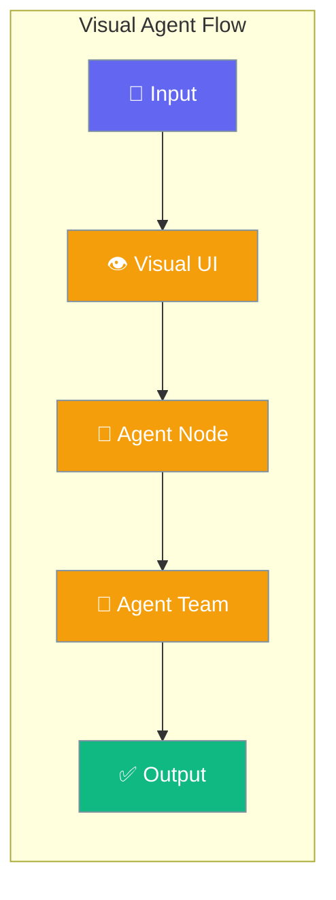
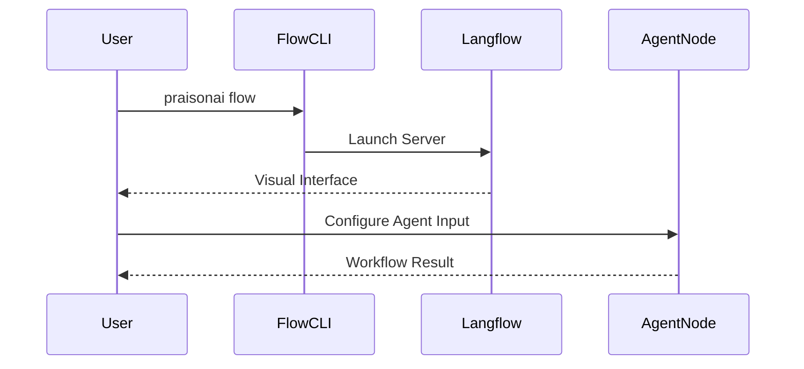

Visual workflow builder allows you to create, connect, and manage agentic processes using a drag-and-drop interface.



## Quick Start

<Steps>
<Step title="Install Flow Addon">
Install the visual builder components.

```bash
pip install "praisonai[flow]"
```
</Step>

<Step title="Launch Visual Builder">
Start the local server and open the web interface.

```bash
praisonai flow
```
</Step>

<Step title="Connect Components">
Open `http://localhost:7860` to access the interface.
Drag and drop **Agent** and **Agent Team** nodes to orchestrate workflows.
</Step>
</Steps>

---

## How It Works



| Component | Purpose | Availability |
|-----------|---------|-------------|
| **Agent Node** | Individual AI entity with tailored instructions | Sidebar > PraisonAI |
| **Agent Team Node** | Multi-agent orchestrator connecting multiple nodes | Sidebar > PraisonAI |
| **CLI Command** | Backend server runtime wrapper | `praisonai` CLI |

---

## Agent Configuration Options

Options available on the **Agent** node visual component.

| Option | Type | Default | Description |
|--------|------|---------|-------------|
| `Agent Name` | `str` | `"Agent"` | Name for identification and logging. |
| `Previous Agent` | `Handle` | `None` | Connect from previous agent to define execution order. |
| `Role` | `str` | `None` | Role defining the agent's expertise. |
| `Goal` | `str` | `None` | Primary objective the agent aims to achieve. |
| `Instructions` | `str` | `"You are a helpful assistant."` | System prompt for the agent. |
| `Model` | `str` | `"openai/gpt-4o-mini"` | LLM model to use (provider/model format). |
| `Input` | `Handle` | `None` | User input to process. |
| `Tools` | `Handle` | `None` | Tools available to the agent. |
| `Memory` | `bool` | `False` | Enable context retention. |
| `Guardrails` | `bool` | `False` | Enable output validation guardrails. |
| `Knowledge Files` | `File` | `None` | Files to use as knowledge sources (PDF, TXT, etc.). |

---

## Agent Team Configuration Options

Options available on the **Agent Team** node visual component for multi-agent workflows.

| Option | Type | Default | Description |
|--------|------|---------|-------------|
| `Name` | `str` | `"AgentTeam"` | Name for this multi-agent team. |
| `Agents` | `Handle` | `[]` | List of connected PraisonAI agents to orchestrate. |
| `Input` | `Handle` | `None` | Initial input to start the multi-agent workflow. |
| `Process` | `str` | `"sequential"` | Collaboration mode (sequential, hierarchical, workflow). |
| `Manager LLM` | `str` | `"openai/gpt-4o"` | LLM used for auto-created managers. |
| `Shared Memory` | `bool` | `False` | Enable shared memory across all agents. |
| `Planning` | `bool` | `False` | Enable planning mode for task decomposition. |
| `Reflection` | `bool` | `False` | Enable self-reflection for improved results. |

---

## Common Patterns

### Sequential Connections
Connect individual `Agent` nodes linearly (Agent 1 → Agent 2) by linking the `Agent` output handle on the first node to the `Previous Agent` input handle on the second node. 

### Multi-Agent Orchestration
Connect multiple `Agent` nodes directly to the `Agents` input handle of an `Agent Team` node. The team node evaluates the topology and runs the sub-agents properly.

---

## Best Practices

<AccordionGroup>
<Accordion title="Configure Knowledge Properly">
When using the agent node's knowledge capabilities, be sure to upload compatible document types (PDF, TXT, CSV) or provide valid URLs in the `Knowledge` inputs.
</Accordion>
<Accordion title="Use Sequential Handles">
Use the `Previous Agent` connection to establish hard execution boundaries. The orchestrator automatically parses node inputs backwards to map deterministic execution flow.
</Accordion>
<Accordion title="Enable Advanced Node Features">
Click the "Advanced" toggle on nodes inside Langflow to expose robust SDK parameters like custom Base URLs, `Code Execution Mode`, `Verbose` logging, and specific `Memory Providers`.
</Accordion>
</AccordionGroup>

---

## Related

<CardGroup cols={2}>
<Card title="Agent Workflow" icon="route" href="/docs/features/workflows">
  Understand the core concepts of workflows.
</Card>
<Card title="Agent Teams" icon="users" href="/docs/features/agent-teams">
  Learn how to build collaborative AI teams.
</Card>
</CardGroup>
