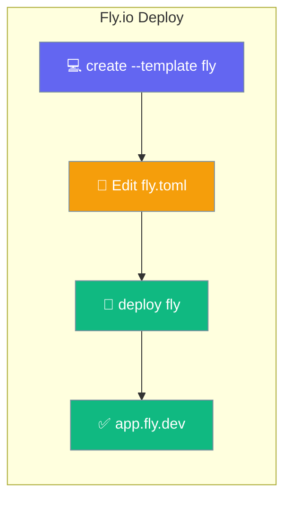
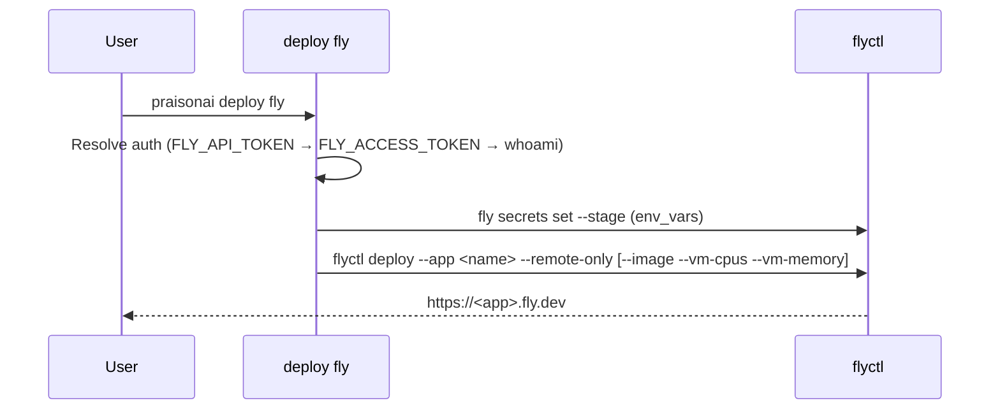
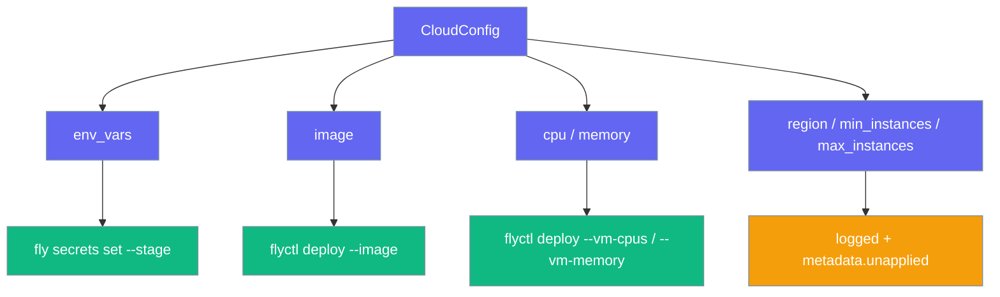

Deploy your agents to Fly.io with a starter `fly.toml` and a single deploy command.



<Warning>
Starter templates ship in the git checkout, **not** in the PyPI wheel (`MANIFEST.in` excludes `infra/`). Run `create` from a monorepo checkout, or set `PRAISONAI_STARTERS_ROOT` / `PRAISONAI_INFRA_ROOT`.
</Warning>

## Quick Start

<Steps>
<Step title="Scaffold the project">
The starter drops `fly.toml` and `agents.yaml` into the current directory.

```bash
praisonai deploy create --template fly
```
</Step>

<Step title="Authenticate with Fly">
Set a token or log in with flyctl.

```bash
export FLY_API_TOKEN="..."
# or: fly auth login
```
</Step>

<Step title="Deploy">
Deploy the app; pass a region if you want to override the default.

```bash
praisonai deploy fly
```
</Step>
</Steps>

---

## How It Works

The command shells out to `flyctl deploy`, so authentication follows a clear precedence.



**Auth precedence:** `FLY_API_TOKEN` → `FLY_ACCESS_TOKEN` → `flyctl auth whoami` fallback (a `fly auth login` session stores its token in the flyctl config, not the environment).

---

## CloudConfig support

The Fly provider forwards most `CloudConfig` fields to `flyctl`; a few belong elsewhere and are reported instead of dropped. Added in [PraisonAI PR #4876](https://github.com/MervinPraison/PraisonAI/pull/4876).



| CloudConfig field | Applied via | Notes |
|---|---|---|
| `env_vars` | `fly secrets set --stage` before deploy | Values never appear on argv or in logs; only names are logged. `--stage` records secrets without a second deploy, then `flyctl deploy` applies them. |
| `image` | `flyctl deploy --image` | Forwarded verbatim. |
| `cpu` | `flyctl deploy --vm-cpus` | Only forwarded when set **away from** the default `"256"`. |
| `memory` | `flyctl deploy --vm-memory` | Only forwarded when set **away from** the default `"512"`. |
| `region` | Not applied | Set in `fly.toml`. Logged and echoed in `metadata["unapplied"]`. |
| `min_instances` / `max_instances` | Not applied | Use `flyctl scale count`. Logged and echoed in `metadata["unapplied"]`. |

<Warning>
`cpu="256"` and `memory="512"` are **ECS CPU-unit conventions** consumed by the AWS provider, not Fly VM core counts — passing `--vm-cpus 256` would request an unavailable machine size and fail a previously valid deploy. Leaving the defaults uses Fly's own default VM. To override VM sizing, set a Fly-appropriate value (for example `cpu="1"`, `memory="1024"`).
</Warning>

<Note>
Programmatic consumers reading the JSON result of `deploy` should inspect `metadata["unapplied"]` to see which fields the provider could not apply (and the suggested remedy).
</Note>

---

## Command Options

| Argument / Flag | Default | Description |
|-----------------|---------|-------------|
| `FILE` (positional) | `agents.yaml` | Agent file to deploy. |
| `--region` / `-r` | *(from `fly.toml`)* | Fly region override. |

---

## Starter `fly.toml`

The `fly` starter ships production-ready defaults.

| Setting | Value |
|---------|-------|
| Image | `ghcr.io/mervinpraison/praisonai:latest` |
| `internal_port` | `8005` |
| `PRAISONAI_API_AUTH` | `enabled` |
| Health check | HTTP `GET /health` every 15s |

---

## Doctor

Check Fly readiness before deploying.

```bash
praisonai deploy doctor --provider fly
```

<Note>
`deploy doctor --provider fly` now runs the Fly provider's checks (flyctl on PATH + authentication) — previously this reported "Unknown provider".
</Note>

---

## Best Practices

<AccordionGroup>
<Accordion title="Pin the image tag for production">
The starter uses `latest`. Swap in a released tag in `[build] image` before shipping.
</Accordion>

<Accordion title="Set secrets with fly secrets, not fly.toml">
Keep `OPENAI_API_KEY` and other secrets out of Git: `fly secrets set OPENAI_API_KEY=...`. Any `env_vars` in `CloudConfig` are handled for you — the provider runs `fly secrets set --stage` before deploying, so values never reach the command line or logs.
</Accordion>

<Accordion title="Keep auth enabled">
The starter sets `PRAISONAI_API_AUTH=enabled`. Leave it on and supply a token so the public app requires `Authorization: Bearer`.
</Accordion>
</AccordionGroup>

---

## Add a New Provider

Provider entry points are pluggable via `pyproject.toml`. To add your own, register it in the provider registry (`providers/_registry.py`) and implement the `BaseProvider` interface (`doctor`, `plan`, `deploy`, `status`, `destroy`).

---

## Related

<CardGroup cols={2}>
<Card title="Deploy Templates" icon="file-code" href="/docs/features/create-templates">
  Scaffold the fly starter.
</Card>
<Card title="Deploy to Railway" icon="train" href="/docs/features/railway">
  Another one-command PaaS target.
</Card>
</CardGroup>
