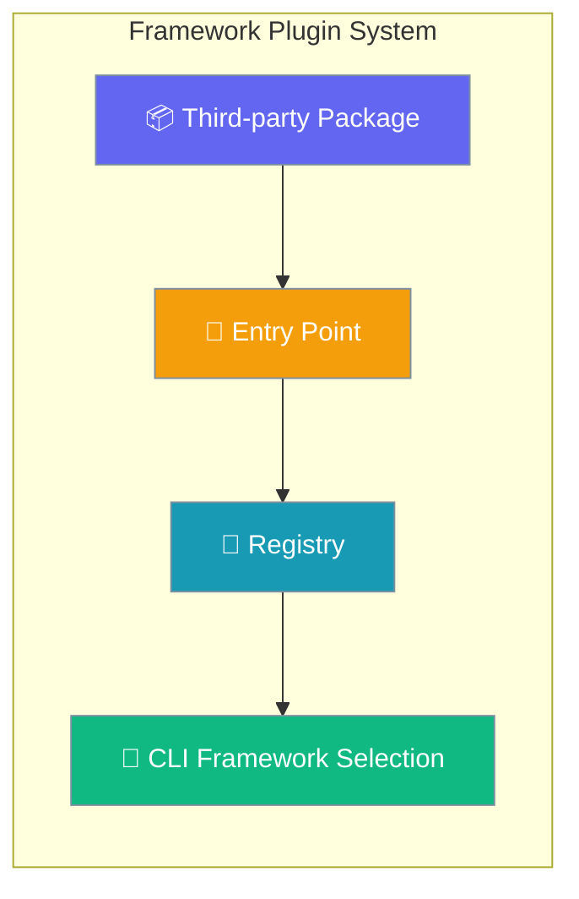
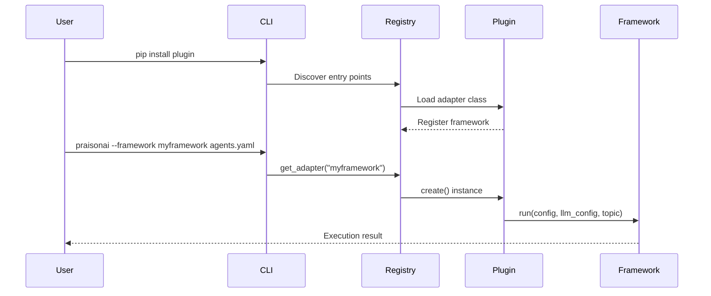
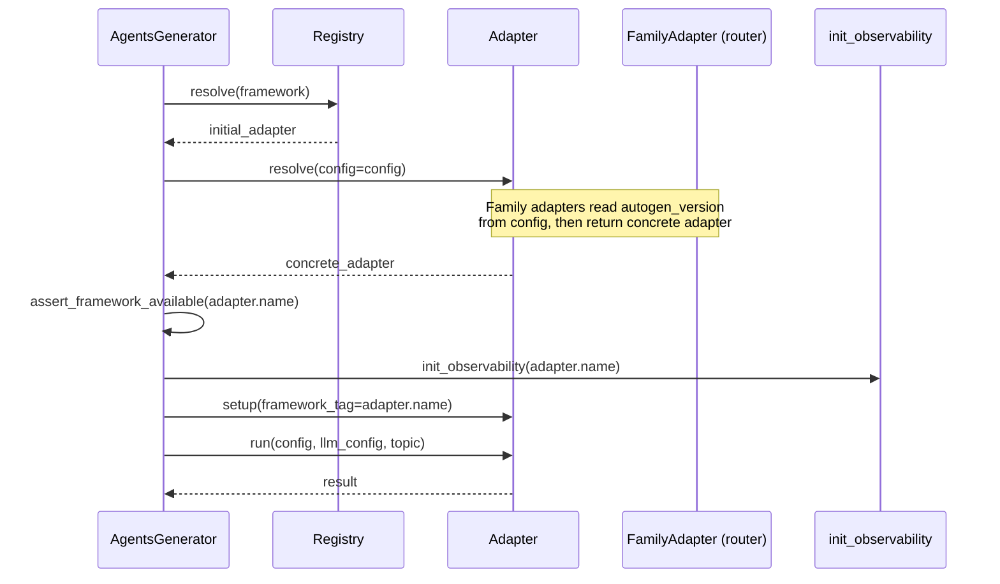
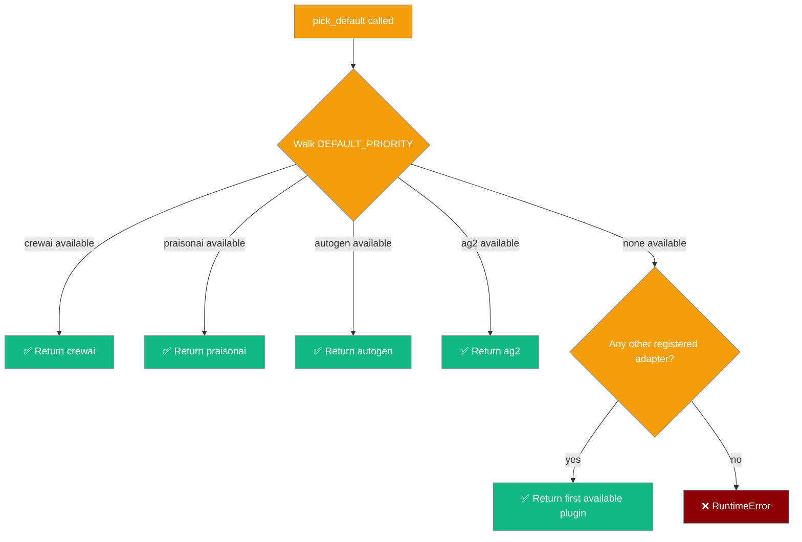

Framework adapter plugins enable third-party developers to add new execution frameworks to PraisonAI without modifying core code.

```python
from praisonaiagents import Agent

agent = Agent(name="adapter-agent", instructions="Use framework adapter plugins.")
agent.start("Enable the LangChain adapter plugin for this workflow.")
```

The user installs a third-party adapter package; entry-point discovery registers it for CLI framework selection.




<Warning>
**Deprecated:** Direct imports of concrete built-in adapter classes from `praisonai.framework_adapters` (`CrewAIAdapter`, `AutoGenAdapter`, `AutoGenV4Adapter`, `AG2Adapter`) now emit `DeprecationWarning`. Use the registry (`get_default_registry().create("crewai")`) or register via the entry-point group instead.
</Warning>

## Quick Start

<Steps>
<Step title="Programmatic Registration">

Register a framework adapter directly in your code:

```python
from typing import Any, Callable, Dict, List, Optional
from praisonaiagents import BaseFrameworkAdapter
from praisonai.framework_adapters.registry import get_default_registry

class MyFrameworkAdapter(BaseFrameworkAdapter):
    name = "myframework"

    def is_available(self) -> bool:
        try:
            import myframework
            return True
        except ImportError:
            return False

    def run(
        self,
        config: Dict[str, Any],
        llm_config: List[Dict],
        topic: str,
        *,
        tools_dict: Optional[Dict[str, Any]] = None,
        agent_callback: Optional[Callable] = None,
        task_callback: Optional[Callable] = None,
        cli_config: Optional[Dict[str, Any]] = None,
    ) -> str:
        return "Framework execution result"

# Register the adapter (preferred for app code)
registry = get_default_registry()
registry.register("myframework", MyFrameworkAdapter)
```

</Step>

<Step title="Entry-Point Plugin (installable)">

Create a pip-installable plugin — no manual `registry.register()` call needed:

```python
# my_framework_adapter.py
from praisonaiagents import BaseFrameworkAdapter

class MyFrameworkAdapter(BaseFrameworkAdapter):
    name = "my_framework"
    install_hint = "pip install my-framework-bridge"
    requires_tools_extra = False

    def is_available(self) -> bool:
        return True

    def run(
        self,
        config,
        llm_config,
        topic,
        *,
        tools_dict=None,
        agent_callback=None,
        task_callback=None,
        cli_config=None,
    ) -> str:
        return f"my_framework ran: {topic}"
```

```toml
# pyproject.toml
[build-system]
requires = ["setuptools>=61.0"]
build-backend = "setuptools.build_meta"

[project]
name = "my-framework-bridge"
version = "0.0.1"
dependencies = ["praisonaiagents"]

[tool.setuptools]
py-modules = ["my_framework_adapter"]

[project.entry-points."praisonai.framework_adapters"]
my_framework = "my_framework_adapter:MyFrameworkAdapter"
```

```bash
pip install -e ./examples/python/frameworks/custom_adapter
praisonai --framework my_framework agents.yaml
```

After `pip install`, the adapter appears in `praisonai --framework` choices and `praisonai doctor` automatically — no manual `registry.register()` call needed.

</Step>
</Steps>

---

## What the Registry Controls

Registering through the `praisonai.framework_adapters` entry-point group gives your adapter automatic visibility across three surfaces — no extra wiring required:

| Surface | Effect |
|---------|--------|
| `praisonai --framework <name>` | Your adapter name appears in the argparse `choices=` list |
| `praisonai doctor config` | `agents.yaml framework: <name>` passes validation |
| Install-hint messages | Your adapter's `install_hint` attribute is shown when the framework module is missing |

```bash
# Example: after pip install praisonai-langgraph
$ praisonai --framework langgraph agents.yaml   # accepted
$ praisonai doctor
✓ agents.yaml framework='langgraph' is a registered adapter
```

See [Framework Availability — Dynamic Discovery](/docs/features/framework-availability#dynamic-framework-discovery) for more details on how the registry feeds these surfaces.

---

## How It Works



The framework adapter registry provides a central point for managing framework implementations:

| Operation | Description | When Called |
|-----------|-------------|-------------|
| Discovery | Entry points auto-loaded on first registry access | Import time |
| Registration | Adapters registered by name | Plugin installation |
| Creation | Adapter instances created on demand | CLI framework selection |
| Availability | Framework dependencies checked | Before execution |

---

## Auto-Discovery in the CLI

Once your adapter is registered (in-process via `register()` or via the `praisonai.framework_adapters` entry-point group), it appears automatically wherever framework names are listed or validated — no further wiring needed:

| Surface | What it shows / validates against |
|---------|-----------------------------------|
| `praisonai --framework <name>` argparse `choices` | `list_framework_choices(include_unavailable=True)` |
| `praisonai doctor` `agents.yaml` `framework:` field check | `list_framework_choices(include_unavailable=True)` |
| Missing-framework error → install hint | adapter's own `install_hint` (falls back to `pip install 'praisonai-frameworks[<name>]'`) |

The single source of truth is `praisonai.framework_adapters.list_framework_choices()`. When `include_unavailable=False` (the default) only adapters whose `is_available()` returns `True` are returned; the CLI uses `include_unavailable=True` so users see every registered framework and get a friendly error if its dependencies are missing.

### Declaring an install hint

Surface a tailored install command for your adapter so users don't see the generic fallback:

```python
class MyFrameworkAdapter:
    name = "myframework"
    install_hint = 'pip install "myframework-praisonai[gpu]"'

    def is_available(self) -> bool: ...
    def run(self, config, llm_config, topic, *, tools_dict=None,
            agent_callback=None, task_callback=None, cli_config=None): ...
    def cleanup(self) -> None: ...
```

When `myframework` is selected but not installed, the CLI now raises:

```
ImportError: 'myframework' was requested but is not installed.
Install with: pip install "myframework-praisonai[gpu]"
```

If you omit `install_hint`, the wrapper falls back to `pip install 'praisonai-frameworks[myframework]'`.

### Missing optional dependencies no longer leak

`FrameworkAdapterRegistry.is_available()` now catches `ImportError` raised when an adapter's constructor touches a missing optional dependency, alongside the existing `ValueError`/`TypeError`. A plugin with unmet deps reports as unavailable rather than crashing the CLI list, the doctor check, or `pick_default()`.

---

## Helpers exposed at the package root

```python
from praisonai.framework_adapters import (
    list_framework_choices,   # canonical name list (sorted, optionally filtered to available)
    get_install_hint,         # adapter-declared hint, or fallback
    get_default_registry,
)
```

---

## Configuration

<Card title="Framework Adapter Registry API" icon="code" href="/docs/sdk/reference/praisonai/modules/adapters">
  Complete API reference for FrameworkAdapterRegistry
</Card>

### Registry Methods

| Method | Parameters | Description |
|--------|------------|-------------|
| `get_default_registry()` | None | Module-level factory; lazy creates a single process-wide registry |
| `register(name, cls)` | `name: str`, `cls: Type[FrameworkAdapter]` | Register adapter at runtime |
| `unregister(name)` | `name: str` → `bool` | Remove adapter; returns `True` if found |
| `resolve(name)` | `name: str` → `Type` | Get adapter class; raises `ValueError` if missing |
| `create(name, *args, **kwargs)` | varies | Create an adapter instance; validates the `run()` signature (PR #2083) and raises `TypeError` if the four protocol kwargs are missing |
| `list_names()` | None → `list[str]` | Sorted list of registered names |
| `list_registered()` | None → `list[str]` | **Backward-compat alias** of `list_names()` |
| `is_available(name)` | `name: str` → `bool` | Check adapter is registered AND its `is_available()` returns `True` |

### Adapter Protocol

Framework adapters must implement the `FrameworkAdapter` protocol:

| Method / Attribute | Required | Description |
|--------|----------|-------------|
| `name` | ✅ | Unique framework identifier |
| `install_hint` | ❌ | String shown when the framework is missing (falls back to `pip install 'praisonai-frameworks[<name>]'`) |
| `requires_tools_extra` | ❌ | `bool`, default `False`. Set `True` if the adapter needs the tools extra. |
| `is_router` | ❌ | `bool`, default `False`. Set `True` for router adapters that delegate to concrete siblings — skips `run()` protocol validation at registration time. |
| `is_available()` | ✅ | Check framework dependencies |
| `resolve(*, config=None)` | ❌ | Pick the concrete adapter variant from YAML config (keyword-only `config`; default returns `self`) |
| `resolve_alias()` | ❌ | Return the concrete adapter name to dispatch to (string). Default returns `self.name`. Override when your adapter is a router that picks a sibling adapter at runtime by name. |
| `setup(*, framework_tag)` | ❌ | Framework-specific pre-run hooks (default no-op) |
| `run(config, llm_config, topic, *, tools_dict, agent_callback, task_callback, cli_config)` | ✅ | Execute framework logic (all four trailing kwargs are validated at registration time — see Troubleshooting) |
| `arun(config, llm_config, topic, *, tools_dict, agent_callback, task_callback, cli_config)` | ❌ | Async execution path. Default offloads `run()` to a thread via `asyncio.to_thread`. Override with a native `async def` for a fully async path. |
| `cleanup()` | ❌ | Release resources after execution (default no-op) |

### Protocol Validation (PR #2083)

Since PR #2083, `FrameworkAdapterRegistry.create()` validates every adapter at construction time. If the `run()` method does not accept the four keyword-only parameters `tools_dict`, `agent_callback`, `task_callback`, and `cli_config`, instantiation fails with:

```
TypeError: FrameworkAdapter '<name>' does not implement the protocol:
missing keyword-only parameters ['agent_callback', 'cli_config', 'task_callback', 'tools_dict']
```

Adapters that fail validation also report `registry.is_available("<name>") == False` instead of raising — so a broken plugin will simply disappear from the available-framework list rather than crashing the CLI.

<Note>
`resolve_alias()` (PR #2086) and `resolve(*, config=None)` (PR #2070) serve different roles. Use `resolve(*, config=...)` when variant selection depends on YAML keys such as `autogen_version`. Use `resolve_alias()` when routing depends on environment or runtime state. Family adapters may combine both.
</Note>

<Warning>
**Migrating from `resolve_variant`:** If you authored a custom framework adapter against PR #1988 (`resolve_variant(config, registry)`), rename your method to `resolve` and drop the `registry` parameter. The orchestrator calls `adapter.resolve(config=config)`. Accept `config` as keyword-only: `*, config=None`. Instantiate sibling adapters directly (e.g. `AutoGenV4Adapter()`) rather than calling `registry.create(...)`.

As of [PR #2257](https://github.com/MervinPraison/PraisonAI/pull/2257) the no-op `resolve_variant` default has been removed from both the `FrameworkAdapter` Protocol and `BaseFrameworkAdapter`. Old adapters that still define `resolve_variant` will have it **silently ignored** — only `resolve(*, config=...)` and `resolve_alias()` are invoked.
</Warning>

**Default `arun()` offloads `run()` via `asyncio.to_thread`**, allowing sync adapters to be called from async contexts without blocking the event loop.

Override `arun()` with a native `async def` to skip the thread offload entirely and use the framework's own async API.

---

## Adding an Async Path

<Steps>

<Step title="Sync-only adapter (default)">

Leave `arun()` unoverridden. The base class offloads `run()` via `asyncio.to_thread` automatically:

```python
from praisonaiagents import BaseFrameworkAdapter

class MySyncAdapter(BaseFrameworkAdapter):
    name = "my_sync_framework"

    def is_available(self) -> bool:
        try:
            import my_sync_framework
            return True
        except ImportError:
            return False

    def run(
        self,
        config,
        llm_config,
        topic,
        *,
        tools_dict=None,
        agent_callback=None,
        task_callback=None,
        cli_config=None,
    ) -> str:
        import my_sync_framework
        return my_sync_framework.execute(config, topic)
```

</Step>

<Step title="Native async adapter">

Override `arun()` with a real `async def` to use the framework's native async API:

```python
from praisonaiagents import BaseFrameworkAdapter

class MyAsyncAdapter(BaseFrameworkAdapter):
    name = "my_async_framework"

    def is_available(self) -> bool:
        try:
            import my_async_framework
            return True
        except ImportError:
            return False

    def run(
        self,
        config,
        llm_config,
        topic,
        *,
        tools_dict=None,
        agent_callback=None,
        task_callback=None,
        cli_config=None,
    ) -> str:
        import asyncio
        return asyncio.run(self.arun(config, llm_config, topic))

    async def arun(
        self,
        config,
        llm_config,
        topic,
        *,
        tools_dict=None,
        agent_callback=None,
        task_callback=None,
        cli_config=None,
    ) -> str:
        import my_async_framework
        return await my_async_framework.aexecute(config, topic)
```

</Step>

</Steps>

### Family Router Pattern — `AutoGenFamilyAdapter` as Canonical Example

A family adapter routes to a concrete sibling adapter based on environment or config. It overrides `resolve_alias()` to return an adapter name, then `resolve()` uses that name to look up and return the concrete instance.

```python
import os
import logging
from typing import Dict, Any, Optional
from praisonaiagents import BaseFrameworkAdapter

logger = logging.getLogger(__name__)

class AutoGenFamilyAdapter(BaseFrameworkAdapter):
    """Router adapter for AutoGen family (v0.2, v0.4, AG2)."""

    name = "autogen"
    is_router = True

    def is_available(self) -> bool:
        v2 = AutoGenAdapter()
        v4 = AutoGenV4Adapter()
        ag2 = AG2Adapter()
        return v2.is_available() or v4.is_available() or ag2.is_available()

    def resolve_alias(self, config: Optional[Dict[str, Any]] = None) -> str:
        """Pick adapter name from config or AUTOGEN_VERSION env var."""
        requested = str(
            (config or {}).get("autogen_version")
            or os.getenv("AUTOGEN_VERSION", "auto")
        ).strip().lower()
        v2_available = AutoGenAdapter().is_available()
        v4_available = AutoGenV4Adapter().is_available()
        ag2_available = AG2Adapter().is_available()

        if requested == "v0.2":
            if v2_available:
                return "autogen_v2"
            raise ImportError(
                "AUTOGEN_VERSION=v0.2 was requested, but the AutoGen v0.2 adapter "
                "is not available. Install with: pip install 'praisonai-frameworks[autogen]'."
            )
        if requested == "v0.4":
            if v4_available:
                return "autogen_v4"
            raise ImportError(
                "AUTOGEN_VERSION=v0.4 was requested, but the v0.4 adapter is not "
                "registered or available. Install/register an autogen_v4 adapter "
                "(pip install 'praisonai-frameworks[autogen-v4]'), or unset AUTOGEN_VERSION "
                "to use auto-selection."
            )
        if requested == "ag2":
            if ag2_available:
                return "ag2"
            raise ImportError(
                "AUTOGEN_VERSION=ag2 was requested, but the AG2 adapter is not "
                "registered or available. Install/register an AG2 adapter "
                "(pip install 'praisonai-frameworks[ag2]'), or unset AUTOGEN_VERSION to use "
                "auto-selection."
            )

        # auto: prefer v0.2 (v0.4 and ag2 are currently unimplemented)
        if v2_available:
            return "autogen_v2"
        if v4_available:
            return "autogen_v4"
        if ag2_available:
            return "ag2"

        raise ImportError(
            "No runnable AutoGen variant is available. Install with:\n"
            "  pip install 'praisonai-frameworks[autogen]' for v0.2\n"
            "  pip install 'praisonai-frameworks[autogen-v4]' for v0.4\n"
            "  pip install 'praisonai-frameworks[ag2]' for AG2"
        )

    def resolve(self, *, config: Optional[Dict[str, Any]] = None) -> "BaseFrameworkAdapter":
        adapter_name = self.resolve_alias(config)
        from praisonai.framework_adapters.registry import get_default_registry
        return get_default_registry().create(adapter_name)

    def run(
        self,
        config,
        llm_config,
        topic,
        *,
        tools_dict=None,
        agent_callback=None,
        task_callback=None,
        cli_config=None,
    ) -> str:
        raise RuntimeError(
            "AutoGenFamilyAdapter.run() should not be called directly. "
            "The resolve() method should have been called first to get the concrete adapter."
        )
```

Key points:
- `resolve_alias(config)` accepts optional `config` dict — config `autogen_version` key wins over `AUTOGEN_VERSION` env var
- `resolve()` passes `config` to `resolve_alias()`, then fetches the concrete adapter from the registry
- `run()` has the full four keyword-only kwargs and raises `RuntimeError` — the orchestrator calls `resolve()` first, then calls `run()` on the returned concrete adapter

---

### Optional Adapter Hooks

After the existing "Adapter protocol" section, two new optional methods were added in PR #1763:

**`resolve(*, config=None)`** — pick a concrete variant (PR #2070).

```python
def resolve(self, *, config: Optional[Dict[str, Any]] = None) -> "FrameworkAdapter":
    """Pick the concrete adapter variant (e.g. autogen v0.2 vs v0.4).

    Args:
        config: YAML configuration that may contain version preferences

    Returns:
        The resolved adapter instance (self or a different adapter)
    """
    return self
```

**Worked example — `AutoGenAdapter.resolve`:** the orchestrator passes YAML config; the adapter instantiates siblings directly:

```python
from praisonaiagents import BaseFrameworkAdapter

def resolve(self, *, config: Optional[Dict[str, Any]] = None) -> "BaseFrameworkAdapter":
    version = "auto"
    if config and config.get("autogen_version"):
        version = str(config["autogen_version"]).lower()
    else:
        version = os.environ.get("AUTOGEN_VERSION", "auto").lower()

    v4_adapter = AutoGenV4Adapter()  # direct instantiation — no registry.create()
    v2_adapter = self

    if version == "v0.4" and v4_adapter.is_available():
        return v4_adapter
    elif version == "v0.2" and v2_adapter.is_available():
        return v2_adapter
    # ... auto-detect and fallback ...
```

**`setup(*, framework_tag)`** — pre-run hook.

```python
def setup(self, *, framework_tag: str) -> None:
    """Framework-specific pre-run hooks (SDK init, etc.).
    
    Default implementation is a no-op. Use this for one-time per-run setup
    that depends on the resolved framework name (logging context, SDK init).
    Note: observability init is handled centrally by init_observability(),
    you don't need to call agentops.init() here.
    """
    pass
```

### Orchestrator Pipeline (Post-#1763, updated for #2086)

The orchestrator (`AgentsGenerator.generate_crew_and_kickoff`) now follows this sequence:



---

## Common Patterns

### Override Built-in Adapter

```python
from typing import Any, Callable, Dict, List, Optional
from praisonaiagents import BaseFrameworkAdapter
from praisonai.framework_adapters.registry import get_default_registry

class CustomCrewAIAdapter(BaseFrameworkAdapter):
    name = "crewai"

    def is_available(self) -> bool:
        try:
            import crewai
            return True
        except ImportError:
            return False

    def run(
        self,
        config: Dict[str, Any],
        llm_config: List[Dict],
        topic: str,
        *,
        tools_dict: Optional[Dict[str, Any]] = None,
        agent_callback: Optional[Callable] = None,
        task_callback: Optional[Callable] = None,
        cli_config: Optional[Dict[str, Any]] = None,
    ) -> str:
        # Custom CrewAI execution logic
        return "Custom CrewAI result"

    def cleanup(self) -> None:
        super().cleanup()

# Override built-in CrewAI adapter
registry = get_default_registry()
registry.register("crewai", CustomCrewAIAdapter)
```

### Subprocess Framework Wrapper

```python
import subprocess
from typing import Any, Callable, Dict, List, Optional
from praisonaiagents import BaseFrameworkAdapter

class NonPythonAdapter(BaseFrameworkAdapter):
    name = "external_framework"

    def is_available(self) -> bool:
        try:
            subprocess.run(["external_framework", "--version"],
                         capture_output=True, check=True)
            return True
        except (subprocess.CalledProcessError, FileNotFoundError):
            return False

    def run(
        self,
        config: Dict[str, Any],
        llm_config: List[Dict],
        topic: str,
        *,
        tools_dict: Optional[Dict[str, Any]] = None,
        agent_callback: Optional[Callable] = None,
        task_callback: Optional[Callable] = None,
        cli_config: Optional[Dict[str, Any]] = None,
    ) -> str:
        # Convert config to external format
        cmd = ["external_framework", "run", "--topic", topic]
        result = subprocess.run(cmd, capture_output=True, text=True)
        return result.stdout
```

### Conditional Dependencies

```python
import logging
from typing import Any, Callable, Dict, List, Optional
from praisonaiagents import BaseFrameworkAdapter

logger = logging.getLogger(__name__)

class OptionalDepsAdapter(BaseFrameworkAdapter):
    name = "advanced_framework"

    def is_available(self) -> bool:
        try:
            # Check multiple optional dependencies
            import advanced_framework
            import optional_plugin
            return True
        except ImportError as e:
            logger.debug(f"Framework not available: {e}")
            return False

    def run(
        self,
        config: Dict[str, Any],
        llm_config: List[Dict],
        topic: str,
        *,
        tools_dict: Optional[Dict[str, Any]] = None,
        agent_callback: Optional[Callable] = None,
        task_callback: Optional[Callable] = None,
        cli_config: Optional[Dict[str, Any]] = None,
    ) -> str:
        if not self.is_available():
            raise RuntimeError("Framework dependencies not installed")

        import advanced_framework
        return advanced_framework.execute(config, llm_config, topic)
```


---

## Best Practices

<AccordionGroup>

<Accordion title="Handle Missing Dependencies Gracefully">

Always implement defensive `is_available()` checks:

```python
def is_available(self) -> bool:
    try:
        # Check all required dependencies
        import required_framework
        import optional_dependency
        
        # Verify minimum versions if needed
        if hasattr(required_framework, 'version'):
            version = required_framework.version
            if version < (1, 0, 0):
                return False
        
        return True
    except ImportError:
        # Log debug info, don't raise
        logging.getLogger(__name__).debug(
            "Framework dependencies not available"
        )
        return False
```

</Accordion>

<Accordion title="Avoid Import-Time Failures">

Don't import heavy dependencies at module level:

```python
# ❌ Bad - imports at module level
import heavy_framework
from expensive.module import Component

class BadAdapter(BaseFrameworkAdapter):
    pass

# ✅ Good - lazy imports
class GoodAdapter(BaseFrameworkAdapter):
    def run(self, config, llm_config, topic):
        # Import only when needed
        import heavy_framework
        from expensive.module import Component
        return heavy_framework.run(config)
```

</Accordion>

<Accordion title="Use Structured Logging">

Log framework events for debugging:

```python
import logging
from praisonaiagents import BaseFrameworkAdapter

class LoggingAdapter(BaseFrameworkAdapter):
    def __init__(self):
        super().__init__()
        self.logger = logging.getLogger(__name__)
    
    def run(self, config, llm_config, topic):
        self.logger.info(f"Starting {self.name} execution for topic: {topic}")
        try:
            result = self._execute_framework(config, llm_config, topic)
            self.logger.info(f"Execution completed successfully")
            return result
        except Exception as e:
            self.logger.error(f"Framework execution failed: {e}")
            raise
```

</Accordion>

<Accordion title="Implement Proper Resource Cleanup">

Always clean up resources in the `cleanup()` method:

```python
class ResourceAwareAdapter(BaseFrameworkAdapter):
    def __init__(self):
        super().__init__()
        self._connections = []
        self._temp_files = []
    
    def run(self, config, llm_config, topic, *, tools_dict=None,
            agent_callback=None, task_callback=None, cli_config=None):
        conn = self._create_connection()
        self._connections.append(conn)
        
        temp_file = self._create_temp_file()
        self._temp_files.append(temp_file)
        
        return result
    
    def cleanup(self) -> None:
        for conn in self._connections:
            try:
                conn.close()
            except Exception:
                pass
        
        for temp_file in self._temp_files:
            try:
                temp_file.unlink()
            except Exception:
                pass
        
        self._connections.clear()
        self._temp_files.clear()
        super().cleanup()
```

</Accordion>

<Accordion title="Don't import heavy deps inside is_available">

Use cached availability checks to avoid multi-second imports on every probe:

```python
import importlib.util

def is_available(self) -> bool:
    return importlib.util.find_spec("myframework") is not None
```

</Accordion>

<Accordion title="Prefer native async for high-concurrency workloads">

The default `arun()` offloads `run()` via `asyncio.to_thread`, which relies on Python's shared thread pool. For high-concurrency workloads, override `arun()` with a native `async def` to avoid thread pool contention:

```python
from praisonaiagents import BaseFrameworkAdapter

class ScalableAsyncAdapter(BaseFrameworkAdapter):
    name = "scalable_framework"

    def is_available(self) -> bool:
        return True

    def run(self, config, llm_config, topic, *, tools_dict=None,
            agent_callback=None, task_callback=None, cli_config=None) -> str:
        import asyncio
        return asyncio.run(self.arun(config, llm_config, topic))

    async def arun(self, config, llm_config, topic, *, tools_dict=None,
                   agent_callback=None, task_callback=None, cli_config=None) -> str:
        import scalable_framework
        return await scalable_framework.arun(config, topic)
```

</Accordion>

</AccordionGroup>

---

## Registry Helpers

Registry-level helpers for building CLIs and plugins:

```python
from praisonai.framework_adapters.registry import (
    list_framework_choices,
    list_available_frameworks,
    get_install_hint,
)
```

| Helper | Returns | Use case |
|---|---|---|
| `list_framework_choices(*, include_unavailable=False)` | `list[str]` | Build the CLI `--framework` choice list (registered adapters; pass `include_unavailable=True` for the full list) |
| `list_available_frameworks()` | `list[str]` | Filter to just those whose `is_available()` returns `True` |
| `get_install_hint(name)` | `str` | Adapter-aware install hint string (e.g. `pip install 'praisonai-frameworks[autogen]'`) |
| `framework_option_help()` | `str` | Auto-generated `--help` text for the `--framework` flag |

```python
from praisonai.framework_adapters.registry import list_framework_choices, get_install_hint

# See which frameworks appear in --framework choices
choices = list_framework_choices()
print(choices)  # ['crewai', 'praisonai', 'autogen', 'my_framework']

# Get install instructions for a missing framework
hint = get_install_hint("crewai")
print(hint)  # pip install 'praisonai-frameworks[crewai]'
```

---

## Default Framework Selection

`FrameworkAdapterRegistry.pick_default()` selects the default framework when none is specified.



`DEFAULT_PRIORITY` is a class attribute on `FrameworkAdapterRegistry`:

```python
DEFAULT_PRIORITY: tuple[str, ...] = ("crewai", "praisonai", "autogen", "ag2")
```

`pick_default()` walks this tuple and returns the first available adapter. If none of the four built-ins are installed, it falls back to any other registered adapter — including entry-point plugins. If no adapter is available at all, it raises `RuntimeError`.

```python
from praisonai.framework_adapters.registry import get_default_registry

registry = get_default_registry()
default = registry.pick_default()   # returns "crewai", "praisonai", etc.
print(f"Using framework: {default}")
```

`_entrypoint.run()` and `arun()` now delegate to `pick_default()`. This means an entry-point adapter can become the default framework once the four built-ins are uninstalled:

```python
from praisonai.framework_adapters.registry import get_default_registry

# Scenario: only your plugin adapter is installed
registry = get_default_registry()
default = registry.pick_default()  # returns your plugin adapter name
```

<Note>
The `praisonaiagents → praisonai` rename is reflected in `DEFAULT_PRIORITY` — the tuple uses `"praisonai"`, not `"praisonaiagents"`. Any YAML or code that relied on the old probe tuple `("crewai", "praisonaiagents", "autogen", "ag2")` now uses `pick_default()` instead.

The static fallback list used by the CLI only when the adapter layer itself cannot be imported is `["ag2", "autogen", "crewai", "praisonai"]` (alphabetical) — `ag2` is a first-class member of this canonical list.
</Note>

---

## Inject Your Own Registry (Multi-tenant / Tests)

<Note>
If you don't pass `adapter_registry`, you get the process-default registry shared by all callers in the same Python process. Use a custom registry for tenant isolation, sandboxed tests, or registering one-off adapters that should not leak across runs.
</Note>

The new `adapter_registry=` kwarg on `AgentsGenerator` and `AutoGenerator` enables dependency injection for multi-tenant applications and testing:

```python
from praisonai.framework_adapters.registry import FrameworkAdapterRegistry
from praisonai.agents_generator import AgentsGenerator

# Tenant-isolated registry — NOT shared with other tenants in the same process
tenant_registry = FrameworkAdapterRegistry()
tenant_registry.register("crewai", CustomCrewAIAdapter)

generator = AgentsGenerator(
    agent_file="agents.yaml",
    framework="crewai",
    config_list=[...],
    adapter_registry=tenant_registry,  # <-- new in #1639
)
```

For `AutoGenerator`:

```python
from praisonai.framework_adapters.registry import FrameworkAdapterRegistry
from praisonai.auto import AutoGenerator

reg = FrameworkAdapterRegistry()
auto = AutoGenerator(
    topic="...",
    agent_file="test.yaml",
    framework="crewai",
    config_list=[...],
    adapter_registry=reg,
)
```

---

## Troubleshooting

<AccordionGroup>
<Accordion title="TypeError: missing keyword-only parameters ['agent_callback', 'cli_config', 'task_callback', 'tools_dict']">

Your adapter's `run()` method is missing the four keyword-only parameters required by the `FrameworkAdapter` protocol. As of [PR #2083](https://github.com/MervinPraison/PraisonAI/pull/2083), `FrameworkAdapterRegistry.create()` validates these at adapter construction time.

Update your `run()` signature to:

```python
def run(
    self,
    config,
    llm_config,
    topic,
    *,
    tools_dict=None,
    agent_callback=None,
    task_callback=None,
    cli_config=None,
):
    ...
```

Your code can still ignore the values — the signature just needs to accept them. The four parameters can be either `KEYWORD_ONLY` (after `*`) or `POSITIONAL_OR_KEYWORD`; either form passes validation.

</Accordion>

<Accordion title="My adapter disappeared from the available frameworks list">

If `praisonai --list-frameworks` (or `registry.list_names()`) no longer shows your adapter, run `registry.is_available("<your-adapter-name>")`. Since PR #2083, `is_available()` catches `TypeError` from the new protocol validator and returns `False` rather than raising — so a malformed plugin is silently filtered out of the available list. Since PR #2415, `is_available()` also catches `ImportError` raised during adapter construction (e.g., when the adapter's `__init__` touches an optional dependency). Check the application logs for the error message above and fix the `run()` signature or ensure your dependencies are properly guarded.

</Accordion>

<Accordion title="Sync adapter called from async context">

The default `arun()` uses `asyncio.to_thread` to offload sync `run()` calls. This is safe for most workloads. If you need a fully async path, override `arun()` with a native `async def`:

```python
class MyAdapter(BaseFrameworkAdapter):
    async def arun(self, config, llm_config, topic, *, tools_dict=None,
                   agent_callback=None, task_callback=None, cli_config=None) -> str:
        return await my_native_async_call(config, topic)
```

</Accordion>
</AccordionGroup>

---

## Related

<CardGroup cols={2}>
<Card title="Registry Dependency Injection" icon="puzzle-piece" href="/docs/features/registry-dependency-injection">
  Learn about injecting custom registries for multi-tenant isolation
</Card>
<Card title="CrewAI Integration" icon="users" href="/docs/framework/crewai">
  See how built-in framework adapters are implemented
</Card>
<Card title="Workflow YAML Framework Field" icon="diagram-project" href="/docs/features/workflow-yaml-framework-field">
  How framework: works in workflow YAML vs agents.yaml
</Card>
</CardGroup>