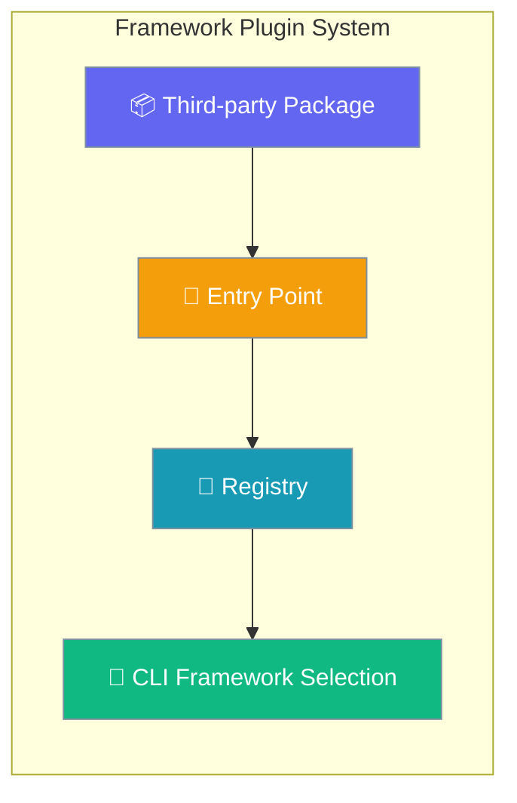
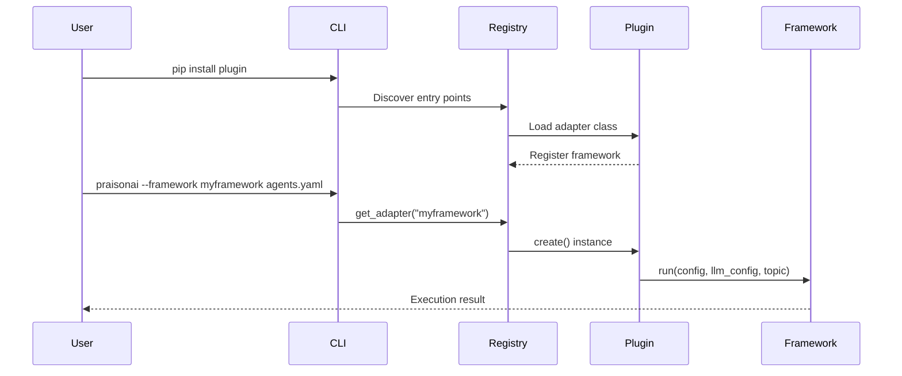

Framework adapter plugins enable third-party developers to add new execution frameworks to PraisonAI without modifying core code.



## Quick Start

<Steps>
<Step title="Programmatic Registration">

Register a framework adapter directly in your code:

```python
from praisonai.framework_adapters.registry import FrameworkAdapterRegistry
from praisonai.framework_adapters.base import BaseFrameworkAdapter

class MyFrameworkAdapter(BaseFrameworkAdapter):
    name = "myframework"
    
    def is_available(self) -> bool:
        try:
            import myframework
            return True
        except ImportError:
            return False
    
    def run(
        self,
        config,
        llm_config,
        topic,
        *,
        tools_dict=None,
        agent_callback=None,
        task_callback=None,
        cli_config=None,
    ):
        # Resolve agent tools from tools_dict
        agent_tool_list = []
        if tools_dict:
            for t in config.get("roles", {}).get("agent_name", {}).get("tools", []):
                if t in tools_dict:
                    agent_tool_list.append(tools_dict[t])

        # Wire callbacks
        # if agent_callback:
        #     agent.step_callback = agent_callback
        # if task_callback:
        #     task.callback = task_callback
        
        # Framework execution logic
        return "Framework execution result"
    
    def cleanup(self) -> None:
        # Optional cleanup
        pass

# Register the adapter
registry = FrameworkAdapterRegistry.get_instance()
registry.register("myframework", MyFrameworkAdapter)
```

</Step>

<Step title="Entry Point Plugin">

Create a pip-installable plugin using `pyproject.toml`:

```toml
# pyproject.toml
[project]
name = "myframework-praisonai"
version = "1.0.0"

[project.entry-points."praisonai.framework_adapters"]
myframework = "myframework_praisonai.adapter:MyFrameworkAdapter"
```

```bash
# Use the framework after installation
pip install myframework-praisonai
praisonai --framework myframework agents.yaml
```

</Step>
</Steps>

---

## How It Works



The framework adapter registry provides a central point for managing framework implementations:

| Operation | Description | When Called |
|-----------|-------------|-------------|
| Discovery | Entry points auto-loaded on first registry access | Import time |
| Registration | Adapters registered by name | Plugin installation |
| Creation | Adapter instances created on demand | CLI framework selection |
| Availability | Framework dependencies checked | Before execution |

---

## Configuration

<Card title="Framework Adapter Registry API" icon="code" href="/docs/sdk/reference/python/modules/framework_adapters.registry">
  Complete API reference for FrameworkAdapterRegistry
</Card>

### Registry Methods

| Method | Parameters | Description |
|--------|------------|-------------|
| `get_instance()` | None | Get singleton registry instance |
| `register(name, adapter_class)` | `name: str`, `adapter_class: Type[FrameworkAdapter]` | Register new adapter |
| `unregister(name)` | `name: str` | Remove adapter by name |
| `create(name)` | `name: str` | Create adapter instance |
| `list_registered()` | None | List all registered adapter names |
| `is_available(name)` | `name: str` | Check if adapter is functional |

### Adapter Protocol

Framework adapters must implement the `FrameworkAdapter` protocol:

| Method | Required | Description |
|--------|----------|-------------|
| `name` | ✅ | Unique framework identifier |
| `is_available()` | ✅ | Check framework dependencies |
| `run(config, llm_config, topic, *, tools_dict, agent_callback, task_callback, cli_config)` | ✅ | Execute framework logic |
| `cleanup()` | ✅ | Clean up resources |

| Parameter | Type | Default | Purpose |
|-----------|------|---------|-------------|
| `config` | `Dict[str, Any]` | - | Framework configuration |
| `llm_config` | `List[Dict]` | - | LLM configuration list |
| `topic` | `str` | - | Topic for the tasks |
| `tools_dict` | `Optional[Dict[str, Any]]` | `None` | Available tools dictionary |
| `agent_callback` | `Optional[Callable]` | `None` | Callback for agent events |
| `task_callback` | `Optional[Callable]` | `None` | Callback for task events |
| `cli_config` | `Optional[Dict[str, Any]]` | `None` | CLI configuration |

<Note>
**Migrating from old signature**: Adapters written for PraisonAI < 1615 (only `run(config, llm_config, topic)`) still work because the new args are keyword-only with defaults. To use tool wiring or callbacks, accept `**kwargs` or the explicit kw-only params.
</Note>

---

## Common Patterns

### Override Built-in Adapter

```python
from praisonai.framework_adapters.registry import FrameworkAdapterRegistry
from praisonai.framework_adapters.base import BaseFrameworkAdapter

class CustomCrewAIAdapter(BaseFrameworkAdapter):
    name = "crewai"
    
    def is_available(self) -> bool:
        try:
            import crewai
            return True
        except ImportError:
            return False
    
    def run(
        self,
        config,
        llm_config,
        topic,
        *,
        tools_dict=None,
        agent_callback=None,
        task_callback=None,
        cli_config=None,
    ):
        # Resolve tools for agents
        if tools_dict:
            for role_config in config.get('roles', {}).values():
                agent_tools = role_config.get('tools', [])
                resolved_tools = [tools_dict[t] for t in agent_tools if t in tools_dict]
                # Wire tools to your framework's agents
        
        # Custom CrewAI execution logic with callbacks
        return "Custom CrewAI result"

# Override built-in CrewAI adapter
registry = FrameworkAdapterRegistry.get_instance()
registry.register("crewai", CustomCrewAIAdapter)
```

### Subprocess Framework Wrapper

```python
import subprocess
from praisonai.framework_adapters.base import BaseFrameworkAdapter

class NonPythonAdapter(BaseFrameworkAdapter):
    name = "external_framework"
    
    def is_available(self) -> bool:
        try:
            subprocess.run(["external_framework", "--version"], 
                         capture_output=True, check=True)
            return True
        except (subprocess.CalledProcessError, FileNotFoundError):
            return False
    
    def run(
        self,
        config,
        llm_config,
        topic,
        *,
        tools_dict=None,
        agent_callback=None,
        task_callback=None,
        cli_config=None,
    ):
        # Convert config to external format
        cmd = ["external_framework", "run", "--topic", topic]
        
        # Pass tools as environment variables or config file
        if tools_dict:
            import json
            import os
            env = os.environ.copy()
            env['FRAMEWORK_TOOLS'] = json.dumps(list(tools_dict.keys()))
            result = subprocess.run(cmd, capture_output=True, text=True, env=env)
        else:
            result = subprocess.run(cmd, capture_output=True, text=True)
            
        return result.stdout
```

### Conditional Dependencies

```python
import logging
from praisonai.framework_adapters.base import BaseFrameworkAdapter

logger = logging.getLogger(__name__)

class OptionalDepsAdapter(BaseFrameworkAdapter):
    name = "advanced_framework"
    
    def is_available(self) -> bool:
        try:
            # Check multiple optional dependencies
            import advanced_framework
            import optional_plugin
            return True
        except ImportError as e:
            logger.debug(f"Framework not available: {e}")
            return False
    
    def run(
        self,
        config,
        llm_config,
        topic,
        *,
        tools_dict=None,
        agent_callback=None,
        task_callback=None,
        cli_config=None,
    ):
        if not self.is_available():
            raise RuntimeError("Framework dependencies not installed")
        
        import advanced_framework
        
        # Pass all parameters to framework
        return advanced_framework.execute(
            config=config,
            llm_config=llm_config,
            topic=topic,
            tools=tools_dict,
            callbacks={'agent': agent_callback, 'task': task_callback},
            cli_options=cli_config
        )
```

---

## Best Practices

<AccordionGroup>

<Accordion title="Handle Missing Dependencies Gracefully">

Always implement defensive `is_available()` checks:

```python
def is_available(self) -> bool:
    try:
        # Check all required dependencies
        import required_framework
        import optional_dependency
        
        # Verify minimum versions if needed
        if hasattr(required_framework, 'version'):
            version = required_framework.version
            if version < (1, 0, 0):
                return False
        
        return True
    except ImportError:
        # Log debug info, don't raise
        logging.getLogger(__name__).debug(
            "Framework dependencies not available"
        )
        return False
```

</Accordion>

<Accordion title="Avoid Import-Time Failures">

Don't import heavy dependencies at module level. Follow three concrete patterns to avoid import-time failures:

```python
# ❌ Bad - imports at module level
import heavy_framework
from expensive.module import Component
# ❌ Bad - environment setup at module level
load_dotenv()
logging.getLogger('framework.cli.config').setLevel(logging.ERROR)

class BadAdapter(BaseFrameworkAdapter):
    pass

# ✅ Good - lazy imports
class GoodAdapter(BaseFrameworkAdapter):
    def run(
        self,
        config,
        llm_config,
        topic,
        *,
        tools_dict=None,
        agent_callback=None,
        task_callback=None,
        cli_config=None,
    ):
        # Import only when needed
        import heavy_framework
        from expensive.module import Component
        
        # Move environment setup here
        self._load_env_once()
        
        # Configure framework-specific logging
        logging.getLogger('framework.cli.config').setLevel(logging.ERROR)
        
        return heavy_framework.run(
            config, llm_config, topic,
            tools=tools_dict,
            callbacks={'agent': agent_callback, 'task': task_callback}
        )
    
    def _load_env_once(self):
        """Load environment variables only when needed."""
        if not hasattr(self, '_env_loaded'):
            from dotenv import load_dotenv
            load_dotenv()
            self._env_loaded = True
```

**Three critical patterns to follow:**

1. **Move `load_dotenv()` from module top to a function called at run/CLI entry** (not at import).
2. **Move framework-specific logger config** (e.g. `logging.getLogger('framework.cli.config').setLevel(logging.ERROR)`) into the adapter's `run()` body, not the wrapper's `__init__.py`.
3. **Use lazy registration via `__getattr__`** instead of calling registration functions at import time.

</Accordion>

<Accordion title="Use Structured Logging">

Log framework events for debugging:

```python
import logging
from praisonai.framework_adapters.base import BaseFrameworkAdapter

class LoggingAdapter(BaseFrameworkAdapter):
    def __init__(self):
        super().__init__()
        self.logger = logging.getLogger(__name__)
    
    def run(
        self,
        config,
        llm_config,
        topic,
        *,
        tools_dict=None,
        agent_callback=None,
        task_callback=None,
        cli_config=None,
    ):
        self.logger.info(f"Starting {self.name} execution for topic: {topic}")
        self.logger.debug(f"Available tools: {list(tools_dict.keys()) if tools_dict else 'None'}")
        try:
            result = self._execute_framework(
                config, llm_config, topic,
                tools_dict=tools_dict,
                agent_callback=agent_callback,
                task_callback=task_callback,
                cli_config=cli_config
            )
            self.logger.info(f"Execution completed successfully")
            return result
        except Exception as e:
            self.logger.error(f"Framework execution failed: {e}")
            raise
```

</Accordion>

<Accordion title="Implement Proper Resource Cleanup">

Always clean up resources in the `cleanup()` method:

```python
class ResourceAwareAdapter(BaseFrameworkAdapter):
    def __init__(self):
        super().__init__()
        self._connections = []
        self._temp_files = []
    
    def run(
        self,
        config,
        llm_config,
        topic,
        *,
        tools_dict=None,
        agent_callback=None,
        task_callback=None,
        cli_config=None,
    ):
        # Create resources during execution
        conn = self._create_connection()
        self._connections.append(conn)
        
        temp_file = self._create_temp_file()
        self._temp_files.append(temp_file)
        
        # Wire tools and callbacks
        if tools_dict:
            self._setup_tools(tools_dict)
        if agent_callback:
            self._setup_agent_callback(agent_callback)
        
        # Use resources...
        return result
    
    def cleanup(self) -> None:
        # Close connections
        for conn in self._connections:
            try:
                conn.close()
            except Exception:
                pass
        
        # Clean up temp files
        for temp_file in self._temp_files:
            try:
                temp_file.unlink()
            except Exception:
                pass
        
        self._connections.clear()
        self._temp_files.clear()
```

</Accordion>

<Accordion title="Be Multi-Agent and Multi-Tenant Safe">

Avoid shared global state mutations at import time that could affect other adapters:

```python
# ❌ Bad - global state mutations at import time
_global_registry = {}
_configure_logging()  # Affects all adapters

class BadAdapter(BaseFrameworkAdapter):
    def __init__(self):
        _global_registry[self.name] = self  # Shared state

# ✅ Good - scoped state management
class GoodAdapter(BaseFrameworkAdapter):
    def __init__(self):
        self._local_state = {}  # Instance-scoped
    
    def run(self, config, llm_config, topic, *, tools_dict=None, **kwargs):
        # Configure only what this adapter needs
        with self._scoped_configuration():
            return self._execute_safely(config, llm_config, topic)
    
    def _scoped_configuration(self):
        """Context manager for adapter-specific configuration."""
        # Temporary, reversible configuration changes
        pass
```

</Accordion>

</AccordionGroup>

---

## Related

<CardGroup cols={2}>
<Card title="Plugin Development" icon="plug" href="/docs/features/plugins">
  Learn about PraisonAI's plugin system for tools and hooks
</Card>
<Card title="CrewAI Integration" icon="users" href="/docs/framework/crewai">
  See how built-in framework adapters are implemented
</Card>
</CardGroup>