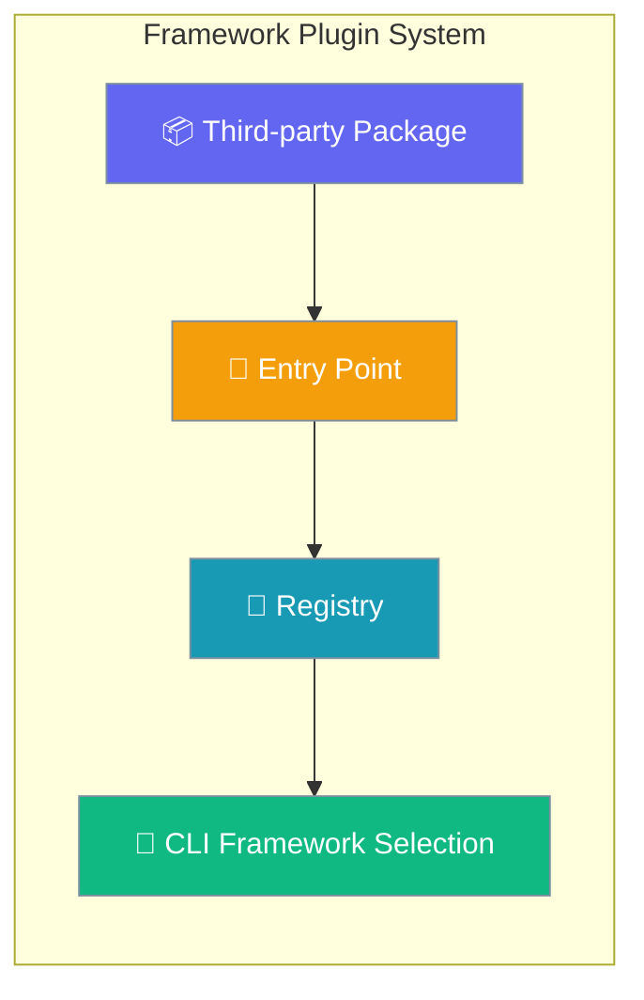
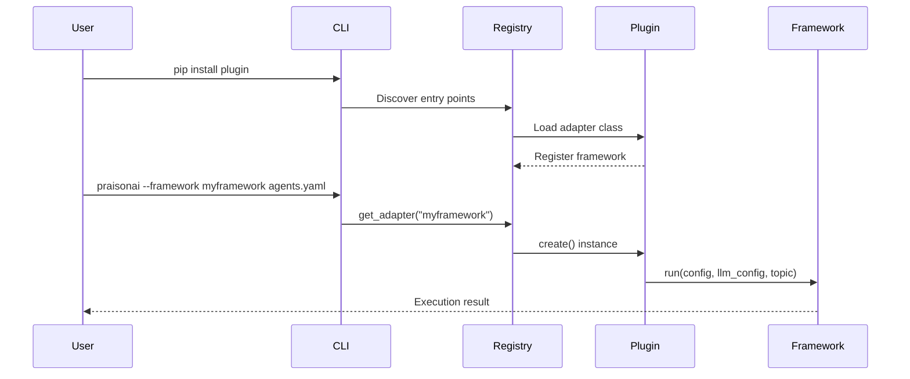
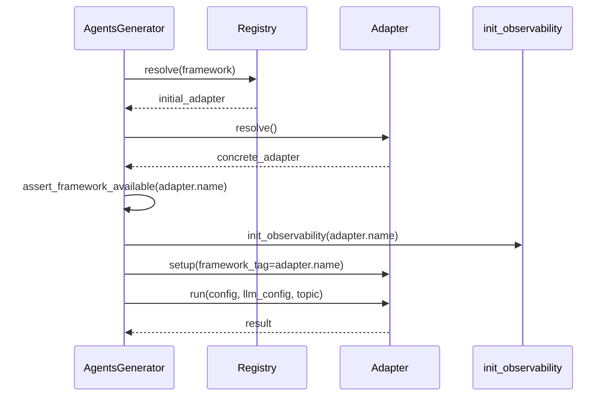

Framework adapter plugins enable third-party developers to add new execution frameworks to PraisonAI without modifying core code.



## Quick Start

<Steps>
<Step title="Programmatic Registration">

Register a framework adapter directly in your code:

```python
from typing import Any, Callable, Dict, List, Optional
from praisonai.framework_adapters.registry import get_default_registry
from praisonai.framework_adapters.base import FrameworkAdapter

class MyFrameworkAdapter:
    name = "myframework"

    def is_available(self) -> bool:
        try:
            import myframework
            return True
        except ImportError:
            return False

    def run(
        self,
        config: Dict[str, Any],
        llm_config: List[Dict],
        topic: str,
        *,
        tools_dict: Optional[Dict[str, Any]] = None,
        agent_callback: Optional[Callable] = None,
        task_callback: Optional[Callable] = None,
        cli_config: Optional[Dict[str, Any]] = None,
    ) -> str:
        # Framework execution logic
        return "Framework execution result"

    def cleanup(self) -> None:
        pass

# Register the adapter (preferred for app code)
registry = get_default_registry()
registry.register("myframework", MyFrameworkAdapter)
```

</Step>

<Step title="Entry Point Plugin">

Create a pip-installable plugin using `pyproject.toml`:

```toml
# pyproject.toml
[project]
name = "myframework-praisonai"
version = "1.0.0"

[project.entry-points."praisonai.framework_adapters"]
myframework = "myframework_praisonai.adapter:MyFrameworkAdapter"
```

```bash
# Use the framework after installation
pip install myframework-praisonai
praisonai --framework myframework agents.yaml
```

</Step>
</Steps>

---

## How It Works



The framework adapter registry provides a central point for managing framework implementations:

| Operation | Description | When Called |
|-----------|-------------|-------------|
| Discovery | Entry points auto-loaded on first registry access | Import time |
| Registration | Adapters registered by name | Plugin installation |
| Creation | Adapter instances created on demand | CLI framework selection |
| Availability | Framework dependencies checked | Before execution |

---

## Configuration

<Card title="Framework Adapter Registry API" icon="code" href="/docs/sdk/reference/python/modules/framework_adapters.registry">
  Complete API reference for FrameworkAdapterRegistry
</Card>

### Registry Methods

| Method | Parameters | Description |
|--------|------------|-------------|
| `get_default_registry()` | None | Module-level factory; lazy creates a single process-wide registry |
| `register(name, cls)` | `name: str`, `cls: Type[FrameworkAdapter]` | Register adapter at runtime |
| `unregister(name)` | `name: str` → `bool` | Remove adapter; returns `True` if found |
| `resolve(name)` | `name: str` → `Type` | Get adapter class; raises `ValueError` if missing |
| `create(name, *args, **kwargs)` | varies | Create an adapter instance; validates the `run()` signature (PR #2083) and raises `TypeError` if the four protocol kwargs are missing |
| `list_names()` | None → `list[str]` | Sorted list of registered names |
| `list_registered()` | None → `list[str]` | **Backward-compat alias** of `list_names()` |
| `is_available(name)` | `name: str` → `bool` | Check adapter is registered AND its `is_available()` returns `True` |

### Adapter Protocol

Framework adapters must implement the `FrameworkAdapter` protocol:

| Method | Required | Description |
|--------|----------|-------------|
| `name` | ✅ | Unique framework identifier |
| `is_available()` | ✅ | Check framework dependencies |
| `resolve()` | ❌ | Pick the concrete adapter variant (default returns `self`) |
| `setup(*, framework_tag)` | ❌ | Framework-specific pre-run hooks (default no-op) |
| `run(config, llm_config, topic, *, tools_dict, agent_callback, task_callback, cli_config)` | ✅ | Execute framework logic (all four trailing kwargs are validated at registration time — see Troubleshooting) |
| `cleanup()` | ✅ | Clean up resources |

### Protocol Validation (PR #2083)

Since PR #2083, `FrameworkAdapterRegistry.create()` validates every adapter at construction time. If the `run()` method does not accept the four keyword-only parameters `tools_dict`, `agent_callback`, `task_callback`, and `cli_config`, instantiation fails with:

```
TypeError: FrameworkAdapter '<name>' does not implement the protocol:
missing keyword-only parameters ['agent_callback', 'cli_config', 'task_callback', 'tools_dict']
```

Adapters that fail validation also report `registry.is_available("<name>") == False` instead of raising — so a broken plugin will simply disappear from the available-framework list rather than crashing the CLI.

**Single authoritative `arun()` (PR #1857):** The Protocol declares `arun()` once; `BaseFrameworkAdapter` provides a single default that offloads `run()` to a worker thread via `asyncio.to_thread`. Sync-only adapters (crewai, autogen v0.2) inherit this and need do nothing. Native-async adapters override `arun()`. Earlier revisions of the codebase declared `arun()` twice on both the Protocol and the base class; those duplicate declarations have been removed and there is now exactly one default to override.

### Optional Adapter Hooks

After the existing "Adapter protocol" section, two new optional methods were added in PR #1763:

**`resolve()`** — pick a concrete variant.

```python
def resolve(self) -> "FrameworkAdapter":
    """Pick the concrete adapter variant.
    
    Default implementation returns self. Override if your adapter is a
    'family' (e.g. multiple SDK versions) and you want to pick at runtime.
    """
    return self
```

**`setup(*, framework_tag)`** — pre-run hook.

```python
def setup(self, *, framework_tag: str) -> None:
    """Framework-specific pre-run hooks (SDK init, etc.).
    
    Default implementation is a no-op. Use this for one-time per-run setup
    that depends on the resolved framework name (logging context, SDK init).
    Note: observability init is handled centrally by init_observability(),
    you don't need to call agentops.init() here.
    """
    pass
```

### Orchestrator Pipeline (Post-#1763)

The orchestrator (`AgentsGenerator.generate_crew_and_kickoff`) now follows this sequence:



---

## Common Patterns

### Override Built-in Adapter

```python
from typing import Any, Callable, Dict, List, Optional
from praisonai.framework_adapters.registry import get_default_registry
from praisonai.framework_adapters.base import FrameworkAdapter

class CustomCrewAIAdapter:
    name = "crewai"

    def is_available(self) -> bool:
        try:
            import crewai
            return True
        except ImportError:
            return False

    def run(
        self,
        config: Dict[str, Any],
        llm_config: List[Dict],
        topic: str,
        *,
        tools_dict: Optional[Dict[str, Any]] = None,
        agent_callback: Optional[Callable] = None,
        task_callback: Optional[Callable] = None,
        cli_config: Optional[Dict[str, Any]] = None,
    ) -> str:
        # Custom CrewAI execution logic
        return "Custom CrewAI result"

    def cleanup(self) -> None:
        pass

# Override built-in CrewAI adapter
registry = get_default_registry()
registry.register("crewai", CustomCrewAIAdapter)
```

### Subprocess Framework Wrapper

```python
import subprocess
from typing import Any, Callable, Dict, List, Optional
from praisonai.framework_adapters.base import BaseFrameworkAdapter

class NonPythonAdapter(BaseFrameworkAdapter):
    name = "external_framework"

    def is_available(self) -> bool:
        try:
            subprocess.run(["external_framework", "--version"],
                         capture_output=True, check=True)
            return True
        except (subprocess.CalledProcessError, FileNotFoundError):
            return False

    def run(
        self,
        config: Dict[str, Any],
        llm_config: List[Dict],
        topic: str,
        *,
        tools_dict: Optional[Dict[str, Any]] = None,
        agent_callback: Optional[Callable] = None,
        task_callback: Optional[Callable] = None,
        cli_config: Optional[Dict[str, Any]] = None,
    ) -> str:
        # Convert config to external format
        cmd = ["external_framework", "run", "--topic", topic]
        result = subprocess.run(cmd, capture_output=True, text=True)
        return result.stdout
```

### Conditional Dependencies

```python
import logging
from typing import Any, Callable, Dict, List, Optional
from praisonai.framework_adapters.base import BaseFrameworkAdapter

logger = logging.getLogger(__name__)

class OptionalDepsAdapter(BaseFrameworkAdapter):
    name = "advanced_framework"

    def is_available(self) -> bool:
        try:
            # Check multiple optional dependencies
            import advanced_framework
            import optional_plugin
            return True
        except ImportError as e:
            logger.debug(f"Framework not available: {e}")
            return False

    def run(
        self,
        config: Dict[str, Any],
        llm_config: List[Dict],
        topic: str,
        *,
        tools_dict: Optional[Dict[str, Any]] = None,
        agent_callback: Optional[Callable] = None,
        task_callback: Optional[Callable] = None,
        cli_config: Optional[Dict[str, Any]] = None,
    ) -> str:
        if not self.is_available():
            raise RuntimeError("Framework dependencies not installed")

        import advanced_framework
        return advanced_framework.execute(config, llm_config, topic)
```


---

## Best Practices

<AccordionGroup>

<Accordion title="Handle Missing Dependencies Gracefully">

Always implement defensive `is_available()` checks:

```python
def is_available(self) -> bool:
    try:
        # Check all required dependencies
        import required_framework
        import optional_dependency
        
        # Verify minimum versions if needed
        if hasattr(required_framework, 'version'):
            version = required_framework.version
            if version < (1, 0, 0):
                return False
        
        return True
    except ImportError:
        # Log debug info, don't raise
        logging.getLogger(__name__).debug(
            "Framework dependencies not available"
        )
        return False
```

</Accordion>

<Accordion title="Avoid Import-Time Failures">

Don't import heavy dependencies at module level:

```python
# ❌ Bad - imports at module level
import heavy_framework
from expensive.module import Component

class BadAdapter(BaseFrameworkAdapter):
    pass

# ✅ Good - lazy imports
class GoodAdapter(BaseFrameworkAdapter):
    def run(self, config, llm_config, topic):
        # Import only when needed
        import heavy_framework
        from expensive.module import Component
        return heavy_framework.run(config)
```

</Accordion>

<Accordion title="Use Structured Logging">

Log framework events for debugging:

```python
import logging
from praisonai.framework_adapters.base import BaseFrameworkAdapter

class LoggingAdapter(BaseFrameworkAdapter):
    def __init__(self):
        super().__init__()
        self.logger = logging.getLogger(__name__)
    
    def run(self, config, llm_config, topic):
        self.logger.info(f"Starting {self.name} execution for topic: {topic}")
        try:
            result = self._execute_framework(config, llm_config, topic)
            self.logger.info(f"Execution completed successfully")
            return result
        except Exception as e:
            self.logger.error(f"Framework execution failed: {e}")
            raise
```

</Accordion>

<Accordion title="Implement Proper Resource Cleanup">

Always clean up resources in the `cleanup()` method:

```python
class ResourceAwareAdapter(BaseFrameworkAdapter):
    def __init__(self):
        super().__init__()
        self._connections = []
        self._temp_files = []
    
    def run(self, config, llm_config, topic):
        # Create resources during execution
        conn = self._create_connection()
        self._connections.append(conn)
        
        temp_file = self._create_temp_file()
        self._temp_files.append(temp_file)
        
        # Use resources...
        return result
    
    def cleanup(self) -> None:
        # Close connections
        for conn in self._connections:
            try:
                conn.close()
            except Exception:
                pass
        
        # Clean up temp files
        for temp_file in self._temp_files:
            try:
                temp_file.unlink()
            except Exception:
                pass
        
        self._connections.clear()
        self._temp_files.clear()
```

</Accordion>

<Accordion title="Don't import heavy deps inside is_available">

Use cached availability checks to avoid multi-second imports on every probe:

```python
from praisonai._framework_availability import is_available as check_availability

def is_available(self) -> bool:
    return check_availability("myframework")  # cached, uses importlib.util.find_spec
```

The `is_available()` method is called on every CLI startup and framework probe. Full imports here cause multi-second delays. The centralized availability check uses cached `importlib.util.find_spec` for fast, repeated checks.

</Accordion>

</AccordionGroup>

---

## Inject Your Own Registry (Multi-tenant / Tests)

<Note>
If you don't pass `adapter_registry`, you get the process-default registry shared by all callers in the same Python process. Use a custom registry for tenant isolation, sandboxed tests, or registering one-off adapters that should not leak across runs.
</Note>

The new `adapter_registry=` kwarg on `AgentsGenerator` and `AutoGenerator` enables dependency injection for multi-tenant applications and testing:

```python
from praisonai.framework_adapters.registry import FrameworkAdapterRegistry
from praisonai.agents_generator import AgentsGenerator

# Tenant-isolated registry — NOT shared with other tenants in the same process
tenant_registry = FrameworkAdapterRegistry()
tenant_registry.register("crewai", CustomCrewAIAdapter)

generator = AgentsGenerator(
    agent_file="agents.yaml",
    framework="crewai",
    config_list=[...],
    adapter_registry=tenant_registry,  # <-- new in #1639
)
```

For `AutoGenerator`:

```python
from praisonai.framework_adapters.registry import FrameworkAdapterRegistry
from praisonai.auto import AutoGenerator

reg = FrameworkAdapterRegistry()
auto = AutoGenerator(
    topic="...",
    agent_file="test.yaml",
    framework="crewai",
    config_list=[...],
    adapter_registry=reg,
)
```

---

## Troubleshooting

<AccordionGroup>
<Accordion title="TypeError: missing keyword-only parameters ['agent_callback', 'cli_config', 'task_callback', 'tools_dict']">

Your adapter's `run()` method is missing the four keyword-only parameters required by the `FrameworkAdapter` protocol. As of [PR #2083](https://github.com/MervinPraison/PraisonAI/pull/2083), `FrameworkAdapterRegistry.create()` validates these at adapter construction time.

Update your `run()` signature to:

```python
def run(
    self,
    config,
    llm_config,
    topic,
    *,
    tools_dict=None,
    agent_callback=None,
    task_callback=None,
    cli_config=None,
):
    ...
```

Your code can still ignore the values — the signature just needs to accept them. The four parameters can be either `KEYWORD_ONLY` (after `*`) or `POSITIONAL_OR_KEYWORD`; either form passes validation.

</Accordion>

<Accordion title="My adapter disappeared from the available frameworks list">

If `praisonai --list-frameworks` (or `registry.list_names()`) no longer shows your adapter, run `registry.is_available("<your-adapter-name>")`. Since PR #2083, `is_available()` catches `TypeError` from the new protocol validator and returns `False` rather than raising — so a malformed plugin is silently filtered out of the available list. Check the application logs for the `TypeError` message above and fix the `run()` signature.

</Accordion>
</AccordionGroup>

---

## Related

<CardGroup cols={2}>
<Card title="Registry Dependency Injection" icon="puzzle-piece" href="/docs/features/registry-dependency-injection">
  Learn about injecting custom registries for multi-tenant isolation
</Card>
<Card title="CrewAI Integration" icon="users" href="/docs/framework/crewai">
  See how built-in framework adapters are implemented
</Card>
</CardGroup>