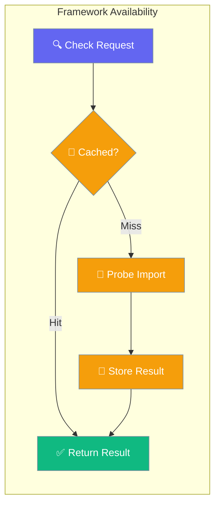

`praisonai._framework_availability` is the single, thread-safe, cached way to check whether an optional PraisonAI dependency is importable.



## API Reference

| Function | Signature | Behavior |
|----------|-----------|----------|
| `is_available(name: str) -> bool` | Raises `ValueError` on unknown name | Cached on first call (double-checked-locking under `threading.Lock`) |
| `invalidate(name: str | None = None) -> None` | Pass `None` to clear the whole cache | Useful in tests that monkey-patch `importlib` |

## Quick Start


<Steps>
<Step title="Quick Start">
```python
from praisonai._framework_availability import is_available

# Check if CrewAI is available
if is_available("crewai"):
    print("CrewAI is installed and importable")

# Check AG2 (special detection logic)
if is_available("ag2"):
    print("AG2 is available (both distribution and namespace)")

# Check multiple frameworks
frameworks = ["autogen", "autogen_v4", "crewai", "ag2"]
available = [fw for fw in frameworks if is_available(fw)]
print(f"Available frameworks: {available}")
```

---
</Step>
</Steps>


## Best Practices

<AccordionGroup>
  <Accordion title="Start simple">
    Enable the feature with a single parameter before adding configuration. Verify it works, then layer in options.
  </Accordion>
  <Accordion title="Use environment variables for secrets">
    Never hardcode API keys or tokens. Use `os.getenv("KEY_NAME")` to read from environment variables.
  </Accordion>
  <Accordion title="Test with minimal examples first">
    Copy the Quick Start example, run it, then extend it. This confirms your environment is set up correctly.
  </Accordion>
  <Accordion title="Check the logs">
    Set `verbose=True` on your agent to see detailed execution logs when debugging unexpected behavior.
  </Accordion>
</AccordionGroup>

## Related

<CardGroup cols={2}>
  <Card title="Features Overview" icon="grid-2" href="/docs/features">
    Browse all PraisonAI features
  </Card>
  <Card title="Quick Start" icon="rocket" href="/docs/introduction">
    Get started with PraisonAI agents
  </Card>
</CardGroup>
