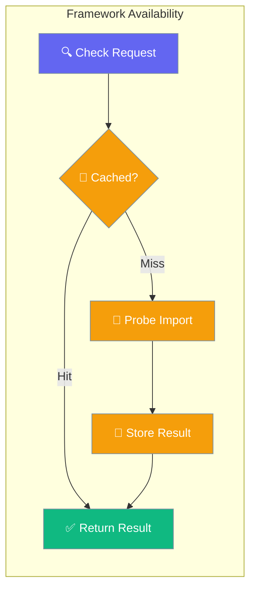

Check whether optional frameworks and dependencies are installed before you run agents or YAML workflows.

```python
from praisonai import PraisonAI

# PraisonAI picks the first available framework automatically
praison = PraisonAI(agent_file="agents.yaml")
praison.run()
```



## Quick Start

<Steps>
<Step title="Run YAML — framework auto-detected">

```python
from praisonai import PraisonAI

praison = PraisonAI(agent_file="agents.yaml")
praison.run()  # uses first available framework (crewai → praisonai → autogen → ag2)
```

</Step>

<Step title="Probe before selecting a framework">

```python
from praisonai._framework_availability import is_available

if is_available("crewai"):
    print("CrewAI is installed")

frameworks = ["autogen", "autogen_v4", "crewai", "ag2"]
available = [fw for fw in frameworks if is_available(fw)]
print(f"Available: {available}")
```

</Step>
</Steps>

---

## API Reference

| Function | Signature | Behaviour |
|----------|-----------|-----------|
| `is_available(name: str) -> bool` | Raises `ValueError` on unknown name | Cached on first call (double-checked locking under `threading.Lock`) |
| `invalidate(name: str \| None = None) -> None` | Pass `None` to clear the whole cache | Useful in tests that monkey-patch `importlib` |

---

## Known Probe Names

The following framework names are supported:

| Name | Detection Method | Notes |
|------|------------------|-------|
| `crewai` | `importlib.util.find_spec("crewai")` | Standard probe |
| `autogen` | `importlib.util.find_spec("autogen")` | AutoGen v0.2 package |
| `autogen_v4` | `find_spec("autogen_agentchat")` + `find_spec("autogen_ext")` | AutoGen v0.4 packages |
| `ag2` | Distribution + namespace check | See AG2 Detection below |
| `praisonaiagents` | `import praisonaiagents` | PraisonAI agents framework |
| `praisonai_tools` | `import praisonai_tools` | PraisonAI tools package |
| `agentops` | `import agentops` | AgentOps observability |
| `litellm` | `import litellm` | LiteLLM package |
| `openai` | `import openai` | OpenAI Python client |
| `chromadb` | `importlib.util.find_spec("chromadb")` | Vector store backend; used by `ChromaVectorStore` |
| `pinecone` | `importlib.util.find_spec("pinecone")` | Vector store backend; used by `PineconeVectorStore` |
| `qdrant_client` | `importlib.util.find_spec("qdrant_client")` | Vector store backend |
| `weaviate` | `importlib.util.find_spec("weaviate")` | Vector store backend |

Vector store backends use the same centralized probe registry — `praisonai.adapters.vector_stores` calls `is_available("chromadb")` / `is_available("pinecone")` rather than maintaining its own `_check_*` helpers.

<Note>
`autogen_v2` is an **adapter name** registered in `FrameworkAdapterRegistry`, not a probe name in `_framework_availability`. The probe name remains `autogen` (it imports the `autogen` v0.2 package). Use the adapter's `.is_available()` method to test whether a specific adapter will dispatch successfully — it folds in the `implemented` marker.
</Note>

<Note>
`autogen_v4` and `ag2` are **not in the built-in adapter registry** by default. `praisonai doctor` and `praisonai --framework` only list them when registered via an entry-point plugin. Raw package installation alone (e.g. `pip install autogen-agentchat`) does not cause them to appear.
</Note>

---

## Adapter Availability vs Framework Availability

Two distinct concepts affect whether an AutoGen-family adapter will actually work:

| Question | API |
|---|---|
| "Is the underlying package importable?" | `is_available("autogen")` from `_framework_availability` |
| "Will calling `adapter.run(...)` actually work?" | `AutoGenV4Adapter().is_available()` (folds `implemented` flag) |
| "Is the adapter registered AND available?" | `registry.is_available("autogen_v4")` |

For AutoGen v0.4 and AG2 today: the package may import successfully, but the adapter still reports `False` because `implemented = False`. This is the safety-by-default behaviour added in PR #2086.

`praisonai doctor` and `--framework` choices now use `registry.is_available(name)` — not raw package probes — for `autogen_v4` and `ag2`. This means installing `autogen-agentchat` alone will **not** flip them to available unless the adapter is also registered. Since `autogen_v4` and `ag2` adapters are unregistered stubs by default (excluded from `_BUILTIN_ADAPTERS`), they only appear in `doctor` and `--framework` when registered via an entry-point plugin.

```python
from praisonai._framework_availability import is_available
from praisonai.framework_adapters.registry import get_default_registry

registry = get_default_registry()

# Package-level check: is the v0.4 package installed?
pkg_available = is_available("autogen_v4")  # True if autogen-agentchat is installed

# Adapter-level check: will dispatch actually work?
from praisonai.framework_adapters.autogen_adapter import AutoGenV4Adapter
adapter_available = AutoGenV4Adapter().is_available()  # False — implemented = False

# Registry-level check: what doctor and --framework choices use
registry_available = registry.is_available("autogen_v4")  # False — not in builtin registry

# pkg_available may be True while adapter_available and registry_available are False
# Always use registry.is_available() to test whether --framework will list an adapter
```

---

## AG2 Detection Quirk

AG2 ships under the `autogen` namespace, so `is_available("ag2")` checks **both**:

1. `importlib.metadata.distribution('ag2')` - Ensures AG2 distribution is installed
2. `importlib.util.find_spec("autogen")` - Ensures `autogen` namespace is importable

This prevents false positives when only the legacy AutoGen package is installed.

```python
from praisonai._framework_availability import is_available

# This checks both AG2 distribution AND autogen namespace
if is_available("ag2"):
    print("AG2 is properly installed and autogen namespace is available")
```

---

## Cache Management

Results are cached indefinitely until explicitly invalidated:

```python
from praisonai._framework_availability import is_available, invalidate

# First call - performs actual import check
result1 = is_available("crewai")  # Slow: actual import

# Subsequent calls - returns cached result
result2 = is_available("crewai")  # Fast: cached

# Invalidate specific framework
invalidate("crewai")
result3 = is_available("crewai")  # Slow: re-checks import

# Invalidate entire cache
invalidate()  # Clear all cached results
```

---

## Thread Safety

The availability checker uses double-checked locking under `threading.Lock` for thread-safe caching:

```python
import threading
from praisonai._framework_availability import is_available

def worker():
    # Safe to call from multiple threads
    return is_available("crewai")

threads = [threading.Thread(target=worker) for _ in range(10)]
for t in threads:
    t.start()
for t in threads:
    t.join()
```

---

## Custom Adapter Usage

Plugin authors can use `_framework_availability` for their `is_available()` implementations:

```python
from praisonai._framework_availability import is_available
from praisonai.framework_adapters.base import BaseFrameworkAdapter

class MyAdapter(BaseFrameworkAdapter):
    name = "myframework"
    
    def is_available(self) -> bool:
        return is_available("myframework")  # Uses centralized detection
```

<Warning>
Third-party adapters cannot extend the known probe names at runtime. The `_PROBES` dict is module-level and not extensible via public API.
</Warning>

---

## Testing Support

Use `invalidate()` in tests that mock `importlib`:

```python
import unittest.mock
from praisonai._framework_availability import is_available, invalidate

def test_framework_detection():
    # Clear any cached results
    invalidate()
    
    with unittest.mock.patch('importlib.util.find_spec', return_value=None):
        assert not is_available("crewai")
    
    # Clear cache again for clean test state
    invalidate()
```

---

## Backward-compat constants on `praisonai.agents_generator`

Six module-level constants are available for backward compatibility and can be imported directly from `praisonai.agents_generator`.

```python
from praisonai.agents_generator import CREWAI_AVAILABLE, AUTOGEN_AVAILABLE
```

| Constant | Equivalent to |
|----------|----------------|
| `PRAISONAI_TOOLS_AVAILABLE` | `is_available("praisonai_tools")` |
| `CREWAI_AVAILABLE` | `is_available("crewai")` |
| `AUTOGEN_AVAILABLE` | `is_available("autogen")` |
| `AG2_AVAILABLE` | `is_available("ag2")` |
| `PRAISONAI_AVAILABLE` | `is_available("praisonaiagents")` |
| `AGENTOPS_AVAILABLE` | `is_available("agentops")` |

For new code, use `is_available("crewai")` directly rather than importing these constants.

---

## Best Practices

<AccordionGroup>
<Accordion title="Prefer adapter.is_available() for dispatch decisions">
Package probes (`is_available("autogen_v4")`) only confirm importability. Use `AutoGenV4Adapter().is_available()` when you need to know whether execution will actually succeed.
</Accordion>

<Accordion title="Use invalidate() in tests that mock importlib">
Cached results persist for the process lifetime. Call `invalidate()` before and after monkey-patching `importlib` so probes re-run cleanly.
</Accordion>

<Accordion title="Avoid heavy imports inside is_available()">
Custom adapters should delegate to `is_available()` rather than importing large packages on every CLI startup probe.
</Accordion>

<Accordion title="Use pick_default() instead of manual priority lists">
For default framework selection, call `FrameworkAdapterRegistry.pick_default()` rather than hard-coding probe tuples.
</Accordion>
</AccordionGroup>

---

## Related

<CardGroup cols={2}>
  <Card title="Framework Adapter Plugins" icon="plug" href="/docs/features/framework-adapter-plugins">
    Creating custom framework adapters
  </Card>
  <Card title="AutoGen Framework" icon="robot" href="/docs/framework/autogen">
    AutoGen framework integration
  </Card>
</CardGroup>