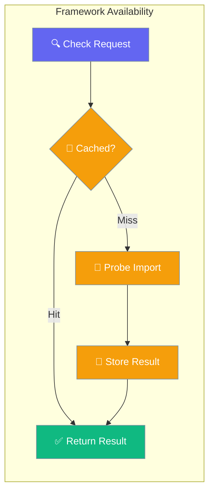

`praisonai._framework_availability` is the single, thread-safe, cached way to check whether an optional PraisonAI dependency is importable.



## API Reference

| Function | Signature | Behavior |
|----------|-----------|----------|
| `is_available(name: str) -> bool` | Raises `ValueError` on unknown name | Cached on first call (double-checked-locking under `threading.Lock`) |
| `invalidate(name: str | None = None) -> None` | Pass `None` to clear the whole cache | Useful in tests that monkey-patch `importlib` |

## Quick Start

```python
from praisonai._framework_availability import is_available

# Check if CrewAI is available
if is_available("crewai"):
    print("CrewAI is installed and importable")

# Check AG2 (special detection logic)
if is_available("ag2"):
    print("AG2 is available (both distribution and namespace)")

# Check multiple frameworks
frameworks = ["autogen", "autogen_v4", "crewai", "ag2"]
available = [fw for fw in frameworks if is_available(fw)]
print(f"Available frameworks: {available}")
```

---

## Known Probe Names

The following framework names are supported:

| Name | Detection Method | Notes |
|------|------------------|-------|
| `crewai` | `import crewai` | Standard import check |
| `autogen` | `import autogen` | AutoGen v0.2 package |
| `autogen_v4` | `from autogen_agentchat.agents import AssistantAgent` | AutoGen v0.4 packages |
| `ag2` | Distribution + namespace check | See AG2 Detection below |
| `praisonaiagents` | `import praisonaiagents` | PraisonAI agents framework |
| `praisonai_tools` | `import praisonai_tools` | PraisonAI tools package |
| `agentops` | `import agentops` | AgentOps observability |
| `litellm` | `import litellm` | LiteLLM package |
| `openai` | `import openai` | OpenAI Python client |

---

## AG2 Detection Quirk

AG2 ships under the `autogen` namespace, so `is_available("ag2")` checks **both**:

1. `importlib.metadata.distribution('ag2')` - Ensures AG2 distribution is installed
2. `importlib.util.find_spec("autogen")` - Ensures `autogen` namespace is importable

This prevents false positives when only the legacy AutoGen package is installed.

```python
from praisonai._framework_availability import is_available

# This checks both AG2 distribution AND autogen namespace
if is_available("ag2"):
    print("AG2 is properly installed and autogen namespace is available")
```

---

## Cache Management

Results are cached indefinitely until explicitly invalidated:

```python
from praisonai._framework_availability import is_available, invalidate

# First call - performs actual import check
result1 = is_available("crewai")  # Slow: actual import

# Subsequent calls - returns cached result
result2 = is_available("crewai")  # Fast: cached

# Invalidate specific framework
invalidate("crewai")
result3 = is_available("crewai")  # Slow: re-checks import

# Invalidate entire cache
invalidate()  # Clear all cached results
```

---

## Thread Safety

The availability checker uses double-checked locking under `threading.Lock` for thread-safe caching:

```python
import threading
from praisonai._framework_availability import is_available

def worker():
    # Safe to call from multiple threads
    return is_available("crewai")

threads = [threading.Thread(target=worker) for _ in range(10)]
for t in threads:
    t.start()
for t in threads:
    t.join()
```

---

## Custom Adapter Usage

Plugin authors can use `_framework_availability` for their `is_available()` implementations:

```python
from praisonai._framework_availability import is_available
from praisonai.framework_adapters.base import BaseFrameworkAdapter

class MyAdapter(BaseFrameworkAdapter):
    name = "myframework"
    
    def is_available(self) -> bool:
        return is_available("myframework")  # Uses centralized detection
```

<Warning>
Third-party adapters cannot extend the known probe names at runtime. The `_PROBES` dict is module-level and not extensible via public API.
</Warning>

---

## Testing Support

Use `invalidate()` in tests that mock `importlib`:

```python
import unittest.mock
from praisonai._framework_availability import is_available, invalidate

def test_framework_detection():
    # Clear any cached results
    invalidate()
    
    with unittest.mock.patch('importlib.util.find_spec', return_value=None):
        assert not is_available("crewai")
    
    # Clear cache again for clean test state
    invalidate()
```

---

## Related

<CardGroup cols={2}>
  <Card title="Framework Adapter Plugins" icon="plug" href="/features/framework-adapter-plugins">
    Creating custom framework adapters
  </Card>
  <Card title="AutoGen Framework" icon="robot" href="/framework/autogen">
    AutoGen framework integration
  </Card>
</CardGroup>