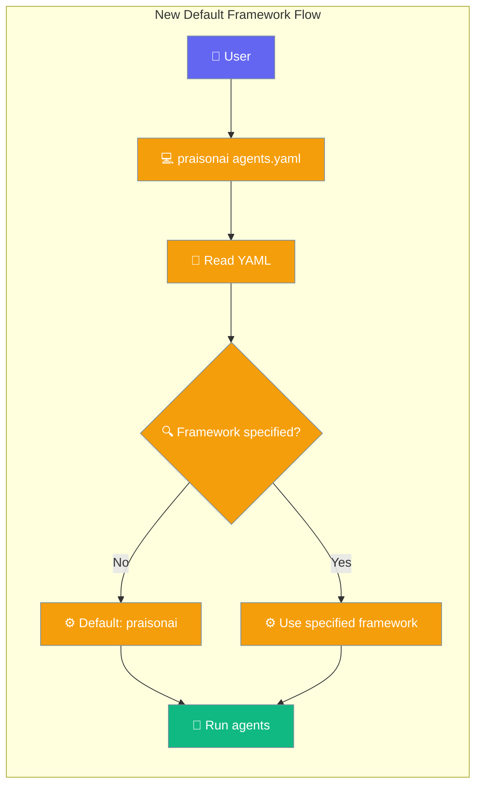
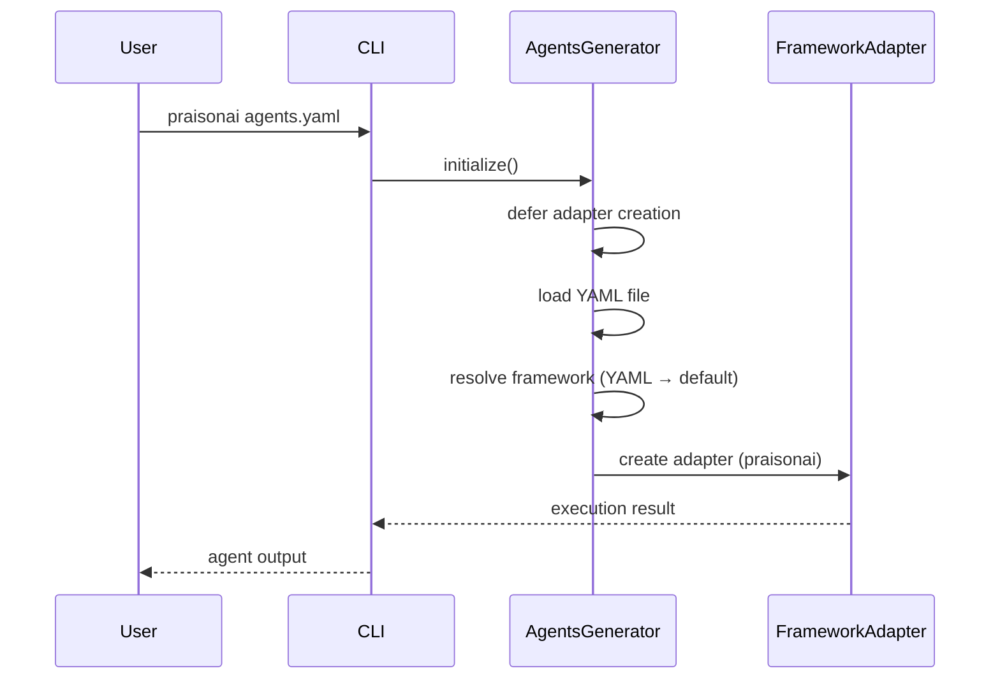

```python
from praisonaiagents import Agent

agent = Agent(name="default-agent", instructions="Use the default agent framework.")
agent.start("What is the current default framework for this agent?")
```


The default framework changed from `crewai` to `praisonai` when running YAML files without specifying an explicit framework.

```python
from praisonai import PraisonAI

# No framework= argument — uses 'praisonai' by default
praison = PraisonAI(agent_file="agents.yaml")
result = praison.run()
```

The user runs a YAML file without `framework:`; agents execute on the `praisonai` adapter by default.



## Quick Start

<Steps>
<Step title="Before (v0.x)">
Running `praisonai agents.yaml` would fail with error:
```
ValueError: Unknown praisonai.framework_adapters plugin: ''.
Available: ['ag2', 'autogen', 'autogen_v4', 'crewai', 'praisonai']
```
</Step>

<Step title="After (v1.0.0+)">
Running `praisonai agents.yaml` works out of the box using the `praisonai` framework:
```bash
praisonai agents.yaml  # ✅ Uses praisonai framework by default
```
</Step>
</Steps>

---

## Agent-Centric Example

```python
from praisonai import PraisonAI

# No framework= argument — uses 'praisonai' by default
praison = PraisonAI(agent_file="agents.yaml")
result = praison.run()
```

Equivalent CLI command:
```bash
praisonai agents.yaml
```

Both produce the same result with no `--framework` flag required.

---

## Framework Precedence

PraisonAI resolves the framework in this order:

| Priority | Source | Example |
|----------|--------|---------|
| 1 | CLI flag | `--framework crewai` |
| 2 | YAML key | `framework: crewai` |
| 3 | Default | `praisonai` |

The set of valid framework names is discovered dynamically from the adapter registry — see [Framework Adapter Plugins](/docs/features/framework-adapter-plugins#auto-discovery-in-the-cli).

---

## How to Keep CrewAI as Default

If you want to continue using CrewAI as your default framework, you have two options:

### Option 1: YAML Configuration
```yaml
framework: crewai
topic: Your task description
roles:
  # Your agents here
```

### Option 2: CLI Flag
```bash
praisonai --framework crewai agents.yaml
```

---

## User Interaction Flow



---

## Best Practices

<AccordionGroup>
<Accordion title="Pin framework in YAML for team consistency">
Add `framework: crewai` (or your preferred adapter) to shared YAML so every teammate gets the same runtime without passing CLI flags.
</Accordion>

<Accordion title="Use --framework for one-off overrides">
Keep YAML portable and pass `--framework crewai` only when experimenting with a different adapter.
</Accordion>

<Accordion title="Verify availability before CI runs">
Run `praisonai --list-frameworks` in CI to confirm the expected adapter is installed before kicking off agent workflows.
</Accordion>

<Accordion title="Migrate gradually with explicit framework keys">
During upgrades, set `framework: praisonai` explicitly in YAML so behaviour stays predictable even if defaults change again.
</Accordion>
</AccordionGroup>

---

## Related

<CardGroup cols={2}>
  <Card title="CrewAI Framework" icon="users" href="/docs/framework/crewai">
    CrewAI framework integration guide
  </Card>
  <Card title="PraisonAI Agents" icon="users-gear" href="/docs/framework/praisonaiagents">
    PraisonAI native agents framework
  </Card>
</CardGroup>