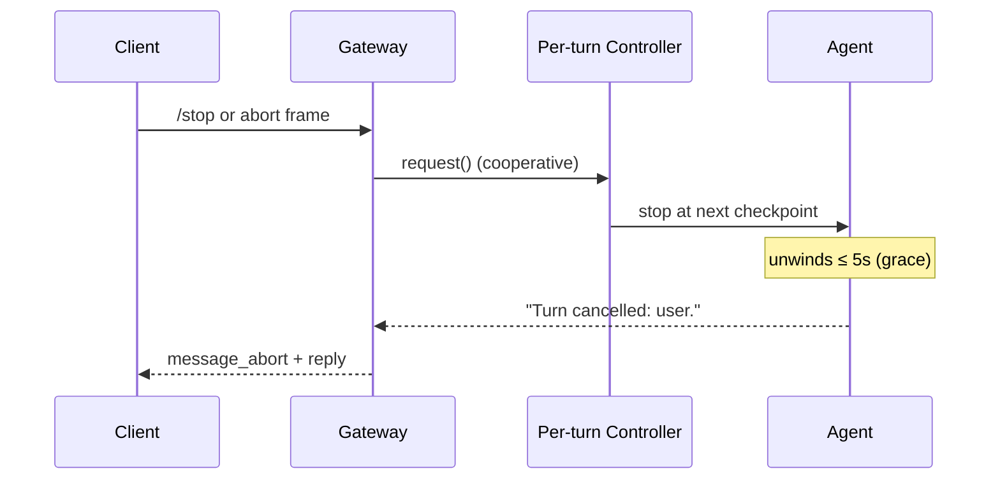

Stop a hung or runaway gateway turn cooperatively using `/stop`, an `abort` WebSocket frame, or a configurable per-turn timeout — all driven by the same `InterruptController` primitive the CLI uses for Ctrl-C.

<Note>
Available since [PraisonAI#3472](https://github.com/MervinPraison/PraisonAI/pull/3472). The gateway advertises `abort` in the `hello_ok` capability handshake, accepts `abort` / `message_abort` WebSocket frames, honours `/stop` (or `stop`) in chat, and enforces a configurable per-turn timeout via `gateway.per_turn_timeout`.
</Note>

```python
from praisonaiagents import Agent

agent = Agent(name="gateway-agent", instructions="Answer questions.")
```

The gateway relays a `message_abort` event to clients when a turn is cancelled, so a custom client can render the turn as "cancelled" instead of hanging or leaking a raw traceback.

```mermaid
graph LR
    S[/stop chat] --> H[Session Handler]
    W[abort WS frame<br/>WRITE scope] --> H
    T[per_turn_timeout] --> H
    H --> IC[Per-turn<br/>InterruptController]
    IC -->|cooperative<br/>request| A[Agent turn]
    A -->|unwinds<br/>≤ 5s| Fin[Turn cancelled: ...]
    Fin --> F[message_abort frame]
    F --> R[client render]

    classDef in fill:#8B0000,stroke:#7C90A0,color:#fff
    classDef proc fill:#189AB4,stroke:#7C90A0,color:#fff
    classDef cfg fill:#F59E0B,stroke:#7C90A0,color:#fff
    classDef out fill:#10B981,stroke:#7C90A0,color:#fff

    class S,W,T in
    class H,IC,A proc
    class Fin,F,R out
```

## Quick Start

<Steps>
  <Step title="Cancel from any chat client with /stop">
    Any chat client can cancel the in-flight turn by sending `/stop` (or bare `stop`, case-insensitive). Reply is either `{"type":"aborted","session_id":"..."}` or `{"type":"no_active_turn","session_id":"..."}`.

    ```json
    {"type": "message", "content": "/stop"}
    ```
  </Step>
  <Step title="Cancel with an abort WebSocket frame">
    Send an `abort` frame — requires the `write` operator scope (same as sending a message as the agent):

    ```json
    {"type": "abort", "reason": "user"}
    ```

    `reason` is optional (defaults to `"user"`) and is echoed back in the terminal turn message.
  </Step>
  <Step title="Set a per-turn wall-clock ceiling">
    Set a wall-clock ceiling per turn in the gateway config. `0` (default) disables the timeout — behaviour is byte-identical to earlier releases.

    ```yaml
    gateway:
      per_turn_timeout: 60.0   # cancel any turn that runs longer than 60s
    ```

    A timed-out turn's terminal response is `"Turn cancelled: exceeded per-turn timeout."`.
  </Step>
  <Step title="Render the message_abort event on the client">
    When the gateway cancels a turn it emits a `message_abort` event; treat it as a terminal outcome for that turn.

    ```python
    from praisonaiagents.gateway.protocols import EventType

    if event["type"] == EventType.MESSAGE_ABORT.value:  # "message_abort"
        mark_turn_cancelled(event)
    ```
  </Step>
</Steps>

---

## Config: `gateway.per_turn_timeout`

Wall-clock ceiling for a single agent turn. When exceeded, the turn is cancelled cooperatively (via its `InterruptController`) and, if it does not unwind within a bounded grace window, the driving task is cancelled hard.

| Field | Type | Default | Description |
|-------|------|---------|-------------|
| `per_turn_timeout` | `float` (seconds) | `0.0` | Wall-clock ceiling per turn. `0` disables the timeout entirely. A negative value raises `ValueError` at config load. |

Three ways to set it:

```python
from praisonaiagents.gateway.config import GatewayConfig

config = GatewayConfig(per_turn_timeout=60.0)
```

```yaml
# multi-channel gateway config
gateway:
  per_turn_timeout: 60.0
```

```python
# via the bot pydantic schema — same key
from praisonai_bot.bots._config_schema import GatewayServerSchema

GatewayServerSchema(per_turn_timeout=60.0)
```

<Note>
Default `0.0` = disabled. Every turn runs to completion, exactly as in releases before #3472.
</Note>

---

## Frame shapes

### Client → Gateway

**Abort frame** — requires the `write` operator scope:

```json
{"type": "abort", "reason": "user"}
```

`message_abort` is accepted as an alias for `type`; `reason` is optional and defaults to `"user"`.

**Portable stop command** — any client already joined to a session can cancel via the message channel:

```json
{"type": "message", "content": "/stop"}
```

`stop` (no slash, case-insensitive) is also accepted.

### Gateway → Client (reply to abort)

| Reply | When |
|-------|------|
| `{"type": "aborted", "session_id": "<sid>"}` | A turn was active and cancellation was signalled. |
| `{"type": "no_active_turn", "session_id": "<sid>"}` | The client is joined but nothing is currently running. |
| `{"type": "error", "code": "insufficient_scope", "message": "insufficient scope", "required_scope": "write"}` | The client is missing the WRITE scope. |
| `{"type": "error", "message": "Not joined to any session"}` | The client hasn't joined a session. |

### Terminal turn message

The turn's own response (delivered on the normal `message` channel) is a typed string:

| Reason | Response text |
|--------|---------------|
| Per-turn timeout expired | `"Turn cancelled: exceeded per-turn timeout."` |
| User abort (chat `/stop` or WS `abort`) | `"Turn cancelled: user."` |
| Any other reason string | `"Turn cancelled: <reason>."` |

---

## The `message_abort` event

`EventType.MESSAGE_ABORT` is defined in `praisonaiagents/gateway/protocols.py` and serialises to the wire string `"message_abort"`.

| Enum member | Wire value | Meaning |
|-------------|-----------|---------|
| `EventType.MESSAGE_ABORT` | `"message_abort"` | The currently-driving turn on the session was cancelled; the client should treat it as terminal. |

<Note>
Because `EventType` is a `str` `Enum`, `EventType.MESSAGE_ABORT == "message_abort"` compares `True`, so clients can match on the raw string without importing the enum.
</Note>

---

## How It Works

Every turn runs through a per-turn `InterruptController`, so a `/stop`, an `abort` frame, or a timeout on one session never touches another session's turn.



<AccordionGroup>
  <Accordion title="Why cancellation is cooperative">
    Cancellation always requests interruption via the turn's `InterruptController` first, so the agent stops at its next safe checkpoint and partial output is preserved. A hard `task.cancel()` fires only if the turn hasn't unwound within **5 seconds** (`_ABORT_GRACE_SECONDS`) — this bounds the case where a sync `agent.chat` running in a worker thread cannot be force-killed but must not keep mutating shared state after the queue advances.
  </Accordion>
  <Accordion title="One controller per turn — never shared">
    Each turn creates its own `InterruptController` and passes it as `cancel_token=` into `arun` / `achat` / `chat`. Overlapping turns from different sessions never share a controller, so one session's `/stop` never interrupts another's turn — even when they share the same `Agent` instance.
  </Accordion>
  <Accordion title="Fallback for older entry points">
    Agent entry points that predate `cancel_token=` fall back to stamping `agent.interrupt_controller` on the shared attribute for the turn's duration. This is best-effort and non-isolated — prefer keeping agents on the current SDK so per-turn isolation applies.
  </Accordion>
  <Accordion title="Timeout is opt-in">
    `per_turn_timeout` defaults to `0.0`, which means no wall-clock cancellation. Every turn runs to completion, exactly as in releases before #3472 — enabling the timeout is opt-in.
  </Accordion>
  <Accordion title="Default-path cooperative cancel needed PR #4301">
    Prior to [PraisonAI PR #4301](https://github.com/MervinPraison/PraisonAI/pull/4301), the gateway's cooperative cancel reached the agent but the agent dropped the token before `OpenAIClient` on the default sync path. So the gateway's `_ABORT_GRACE_SECONDS = 5.0` hard-cancel was the only real halt on plain `Agent(llm="gpt-4o-mini")`. Upgrade to get cooperative interruption between tool iterations, not just after the 5-second grace.
  </Accordion>
</AccordionGroup>

---

## Common Patterns

Real scenarios this page lets you pattern-match to:

| Scenario | Trigger | Outcome |
|----------|---------|---------|
| Telegram user stuck in a slow tool call | User types `/stop` | Controller fires, turn unwinds in ~5s, user sees `"Turn cancelled: user."` |
| Operator dashboard spots a runaway turn | WS client (WRITE scope) sends `{"type": "abort", "reason": "operator-timeout"}` | Gateway replies `{"type": "aborted", "session_id": "..."}`; next turn resumes |
| Ops set a hard ceiling | `gateway.per_turn_timeout: 120.0` | A wedged turn auto-cancels after 2 minutes with `"Turn cancelled: exceeded per-turn timeout."` |
| One `Agent` serves ten users | User A hits `/stop` | User B's parallel turn keeps running — controllers are per-turn, not per-agent |

---

## Related

<CardGroup cols={2}>
  <Card title="Chat /stop Command" icon="octagon-pause" href="/features/bot-commands#stop">
    The chat-side twin of the gateway's abort surface.
  </Card>
  <Card title="Handshake Protocol" icon="handshake" href="/features/gateway-handshake-protocol">
    Capability negotiation and the `hello_ok` feature set.
  </Card>
  <Card title="Gateway CLI" icon="terminal" href="/features/gateway-cli">
    Process-level `praisonai gateway stop` versus turn-level cancellation.
  </Card>
  <Card title="Interactive TUI Ctrl-C" icon="keyboard" href="/cli/interactive-tui">
    The terminal-side twin of the same cooperative primitive.
  </Card>
</CardGroup>
