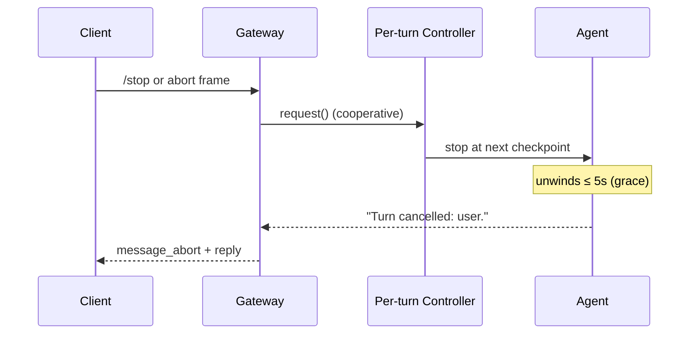

Stop a hung or runaway gateway turn cooperatively using `/stop`, an `abort` WebSocket frame, or a configurable per-turn timeout — or stop the whole session (the running turn **and** everything queued behind it) with `/stop all`, `/cancel`, or `abort` carrying `scope: "session"`.

<Note>
Available since [PraisonAI#3472](https://github.com/MervinPraison/PraisonAI/pull/3472). The gateway advertises `abort` in the `hello_ok` capability handshake, accepts `abort` / `message_abort` WebSocket frames, honours `/stop` (or `stop`) in chat, and enforces a configurable per-turn timeout via `gateway.per_turn_timeout`.

Session-scoped stop (`/stop all`, `/cancel`, `abort` with `scope: "session"`) added in [PraisonAI#5130](https://github.com/MervinPraison/PraisonAI/pull/5130). Default remains turn-scoped for back-compat.
</Note>

```python
from praisonaiagents import Agent

agent = Agent(name="gateway-agent", instructions="Answer questions.")
```

The gateway relays a `message_abort` event to clients when a turn is cancelled, so a custom client can render the turn as "cancelled" instead of hanging or leaking a raw traceback.

```mermaid
graph LR
    S1[/stop / stop] --> H[Session Handler]
    S2[/stop all / /cancel] --> H
    W1[abort scope=turn] --> H
    W2[abort scope=session] --> H
    T[per_turn_timeout] --> H
    H -->|TURN| IC[Per-turn<br/>InterruptController]
    H -->|SESSION| IC
    H -->|SESSION| Q[Drain session inbox<br/>+ bump stop_epoch]
    IC --> A[Agent turn]
    Q --> C[pending_cancelled: N]
    A --> Fin[turn_aborted: true]
    Fin --> F[message_abort frame]
    C --> R[reply payload]
    F --> R

    classDef in fill:#8B0000,stroke:#7C90A0,color:#fff
    classDef proc fill:#189AB4,stroke:#7C90A0,color:#fff
    classDef cfg fill:#F59E0B,stroke:#7C90A0,color:#fff
    classDef out fill:#10B981,stroke:#7C90A0,color:#fff

    class S1,S2,W1,W2,T in
    class H,IC,A,Q proc
    class Fin,F,C,R out
```

Pick the scope that matches what you want stopped — the running answer only, or that answer plus everything you queued behind it.

```mermaid
graph TB
    Q{What do you want to stop?} --> A[Just the running answer]
    Q --> B[Everything I typed — the running answer AND my queued follow-ups]
    A --> A1[/stop  ·  stop  ·  abort frame default]
    B --> B1[/stop all  ·  /cancel  ·  abort frame with scope=session]

    classDef q fill:#8B0000,stroke:#7C90A0,color:#fff
    classDef turn fill:#189AB4,stroke:#7C90A0,color:#fff
    classDef session fill:#F59E0B,stroke:#7C90A0,color:#fff

    class Q q
    class A,A1 turn
    class B,B1 session
```

## Quick Start

<Steps>
  <Step title="Cancel from any chat client with /stop">
    Any chat client can cancel the in-flight turn by sending `/stop` (or bare `stop`, case-insensitive). Reply is either `{"type":"aborted","session_id":"..."}` or `{"type":"no_active_turn","session_id":"..."}`.

    ```json
    {"type": "message", "content": "/stop"}
    ```
  </Step>
  <Step title="Cancel the whole session with /stop all or /cancel">
    When the user typed several follow-ups and wants everything they queued cancelled too, a session-scoped stop cancels the in-flight turn **and** drains the session inbox.

    ```json
    {"type": "message", "content": "/stop all"}
    ```

    Reply carries the drained count:

    ```json
    {
      "type": "aborted",
      "session_id": "sess-1",
      "scope": "session",
      "turn_aborted": true,
      "pending_cancelled": 2
    }
    ```

    `/cancel` is an alias for `/stop all`.
  </Step>
  <Step title="Session-scope the abort WebSocket frame">
    The same `abort` frame drains the backlog when you add `scope: "session"`:

    ```json
    {"type": "abort", "reason": "user", "scope": "session"}
    ```

    `scope` is optional; absent or unknown falls back to `TURN`.
  </Step>
  <Step title="Cancel with an abort WebSocket frame">
    Send an `abort` frame — requires the `write` operator scope (same as sending a message as the agent):

    ```json
    {"type": "abort", "reason": "user"}
    ```

    `reason` is optional (defaults to `"user"`) and is echoed back in the terminal turn message.
  </Step>
  <Step title="Set a per-turn wall-clock ceiling">
    Set a wall-clock ceiling per turn in the gateway config. `0` (default) disables the timeout — behaviour is byte-identical to earlier releases.

    ```yaml
    gateway:
      per_turn_timeout: 60.0   # cancel any turn that runs longer than 60s
    ```

    A timed-out turn's terminal response is `"Turn cancelled: exceeded per-turn timeout."`.
  </Step>
  <Step title="Render the message_abort event on the client">
    When the gateway cancels a turn it emits a `message_abort` event; treat it as a terminal outcome for that turn.

    ```python
    from praisonaiagents.gateway.protocols import EventType

    if event["type"] == EventType.MESSAGE_ABORT.value:  # "message_abort"
        mark_turn_cancelled(event)
    ```
  </Step>
</Steps>

---

## Config: `gateway.per_turn_timeout`

Wall-clock ceiling for a single agent turn. When exceeded, the turn is cancelled cooperatively (via its `InterruptController`) and, if it does not unwind within a bounded grace window, the driving task is cancelled hard.

| Field | Type | Default | Description |
|-------|------|---------|-------------|
| `per_turn_timeout` | `float` (seconds) | `0.0` | Wall-clock ceiling per turn. `0` disables the timeout entirely. A negative value raises `ValueError` at config load. |

Three ways to set it:

```python
from praisonaiagents.gateway.config import GatewayConfig

config = GatewayConfig(per_turn_timeout=60.0)
```

```yaml
# multi-channel gateway config
gateway:
  per_turn_timeout: 60.0
```

```python
# via the bot pydantic schema — same key
from praisonai_bot.bots._config_schema import GatewayServerSchema

GatewayServerSchema(per_turn_timeout=60.0)
```

<Note>
Default `0.0` = disabled. Every turn runs to completion, exactly as in releases before #3472.
</Note>

---

## Stop Scopes

Two scopes. `TURN` stops the current answer. `SESSION` stops the current answer and drains everything the user queued behind it.

| Scope | Chat command | Abort frame | What it stops |
|-------|-------------|-------------|---------------|
| `TURN` (default, back-compat) | `/stop`, `stop` | `{"type":"abort"}` or `{"scope":"turn"}` | The in-flight turn only. Backlog preserved. |
| `SESSION` | `/stop all`, `/cancel` | `{"type":"abort","scope":"session"}` | The in-flight turn **and** every queued-but-unstarted message on the session inbox. |

Both `StopScope` and `StopResult` are exported from the public gateway surface:

```python
from praisonaiagents.gateway import StopScope, StopResult
```

`StopResult.to_dict()` serialises to exactly `{"scope": ..., "turn_aborted": ..., "pending_cancelled": ...}`. `pending_cancelled` is the count of queued messages a `SESSION` stop drained — a visible, intentional non-outcome, never a silent drop — and is always `0` for a `TURN` stop.

<Note>
An unknown or malformed `scope` never escalates to `SESSION` — it falls back to the caller's default (`TURN`). A session drain always requires an explicit opt-in.
</Note>

---

## Frame shapes

### Client → Gateway

**Abort frame** — requires the [`write`](/features/gateway-operator-scopes#core-method-classification) operator scope:

```json
{"type": "abort", "reason": "user", "scope": "session"}
```

`message_abort` is accepted as an alias for `type`.

| Field | Type | Default | Description |
|-------|------|---------|-------------|
| `reason` | `string` | `"user"` | Echoed back in the terminal turn message. |
| `scope` | `"turn"` \| `"session"` | `"turn"` | `"session"` also drains the queued backlog; absent/unknown → `"turn"`. |

<Note>
`abort` is classified as `write` in the gateway method registry — the same scope as sending a `message`, on the principle that aborting a turn mutates it exactly as sending one does.
</Note>

**Portable stop command** — any client already joined to a session can cancel via the message channel:

| Command | Scope | What it stops |
|---------|-------|---------------|
| `/stop`, `stop` | `TURN` | The in-flight turn only. Backlog preserved. |
| `/stop all` | `SESSION` | The in-flight turn **and** the queued backlog. |
| `/cancel` | `SESSION` | Alias for `/stop all`. |

```json
{"type": "message", "content": "/stop all"}
```

Matching is case-insensitive and whitespace-trimmed.

### Gateway → Client (reply to abort)

The reply carries the `StopResult` fields alongside `type` and `session_id`.

| Reply | When | Extra fields |
|-------|------|-------------|
| `{"type": "aborted", ...}` | A turn was active *or* the `SESSION` drain cancelled queued messages. | `scope`, `turn_aborted` (bool), `pending_cancelled` (int ≥ 0) |
| `{"type": "no_active_turn", ...}` | No turn was running and (for `SESSION`) the inbox was empty. | `scope`, `turn_aborted: false`, `pending_cancelled: 0` |
| `{"type": "error", "code": "insufficient_scope", "message": "insufficient scope", "required_scope": "write"}` | The client is missing the WRITE scope. | (unchanged) |
| `{"type": "error", "message": "Not joined to any session"}` | The client hasn't joined a session. | (unchanged) |

`type` is `"aborted"` when *either* `turn_aborted` is true *or* `pending_cancelled > 0`; otherwise `"no_active_turn"`. A `SESSION` stop with no active turn but 3 queued messages still replies `"aborted"` with `pending_cancelled: 3` — the queued work counts as work stopped.

**Turn-scoped reply:**

```json
{
  "type": "aborted",
  "session_id": "sess-1",
  "scope": "turn",
  "turn_aborted": true,
  "pending_cancelled": 0
}
```

**Session-scoped reply:**

```json
{
  "type": "aborted",
  "session_id": "sess-1",
  "scope": "session",
  "turn_aborted": true,
  "pending_cancelled": 3
}
```

### Terminal turn message

The turn's own response (delivered on the normal `message` channel) is a typed string:

| Reason | Response text |
|--------|---------------|
| Per-turn timeout expired | `"Turn cancelled: exceeded per-turn timeout."` |
| User abort (chat `/stop` or WS `abort`) | `"Turn cancelled: user."` |
| Any other reason string | `"Turn cancelled: <reason>."` |

---

## The `message_abort` event

`EventType.MESSAGE_ABORT` is defined in `praisonaiagents/gateway/protocols.py` and serialises to the wire string `"message_abort"`.

| Enum member | Wire value | Meaning |
|-------------|-----------|---------|
| `EventType.MESSAGE_ABORT` | `"message_abort"` | The currently-driving turn on the session was cancelled; the client should treat it as terminal. |

<Note>
Because `EventType` is a `str` `Enum`, `EventType.MESSAGE_ABORT == "message_abort"` compares `True`, so clients can match on the raw string without importing the enum.
</Note>

---

## How It Works

Every turn runs through a per-turn `InterruptController`, so a `/stop`, an `abort` frame, or a timeout on one session never touches another session's turn.



<AccordionGroup>
  <Accordion title="Why cancellation is cooperative">
    Cancellation always requests interruption via the turn's `InterruptController` first, so the agent stops at its next safe checkpoint and partial output is preserved. A hard `task.cancel()` fires only if the turn hasn't unwound within **5 seconds** (`_ABORT_GRACE_SECONDS`) — this bounds the case where a sync `agent.chat` running in a worker thread cannot be force-killed but must not keep mutating shared state after the queue advances.
  </Accordion>
  <Accordion title="One controller per turn — never shared">
    Each turn creates its own `InterruptController` and passes it as `cancel_token=` into `arun` / `achat` / `chat`. Overlapping turns from different sessions never share a controller, so one session's `/stop` never interrupts another's turn — even when they share the same `Agent` instance.
  </Accordion>
  <Accordion title="Fallback for older entry points">
    Agent entry points that predate `cancel_token=` fall back to stamping `agent.interrupt_controller` on the shared attribute for the turn's duration. This is best-effort and non-isolated — prefer keeping agents on the current SDK so per-turn isolation applies.
  </Accordion>
  <Accordion title="Timeout is opt-in">
    `per_turn_timeout` defaults to `0.0`, which means no wall-clock cancellation. Every turn runs to completion, exactly as in releases before #3472 — enabling the timeout is opt-in.
  </Accordion>
  <Accordion title="Default-path cooperative cancel needed PR #4301">
    Prior to [PraisonAI PR #4301](https://github.com/MervinPraison/PraisonAI/pull/4301), the gateway's cooperative cancel reached the agent but the agent dropped the token before `OpenAIClient` on the default sync path. So the gateway's `_ABORT_GRACE_SECONDS = 5.0` hard-cancel was the only real halt on plain `Agent(llm="gpt-4o-mini")`. Upgrade to get cooperative interruption between tool iterations, not just after the 5-second grace.
  </Accordion>
  <Accordion title="Race-window: the dequeue-to-registration gap">
    The queue worker dequeues a message *before* registering it as an active turn. A `SESSION` stop bumps a per-session `_stop_epoch` counter; the worker snapshots the epoch at dequeue and re-checks it just before dispatch. A mismatch means a stop landed in the gap — the message is dropped instead of executed, and it is counted toward `pending_cancelled` so the reported outcome is never a silent loss. See `praisonai_bot/gateway/server.py` (search `dequeued_stop_epoch`).

    ```mermaid
    sequenceDiagram
        participant Worker
        participant Session
        participant Client

        Worker->>Session: dequeue message (snapshot _stop_epoch)
        Client->>Session: /stop all (bump _stop_epoch, count inflight)
        Worker->>Session: re-check _stop_epoch before dispatch
        Note over Worker: epoch mismatch → drop, don't run
        Session-->>Client: pending_cancelled includes it
    ```
  </Accordion>
</AccordionGroup>

---

## Common Patterns

Real scenarios this page lets you pattern-match to:

| Scenario | Trigger | Outcome |
|----------|---------|---------|
| Telegram user stuck in a slow tool call | User types `/stop` | Controller fires, turn unwinds in ~5s, user sees `"Turn cancelled: user."` |
| Operator dashboard spots a runaway turn | WS client (WRITE scope) sends `{"type": "abort", "reason": "operator-timeout"}` | Gateway replies `{"type": "aborted", "session_id": "..."}`; next turn resumes |
| Ops set a hard ceiling | `gateway.per_turn_timeout: 120.0` | A wedged turn auto-cancels after 2 minutes with `"Turn cancelled: exceeded per-turn timeout."` |
| One `Agent` serves ten users | User A hits `/stop` | User B's parallel turn keeps running — controllers are per-turn, not per-agent |
| User fires 3 follow-ups, then wants everything stopped | User types `/stop all` (or `/cancel`) | Current turn cancels, 3 queued messages drop, reply shows `pending_cancelled: 3` |
| Operator dashboard revokes an entire session's plan | WS `{"type":"abort","scope":"session","reason":"operator-timeout"}` | Same drain, plus the explicit reason echoed in the terminal turn message |
| User cancels while queue is running but no active turn | `/stop all` | `turn_aborted: false`, `pending_cancelled: N`, backlog is now empty |

---

## Related

<CardGroup cols={2}>
  <Card title="Chat /stop Command" icon="octagon-pause" href="/features/bot-commands#stop">
    The chat-side twin of the gateway's abort surface.
  </Card>
  <Card title="Handshake Protocol" icon="handshake" href="/features/gateway-handshake-protocol">
    Capability negotiation and the `hello_ok` feature set.
  </Card>
  <Card title="Gateway CLI" icon="terminal" href="/features/gateway-cli">
    Process-level `praisonai gateway stop` versus turn-level cancellation.
  </Card>
  <Card title="Interactive TUI Ctrl-C" icon="keyboard" href="/cli/interactive-tui">
    The terminal-side twin of the same cooperative primitive.
  </Card>
</CardGroup>
