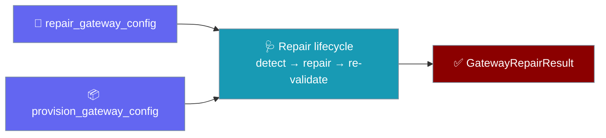
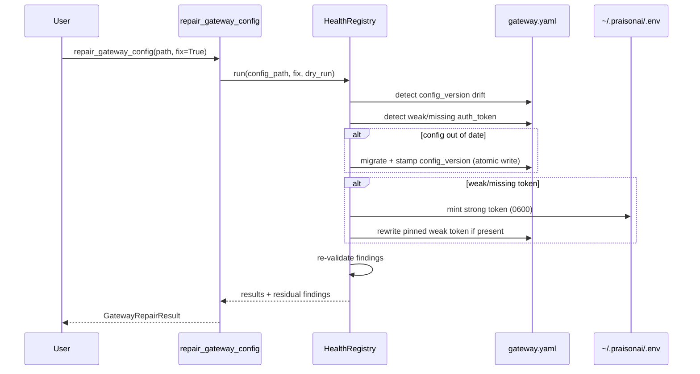
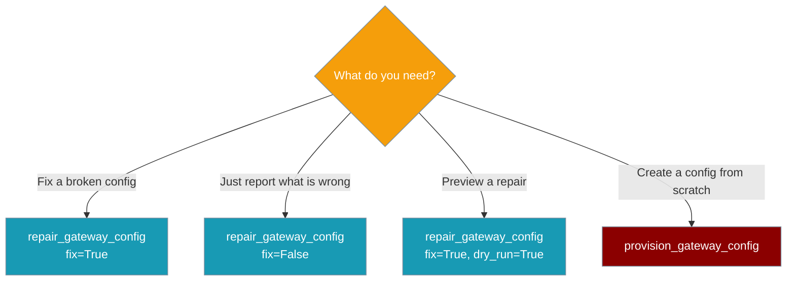

Repair and provision a gateway config from Python — no shell-out, no interactive wizard, and a typed result you can assert on.



## Quick Start

<Steps>
<Step title="Repair a broken config">
```python
from praisonai_bot import repair_gateway_config

result = repair_gateway_config("~/.praisonai/bot.yaml", fix=True)
assert result.config_version_migrated is True or result.auth_token_minted is True
assert not result.remaining_degraded_owners
```
</Step>

<Step title="Provision a config from scratch">
```python
from praisonai_bot import provision_gateway_config

path = provision_gateway_config(
    platform="telegram",
    token="${TELEGRAM_BOT_TOKEN}",   # persisted to ~/.praisonai/.env
    agents=["assistant"],
)
print(path)   # ~/.praisonai/bot.yaml
```
</Step>

<Step title="Detect without repairing">
```python
result = repair_gateway_config("~/.praisonai/bot.yaml")   # fix=False by default
for owner in result.remaining_degraded_owners:
    print(owner["owner_id"], "->", owner["reason"])
```
</Step>
</Steps>

---

## How It Works

Both entry points share the detect → repair → re-validate lifecycle behind `praisonai gateway doctor --fix`.



---

## When to use which



---

## API Reference

Three symbols make up the whole public surface.

```python
from praisonai_bot import (
    repair_gateway_config,
    provision_gateway_config,
    GatewayRepairResult,
)
```

### `repair_gateway_config`

`repair_gateway_config(config_path, *, fix=False, dry_run=False) -> GatewayRepairResult`

| Parameter | Type | Default | Description |
|-----------|------|---------|-------------|
| `config_path` | `str \| os.PathLike[str]` | — | Path to the gateway `bot.yaml` / `gateway.yaml`. `~` is expanded. |
| `fix` | `bool` | `False` | Apply safe repairs. Leave `False` for a detect-only report. |
| `dry_run` | `bool` | `False` | With `fix=True`, preview repairs without writing. |

Runs the same detect → repair → re-validate lifecycle as `praisonai gateway doctor --fix`: forward-migrate an out-of-date `config_version` and mint/persist a strong `gateway.auth_token` when the configured one is weak or missing.

### `provision_gateway_config`

`provision_gateway_config(*, platform, token, agents=None, config_path=None) -> Path`

| Parameter | Type | Default | Description |
|-----------|------|---------|-------------|
| `platform` | `str` | — | Channel platform, e.g. `"telegram"`. Must be a supported built-in / installed channel. |
| `token` | `str` | — | Channel token; persisted to `~/.praisonai/.env`. Empty string raises `ValueError`. |
| `agents` | `list[str] \| None` | `None` → `["assistant"]` | Agent names declared in `agents:`. The first is the channel's default route. |
| `config_path` | `str \| os.PathLike[str] \| None` | `None` → `~/.praisonai/bot.yaml` | Target path. |

<Warning>
`provision_gateway_config` is fail-closed: an unsupported `platform` or an empty `token` raises `ValueError` and writes nothing, rather than producing a config the gateway would boot degraded.
</Warning>

### `GatewayRepairResult`

`@dataclass(frozen=True)` — the closed result shape returned by `repair_gateway_config`.

| Field | Type | Default | Description |
|-------|------|---------|-------------|
| `auth_token_minted` | `bool` | `False` | Set when a strong `gateway.auth_token` was minted and persisted. |
| `config_version_migrated` | `bool` | `False` | Set when `config_version` was forward-migrated. |
| `changes` | `list[str]` | `[]` | Operator-facing lines describing what was repaired. |
| `remaining_degraded_owners` | `list[dict[str, str]]` | `[]` | Redacted `{owner_kind, owner_id, state, reason, retry_hint}` dicts. Empty on a clean verify. |

`.to_dict()` returns a shallow JSON-safe copy of all four fields.

```python
result = repair_gateway_config("~/.praisonai/bot.yaml", fix=True)
print(result.to_dict())
```

---

## Precedence & Fallbacks

The auth-token repair interacts with `${ENV}` references and explicit YAML tokens as follows.

| Situation | Behaviour |
|-----------|-----------|
| `gateway.yaml` pins a weak literal `auth_token` | Repair rewrites the YAML **and** the env var. |
| `auth_token` is a `${ENV}` reference | Not rewritten — operator indirection is preserved; only `~/.praisonai/.env` is written. |
| Weak token on a loopback bind | Warning to stderr, no error; `remaining_degraded_owners` stays empty. |
| Weak token on an external bind | Fail-closed finding; `fix=True` mints a strong token. |
| Config from a newer build than the installed core | Reported once as unsupported; the migrator does **not** downgrade. |

---

## CLI parity

The Python API, CLI, and YAML surfaces run the same helpers.

| What you want | Python | CLI | YAML |
|---------------|--------|-----|------|
| Detect only | `repair_gateway_config(path)` | `praisonai gateway doctor` | (n/a — inspection command) |
| Detect + repair | `repair_gateway_config(path, fix=True)` | `praisonai gateway doctor --fix` | (n/a — inspection command) |
| Preview a repair | `repair_gateway_config(path, fix=True, dry_run=True)` | `praisonai gateway doctor --fix --dry-run` | (n/a) |
| Provision a config | `provision_gateway_config(platform=..., token=..., agents=[...])` | `praisonai onboard` (interactive) | ships as `bot.yaml` |

---

## Common Patterns

### CI-driven per-tenant provisioning

```python
from praisonai_bot import provision_gateway_config, repair_gateway_config

tenants = {
    "acme": "${ACME_TELEGRAM_TOKEN}",
    "globex": "${GLOBEX_TELEGRAM_TOKEN}",
}

for tenant, token in tenants.items():
    path = provision_gateway_config(
        platform="telegram",
        token=token,
        agents=["assistant"],
        config_path=f"/etc/praisonai/{tenant}/bot.yaml",
    )
    result = repair_gateway_config(path, fix=True)
    assert not result.remaining_degraded_owners, (tenant, result.remaining_degraded_owners)
```

### Post-deploy self-healing check

```python
import sys
from praisonai_bot import repair_gateway_config

result = repair_gateway_config("~/.praisonai/bot.yaml", fix=False)
if result.remaining_degraded_owners:
    for owner in result.remaining_degraded_owners:
        print(owner["owner_id"], "->", owner["reason"], file=sys.stderr)
    sys.exit(1)
```

### Testing the fixed gateway in pytest

```python
from praisonai_bot import repair_gateway_config

def test_gateway_self_heals(tmp_path):
    config = tmp_path / "bot.yaml"
    config.write_text("gateway:\n  auth_token: changeme\n  bind_host: 0.0.0.0\n")

    result = repair_gateway_config(config, fix=True)

    assert result.auth_token_minted or result.config_version_migrated
    assert not result.remaining_degraded_owners
```

### Explicit path vs default location

```python
from praisonai_bot import provision_gateway_config

# Default location: ~/.praisonai/bot.yaml
default_path = provision_gateway_config(platform="telegram", token="${TELEGRAM_BOT_TOKEN}")

# Explicit override
custom_path = provision_gateway_config(
    platform="telegram",
    token="${TELEGRAM_BOT_TOKEN}",
    config_path="/etc/praisonai/bot.yaml",
)
```

---

## Best Practices

<AccordionGroup>
<Accordion title="🧪 Verify with the detect pass first">
Run without `fix=True`, review `remaining_degraded_owners`, then re-run with `fix=True`. A detect-only pass never writes to disk.
</Accordion>

<Accordion title="🔁 Re-run after every deploy">
Config-version drift and weak tokens are silent until you check. Wire `repair_gateway_config(path, fix=False)` into your post-deploy smoke test.
</Accordion>

<Accordion title="🔒 Never commit the token">
`provision_gateway_config(token=...)` persists the credential to `~/.praisonai/.env` (`0600`). Pass a `${VAR}` reference in your YAML so the secret stays out of source control.
</Accordion>

<Accordion title="🧭 Keep the CLI and Python in sync">
Both surfaces run the same helpers in `admin.py` — a repair from either is identical. Use the CLI interactively, the Python API in CI and tests.
</Accordion>

<Accordion title="🛑 Treat ValueError as fail-closed">
An unsupported `platform` or empty `token` refuses to write, preventing a "starts degraded" outcome. Do not catch and ignore it.
</Accordion>
</AccordionGroup>

---

## Related

<CardGroup cols={2}>
<Card title="Gateway CLI" icon="terminal" href="/features/gateway-cli">
The wrapping `gateway doctor` commands.
</Card>
<Card title="Bot Onboarding" icon="wand-magic-sparkles" href="/features/onboard">
The interactive wizard — sibling of `provision_gateway_config`.
</Card>
<Card title="Bind-Aware Auth" icon="shield-halved" href="/features/gateway-bind-aware-auth">
Weak-secret guard context.
</Card>
<Card title="Config Migration" icon="arrows-rotate" href="/features/gateway-config-migration">
Config-version migration context.
</Card>
</CardGroup>
