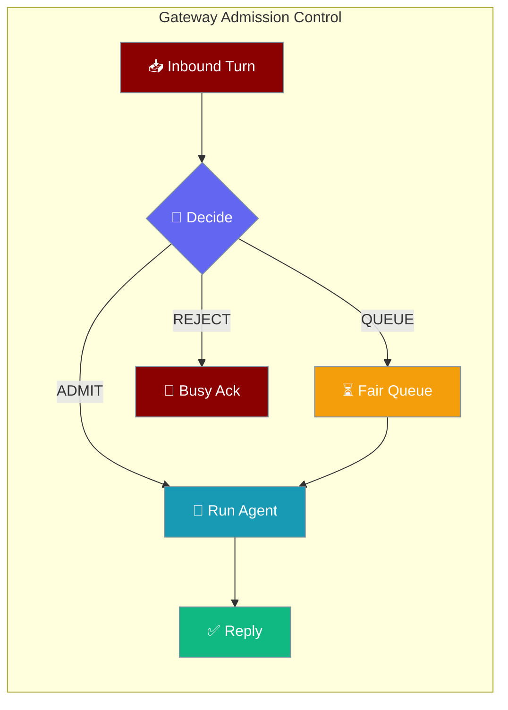
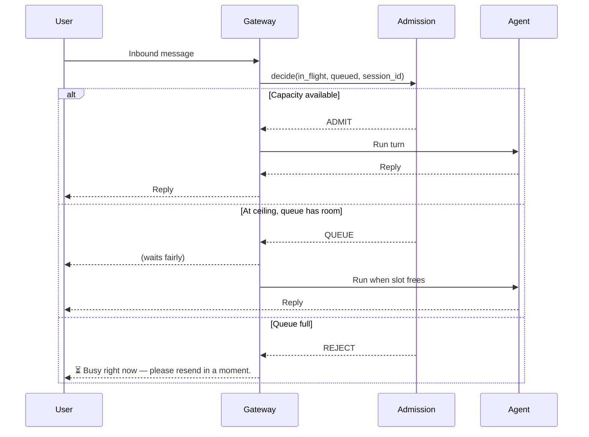

<Note>
For the composed one-switch experience, see [Reliability Preset](/docs/features/gateway-reliability). This page documents the admission-control knob in isolation.
</Note>

Admission control caps the number of concurrent inbound agent runs across all users, queues the overflow fairly, and explicitly sheds load when the queue is full.

```python
from praisonaiagents import Agent
from praisonai.bots import BotOS

agent = Agent(name="Support", instructions="Help users")

bot = BotOS(
    agent=agent,
    platforms=["telegram"],
    max_concurrent_runs=32,
)
bot.start()
```

The user sends a chat message on a channel; admission control admits, queues, or rejects the run before the agent replies.

<Note>
Admission control bounds **concurrent** inbound runs. For a bound on **request rate per identity**, see [Gateway Rate Limit](/docs/features/gateway-rate-limit).
</Note>


## Quick Start

<Note>
For a one-switch preset that turns on admission with sensible defaults alongside graceful drain, see [Gateway Reliability Presets](/docs/features/gateway-reliability).
</Note>

<Steps>

<Step title="Simple Usage">
Cap aggregate concurrent runs with a single parameter:

```python
from praisonaiagents import Agent
from praisonai.bots import BotOS

agent = Agent(name="Support", instructions="Help users")

bot = BotOS(
    agent=agent,
    platforms=["telegram"],
    max_concurrent_runs=32,
)
bot.start()
```
</Step>

<Step title="With Configuration">
Add a wait queue and choose what happens when the queue is full:

```python
from praisonaiagents import Agent
from praisonai.bots import BotOS

agent = Agent(name="Support", instructions="Help users")

bot = BotOS(
    agent=agent,
    platforms=["telegram", "discord"],
    max_concurrent_runs=32,
    queue_depth=128,
    overflow_policy="reject",   # reject | queue | shed_oldest
)
bot.start()
```
</Step>

</Steps>

---

## How It Works



| Decision | When | What the user sees |
|---|---|---|
| `ADMIT` | `in_flight < max_concurrent_runs` | Immediate response |
| `QUEUE` | At ceiling, queue has room | Brief wait, then response |
| `REJECT` | Queue full and policy is `reject` (or `shed_oldest` can't evict) | Friendly busy acknowledgement |

---

## Configuration Options

The three fields live on `GatewayConfig` (read from `praisonaiagents/gateway/config.py`):

| Option | Type | Default | Description |
|---|---|---|---|
| `max_concurrent_runs` | `int` | `0` | Max concurrent inbound agent runs across all users. `0` disables the gate (legacy behaviour). |
| `queue_depth` | `int` | `128` | Max number of inbound turns that can wait when at the ceiling. |
| `overflow_policy` | `str` | `"reject"` | Behaviour when at the ceiling and the queue is full: `reject`, `queue`, or `shed_oldest`. |

**Precedence:** CLI flags → YAML → Python defaults.

### Python

```python
from praisonai.bots import BotOS
from praisonaiagents import Agent

agent = Agent(name="Support", instructions="Help users")

bot = BotOS(
    agent=agent,
    platforms=["telegram"],
    max_concurrent_runs=32,
    queue_depth=128,
    overflow_policy="reject",
)
```

### YAML (`gateway.yaml`)

```yaml
gateway:
  host: "127.0.0.1"
  port: 8765
  max_concurrent_runs: 32
  queue_depth: 128
  overflow_policy: reject   # reject | queue | shed_oldest
```

### CLI

```bash
praisonai gateway start \
  --max-concurrent-runs 32 \
  --queue-depth 128 \
  --overflow-policy reject
```

CLI flags override YAML, which overrides Python defaults.

---

## Common Patterns

**Production multi-tenant bot** — explicit busy ack under load; no OOM risk; no provider 429 storm:

```python
bot = BotOS(
    agent=agent,
    platforms=["telegram", "discord", "slack"],
    max_concurrent_runs=32,
    queue_depth=128,
    overflow_policy="reject",
)
```

**Burst-tolerant single-channel** — lower aggregate concurrency, deeper queue, no rejections under modest bursts:

```python
bot = BotOS(
    agent=agent,
    platforms=["telegram"],
    max_concurrent_runs=8,
    queue_depth=64,
    overflow_policy="queue",
)
```

**Newest-message-wins** — useful when conversation freshness matters more than fairness. When `shed_oldest` can't evict a live waiter, the newcomer is rejected rather than overfilling the queue:

```python
bot = BotOS(
    agent=agent,
    platforms=["telegram"],
    max_concurrent_runs=16,
    queue_depth=32,
    overflow_policy="shed_oldest",
)
```

---

## Observability

`BotOS.admission_stats` exposes live counters without any extra setup:

```python
print(bot.admission_stats)
# {"in_flight": 12, "queued": 3, "rejected": 0}
```

Watch `rejected` alongside your LLM provider's 429 rate. When both rise together, raise `max_concurrent_runs`. When only `rejected` rises, deepen `queue_depth` or switch to `overflow_policy="queue"`.

---

## Best Practices

<AccordionGroup>
  <Accordion title="Start with max_concurrent_runs ≈ 2× expected steady-state">
    Set `max_concurrent_runs` to roughly twice your expected concurrent-user baseline. Watch `admission_stats.rejected` — if rejections are non-zero under normal load, raise the ceiling.
  </Accordion>

  <Accordion title="Default to overflow_policy='reject' for multi-user deployments">
    Silent unbounded queueing under load is harder to debug than an explicit busy ack. `reject` surfaces pressure immediately and lets users retry on their own schedule.
  </Accordion>

  <Accordion title="Pair with flow control for full gateway protection">
    Admission control bounds **inbound** concurrent runs; [flow control](/docs/features/gateway-flow-control) bounds **outbound** send throughput and per-session inbox depth. Production gateways usually want both.
  </Accordion>

  <Accordion title="Leave the gate off only for single-user or local dev">
    `max_concurrent_runs=0` (the default) disables the gate entirely — every inbound turn runs immediately. Suitable for local development or single-operator deployments where there is no shared provider quota to protect.
  </Accordion>
</AccordionGroup>

---

## Related

<CardGroup cols={2}>
  <Card title="Gateway Reliability Presets" icon="shield-check" href="/docs/features/gateway-reliability">
    One switch that turns on admission + graceful drain with sensible defaults
  </Card>
  <Card title="Gateway Flow Control" icon="gauge-high" href="/docs/features/gateway-flow-control">
    Outbound counterpart — bounded inboxes and slow-consumer disconnect
  </Card>
  <Card title="Gateway Rate Limit" icon="gauge-high" href="/docs/features/gateway-rate-limit">
    Bound inbound turns per identity/scope with a sliding window or custom limiter
  </Card>
  <Card title="Gateway Overview" icon="broadcast-tower" href="/docs/features/gateway-overview">
    Full gateway architecture and feature index
  </Card>
</CardGroup>
