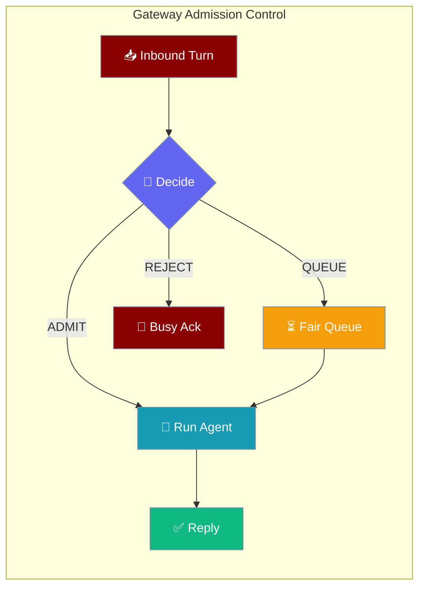
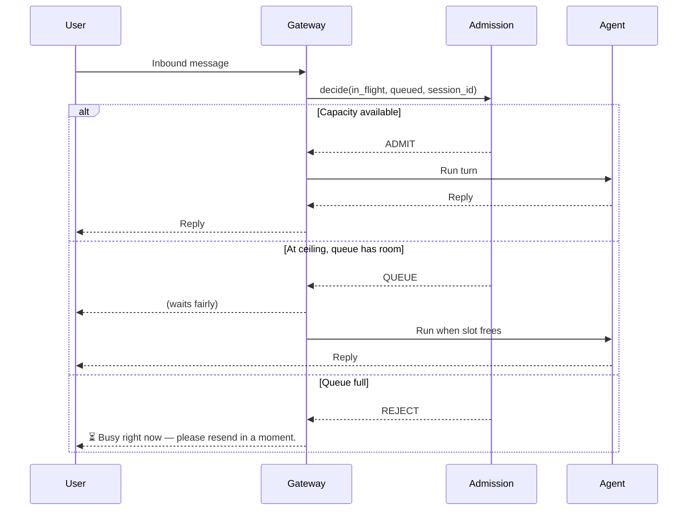
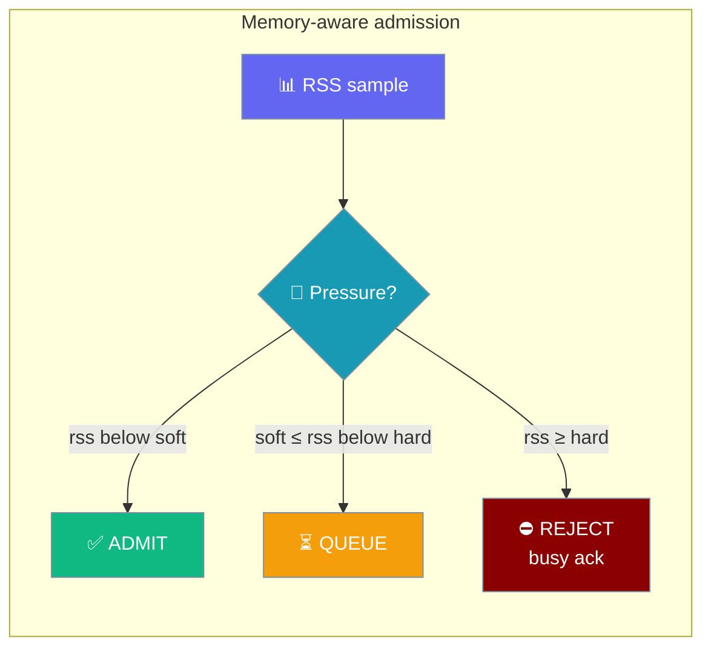

<Note>
The gateway now ships in the `praisonai-bot` package. `praisonai serve gateway` still works exactly as documented here; for a standalone install see [praisonai-bot Migration](/guides/praisonai-bot-migration).
</Note>

<Note>
For the composed one-switch experience, see [Reliability Preset](/features/gateway-reliability). This page documents the admission-control knob in isolation.
</Note>

Admission control caps the number of concurrent inbound agent runs across all users, queues the overflow fairly, and explicitly sheds load when the queue is full.

```python
from praisonaiagents import Agent
from praisonai.bots import BotOS

agent = Agent(name="Support", instructions="Help users")

bot = BotOS(
    agent=agent,
    platforms=["telegram"],
    max_concurrent_runs=32,
)
bot.start()
```

The user sends a chat message on a channel; admission control admits, queues, or rejects the run before the agent replies.

<Note>
Admission control bounds **concurrent** inbound runs. For a bound on **request rate per identity**, see [Gateway Rate Limit](/features/gateway-rate-limit).
</Note>

```mermaid
graph LR
    subgraph "Gateway Admission Control"
        In[📥 Inbound Turn] --> Gate{🚦 Decide}
        Gate -->|ADMIT| Run[🤖 Run Agent]
        Gate -->|QUEUE| Q[⏳ Fair Queue]
        Gate -->|REJECT| Busy[🛑 Busy Ack]
        Q --> Run
        Run --> Reply[✅ Reply]
    end

    classDef inbound fill:#8B0000,stroke:#7C90A0,color:#fff
    classDef decision fill:#6366F1,stroke:#7C90A0,color:#fff
    classDef queue fill:#F59E0B,stroke:#7C90A0,color:#fff
    classDef busy fill:#8B0000,stroke:#7C90A0,color:#fff
    classDef agent fill:#189AB4,stroke:#7C90A0,color:#fff
    classDef output fill:#10B981,stroke:#7C90A0,color:#fff

    class In inbound
    class Gate decision
    class Q queue
    class Busy busy
    class Run agent
    class Reply output
```

## Quick Start

<Note>
For a one-switch preset that turns on admission with sensible defaults alongside graceful drain, see [Gateway Reliability Presets](/features/gateway-reliability).
</Note>

<Steps>

<Step title="Simple Usage">
Cap aggregate concurrent runs with a single parameter:

```python
from praisonaiagents import Agent
from praisonai.bots import BotOS

agent = Agent(name="Support", instructions="Help users")

bot = BotOS(
    agent=agent,
    platforms=["telegram"],
    max_concurrent_runs=32,
)
bot.start()
```
</Step>

<Step title="With Configuration">
Add a wait queue and choose what happens when the queue is full:

```python
from praisonaiagents import Agent
from praisonai.bots import BotOS

agent = Agent(name="Support", instructions="Help users")

bot = BotOS(
    agent=agent,
    platforms=["telegram", "discord"],
    max_concurrent_runs=32,
    queue_depth=128,
    overflow_policy="reject",   # reject | queue | shed_oldest
)
bot.start()
```
</Step>

</Steps>

---

## How It Works


```mermaid
sequenceDiagram
    participant User
    participant Gateway
    participant Admission
    participant Agent
    User->>Gateway: Inbound message
    Gateway->>Admission: decide(in_flight, queued, session_id)
    alt Capacity available
        Admission-->>Gateway: ADMIT
        Gateway->>Agent: Run turn
        Agent-->>Gateway: Reply
        Gateway-->>User: Reply
    else At ceiling, queue has room
        Admission-->>Gateway: QUEUE
        Gateway-->>User: (waits fairly)
        Gateway->>Agent: Run when slot frees
        Agent-->>User: Reply
    else Queue full
        Admission-->>Gateway: REJECT
        Gateway-->>User: ⏳ Busy right now — please resend in a moment.
    end
```

| Decision | When | What the user sees |
|---|---|---|
| `ADMIT` | `in_flight < max_concurrent_runs` | Immediate response |
| `QUEUE` | At ceiling, queue has room | Brief wait, then response |
| `REJECT` | Queue full and policy is `reject` (or `shed_oldest` can't evict) | Friendly busy acknowledgement |

---

## Configuration Options

The three fields live on `GatewayConfig` (read from `praisonaiagents/gateway/config.py`):

| Option | Type | Default | Description |
|---|---|---|---|
| `max_concurrent_runs` | `int` | `0` | Max concurrent inbound agent runs across all users. `0` disables the gate (legacy behaviour). |
| `queue_depth` | `int` | `128` | Max number of inbound turns that can wait when at the ceiling. |
| `overflow_policy` | `str` | `"reject"` | Behaviour when at the ceiling and the queue is full: `reject`, `queue`, or `shed_oldest`. |
| `max_rss_mb` | `float` | `0.0` | Hard RSS ceiling in MiB for [memory-aware admission](#memory-aware-admission). `0` disables it (concurrency-only, legacy behaviour). |

**Precedence:** CLI flags → YAML → Python defaults.

### Python

```python
from praisonai.bots import BotOS
from praisonaiagents import Agent

agent = Agent(name="Support", instructions="Help users")

bot = BotOS(
    agent=agent,
    platforms=["telegram"],
    max_concurrent_runs=32,
    queue_depth=128,
    overflow_policy="reject",
)
```

### YAML (`gateway.yaml`)

```yaml
gateway:
  host: "127.0.0.1"
  port: 8765
  max_concurrent_runs: 32
  queue_depth: 128
  overflow_policy: reject   # reject | queue | shed_oldest
```

### CLI

```bash
praisonai gateway start \
  --max-concurrent-runs 32 \
  --queue-depth 128 \
  --overflow-policy reject
```

CLI flags override YAML, which overrides Python defaults.

---

## Common Patterns

**Production multi-tenant bot** — explicit busy ack under load; no OOM risk; no provider 429 storm:

```python
bot = BotOS(
    agent=agent,
    platforms=["telegram", "discord", "slack"],
    max_concurrent_runs=32,
    queue_depth=128,
    overflow_policy="reject",
)
```

**Burst-tolerant single-channel** — lower aggregate concurrency, deeper queue, no rejections under modest bursts:

```python
bot = BotOS(
    agent=agent,
    platforms=["telegram"],
    max_concurrent_runs=8,
    queue_depth=64,
    overflow_policy="queue",
)
```

**Newest-message-wins** — useful when conversation freshness matters more than fairness. When `shed_oldest` can't evict a live waiter, the newcomer is rejected rather than overfilling the queue:

```python
bot = BotOS(
    agent=agent,
    platforms=["telegram"],
    max_concurrent_runs=16,
    queue_depth=32,
    overflow_policy="shed_oldest",
)
```

---

## Observability

`BotOS.admission_stats` exposes live counters without any extra setup:

```python
print(bot.admission_stats)
# {
#   "max_concurrent_runs": 32, "queue_depth": 128,
#   "in_flight": 12, "queued": 3,
#   "admitted": 1247, "rejected": 0, "shed": 0,
#   "max_rss_mb": 0.0,   # ← memory-aware ceiling (0.0 when disabled)
# }
```

Watch `rejected` alongside your LLM provider's 429 rate. When both rise together, raise `max_concurrent_runs`. When only `rejected` rises, deepen `queue_depth` or switch to `overflow_policy="queue"`.

---

## Memory-aware admission

Set one number — `max_rss_mb` — and the gateway queues turns under soft RSS pressure and sheds them under hard pressure, **before the OOM killer fires**. Zero deps, no new subsystem — the same admission gate that enforces the concurrency ceiling folds a memory decision into every `admit()`.


```mermaid
graph LR
    subgraph "Memory-aware admission"
        Sample[📊 RSS sample] --> Decide{🚦 Pressure?}
        Decide -->|rss below soft| Admit[✅ ADMIT]
        Decide -->|soft ≤ rss below hard| Queue[⏳ QUEUE]
        Decide -->|rss ≥ hard| Reject[⛔ REJECT<br/>busy ack]
    end

    classDef sample fill:#6366F1,stroke:#7C90A0,color:#fff
    classDef gate fill:#189AB4,stroke:#7C90A0,color:#fff
    classDef ok fill:#10B981,stroke:#7C90A0,color:#fff
    classDef warn fill:#F59E0B,stroke:#7C90A0,color:#fff
    classDef bad fill:#8B0000,stroke:#7C90A0,color:#fff

    class Sample sample
    class Decide gate
    class Admit ok
    class Queue warn
    class Reject bad
```

### Quick start

<Tabs>
<Tab title="Python (single knob)">

```python
from praisonaiagents import Agent
from praisonai.bots import BotOS

agent = Agent(name="Support", instructions="Help users")

# 1 GiB hard ceiling; soft (queue) threshold auto-derived at 90% (~921 MiB).
bot = BotOS(agent=agent, platforms=["telegram"], max_rss_mb=1024)

print(bot.admission_stats["max_rss_mb"])
# 1024.0
```

</Tab>
<Tab title="YAML">

```yaml
# Top-level (canonical praisonai.yaml or gateway.yaml)
max_rss_mb: 1024

# Or nested under gateway:
gateway:
  max_rss_mb: 1024
```

</Tab>
<Tab title="Explicit ladder">

```python
from praisonaiagents.gateway import MemoryPressurePolicy
from praisonai_bot.bots._admission import build_admission_gate

# Explicit two-threshold ladder instead of the single-knob 90% default.
policy = MemoryPressurePolicy(soft_rss_mb=800, hard_rss_mb=1024)
gate = build_admission_gate(
    max_concurrent_runs=32,   # concurrency ceiling (optional)
    resource_policy=policy,   # memory-aware layer
)
```

</Tab>
</Tabs>

### The pressure ladder

Given a sample's resident set size (`rss_mb`), the policy decides:

| RSS | Decision | What the gateway does |
|---|---|---|
| `rss < soft_rss_mb` | **ADMIT** | Run the turn immediately. |
| `soft_rss_mb ≤ rss < hard_rss_mb` | **QUEUE** | Apply backpressure via the existing bounded wait queue.<sup>*</sup> |
| `rss ≥ hard_rss_mb` | **REJECT** | Shed with a polite busy ack (honours the existing `reject` / `shed_oldest` overflow policy). |
| `rss is None` (platform can't report) | **ADMIT** | Never block on a missing signal — sampler self-disables with a single warning. |

<sup>*</sup> **Memory-only mode caveat.** With no concurrency ceiling (`max_concurrent_runs=0`), there is no slot to wait on, so a soft-pressure QUEUE degrades to ADMIT — real wait-queue backpressure needs a concurrency ceiling *alongside* `max_rss_mb`. **The hard threshold always REJECTs regardless**, which is what prevents the OOM kill.

### Memory-aware configuration

| Option | Type | Default | Description |
|---|---|---|---|
| `max_rss_mb` | `float` | `0.0` | Hard RSS ceiling in MiB. `0` disables memory-aware admission (concurrency-only, byte-for-byte legacy behaviour). |
| `MemoryPressurePolicy.soft_rss_mb` | `float` | `0.0` | Soft (QUEUE) threshold in MiB. When you set only `max_rss_mb`, this is auto-derived as `0.9 × max_rss_mb`. |
| `MemoryPressurePolicy.hard_rss_mb` | `float` | `0.0` | Hard (REJECT) threshold in MiB. |
| `soft_ratio` (in `build_memory_pressure_policy`) | `float` | `0.9` | Fraction of the hard ceiling that becomes the soft threshold when a single-knob `max_rss_mb` is used. Clamped to `[0.0, 1.0]`. |

<Warning>
`MemoryPressurePolicy` fails fast at construction — a `ValueError` is raised if `soft_rss_mb` or `hard_rss_mb` is negative or non-numeric, or if `soft_rss_mb > hard_rss_mb` (which would queue turns that should be shed). No silent pressure-ladder inversion.
</Warning>

### Choosing values

<AccordionGroup>
  <Accordion title="Small always-on host (a $5 VPS)">
    Set `max_rss_mb` at ~70–80% of the box's RAM ceiling minus other resident daemons. Example: on a 1 GiB VPS running only the gateway, `max_rss_mb: 700` gives a ~630 MiB soft threshold — bursts queue, sustained pressure sheds, and the OOM killer stays quiet.
  </Accordion>
  <Accordion title="Containerised deployment with a memory limit">
    Set `max_rss_mb` to ~80% of the container's memory limit. The pressure ladder then queues *before* the kernel starts reclaiming pages aggressively, preserving observability and giving the graceful-drain window a chance to complete in-flight turns.
  </Accordion>
  <Accordion title="Large host combining concurrency + memory">
    Combine `max_concurrent_runs` (concurrency ceiling) with `max_rss_mb` (memory ceiling). Concurrency handles CPU-scaled bursts; memory handles per-turn resident growth (large tool outputs, long transcripts). Either dimension can shed independently.
  </Accordion>
  <Accordion title="Development / test (off)">
    Default `max_rss_mb=0` disables memory-aware admission entirely. `admit()` is bit-for-bit as before — the exact behaviour of every release prior to 2026-07-27.
  </Accordion>
</AccordionGroup>

### Sampler behaviour

The wrapper samples process RSS on a lightweight cadence:

- **Preferred:** `psutil.Process().memory_info().rss` — a live, monotonic reading. Enabled automatically if `psutil` is installed.
- **Fallback:** stdlib `resource.getrusage(RUSAGE_SELF).ru_maxrss` — a *peak* (not live) reading, good enough to catch a climbing leak. Kilobytes on Linux, bytes on macOS/BSD; the sampler normalises to MiB.
- **Self-disable:** if the platform can report neither (Windows without `psutil`, exotic runtimes), the sampler emits a single `AdmissionGate: resource sampling unavailable on this platform; memory-pressure admission disabled.` warning and thereafter returns a `rss_mb=None` sample. The policy admits on `None` — the monitor never crashes the gateway it protects.

<Warning>
The `resource` stdlib module is **Unix-only**. On Windows without `psutil`, memory-aware admission is silently disabled — a single warning is logged at first sample. Install `psutil` in production Windows deployments if you rely on `max_rss_mb`.
</Warning>

### Memory observability

`admission_stats` gains a `max_rss_mb` field so operators can confirm the ceiling is wired end-to-end:

```python
bot.admission_stats
# {
#   "max_concurrent_runs": 32, "queue_depth": 128,
#   "in_flight": 4, "queued": 0,
#   "admitted": 1247, "rejected": 3, "shed": 0,
#   "max_rss_mb": 1024.0,     # ← the configured hard ceiling (0.0 when disabled)
# }
```

<Note>
`stats()` surfaces only the configured ceiling, not a rolling RSS window. For historical RSS for capacity planning, scrape `psutil.Process(<pid>).memory_info().rss` or your existing container / host metrics pipeline.
</Note>

---

## Best Practices

<AccordionGroup>
  <Accordion title="Start with max_concurrent_runs ≈ 2× expected steady-state">
    Set `max_concurrent_runs` to roughly twice your expected concurrent-user baseline. Watch `admission_stats.rejected` — if rejections are non-zero under normal load, raise the ceiling.
  </Accordion>

  <Accordion title="Default to overflow_policy='reject' for multi-user deployments">
    Silent unbounded queueing under load is harder to debug than an explicit busy ack. `reject` surfaces pressure immediately and lets users retry on their own schedule.
  </Accordion>

  <Accordion title="Pair with flow control for full gateway protection">
    Admission control bounds **inbound** concurrent runs; [flow control](/features/gateway-flow-control) bounds **outbound** send throughput and per-session inbox depth. Production gateways usually want both.
  </Accordion>

  <Accordion title="Leave the gate off only for single-user or local dev">
    `max_concurrent_runs=0` (the default) disables the gate entirely — every inbound turn runs immediately. Suitable for local development or single-operator deployments where there is no shared provider quota to protect.
  </Accordion>
</AccordionGroup>

---

## Related

<CardGroup cols={2}>
  <Card title="Memory-aware admission" icon="memory" href="#memory-aware-admission">
    Queue under soft RSS pressure, shed under hard pressure — before the OOM killer fires
  </Card>
  <Card title="Gateway Reliability Presets" icon="shield-check" href="/features/gateway-reliability">
    One switch that turns on admission + graceful drain with sensible defaults
  </Card>
  <Card title="Gateway Flow Control" icon="gauge-high" href="/features/gateway-flow-control">
    Outbound counterpart — bounded inboxes and slow-consumer disconnect
  </Card>
  <Card title="Gateway Rate Limit" icon="gauge-high" href="/features/gateway-rate-limit">
    Bound inbound turns per identity/scope with a sliding window or custom limiter
  </Card>
  <Card title="Gateway Overview" icon="broadcast-tower" href="/features/gateway-overview">
    Full gateway architecture and feature index
  </Card>
</CardGroup>
