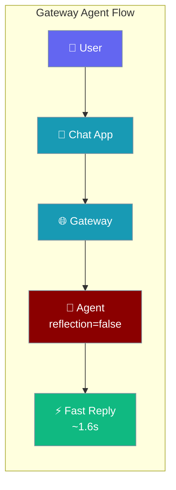
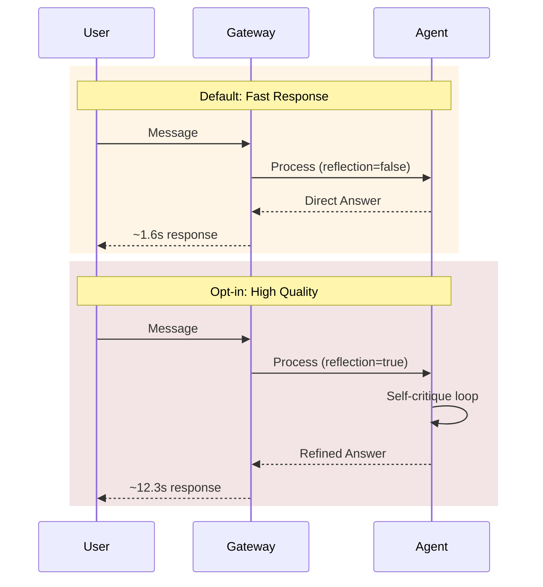

Gateway agents use chat-optimised defaults to ensure fast response times for interactive chat applications.



## Quick Start

<Steps>
<Step title="Fast by default">
Create a minimal `bot.yaml` with fast defaults:

```yaml
agents:
  assistant:
    instructions: "You are a helpful AI assistant."
    model: gpt-4o-mini
```

Response latency: ~1.6 seconds on short prompts.
</Step>

<Step title="Opt in to reflection">
Add reflection for higher quality responses:

```yaml
agents:
  assistant:
    instructions: "You are a helpful AI assistant."
    model: gpt-4o-mini
    reflection: true   # opt-in: enables self-critique
```

Response latency: ~12.3 seconds (8x slower for better quality).
</Step>
</Steps>

---

## How It Works

Gateway agents optimize for chat channel performance with different flow patterns:



| Mode | Reflection | Latency | Quality |
|------|-----------|---------|---------|
| **Fast** (default) | `false` | ~1.6s | Direct response |
| **Quality** (opt-in) | `true` | ~12.3s | Self-critiqued response |

---

## Configuration Options

Gateway agents loaded from YAML use chat-optimised defaults:

| YAML key | Gateway default | SDK default | Why different |
|---|---|---|---|
| `reflection` | `false` | `false` | Chat channels need sub-second replies |
| `tool_choice` | `null` (auto) | `null` (auto) | Let LLM decide when to call tools |
| `allow_delegation` | `false` | `false` | Prevents routing unless opted in |

---

## Common Patterns

### Plain Chat Assistant
```yaml
agents:
  assistant:
    instructions: "You are a helpful AI assistant."
    model: gpt-4o-mini
    # reflection defaults to false - fast responses
```

### High-Quality Q&A Bot
```yaml
agents:
  expert:
    instructions: "You are an expert consultant. Think carefully before answering."
    model: gpt-4o
    reflection: true  # opt-in for quality over speed
```

### Mixed Agent Configuration
```yaml
agents:
  quickhelp:
    instructions: "Handle basic questions quickly."
    model: gpt-4o-mini
    # reflection=false (default) - fast responses
    
  research:
    instructions: "Conduct thorough research and analysis."
    model: gpt-4o
    reflection: true  # enable self-critique for research
```

---

## Best Practices

<AccordionGroup>
<Accordion title="Default is fast — only enable reflection when quality matters more than latency">
Gateway agents default to `reflection: false` because chat applications prioritize response speed. Enable reflection only for agents handling complex analysis or research tasks.
</Accordion>

<Accordion title="Measure before opting in: reflection adds 1..max_reflect=3 extra LLM round-trips per message">
Each reflection cycle requires additional API calls. For `gpt-4o-mini`, this increases latency from ~1.6s to ~12.3s. Test your specific use case to validate the quality improvement justifies the speed tradeoff.
</Accordion>

<Accordion title="Use reflection selectively per agent, not globally">
Configure reflection per agent based on their role. Quick support agents should stay fast, while research or analysis agents benefit from reflection.
</Accordion>

<Accordion title="For background / long-form tasks use the Python SDK directly — it has different defaults suited to that use case">
Gateway defaults optimize for interactive chat. For batch processing, long-running tasks, or non-interactive workflows, use the Python SDK directly where different performance characteristics apply.
</Accordion>
</AccordionGroup>

---

## Related

<CardGroup cols={2}>
<Card title="Gateway" icon="gateway" href="/docs/gateway">
  Gateway configuration and deployment
</Card>
<Card title="Reflection" icon="rotate" href="/docs/concepts/reflection">
  Understanding reflection and self-critique
</Card>
<Card title="Bot OS" icon="robot" href="/docs/concepts/bot-os">
  Bot operating system concepts
</Card>
<Card title="Messaging Bots" icon="message-square" href="/docs/features/messaging-bots">
  Chat platform integrations
</Card>
</CardGroup>