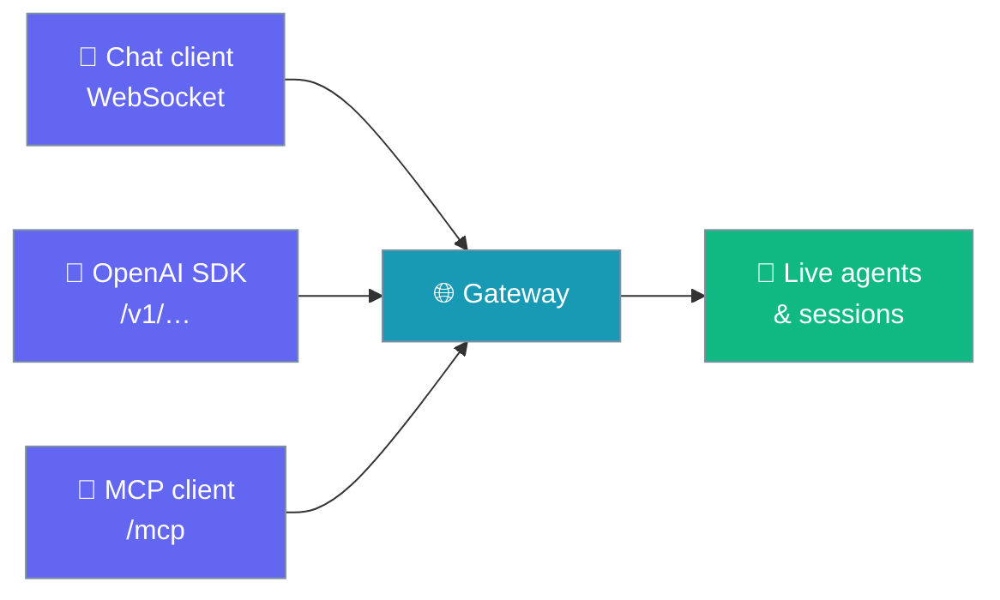
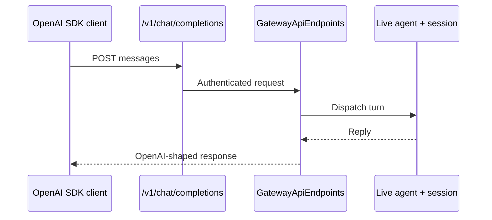
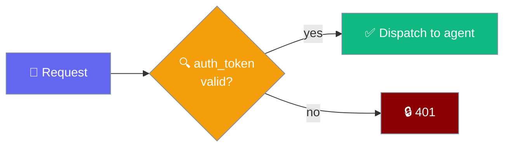

Turn the running gateway into an OpenAI-compatible and MCP endpoint so SDK clients and MCP tools reach the same live agents as chat users.



One process, one agent state, three protocols. This is different from `praisonai serve openai`, which runs a separate standalone OpenAI-only process.

## Quick Start

<Steps>
<Step title="Enable in gateway.yaml">
Add the `api` block to your gateway config:

```yaml
gateway:
  api:
    openai: true
    mcp: true
```
</Step>

<Step title="Start with CLI flags">
Enable the same surfaces from the command line:

```bash
praisonai gateway start --config gateway.yaml --openai-api --mcp
```
</Step>

<Step title="Enable in Python">
Pass constructor flags to the gateway:

```python
from praisonai.gateway import WebSocketGateway

WebSocketGateway(config=cfg, openai_api=True, mcp=True).start()
```
</Step>
</Steps>

---

## How It Works

Each API request dispatches into the gateway's own registered agents, sharing the same session store and admission gate as chat users.



| Step | What happens |
|------|--------------|
| **Resolve agent** | The `model` field selects a registered agent; falls back to the first agent |
| **Reuse session** | Each caller gets a stable session keyed by `OpenAI-Session` / `X-Session-Id` header or bearer token |
| **Admit turn** | The turn passes through the same admission gate as chat users |
| **Respond** | The reply is returned in OpenAI or MCP shape |

---

## Endpoints Exposed

| Surface | Method + Path | Notes |
|---------|---------------|-------|
| OpenAI chat | `POST /v1/chat/completions` | SSE streaming supported (`stream: true`) |
| OpenAI responses | `POST /v1/responses` | Accepts string or messages-style `input` |
| OpenAI models | `GET /v1/models` | Lists gateway-registered agent IDs |
| MCP JSON-RPC | `POST /mcp` | Methods: `initialize`, `tools/list`, `tools/call` |

Call the OpenAI surface with any standard client:

```python
from openai import OpenAI

client = OpenAI(base_url="http://127.0.0.1:8765/v1", api_key="gateway-token")
reply = client.chat.completions.create(
    model="assistant",
    messages=[{"role": "user", "content": "Hello"}],
)
print(reply.choices[0].message.content)
```

---

## Configuration Options

The `gateway.api` block maps to the `ApiConfig` dataclass. Both surfaces are opt-in; when both are `False` (default), no extra routes are mounted.

| Option | Type | Default | Description |
|--------|------|---------|-------------|
| `openai` | `bool` | `False` | Serve `/v1/chat/completions`, `/v1/responses`, `/v1/models` backed by the gateway's live agents and sessions. |
| `mcp` | `bool` | `False` | Serve an MCP JSON-RPC endpoint at `/mcp` exposing registered agents as callable tools. |

`ApiConfig` also exposes an `enabled` property (true if either surface is on), plus `to_dict()` and `from_dict()`.

<Card icon="code" href="/docs/sdk/reference/typescript/classes/ApiConfig">
  Full API surface
</Card>

---

## How Auth Works

Every API route is protected by the same `gateway.auth_token` as `/info` and `/metrics`.



The `/info` endpoint advertises which surfaces are enabled in its `api` field, so clients can introspect a running gateway before connecting.

---

## When to Use vs `praisonai serve openai`

<Note>
Use the gateway `api:` block when you want SDK clients and MCP tools to **share live agents and sessions** with chat users. Use `praisonai serve openai` when you want a **standalone, lightweight OpenAI-only process** with no gateway state. See [OpenAI-Compatible Server](/docs/features/openai-compatible-server).
</Note>

| Need | Choose |
|------|--------|
| SDK clients share chat users' live sessions | Gateway `api:` block |
| Standalone OpenAI-only endpoint | `praisonai serve openai` |
| Expose gateway agents as MCP tools | Gateway `api.mcp` |

---

## Best Practices

<AccordionGroup>
<Accordion title="Keep surfaces off unless needed">
Leave `openai: false` and `mcp: false` (the defaults) unless a client needs them. Disabled surfaces mount no routes and leave the gateway unchanged.
</Accordion>

<Accordion title="Protect with auth_token in production">
Every `/v1/*` and `/mcp` route uses the same `gateway.auth_token`. Set a strong token when binding to any non-loopback interface.
</Accordion>

<Accordion title="Pin conversations with a session header">
Pass an `OpenAI-Session` or `X-Session-Id` header to reuse one agent session across calls. Without it, stateless callers get a fresh session per request.
</Accordion>

<Accordion title="Introspect surfaces with /info">
`GET /info` returns an `api` field listing enabled surfaces, so tooling can confirm what a gateway exposes before dispatching.
</Accordion>
</AccordionGroup>

---

## Related

<CardGroup cols={2}>
<Card title="Gateway" icon="gateway" href="/docs/gateway">
  Gateway architecture and YAML configuration
</Card>
<Card title="OpenAI-Compatible Server" icon="cpu" href="/docs/features/openai-compatible-server">
  Standalone OpenAI-only server process
</Card>
<Card title="MCP Integration" icon="plug" href="/docs/mcp/mcp-server">
  Model Context Protocol servers and clients
</Card>
<Card title="Gateway CLI" icon="terminal" href="/docs/features/gateway-cli">
  CLI commands for managing the gateway
</Card>
</CardGroup>
