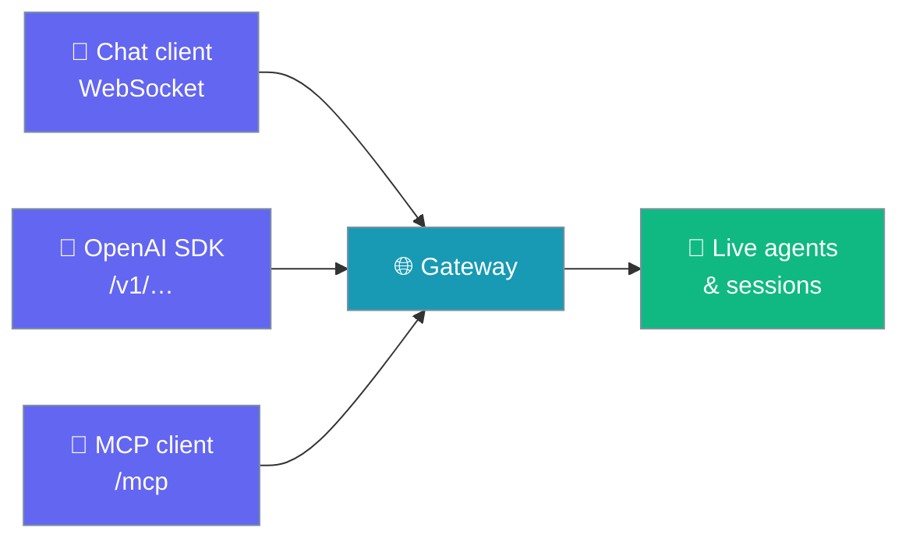
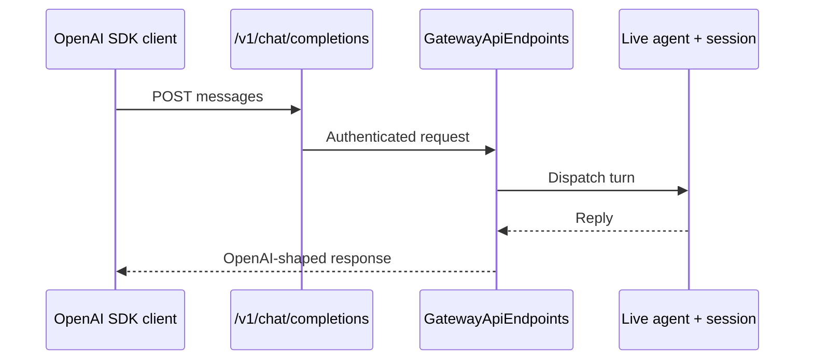
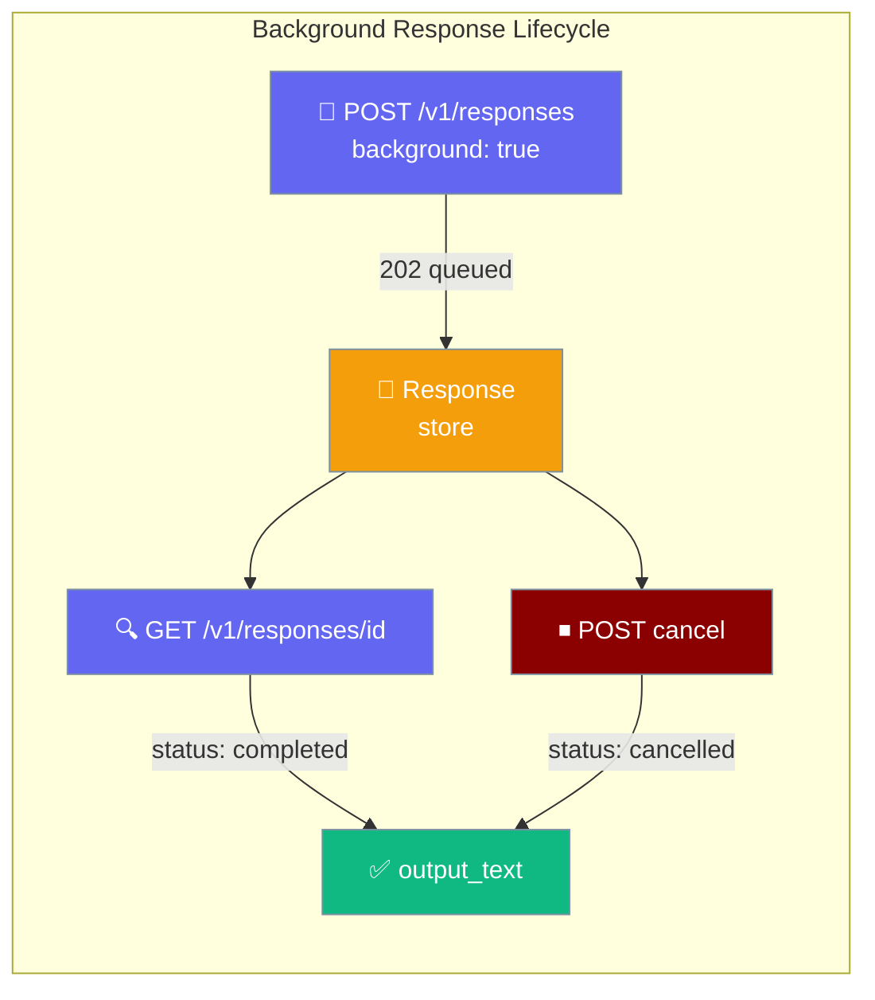
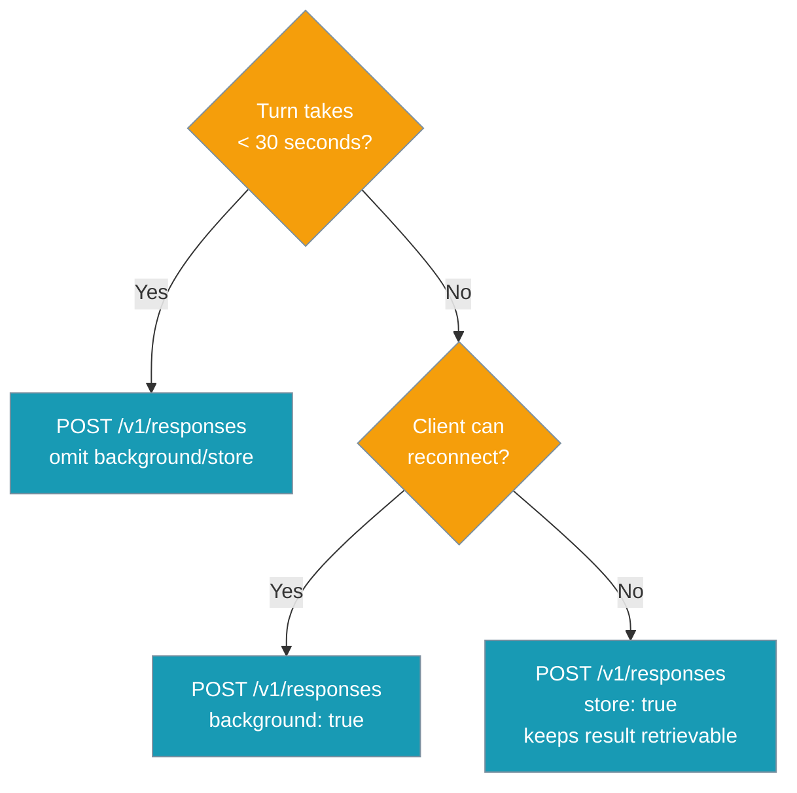
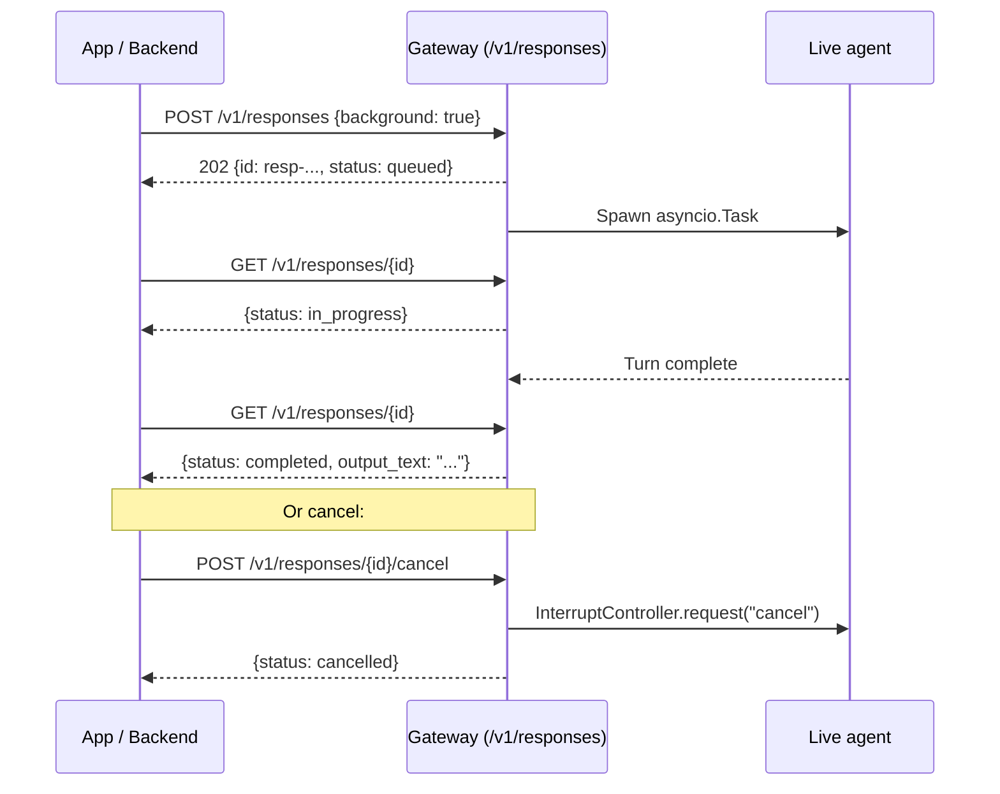
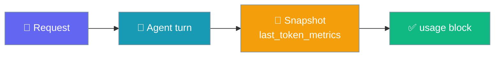
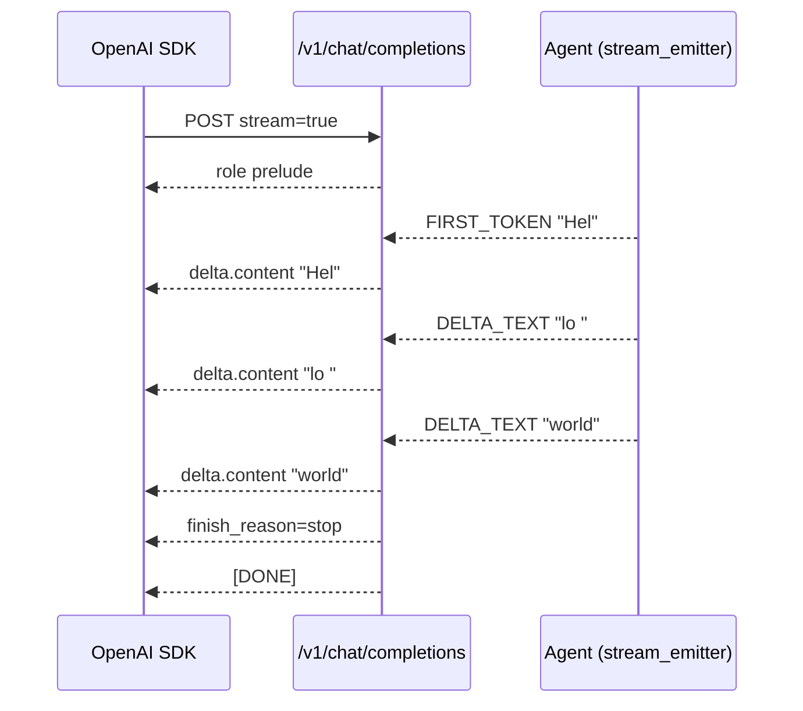
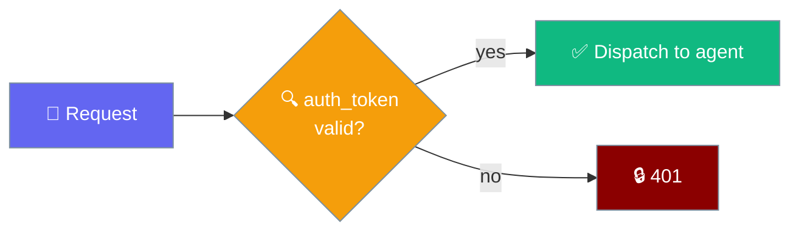

Turn the running gateway into an OpenAI-compatible and MCP endpoint so SDK clients and MCP tools reach the same live agents as chat users.


```mermaid
graph LR
    Chat[💬 Chat client<br/>WebSocket] --> GW[🌐 Gateway]
    SDK[🧩 OpenAI SDK<br/>/v1/…] --> GW
    MCP[🔌 MCP client<br/>/mcp] --> GW
    GW --> Live[🤖 Live agents<br/>& sessions]

    classDef client fill:#6366F1,stroke:#7C90A0,color:#fff
    classDef gateway fill:#189AB4,stroke:#7C90A0,color:#fff
    classDef agents fill:#10B981,stroke:#7C90A0,color:#fff

    class Chat,SDK,MCP client
    class GW gateway
    class Live agents
```

One process, one agent state, three protocols. This is different from `praisonai serve openai`, which runs a separate standalone OpenAI-only process.

## Quick Start

<Steps>
<Step title="Enable in gateway.yaml">
Add the `api` block to your gateway config:

```yaml
gateway:
  api:
    openai: true
    mcp: true
```
</Step>

<Step title="Start with CLI flags">
Enable the same surfaces from the command line:

```bash
praisonai gateway start --config gateway.yaml --openai-api --mcp
```
</Step>

<Step title="Enable in Python">
Pass constructor flags to the gateway:

```python
from praisonai.gateway import WebSocketGateway

WebSocketGateway(config=cfg, openai_api=True, mcp=True).start()
```
</Step>
</Steps>

---

## How It Works

Each API request dispatches into the gateway's own registered agents, sharing the same session store and admission gate as chat users.


```mermaid
sequenceDiagram
    participant SDK as OpenAI SDK client
    participant API as /v1/chat/completions
    participant EP as GatewayApiEndpoints
    participant Agent as Live agent + session

    SDK->>API: POST messages
    API->>EP: Authenticated request
    EP->>Agent: Dispatch turn
    Agent-->>EP: Reply
    EP-->>SDK: OpenAI-shaped response
```

| Step | What happens |
|------|--------------|
| **Resolve agent** | The `model` field selects a registered agent; falls back to the first agent |
| **Reuse session** | Each caller gets a stable session keyed by `OpenAI-Session` / `X-Session-Id` header or bearer token |
| **Admit turn** | The turn passes through the same admission gate as chat users |
| **Respond** | The reply is returned in OpenAI or MCP shape |

---

## Endpoints Exposed

| Surface | Method + Path | Notes |
|---------|---------------|-------|
| OpenAI chat | `POST /v1/chat/completions` | SSE streaming supported (`stream: true`); real `usage` returned; opt-in streamed usage via `stream_options.include_usage`; opt-in token-level `delta.content` frames via `gateway.api.stream` (default off keeps single-chunk buffered behaviour) |
| OpenAI responses (sync) | `POST /v1/responses` | Default — blocks for the whole turn; accepts string or messages-style `input`; returns `status: "completed"` with `usage` in Responses-native shape |
| OpenAI responses (async) | `POST /v1/responses` with `background: true` or `store: true` | Returns `202` immediately with `status: "queued"` and a persisted `id` |
| OpenAI response retrieve | `GET /v1/responses/{id}` | Fetches the current status + output of a background/stored run |
| OpenAI response cancel | `POST /v1/responses/{id}/cancel` | Stops an in-flight background run cooperatively |
| OpenAI models | `GET /v1/models` | Lists gateway-registered agent IDs |
| MCP JSON-RPC | `POST /mcp` | Methods: `initialize`, `tools/list`, `tools/call` |

Call the OpenAI surface with any standard client:

```python
from openai import OpenAI

client = OpenAI(base_url="http://127.0.0.1:8765/v1", api_key="gateway-token")
reply = client.chat.completions.create(
    model="assistant",
    messages=[{"role": "user", "content": "Hello"}],
)
print(reply.choices[0].message.content)
```

---

## Background Runs

Submit long agent turns in the background, retrieve the result by id, and cancel in-flight runs — over the same OpenAI-compatible surface.


```mermaid
graph LR
    subgraph "Background Response Lifecycle"
        Submit[📝 POST /v1/responses<br/>background: true] -->|202 queued| Store[💾 Response<br/>store]
        Store --> Poll[🔍 GET /v1/responses/id]
        Poll -->|status: completed| Result[✅ output_text]
        Store --> Cancel[⏹ POST cancel]
        Cancel -->|status: cancelled| Result
    end

    classDef request fill:#6366F1,stroke:#7C90A0,color:#fff
    classDef store fill:#F59E0B,stroke:#7C90A0,color:#fff
    classDef result fill:#10B981,stroke:#7C90A0,color:#fff
    classDef cancel fill:#8B0000,stroke:#7C90A0,color:#fff

    class Submit,Poll request
    class Store store
    class Result result
    class Cancel cancel
```

The synchronous path is unchanged and remains the default — omit `background` and `store` to keep the exact previous behaviour.

### Which mode fits


```mermaid
graph TB
    Q1{Turn takes<br/>&lt; 30 seconds?}
    Q1 -->|Yes| Sync[POST /v1/responses<br/>omit background/store]
    Q1 -->|No| Q2{Client can<br/>reconnect?}
    Q2 -->|Yes| Async[POST /v1/responses<br/>background: true]
    Q2 -->|No| Store[POST /v1/responses<br/>store: true<br/>keeps result retrievable]

    classDef question fill:#F59E0B,stroke:#7C90A0,color:#fff
    classDef choice fill:#189AB4,stroke:#7C90A0,color:#fff

    class Q1,Q2 question
    class Sync,Async,Store choice
```

### Quick Start

<Steps>
<Step title="Submit in the background">
```python
import requests

resp = requests.post(
    "http://127.0.0.1:8765/v1/responses",
    headers={"Authorization": "Bearer gateway-token"},
    json={"model": "assistant", "input": "Write me a long essay", "background": True},
)
run_id = resp.json()["id"]
print(resp.status_code, resp.json()["status"])   # 202 queued
```
</Step>

<Step title="Poll until terminal">
```python
import time, requests

while True:
    got = requests.get(
        f"http://127.0.0.1:8765/v1/responses/{run_id}",
        headers={"Authorization": "Bearer gateway-token"},
    ).json()
    if got["status"] in ("completed", "cancelled", "failed"):
        break
    time.sleep(2)
print(got["output_text"])
```
</Step>

<Step title="Cancel if needed">
```python
import requests

requests.post(
    f"http://127.0.0.1:8765/v1/responses/{run_id}/cancel",
    headers={"Authorization": "Bearer gateway-token"},
)
```
</Step>
</Steps>

### User Flow


```mermaid
sequenceDiagram
    participant App as App / Backend
    participant GW as Gateway (/v1/responses)
    participant Agent as Live agent

    App->>GW: POST /v1/responses {background: true}
    GW-->>App: 202 {id: resp-..., status: queued}
    GW->>Agent: Spawn asyncio.Task
    App->>GW: GET /v1/responses/{id}
    GW-->>App: {status: in_progress}
    Agent-->>GW: Turn complete
    App->>GW: GET /v1/responses/{id}
    GW-->>App: {status: completed, output_text: "..."}

    Note over App,GW: Or cancel:
    App->>GW: POST /v1/responses/{id}/cancel
    GW->>Agent: InterruptController.request("cancel")
    GW-->>App: {status: cancelled}
```

### Status Vocabulary

| Status | Meaning |
|--------|---------|
| `queued` | Submitted; the driving task has not started yet (immediately after `202`) |
| `in_progress` | Task is running the agent turn |
| `completed` | Turn finished; `output`, `output_text`, `usage` are populated |
| `cancelled` | The run's cancel route (or task cancel) fired before completion |
| `failed` | The turn raised an exception, or the admission gate rejected it (`error.message` explains) |

A `completed` response always carries an assistant message (even with empty `text`), so a client reading `output[0]` keeps working. Polling the same completed response returns the same `output[0].id` each time.

### Response Object

```json
{
  "id": "resp-<hex>",
  "object": "response",
  "created_at": 1727612345,
  "model": "<agent_id>",
  "status": "queued|in_progress|completed|cancelled|failed",
  "output": [
    { "id": "msg-<hex>", "type": "message", "role": "assistant",
      "content": [{"type": "output_text", "text": "..."}] }
  ],
  "output_text": "...",
  "usage": { "input_tokens": 0, "output_tokens": 0, "total_tokens": 0 },
  "error": { "message": "..." }
}
```

The `error` block appears only when `status` is `failed`. A `GET` on an unknown id returns `404` with `{"error": {"type": "invalid_request_error", "message": "No such response: resp-…"}}`.

<Note>
When the caller uses a stable identity (a bearer token, or an `OpenAI-Session` / `X-Session-Id` header), only that caller can retrieve or cancel their own background runs. A different token receives `404` (not `403`, to avoid leaking id existence). Anonymous callers on auth-disabled gateways are looked up by id alone — the same open posture that applies to every `/v1/*` route without auth.
</Note>

<Warning>
Background responses live in a bounded in-process store (cap: 1024 entries). When full, the oldest terminal entry (completed/cancelled/failed) is evicted first; in-flight runs are never evicted. Results do not survive a gateway restart — this is intentional for now; durable cross-restart persistence is tracked separately.
</Warning>

Both new routes go through the same `_api_guarded` wrapper as `POST /v1/responses` (gated by `gateway.auth_token`) and only mount when `gateway.api.openai = true`.

---

## Token Usage

Every response reports real per-turn token counts from the agent's LLM instance.


```mermaid
graph LR
    Req[📨 Request] --> Turn[🤖 Agent turn]
    Turn --> Snap[📸 Snapshot<br/>last_token_metrics]
    Snap --> Usage[✅ usage block]

    classDef req fill:#6366F1,stroke:#7C90A0,color:#fff
    classDef turn fill:#189AB4,stroke:#7C90A0,color:#fff
    classDef snap fill:#F59E0B,stroke:#7C90A0,color:#fff
    classDef usage fill:#10B981,stroke:#7C90A0,color:#fff

    class Req req
    class Turn turn
    class Snap snap
    class Usage usage
```

Each surface reports usage in its own OpenAI-native shape:

| Surface | `usage` shape |
|---------|---------------|
| `/v1/chat/completions` | `{prompt_tokens, completion_tokens, total_tokens}` (OpenAI Chat Completions) |
| `/v1/responses` | `{input_tokens, output_tokens, total_tokens}` (OpenAI Responses-native) |

When an agent exposes no LLM metrics, `usage` falls back to zeros in the correct spec shape, so clients never need to special-case a missing block.

### Streamed usage

Opt in with `stream_options.include_usage: true` to receive a streamed `usage` chunk — the same contract OpenAI's own API uses.

```python
from openai import OpenAI

client = OpenAI(base_url="http://127.0.0.1:8765/v1", api_key="gateway-token")
stream = client.chat.completions.create(
    model="assistant",
    messages=[{"role": "user", "content": "Hello"}],
    stream=True,
    stream_options={"include_usage": True},
)
for chunk in stream:
    if chunk.usage:
        print(chunk.usage)  # final chunk: real prompt/completion/total tokens
```

The `usage`-only chunk is emitted right before `data: [DONE]`. Without `include_usage`, the stream frames are unchanged and no extra chunk is sent. This is orthogonal to token-level streaming below — it works with or without it.

### Token-level streaming (opt-in)

Enable `gateway.api.stream` to emit each `DELTA_TEXT` / `FIRST_TOKEN` piece as its own `chat.completion.chunk` with `delta.content`, so time-to-first-content matches token latency instead of full-turn latency.


```mermaid
sequenceDiagram
    participant Client as OpenAI SDK
    participant SSE as /v1/chat/completions
    participant Agent as Agent (stream_emitter)

    Client->>SSE: POST stream=true
    SSE-->>Client: role prelude
    Agent-->>SSE: FIRST_TOKEN "Hel"
    SSE-->>Client: delta.content "Hel"
    Agent-->>SSE: DELTA_TEXT "lo "
    SSE-->>Client: delta.content "lo "
    Agent-->>SSE: DELTA_TEXT "world"
    SSE-->>Client: delta.content "world"
    SSE-->>Client: finish_reason=stop
    SSE-->>Client: [DONE]
```

Default is **off**: without opt-in the SSE surface is byte-for-byte the previous single buffered chunk, so existing clients keep working unchanged.

Enable it in `gateway.yaml`:

```yaml
gateway:
  api:
    openai: true
    stream: true   # opt-in token-level SSE on /v1/chat/completions
```

Or in Python:

```python
from praisonai.gateway import WebSocketGateway
from praisonaiagents.gateway import ApiConfig

WebSocketGateway(
    config=cfg,
    api=ApiConfig(openai=True, stream=True),
).start()
```

Consume it from any standard OpenAI client — no client-side change needed:

```python
from openai import OpenAI

client = OpenAI(base_url="http://127.0.0.1:8765/v1", api_key="gateway-token")
stream = client.chat.completions.create(
    model="assistant",
    messages=[{"role": "user", "content": "Write a haiku about the sea"}],
    stream=True,
)
for chunk in stream:
    delta = chunk.choices[0].delta
    if delta.content:
        print(delta.content, end="", flush=True)  # arrives token-by-token
```

Behaviour guarantees:

| Guarantee | What it means |
|-----------|---------------|
| **Same frame envelope** | The role prelude, `finish_reason: "stop"` terminator, `stream_options.include_usage`, and `[DONE]` sentinel are all preserved. |
| **No-delta fallback** | If the agent emits no token deltas, the buffered reply is still delivered as one `delta.content` frame — nothing is lost, even for an empty reply. |
| **Reasoning filtered** | Thinking/reasoning deltas are excluded from the answer stream. |
| **Concurrent isolation** | A per-turn guard ensures two callers sharing one agent never receive each other's tokens. |

---

## Configuration Options

The `gateway.api` block maps to the `ApiConfig` dataclass. All three flags are opt-in; when `openai` and `mcp` are both `False` (default), no extra routes are mounted.

| Option | Type | Default | Description |
|--------|------|---------|-------------|
| `openai` | `bool` | `False` | Serve `/v1/chat/completions`, `/v1/responses`, `/v1/models` backed by the gateway's live agents and sessions. |
| `mcp` | `bool` | `False` | Serve an MCP JSON-RPC endpoint at `/mcp` exposing registered agents as callable tools. |
| `stream` | `bool` | `False` | Emit true token-level `delta.content` frames on `/v1/chat/completions` SSE by wiring the agent's `stream_emitter` through the gateway hot path. Off by default: streaming responses stay byte-for-byte the buffered single-chunk path. |

`ApiConfig` also exposes an `enabled` property (true if either surface is on), plus `to_dict()` and `from_dict()`.

<Card icon="code" href="/sdk/reference/typescript/modules/tools">
  Full API surface
</Card>

---

## How Auth Works

Every API route is protected by the same `gateway.auth_token` as `/info` and `/metrics`.


```mermaid
graph LR
    Req[📨 Request] --> Check{🔍 auth_token<br/>valid?}
    Check -->|yes| Route[✅ Dispatch to agent]
    Check -->|no| Deny[🔒 401]

    classDef req fill:#6366F1,stroke:#7C90A0,color:#fff
    classDef check fill:#F59E0B,stroke:#7C90A0,color:#fff
    classDef ok fill:#10B981,stroke:#7C90A0,color:#fff
    classDef deny fill:#8B0000,stroke:#7C90A0,color:#fff

    class Req req
    class Check check
    class Route ok
    class Deny deny
```

The `/info` endpoint advertises which surfaces are enabled in its `api` field, so clients can introspect a running gateway before connecting.

---

## When to Use vs `praisonai serve openai`

<Note>
Use the gateway `api:` block when you want SDK clients and MCP tools to **share live agents and sessions** with chat users. Use `praisonai serve openai` when you want a **standalone, lightweight OpenAI-only process** with no gateway state. See [OpenAI-Compatible Server](/features/openai-compatible-server).
</Note>

| Need | Choose |
|------|--------|
| SDK clients share chat users' live sessions | Gateway `api:` block |
| Standalone OpenAI-only endpoint | `praisonai serve openai` |
| Expose gateway agents as MCP tools | Gateway `api.mcp` |

---

## Best Practices

<AccordionGroup>
<Accordion title="Keep surfaces off unless needed">
Leave `openai: false` and `mcp: false` (the defaults) unless a client needs them. Disabled surfaces mount no routes and leave the gateway unchanged.
</Accordion>

<Accordion title="Protect with auth_token in production">
Every `/v1/*` and `/mcp` route uses the same `gateway.auth_token`. Set a strong token when binding to any non-loopback interface.
</Accordion>

<Accordion title="Pin conversations with a session header">
Pass an `OpenAI-Session` or `X-Session-Id` header to reuse one agent session across calls. Without it, stateless callers get a fresh session per request.
</Accordion>

<Accordion title="Introspect surfaces with /info">
`GET /info` returns an `api` field listing enabled surfaces, so tooling can confirm what a gateway exposes before dispatching.
</Accordion>

<Accordion title="Enable streamed usage for cost accounting">
Pass `stream_options={"include_usage": True}` when using `stream=True` if your client tracks cost per response. The extra chunk arrives right before `[DONE]` and carries real per-turn totals.
</Accordion>

<Accordion title="Usage is per-turn, even under concurrent sessions">
The gateway snapshots the agent's per-turn token metrics in the same execution context that produced the reply, so a `usage` field returned to one caller cannot be corrupted by a concurrent turn on the same shared agent. No configuration required.
</Accordion>

<Accordion title="Run long turns in the background">
Any turn that could exceed the client's HTTP timeout is a candidate. `POST /v1/responses` with `background: true` returns a persisted id in ~milliseconds; poll `GET /v1/responses/{id}` at a comfortable interval (2–5s) until `status` is terminal. If the caller loses connectivity, the run keeps going and the result is still retrievable by id (subject to the in-process store cap).
</Accordion>

<Accordion title="Set a bearer token to scope background runs">
Owner-scoped retrieval only kicks in when the caller has a stable identity. Anonymous callers on auth-disabled gateways are looked up by id alone. Set `gateway.auth_token` in any deployment where multiple clients share the same gateway.
</Accordion>

<Accordion title="Cancel is cooperative">
`/cancel` fires the same interrupt seam as the WebSocket `/stop` path — the agent checks it at its own checkpoints and stops between LLM calls / tool calls. A tight, non-yielding loop inside a tool won't stop until it yields; the task-cancel fallback covers most cases but not synchronous CPU-bound work.
</Accordion>
</AccordionGroup>

---

## Related

<CardGroup cols={2}>
<Card title="Gateway" icon="gateway" href="/gateway">
  Gateway architecture and YAML configuration
</Card>
<Card title="OpenAI-Compatible Server" icon="cpu" href="/features/openai-compatible-server">
  Standalone OpenAI-only server process
</Card>
<Card title="MCP Integration" icon="plug" href="/mcp/mcp-server">
  Model Context Protocol servers and clients
</Card>
<Card title="Gateway CLI" icon="terminal" href="/features/gateway-cli">
  CLI commands for managing the gateway
</Card>
</CardGroup>
