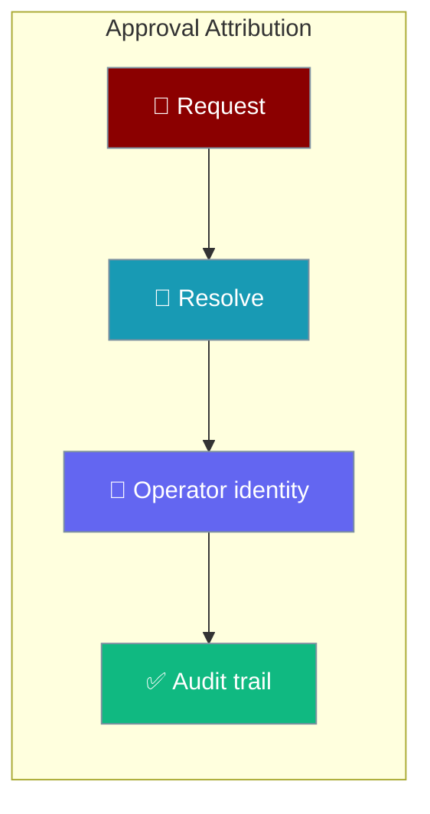
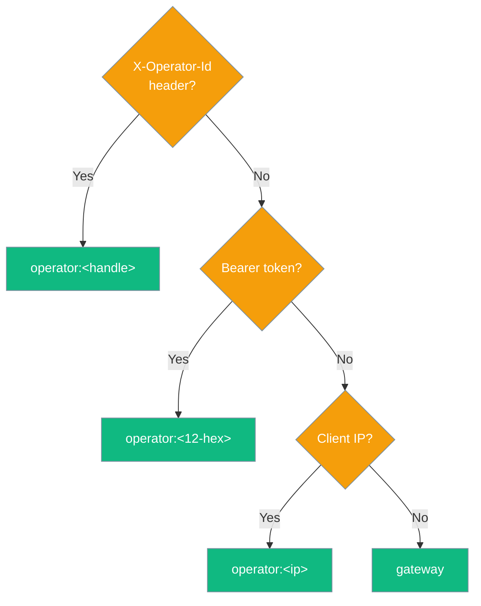
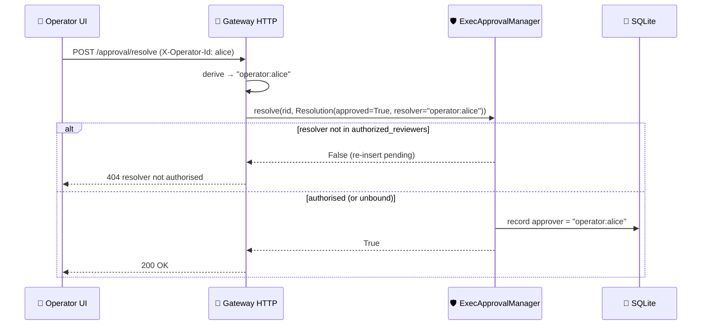

Every resolved gateway approval records **which** operator approved it, and a request can optionally be bound to a specific reviewer so only they can resolve it.



## Quick Start

<Steps>
<Step title="Approve — attribution is automatic">
The gateway captures the resolving operator on the audit trail. No extra code is needed on the agent side.

```python
from praisonaiagents import Agent

agent = Agent(
    name="Deployer",
    instructions="Deploy safely",
    approval=True,
)
agent.start("Deploy the release candidate to prod")
```
</Step>

<Step title="Bind a request to specific reviewers">
Pass `authorized_reviewers` so only listed operators can resolve the request.

```python
from praisonaiagents.approval import ApprovalRequest

request = ApprovalRequest(
    tool_name="deploy",
    arguments={"target": "prod"},
    risk_level="high",
    agent_name="deployer",
    authorized_reviewers=["operator:alice", "operator:oncall"],
)
```
</Step>
</Steps>

---

## How Resolver Identity Is Captured

The `POST /approval/resolve` endpoint derives a non-secret operator identity from the authenticated request, in this precedence order.



| Order | Source | Identity string |
|-------|--------|-----------------|
| 1 | `X-Operator-Id` header (trimmed to 64 chars) | `operator:<handle>` |
| 2 | Short SHA-256 digest of the bearer token | `operator:<12-hex>` |
| 3 | Client IP | `operator:<ip>` |
| 4 | Fallback | `gateway` |

Set `X-Operator-Id` from a proxy or SSO layer so operators sharing one gateway token still get distinct audit attribution. Holders of the same token collapse to one token-digest identity by design.

```bash
curl -X POST -H "Authorization: Bearer $OPS_TOKEN" \
  -H "X-Operator-Id: alice" \
  -H "Content-Type: application/json" \
  -d '{"request_id": "apr-1a2b3c4d", "approved": true}' \
  http://localhost:8080/approval/resolve
```

The identity flows into `Resolution.resolver` and is recorded on the audit trail and the allow-always grant. When no resolver is supplied, attribution falls back to the legacy `"gateway"` / `"gateway:human"` constant.

---

## Per-request Reviewer Custody

Bind an approval to specific reviewers so only they can resolve it.



| Behaviour | Detail |
|---|---|
| Unauthorised resolver | Receives `404` with `{"error": "Request not found, already resolved, or resolver not authorised"}` and the request stays pending |
| First-answer-wins | Preserved between authorised reviewers via the atomic pop |
| Durability | The binding survives a gateway restart (persisted and rehydrated by the SQLite store) |

<Note>
The `404` for an unauthorised resolver uses the same status as "not found" so the caller cannot enumerate request IDs.
</Note>

---

## Best Practices

<AccordionGroup>
<Accordion title="Stamp X-Operator-Id at your proxy or SSO layer">
Operators sharing one gateway token collapse to a single token-digest identity. Stamp `X-Operator-Id` per user upstream so each decision is attributed to an individual.
</Accordion>

<Accordion title="Use reviewer custody for high-risk requests">
The `APPROVALS` scope is coarse — any holder may resolve any request. Bind high-risk requests to named reviewers with `authorized_reviewers`.
</Accordion>

<Accordion title="Read the approver field in audit reports">
For gateway-resolved requests, `approver` now carries the real principal, so reports can answer "who approved this exec?".
</Accordion>
</AccordionGroup>

---

## Related

<CardGroup cols={2}>
<Card title="Gateway Scoped Approvals" icon="user-lock" href="/features/gateway-scoped-approvals">
  Durable, agent-scoped allow-always grants
</Card>
<Card title="Gateway Operator Scopes" icon="user-lock" href="/features/gateway-operator-scopes">
  Coarse authorisation for admin endpoints
</Card>
<Card title="Gateway Approval Durability" icon="database" href="/features/gateway-approval-durability">
  Pending approvals survive restart
</Card>
<Card title="Audit Logging" icon="scroll" href="/features/audit-logging">
  The approver field on audit entries
</Card>
</CardGroup>
