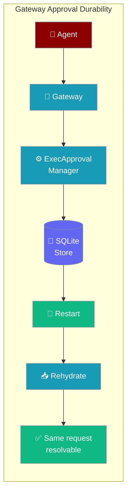
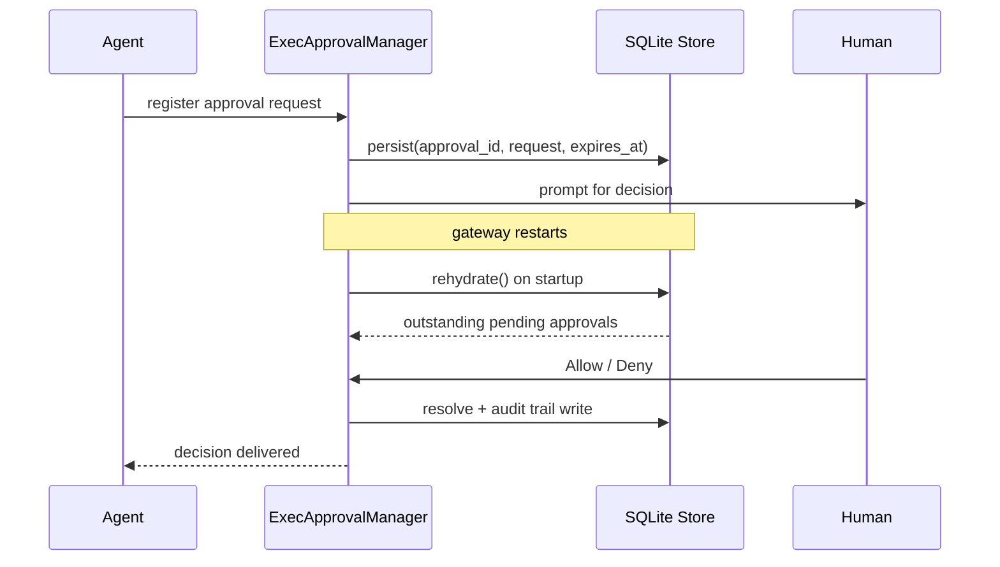
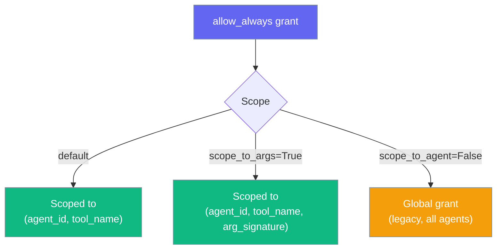

Turn on `PRAISONAI_GATEWAY_DURABLE_APPROVALS=1` so pending approvals and "allow-always" grants survive a gateway restart.



## Quick Start

<Steps>
<Step title="Turn it on">
One env var enables durability — no code changes needed:

```bash
export PRAISONAI_GATEWAY_DURABLE_APPROVALS=1
praisonai gateway start
```

Accepted truthy values: `1`, `true`, `yes`, `on` (case-insensitive). Anything else keeps the default in-memory behaviour.
</Step>

<Step title="Agent-centric example">
```python
from praisonaiagents import Agent

agent = Agent(
    name="Ops",
    instructions="You are a careful ops assistant. Ask before destructive commands.",
    tools=["shell_exec"],
)

agent.start("Clean up /tmp/cache")
# The gateway asks the human once, they choose "Allow always for this agent".
# Restart the gateway — the grant is still there. The agent runs without a re-prompt.
```
</Step>
</Steps>

---

## How It Works



| Step | What happens |
|------|-------------|
| `register` | Request is persisted to SQLite before the human is prompted |
| `rehydrate()` | On startup, outstanding requests are restored with their **original expiry** |
| `resolve` | Every decision (approved / denied / expired) is written to the audit trail |
| `allow_always` | Scoped grants persist in a separate allowlist store, scoped per agent |

---

## Configuration

| Setting | Value | Notes |
|---------|-------|-------|
| `PRAISONAI_GATEWAY_DURABLE_APPROVALS` | `1` / `true` / `yes` / `on` | Enables durable mode. Default: off (in-memory) |
| `PRAISONAI_HOME` | Any path | Overrides the state root. Default: `~/.praisonai` |

### Default persistence paths

| File | Contents |
|------|----------|
| `~/.praisonai/state/approvals.sqlite` | Pending approvals + audit trail (approved / denied / expired) |
| `~/.praisonai/state/gateway/approvals.sqlite` | Scoped `allow_always` grants `(agent_id, tool_name, arg_signature)` |

Override the root with `PRAISONAI_HOME`:

```bash
export PRAISONAI_HOME=/var/lib/praisonai
# Stores will be created under /var/lib/praisonai/state/
```

---

## Programmatic Override

```python
from praisonai.gateway import create_exec_approval_manager
from praisonai.bots import ApprovalStore

manager = create_exec_approval_manager(
    ttl=600,
    store=ApprovalStore(path="/var/lib/praisonai/approvals.sqlite"),
    allowlist_path="/var/lib/praisonai/allow.json",
)
```

`ExecApprovalManager` constructor knobs:

| Parameter | Type | Default | Description |
|-----------|------|---------|-------------|
| `ttl` | `float` | `300.0` | Seconds before a pending approval expires |
| `store` | `ApprovalStoreProtocol` | `None` | Durable queue store; `None` means in-memory |
| `allowlist_path` | `str \| Path` | `None` | Path to the JSON allow-list file |

---

## What Happens on Restart

<Note>
Rehydrated pending requests keep their **original expiry** — a restart does not reset the TTL clock. A request that had 30 seconds left still has 30 seconds after rehydration.
</Note>

- **No live awaiter**: the awaiting agent call was lost with the previous process. Rehydrated requests stay visible via `list_pending()` and are resolvable via the gateway UI or API. The audit trail records the terminal state.
- **Expiry is preserved**: `rehydrate()` derives `created_at` from the stored `expires_at` minus `ttl`, so a nearly-expired approval is not inadvertently extended.
- **Fail-open startup**: a corrupted store logs the error and returns 0 — it never blocks gateway startup.
- **`allow_always` grants persist**: grants are written to the scoped allowlist store immediately and survive restarts without rehydration.

---

## Scoping of `allow_always` Grants

Grants default to being scoped to the requesting agent — granting `shell_exec` to `ops-agent` does not authorise `chat-agent`.



| Scope mode | Behaviour |
|-----------|-----------|
| Default (agent-scoped) | Grant applies only to the specific agent that requested it |
| `scope_to_args=True` | Narrows further to the exact argument signature |
| `scope_to_agent=False` | Legacy global grant — applies to all agents (not recommended) |

---

## Best Practices

<AccordionGroup>
<Accordion title="Enable in every production deployment">
Set `PRAISONAI_GATEWAY_DURABLE_APPROVALS=1` in your deployment environment. Without it, a gateway restart drops all pending approvals — agents waiting for a human decision receive `timeout`/`deny`.
</Accordion>

<Accordion title="Prefer scoped grants over global">
Default agent-scoped grants are safer: granting `shell_exec` to `ops-agent` does not silently authorise `chat-agent`. Reserve global grants only for tools that are truly safe for every agent.
</Accordion>

<Accordion title="Rotate SQLite files with host rotation">
Grants are stored per-host. When rotating to a new host, copy `~/.praisonai/state/*.sqlite` or regenerate grants — do not leave agents in a state where they re-prompt unnecessarily in production.
</Accordion>

<Accordion title="Combine with actor allow-lists for defence-in-depth">
Pair `PRAISONAI_GATEWAY_DURABLE_APPROVALS=1` with `PRAISONAI_APPROVAL_ACTORS` from the [Secure Approval Backend](/docs/features/approval-secure-backend) so that only authorised actors can approve persisted requests.
</Accordion>
</AccordionGroup>

---

## Related

<CardGroup cols={2}>
<Card title="Secure Approval Backend" icon="shield-check" href="/docs/features/approval-secure-backend">
  Actor-authorised approval backend with actor allow-lists
</Card>
<Card title="Gateway" icon="network" href="/docs/features/gateway">
  Gateway deployment and configuration
</Card>
<Card title="Durable Approvals (Bots)" icon="database" href="/docs/features/durable-approvals">
  SQLite-backed approval storage for messaging bots
</Card>
<Card title="Approval" icon="check-circle" href="/docs/features/approval">
  Default approval behaviour and backends
</Card>
</CardGroup>
