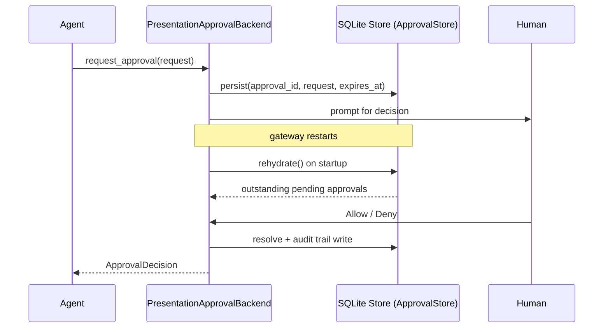

Use `--approval secure` so pending approvals survive a gateway restart — the SQLite-backed `PresentationApprovalBackend` persists every decision and rehydrates outstanding requests on startup.

```mermaid
graph LR
    subgraph "Gateway Approval Durability"
        Agent[🤖 Agent] --> Backend[🔒 PresentationApproval\nBackend]
        Backend --> Store[(💾 SQLite\nStore)]
        Store --> Restart[🔄 Restart]
        Restart --> Rehydrate[📥 rehydrate()]
        Rehydrate --> Resolve[✅ Same request\nresolvable]
    end

    classDef agent fill:#8B0000,stroke:#7C90A0,color:#fff
    classDef process fill:#189AB4,stroke:#7C90A0,color:#fff
    classDef storage fill:#6366F1,stroke:#7C90A0,color:#fff
    classDef result fill:#10B981,stroke:#7C90A0,color:#fff

    class Agent agent
    class Backend,Rehydrate process
    class Store storage
    class Restart,Resolve result
```

## Quick Start

<Steps>
<Step title="Set required env vars">
```bash
export PRAISONAI_APPROVAL_ACTORS="your-user-id"
export PRAISONAI_HOME=/var/lib/praisonai   # optional, overrides ~/.praisonai
```

`PRAISONAI_APPROVAL_ACTORS` is required — the secure backend refuses to start without at least one authorised actor.
</Step>

<Step title="Agent-centric example">
```python
from praisonaiagents import Agent

agent = Agent(
    name="Ops",
    instructions="You are a careful ops assistant. Ask before destructive commands.",
    approval="secure",
    tools=["shell_exec"],
)

agent.start("Clean up /tmp/cache")
# The gateway asks the human once. Restart the gateway — the pending request
# is rehydrated from SQLite and the human can still Allow or Deny.
```
</Step>

<Step title="CLI usage">
```bash
praisonai run --approval secure agent.py
```
</Step>
</Steps>

---

## How It Works



| Step | What happens |
|------|-------------|
| `persist` | Request is written to SQLite before the human is prompted |
| `rehydrate()` | On startup, outstanding requests are restored with their **original expiry** |
| `resolve` | Every decision (approved / denied / expired) is written to the audit trail |
| actor check | Only actors listed in `PRAISONAI_APPROVAL_ACTORS` may approve |

---

## Configuration

| Setting | Value | Notes |
|---------|-------|-------|
| `PRAISONAI_APPROVAL_ACTORS` | Comma-separated actor IDs | **Required** for `--approval secure`. Approvers not on this list are rejected. |
| `PRAISONAI_HOME` | Any path | Overrides the state root. Default: `~/.praisonai` |

### Default persistence paths

| File | Contents |
|------|----------|
| `~/.praisonai/state/approvals.sqlite` | Pending approvals + audit trail (approved / denied / expired) |

Override the root with `PRAISONAI_HOME`:

```bash
export PRAISONAI_HOME=/var/lib/praisonai
# Store will be created under /var/lib/praisonai/state/approvals.sqlite
```

---

## Programmatic Override

```python
from pathlib import Path
from praisonai.bots import ApprovalStore, PresentationApprovalBackend
from praisonaiagents import Agent
from praisonaiagents.approval import ApprovalConfig

store = ApprovalStore(path="/var/lib/praisonai/state/approvals.sqlite")
backend = PresentationApprovalBackend(
    store=store,
    allowed_actors={"user-123", "ops-team"},
    timeout=600,
)

agent = Agent(
    name="Ops",
    instructions="Ask before destructive commands.",
    approval=ApprovalConfig(backend=backend, all_tools=True),
)
```

`PresentationApprovalBackend` constructor parameters:

| Parameter | Type | Default | Description |
|-----------|------|---------|-------------|
| `store` | `ApprovalStore \| None` | `None` | Durable SQLite store; `None` means in-memory only |
| `allowed_actors` | `Iterable[str] \| None` | `None` | Actor IDs that may approve; `None` allows any actor (legacy) |
| `channel_send_func` | `callable \| None` | `None` | Async function to send approval prompt to a channel |
| `target` | `str \| None` | `None` | Default channel/chat ID |
| `timeout` | `float` | `300.0` | Seconds to wait for a decision before failing closed |

---

## What Happens on Restart

<Note>
Rehydrated pending requests keep their **original expiry** — a restart does not reset the TTL clock. A request that had 30 seconds left still has 30 seconds after rehydration.
</Note>

- **No live awaiter**: the awaiting agent call was lost with the previous process. Rehydrated requests stay resolvable via the gateway UI or API. The audit trail records the terminal state.
- **Expiry is preserved**: `rehydrate()` filters by stored `expires_at`, so a nearly-expired approval is not inadvertently extended.
- **Fail-open startup**: a corrupted store logs the error and returns 0 — it never blocks gateway startup.

---

## Best Practices

<AccordionGroup>
<Accordion title="Enable in every production deployment">
Pass `approval="secure"` (or `--approval secure` on the CLI) in your deployment environment. Without a durable store, a gateway restart drops all pending approvals — agents waiting for a human decision receive a `timeout`/`deny`.
</Accordion>

<Accordion title="Always set PRAISONAI_APPROVAL_ACTORS">
The secure backend requires at least one authorised actor. Omitting `PRAISONAI_APPROVAL_ACTORS` causes a startup error by design — it prevents a misconfigured deployment from silently accepting approvals from any actor.
</Accordion>

<Accordion title="Rotate SQLite files with host rotation">
Grants are stored per-host. When rotating to a new host, copy `~/.praisonai/state/*.sqlite` to preserve in-flight approvals — do not leave agents in a state where they re-prompt unnecessarily in production.
</Accordion>

<Accordion title="Combine with actor allow-lists for defence-in-depth">
`PRAISONAI_APPROVAL_ACTORS` scopes who can approve. Pair this with network-level access controls on the gateway callback endpoint for defence-in-depth.
</Accordion>
</AccordionGroup>

---

## Related

<CardGroup cols={2}>
<Card title="Secure Approval Backend" icon="shield-check" href="/docs/features/approval-secure-backend">
  Full reference for the actor-authorised, durable approval backend
</Card>
<Card title="Gateway" icon="network" href="/docs/features/gateway">
  Gateway deployment and configuration
</Card>
<Card title="Durable Approvals (Bots)" icon="database" href="/docs/features/durable-approvals">
  SQLite-backed approval storage for messaging bots
</Card>
<Card title="Approval" icon="check-circle" href="/docs/features/approval">
  Default approval behaviour and backends
</Card>
</CardGroup>
