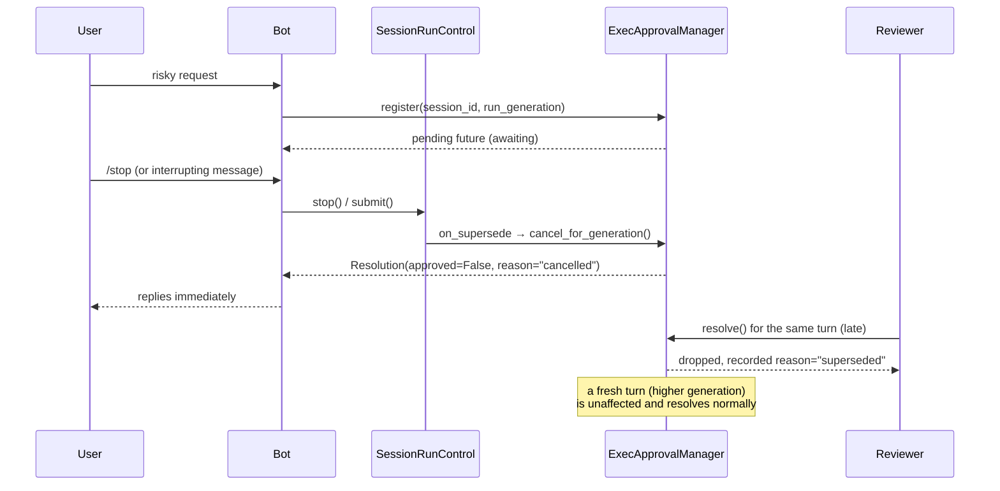
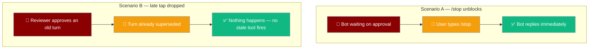

When a user hits `/stop` (or supersedes the turn with a new message in `busy_mode="interrupt"`), any approval the turn was waiting on is cancelled — the bot replies immediately instead of hanging, and a late Allow tap for that stopped turn is dropped.


## Quick Start

<Steps>
<Step title="Run a bot with interrupt mode and presentation approval">
Set `busy_mode="interrupt"` and `approval="presentation"` — the turn-liveness wiring is automatic. No extra config.

```python
from praisonaiagents import Agent
from praisonai.bots import TelegramBot

agent = Agent(
    name="Ops",
    instructions="Ask before destructive tools.",
    approval="presentation",     # durable Allow/Deny buttons on chat
    tools=["execute_command"],
)

bot = TelegramBot(
    token="YOUR_TOKEN",
    agent=agent,
    busy_mode="interrupt",       # turn-liveness cancellation wired automatically
)

import asyncio
asyncio.run(bot.start())
```
</Step>

<Step title="Scenario A — /stop unblocks a parked turn">
Trigger a tool that needs approval, then send `/stop` before you tap Allow. The turn unwinds immediately instead of hanging on the approval wait.

```
User: delete the /tmp/cache directory
Bot:  🔒 Approval needed: execute_command (Allow / Deny)
User: /stop
Bot:  ✅ Current task cancelled. Send a new message to start fresh.
```

The awaiting tool call resolves with `reason="cancelled"` — the bot replies rather than parking indefinitely.
</Step>

<Step title="Scenario B — a late Allow tap is dropped">
Tap **Allow** on that stopped turn's card after `/stop`. Nothing happens: no stale tool runs, no stale reply lands.

```
User: /stop            # turn already stopped above
User: (taps Allow on the old approval card)
Bot:  ⚠️ Approval no longer applicable
```

The resolution is dropped fail-closed and recorded with `reason="superseded"` in the audit trail.
</Step>
</Steps>

<Note>
No new user-facing config is introduced. The binding is wired automatically when a bot uses `busy_mode` with `SessionRunControl` (for example Telegram with `busy_mode="interrupt"`). Requests that carry no `session_id`/`run_generation` behave exactly as before.
</Note>

---

## How It Works

A gateway approval request can optionally bind to the **turn liveness** of the originating run via `session_id` + `run_generation`. When the run is stopped or superseded, the gateway fail-closes any pending future and drops any resolution that arrives afterwards.



| Step | What happens |
|------|-------------|
| `register()` | The pending approval is stamped with `session_id` + `run_generation` when the bot supplies them. |
| `cancel_for_generation()` | Fired by `on_supersede`; completes the pending future with `Resolution(approved=False, reason="cancelled")` so the awaiting tool call unwinds. |
| `resolve()` (late) | A resolution arriving after supersede is dropped and recorded with `reason="superseded"`. |
| newer generation | A fresh turn (higher `run_generation`) on the same session stays live and resolves normally. |

---

## User Interaction Flow



---

## What Triggers the Cancel

| Trigger | Path | Cancels approval? |
|---------|------|-------------------|
| `/stop` command | `SessionRunControl.stop()` → `on_supersede` | ✅ Yes |
| Superseding message with `busy_mode="interrupt"` | `SessionRunControl.submit()` (INTERRUPT path) → `on_supersede` | ✅ Yes |
| Mid-run message with `busy_mode="steer"` | Folds into the running turn | ❌ No — the same turn stays live |
| Mid-run message with `busy_mode="queue"` | Preserves the current turn, queues the follow-up | ❌ No — the running turn is preserved |

`busy_mode="steer"` folds the new message into the *same* turn, and `busy_mode="queue"` preserves the running turn — neither fires `on_supersede`, so a pending approval on that turn stays live. `busy_mode="interrupt"` (and `/stop`) is the path that cancels.

---

## Backward Compatibility

<Note>
No new user-facing config, and a no-op for unbound requests. Existing single-turn flows are unchanged.
</Note>

- The binding is **automatic** when a bot uses `busy_mode` with `SessionRunControl` (e.g. Telegram with `busy_mode="interrupt"`).
- Approvals **not** stamped with `session_id`/`run_generation` — anything outside the bot → gateway path today — are always considered live and keep behaving exactly as before.
- Today's single-turn / no-supersede flows behave identically; the cancel path only runs when a turn is actually stopped or superseded.

---

## Failure Semantics

<AccordionGroup>
<Accordion title="TOCTOU guard — /stop racing register()">
If `/stop` marks the generation superseded *before* the tool's `register()` call lands, `register()` denies immediately with `reason="superseded"` — it never parks the caller on a future that no cancel batch will ever complete.
</Accordion>

<Accordion title="Non-integer run_generation — fail-open to unbound">
An un-coercible `run_generation` logs a warning and registers the approval **unbound** rather than becoming silently un-cancellable. The request still resolves normally (fail-open to unbound, not fail-closed to stuck).
</Accordion>

<Accordion title="Newer generation stays live">
Cancelling generation N does not affect generation N+1 on the same session. A fresh turn started after the stop is unaffected and resolves normally.
</Accordion>

<Accordion title="Callback failures are swallowed">
The `on_supersede` callback is best-effort. Any exception is logged and swallowed (see `_notify_supersede`) so `/stop` and interrupt handling are never broken by a missing gateway package or manager.
</Accordion>
</AccordionGroup>

---

## Best Practices

<AccordionGroup>
<Accordion title="Prefer busy_mode='interrupt' for the strongest benefit">
Turn-liveness cancellation matters most when the latest message should win. In `busy_mode="interrupt"`, a superseding message (or `/stop`) cancels the abandoned turn's pending approval so the bot never hangs on a decision for a turn the user already replaced.
</Accordion>

<Accordion title="Why busy_mode='queue' does not cancel a running turn's approval">
Queue mode preserves the current turn on purpose — that is the point. A follow-up is parked for the next turn, so the running turn's pending approval stays live and can still be resolved normally.
</Accordion>

<Accordion title="Custom integrators embedding SessionRunControl">
Pass `on_supersede=make_approval_supersede_callback()` (or an explicit `ExecApprovalManager`) to opt in:

```python
from praisonai_bot.bots._run_control import (
    SessionRunControl,
    make_approval_supersede_callback,
)

run_control = SessionRunControl(
    busy_mode="interrupt",
    on_supersede=make_approval_supersede_callback(),
)
```

Without the callback, the old silent-hang behaviour returns.
</Accordion>

<Accordion title="Verifying the fix locally">
Run the bot with `busy_mode="interrupt"`, trigger an approval, and issue `/stop`:

- The awaiting tool call must unwind with `reason="cancelled"`.
- A late reviewer Allow for the stopped turn must be a no-op with `reason="superseded"` in the audit trail.
</Accordion>
</AccordionGroup>

---

## Related

<CardGroup cols={2}>
<Card title="Bot Run Control" icon="octagon-pause" href="/features/bot-run-control">
  The `busy_mode` + `/stop` side that fires the supersede callback
</Card>
<Card title="Gateway Approval Durability" icon="database" href="/features/gateway-approval-durability">
  The persistence side — pending approvals that survive a restart
</Card>
<Card title="Telegram Durable Approval" icon="shield-check" href="/features/telegram-durable-approval">
  The transport side — Allow/Deny buttons on chat
</Card>
<Card title="Gateway Scoped Approvals" icon="user-check" href="/features/gateway-scoped-approvals">
  Per-request reviewer custody on the same manager
</Card>
</CardGroup>
