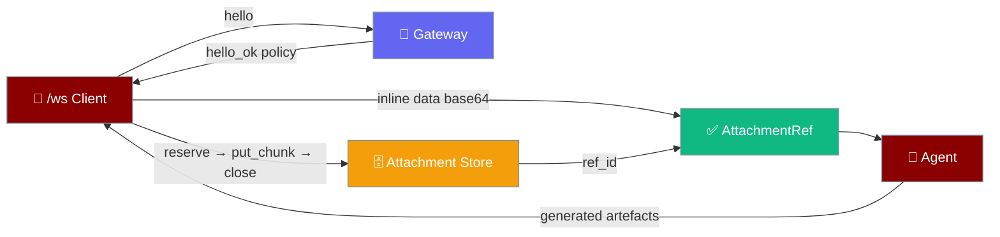
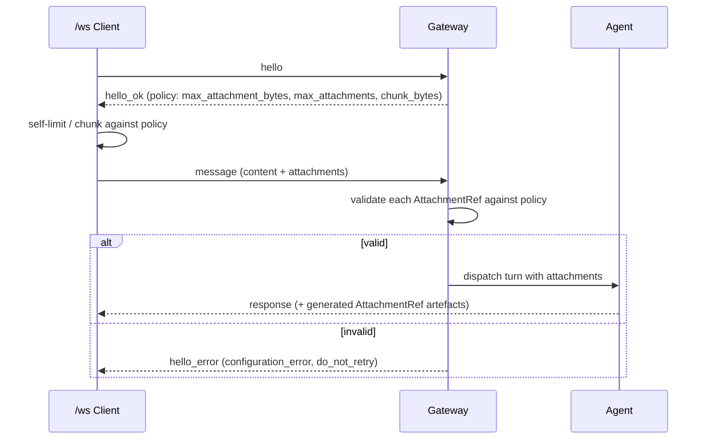

<Note>
The gateway ships in the `praisonai-bot` package. `praisonai serve gateway` works exactly as documented here; for a standalone install see [praisonai-bot Migration](/guides/praisonai-bot-migration).
</Note>

<Note>
Looking for `agent.start(attachments=[…])`? That is a **different** feature — attaching local files to a single agent call so the model sees them as content parts. See [Attachments](/features/attachments). This page is the **gateway wire protocol**: how any custom `/ws` client hands the gateway a file over the connection and gets agent-generated files back.
</Note>

Gateway Attachments is a typed, additive, size-bounded contract so any `/ws` client can send a file to an agent and receive agent-generated artefacts back over the same connection.

```python
from praisonaiagents import Agent

agent = Agent(name="gateway-agent", instructions="Summarise any file a client sends over the gateway.")
agent.start("Summarise the attached report.")
```

An attachment travels one of two ways: **inline** base64 for small files, or **by reference** to a chunked entry in the gateway attachment store for large files. The gateway advertises its size and type ceilings in `hello_ok`, so a client self-limits and chunks before sending.



## Quick Start

<Steps>

<Step title="Send a small inline file">

Small files ride inline as base64 in an `AttachmentRef`, bounded by the advertised `max_attachment_bytes` policy.

```python
import base64
from praisonaiagents.gateway import AttachmentRef, MessageParams

raw = open("note.txt", "rb").read()
attachment = AttachmentRef(
    filename="note.txt",
    mime="text/plain",
    size=len(raw),
    data=base64.b64encode(raw).decode("ascii"),   # inline base64
)

message = MessageParams(
    content="Summarise the attached note.",
    attachments=[attachment],
)
```

</Step>

<Step title="Send a large file by reference">

Large files stream into the gateway attachment store, then travel by `ref_id`.

```python
from praisonaiagents.gateway import AttachmentRef, MessageParams

# store implements AttachmentStoreProtocol (provided by the wrapper/bot package)
ref_id = store.reserve(filename="report.pdf", mime="application/pdf", size=len(blob))
for offset in range(0, len(blob), 262144):                 # chunk_bytes from policy
    store.put_chunk(ref_id, offset, blob[offset:offset + 262144])
ref = store.close(ref_id)                                  # -> AttachmentRef with ref_id

message = MessageParams(
    content="Extract the tables from the attached report.",
    attachments=[AttachmentRef(
        filename="report.pdf",
        mime="application/pdf",
        size=len(blob),
        ref_id=ref.ref_id,                                 # by reference, no inline data
    )],
)
```

</Step>

<Step title="Configure ceilings">

Set the size and type ceilings in Python or YAML. The gateway folds them into `hello_ok`.

```python
from praisonaiagents.gateway import AttachmentConfig

attachments = AttachmentConfig(
    max_attachment_bytes=10 * 1024 * 1024,   # 10 MiB
    max_attachments=10,
    chunk_bytes=256 * 1024,                   # 256 KiB
    allowed_types=["image/", "application/pdf"],
)
```

```yaml
gateway:
  attachments:
    max_attachment_bytes: 10485760   # 10 MiB
    max_attachments: 10
    chunk_bytes: 262144              # 256 KiB
    allowed_types: ["image/", "application/pdf"]
```

</Step>

</Steps>

---

## How It Works

The client reads the advertised policy, self-limits, then sends a `message` frame with `attachments`; the gateway validates each against the policy before dispatching to the agent.



The advertised policy is part of the wider `hello_ok` contract — see [Gateway Handshake Protocol](/features/gateway-handshake-protocol).

---

## Wire Format

An `AttachmentRef` carries the file two mutually exclusive ways. An **inline** attachment sets `data`:

```json
{
  "filename": "note.txt",
  "mime": "text/plain",
  "size": 12,
  "data": "SGVsbG8sIHdvcmxkIQ=="
}
```

A **by-reference** attachment sets `ref_id` instead:

```json
{
  "filename": "report.pdf",
  "mime": "application/pdf",
  "size": 4194304,
  "ref_id": "att_8f2c1a"
}
```

The same shape is reused outbound: agent-generated files surface as `AttachmentRef` entries a generic client fetches over the same connection, instead of relying on platform (Telegram/Slack/…) delivery.

A `message` frame carries them under `attachments`:

```json
{
  "type": "message",
  "content": "Summarise the attached note and extract tables from the report.",
  "attachments": [
    {"filename": "note.txt", "mime": "text/plain", "size": 12, "data": "SGVsbG8sIHdvcmxkIQ=="},
    {"filename": "report.pdf", "mime": "application/pdf", "size": 4194304, "ref_id": "att_8f2c1a"}
  ]
}
```

---

## Configuration Options

`AttachmentConfig` sets the ceilings the gateway advertises and enforces.

| Option | Type | Default | Description |
|--------|------|---------|-------------|
| `max_attachment_bytes` | `int` | `10485760` (10 MiB) | Largest single attachment the gateway accepts, in bytes. `0` disables attachments. |
| `max_attachments` | `int` | `10` | Maximum attachments on one `message` turn. `0` disables attachments. |
| `chunk_bytes` | `int` | `262144` (256 KiB) | Advertised chunk size for streaming large files into the store. Must be `> 0`. |
| `allowed_types` | `List[str]` | `[]` | Optional MIME allow-list (e.g. `"image/"`, `"application/pdf"`). Empty means no advertised restriction. |

`AttachmentConfig.enabled` is `True` only when both `max_attachment_bytes` and `max_attachments` are positive. Wire it onto `GatewayConfig.attachments`, or set it in YAML under `gateway.attachments`.

---

## Advertised Policy

When attachments are enabled, `hello_ok` gains the attachment keys:

```json
{
  "type": "hello_ok",
  "protocol": 1,
  "policy": {
    "max_payload": 1048576,
    "heartbeat_ms": 30000,
    "max_attachment_bytes": 10485760,
    "max_attachments": 10,
    "chunk_bytes": 262144,
    "allowed_attachment_types": ["image/", "application/pdf"]
  }
}
```

When attachments are disabled (`max_attachment_bytes=0` or `max_attachments=0`), **none of these keys are added** — the policy is byte-for-byte today's shape:

```json
{
  "type": "hello_ok",
  "protocol": 1,
  "policy": {
    "max_payload": 1048576,
    "heartbeat_ms": 30000
  }
}
```

`allowed_attachment_types` appears only when `allowed_types` is configured. The wider policy story lives in [Gateway Handshake Protocol](/features/gateway-handshake-protocol).

---

## AttachmentStoreProtocol

Large files stream into a store that every client and implementation agree on through one core Protocol.

```python
from typing import BinaryIO, Protocol, runtime_checkable
from praisonaiagents.gateway import AttachmentRef

@runtime_checkable
class AttachmentStoreProtocol(Protocol):
    def reserve(self, filename: str, mime: str, size: int) -> str: ...   # -> ref_id
    def put_chunk(self, ref_id: str, offset: int, data: bytes) -> None: ...
    def close(self, ref_id: str) -> AttachmentRef: ...
    def open(self, ref_id: str) -> BinaryIO: ...
```

The contract lives in the dependency-free core so every client agrees on one shape. The concrete durable store (filesystem / object store) is intentionally a wrapper/bot concern, kept out of the core to preserve its no-heavy-import rule.

---

## Validation Rules & Failure Modes

Each rule below rejects with a `FrameDecodeError` carrying `ConnectErrorCode.CONFIGURATION_ERROR` / `ConnectRecoveryStep.DO_NOT_RETRY` — the same structured envelope the rest of the inbound codec uses (see [Frame Codec](/features/gateway-frame-codec)).

| Rejection case | Reason |
|----------------|--------|
| Empty `filename` or `mime` | Both must be non-empty strings |
| Negative `size` | `size` must be `>= 0` |
| Both `data` and `ref_id` present | Exactly one carrier is allowed |
| Neither `data` nor `ref_id` present | Exactly one carrier is required |
| Non-dict attachment entry | Each attachment must be an object |
| Non-list `attachments` field | `attachments` must be a list |

---

## Backward Compatibility

`attachments` is opt-in per turn: a frame without it decodes exactly as before, since the field defaults to `[]`. When the config is disabled (`max_attachment_bytes=0` or `max_attachments=0`), the advertised policy is byte-for-byte today's shape — none of the attachment keys are added, so legacy clients see no change.

---

## Best Practices

<AccordionGroup>

<Accordion title="Read the policy before sending">
Read `HelloResult.policy` — `max_attachment_bytes`, `max_attachments`, `chunk_bytes` — from `hello_ok` and self-limit / chunk accordingly. Clients that check first reject early instead of being disconnected mid-turn.
</Accordion>

<Accordion title="Inline small files, store large ones">
Prefer inline `data` for files below `chunk_bytes`; use `reserve → put_chunk → close` and send by `ref_id` for anything larger. Inline avoids a round trip; the store avoids an oversized frame.
</Accordion>

<Accordion title="Advertise your MIME allow-list up front">
Set `allowed_types` (e.g. `["image/", "application/pdf"]`) so the gateway advertises `allowed_attachment_types`. Clients then reject unsupported files early instead of being disconnected.
</Accordion>

<Accordion title="Disable while keeping the config wired">
Set `max_attachment_bytes=0` or `max_attachments=0` to advertise a byte-identical legacy policy while keeping `gateway.attachments` in place — flip the ceilings positive to enable without a config restructure.
</Accordion>

</AccordionGroup>

---

## Related

<CardGroup cols={2}>

<Card title="Gateway Handshake Protocol" icon="handshake" href="/features/gateway-handshake-protocol">
Where `HelloResult.policy` lives — the advertised attachment ceilings.
</Card>

<Card title="Frame Codec" icon="shield-check" href="/features/gateway-frame-codec">
Where `MessageParams` lives — the `message` frame that carries `attachments`.
</Card>

<Card title="Gateway Client" icon="plug" href="/features/gateway-client">
The client that sends and receives frames over the `/ws` connection.
</Card>

<Card title="Attachments" icon="paperclip" href="/features/attachments">
The different, `agent.start(attachments=[…])`-level feature — local files as model-visible content parts.
</Card>

</CardGroup>
