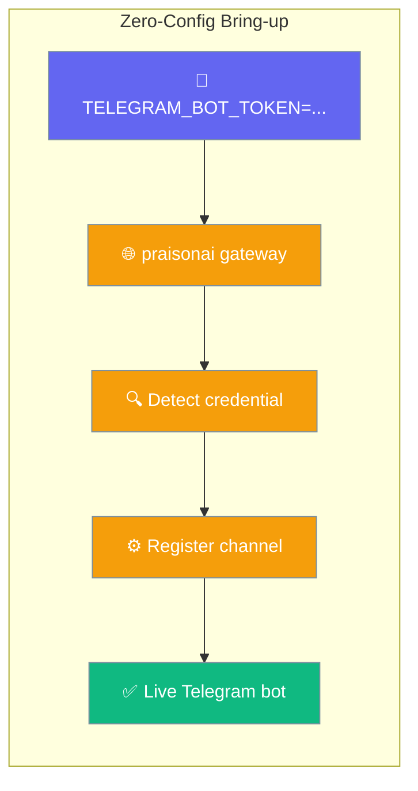
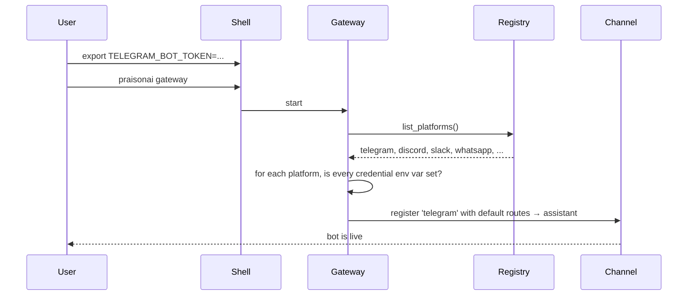
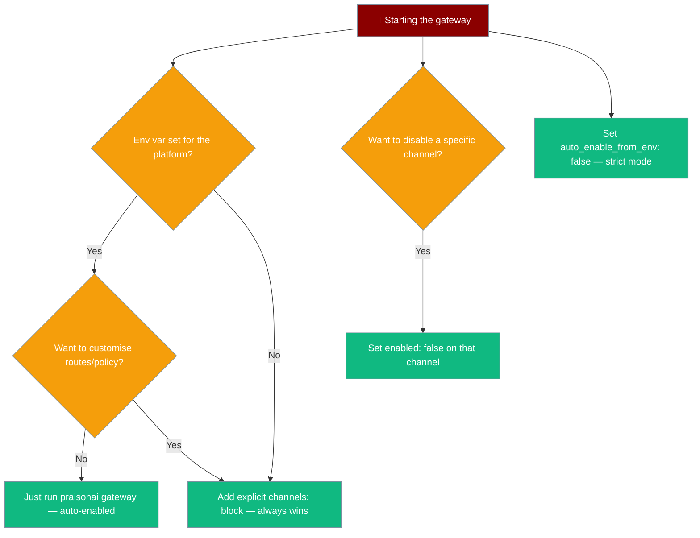

Set your bot's token, run `praisonai gateway` — you have a working bot. No YAML required.

```python
# One agent, one env var, one command — a live Telegram bot.
from praisonaiagents import Agent

agent = Agent(
    name="assistant",
    instructions="You are a helpful assistant."
)
# Then in a shell:
#   export TELEGRAM_BOT_TOKEN=123:abc
#   praisonai gateway
```

The gateway detects any platform whose credential env var(s) are all present and registers a channel for it — so a single token brings a bot up with zero `channels:` config.



## Quick Start

<Steps>
<Step title="One platform, one line">

```bash
export TELEGRAM_BOT_TOKEN=123:abc
praisonai gateway
```

One log line confirms the bot is live:

```text
Auto-enabled channel 'telegram' from TELEGRAM_BOT_TOKEN
```

</Step>

<Step title="Multiple platforms fan out automatically">

```bash
export TELEGRAM_BOT_TOKEN=...
export DISCORD_BOT_TOKEN=...
export SLACK_BOT_TOKEN=...
export SLACK_APP_TOKEN=...
praisonai gateway
```

All three come up — still no `channels:` block.

</Step>

<Step title="Add YAML only when you want to customise">

Explicit `channels:` entries always win. Add YAML the moment you need routes, per-channel policy, or a non-env token; leave everything else to the env var.

</Step>
</Steps>

---

## How It Works



Auto-enabled channels get `routes: {dm: <agent>, group: <agent>, default: <agent>}`. The `<agent>` resolves in this order:

1. `routing.default` (if set)
2. First key in `agents:` (if any)
3. Single-bot `agent.name` (if set)
4. Literal `"assistant"` (final fallback)

---

## Which env vars trigger which channel

A built-in platform is auto-enabled only when **all** its credential env vars are present.

| Platform | Required env var(s) — ALL must be present |
|----------|-------------------------------------------|
| `telegram` | `TELEGRAM_BOT_TOKEN` |
| `discord` | `DISCORD_BOT_TOKEN` |
| `slack` | `SLACK_BOT_TOKEN` **and** `SLACK_APP_TOKEN` |
| `whatsapp` | `WHATSAPP_ACCESS_TOKEN` **and** `WHATSAPP_PHONE_NUMBER_ID` |

Multi-credential platforms (Slack, WhatsApp) stay down until every listed var is set — `SLACK_BOT_TOKEN` alone does not auto-enable Slack.

---

## Choosing an Option



---

## Configuration Options

| Option | Level | Type | Default | Description |
|--------|-------|------|---------|-------------|
| `auto_enable_from_env` | `gateway.yaml` top-level | `bool` | `true` | Auto-register a channel for any known platform whose credential env var(s) are all present and that isn't declared or disabled. Set to `false` to restore the strict "must declare a channel" guard. |
| `enabled` | Each `channels:` entry | `bool` | `true` | Explicit per-channel opt-out. `false` drops the channel and also suppresses auto-enable for that platform even when its token env var is set. |

---

## Precedence

```text
Explicit channels: entry  >  enabled: false  >  auto-enable from env  >  strict "No channels" error
```

<AccordionGroup>

<Accordion title="Explicit token wins over env">

An explicit `token:` overrides the env-resolved one — the auto-enable path never touches a platform you already declared.

```yaml
channels:
  telegram:
    platform: telegram
    token: "explicit-token"     # env-derived token is ignored
    routes:
      default: assistant
```

</Accordion>

<Accordion title="Opt out even when the token is present">

`enabled: false` keeps a channel down and suppresses auto-enable for that platform, even with the credential set.

```yaml
channels:
  telegram:
    platform: telegram
    enabled: false              # stays down
```

</Accordion>

<Accordion title="Restore strict behaviour">

Set `auto_enable_from_env: false` to require an explicit `channels:` block. With no channel declared, the gateway fails closed:

```text
No channels configured. Add at least one channel (telegram, discord, slack, whatsapp)
to your config, or set a platform credential env var (e.g. TELEGRAM_BOT_TOKEN)
to auto-enable one.
```

```yaml
gateway:
  auto_enable_from_env: false
```

</Accordion>

</AccordionGroup>

---

## For Plugin Channel Authors

A plugin platform (registered via the `praisonai.channels` entry point or `register_platform(...)`) becomes auto-enable-able when its `ChannelDescriptor.config_fields` lets the gateway source every `required` field from the environment (each has an `env` fallback).

If a plugin has a required field without an `env` fallback (e.g. a required `server` for an IRC-like channel), the gateway leaves it for explicit configuration — auto-enabling it would seed a channel that then fails required-field validation and aborts the whole gateway. When there are no required fields, a single env-backed `secret` field is enough to identify a ready-to-use credential.

---

## Best Practices

<AccordionGroup>

<Accordion title="Use a .env file for local development">

`praisonai gateway` loads `~/.praisonai/.env` into the environment without overwriting shell values, so committing an `.env.example` and running `praisonai gateway` is enough for a teammate to get a bot up.

</Accordion>

<Accordion title="Put production env vars in your process supervisor">

In production, set credentials in systemd (`Environment=`), Docker (`--env-file`), or your orchestrator's secret manager rather than shell dotfiles.

</Accordion>

<Accordion title="Prefer explicit channels: for shared bots">

Where routing, policies, or per-channel session settings matter, declare `channels:` explicitly. The zero-config path is designed for first-run and single-agent deployments.

</Accordion>

<Accordion title="Disable auto-enable on multi-tenant deployments">

Set `auto_enable_from_env: false` on shared deployments so no unexpected channel comes up just because a token happens to be in the environment.

</Accordion>

</AccordionGroup>

---

## Related

<CardGroup cols={2}>
<Card title="Gateway Overview" icon="broadcast-tower" href="/features/gateway-overview">
  Multi-channel agent coordination and the full config surface
</Card>
<Card title="Gateway CLI" icon="tower-broadcast" href="/features/gateway-cli">
  Start, monitor, and manage the gateway from the command line
</Card>
<Card title="Bot Gateway" icon="server" href="/features/bot-gateway">
  Routing, approvals, and multi-agent channel wiring
</Card>
<Card title="Custom Channel" icon="plug" href="/features/gateway-custom-channel">
  Add a plugin platform that self-describes its credential fields
</Card>
</CardGroup>
